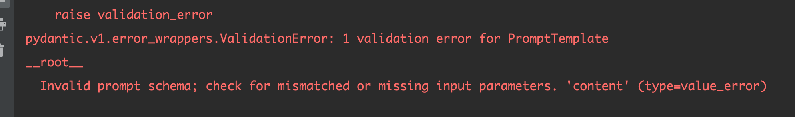
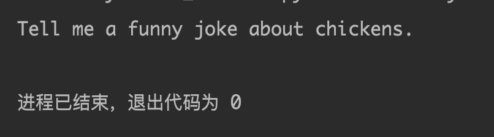
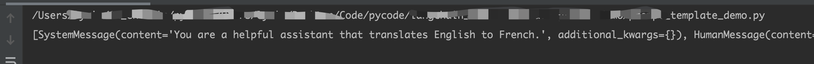
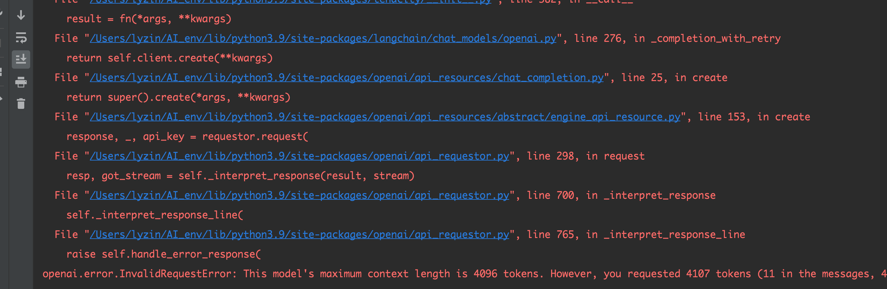

## 一、Langchain

> langchain官网地址：https://python.langchain.com/docs/get_started/introduction.html

### 1、介绍

> LangChain 是一个利用语言模型开发应用程序的框架，它使应用程序能够：
>
> - Data-aware：将语言模型与其他数据源连接起来
>
> - Proxy：允许语言模型与其环境交互
>
> LangChain的主要价值部分：
>
> - Components：用于处理语言模型的抽象概念，以及每个抽象概念的实现集合。无论您是否使用 LangChain 框架的其他部分，组件都是模块化的，易于使用。
>
>
> - Off-the-shelf chains：用于完成特定高级任务的组件结构化组合，现成的链可以让您轻松上手。对于更复杂的应用和细微的用例，组件可以轻松定制现有链或构建新链。

> LangChain 为下列模块提供了标准的、可扩展的接口和外部集成，这些模块的复杂程度从低到高依次排列：
>
> - Model I/O（模型输入输出）：语言模型接口
>
> - Retrieval（检索）：与特定应用数据的接口
>
> - Chains（链）：构建调用序列
>
>
> - Agents（代理）：让链根据高级指令选择要使用的工具
>
> - Memory（内存）：在链运行之间保持应用程序状态
> - Callbacks（回调）：记录任何链的中间步骤并进行流式处理

### 2、安装Langchain

> 要安装所有集成所需的所有模块，请运行如下命令
>

```bash
pip install "langchain[all]"
```

### 3、LLMs介绍

> **LLMs**是Large Language Model的缩写。
>
> LLMs语言模型分为两种类型，在LangChain中被称为：
>
> - LLMs：这是一种语言模型，它接受一个字符串作为输入并返回一个字符串 
> - ChatModels：这是一种语言模型，它接受一系列消息作为输入，并返回一个消息
>
> 
>
> LLMs的输入/输出非常简单易懂 - 一个字符串。但是ChatModels呢？输入是一个ChatMessages的列表，输出是一个单独的ChatMessage。
>
> 一个ChatMessage有两个必需的组件：
>
> - content：这是消息的内容。 
> - role：这是发出ChatMessage的实体的角色。 
>
> 
>
> LangChain提供了几个对象，便于区分不同的角色：
>
> - HumanMessage：来自人/用户的ChatMessage。 
> - AIMessage：来自AI/助手的ChatMessage。 
> - SystemMessage：来自系统的ChatMessage。 
> - FunctionMessage：来自函数调用的ChatMessage。 
> - 如果这些角色都不确切，还有一个ChatMessage类，您可以手动指定角色。
>
> 
>
> LangChain为上面两个语言模型都提供了标准接口，但理解这种差异对构建给定语言模型的提示很有帮助。LangChain提供的标准接口有两种方法：
>
> - predict：输入一个字符串，返回一个字符串。 
> - predict_messages（给ChatModels用）: 输入一系列消息，返回一个消息。

### 4、Prompt模板

> 大多数 LLM 应用程序不会将用户输入直接传递到 LLM 中。通常，它们会将用户输入添加到一段较大的文本（称为提示模板）中，为手头的特定任务提供额外的上下文。
>
> 在前面的例子中，我们传递给模型的文本包含生成公司名称的指令。对于我们的应用程序来说，如果用户只需提供公司/产品的描述，而无需向模型提供说明，那就再好不过了。
>
> PromptTemplates 正好可以解决这个问题！它们捆绑了从用户输入到完全格式化提示的所有逻辑。一开始可以非常简单--例如，生成上述字符串的提示语可以是

#### 4.1 prompt模板简单示例

```python
from langchain.prompts import PromptTemplate

prompt = PromptTemplate.from_template("What is a good name for a company that makes {product}?")
prompt.format(product="colorful socks")

# 输出，可以看到将"colorful socks"替换到了{product}中
What is a good name for a company that makes colorful socks?
```

```python
from langchain import PromptTemplate

prompt_template = PromptTemplate.from_template(
    "Tell me a {adjective} joke about {content}."
)
prompt_template.format(adjective="funny", content="chickens")

# 输出
"Tell me a funny joke about chickens."
```

##### 4.1.1 支持没有变量直接输出

```python
# 支持没有变量直接输出
from langchain import PromptTemplate

prompt_template = PromptTemplate.from_template(
"Tell me a joke"
)
prompt_template.format()
```

##### 4.1.2 指定输入的变量值

> 可明确指定input_variables。input_variables是一个列表，里面的元素为模板需要替换的变量，当这些变量将与模板字符串中的变量进行比较，如果不匹配，就会出现异常。

```python
from langchain import PromptTemplate

invalid_prompt = PromptTemplate(
    # input_variables 只有adjective，缺少content变量，输出报错
    input_variables=["adjective"],
    template="Tell me a {adjective} joke about {content}."
)
print(invalid_prompt.format(adjective="funny", content="chickens"))
```



```python
from langchain import PromptTemplate

invalid_prompt = PromptTemplate(
    # input_variables 有adjective、content变量，输出正常
    input_variables=["adjective", "content"],
    template="Tell me a {adjective} joke about {content}."
)
print(invalid_prompt.format(adjective="funny", content="chickens"))
```



#### 4.2 prompt模板组合使用

> 与原始字符串格式化相比，使用这些格式化有几个优点。
>
> - 可以 "部分 "删除变量--例如，一次只能格式化部分变量。
> - 可以将它们组合在一起，轻松地将不同模板组合成一个提示符。
>
> PromptTemplates也可用于生成信息列表
>
> - 在这种情况下，提示不仅包含内容信息，还包含每条信息（其角色、在列表中的位置等）
> - 最常见的情况是 ChatPromptTemplate 是 ChatMessageTemplate 的列表。
> - 每个 ChatMessageTemplate 都包含如何格式化 ChatMessage 的说明--它的角色和内容。下面我们就来看看：

```python
from langchain.prompts.chat import (
    ChatPromptTemplate,
    SystemMessagePromptTemplate,
    HumanMessagePromptTemplate,
)

# 系统消息模板
template = "You are a helpful assistant that translates {input_language} to {output_language}."
system_message_prompt = SystemMessagePromptTemplate.from_template(template)

# 用户输出模板，也就是提问的问题
human_template = "{text}"
human_message_prompt = HumanMessagePromptTemplate.from_template(human_template)

# chatGPT提问的模板，组合上面的system_message_prompt、human_message_prompt
chat_prompt = ChatPromptTemplate.from_messages([system_message_prompt, human_message_prompt])
print(chat_prompt.format_messages(input_language="English", output_language="French", text="I love programming."))
```



## X、ChatGPt遇到的问题

### 1、查出token长度



> 解决:初始化AI时，不要穿max_token参数，就暂时不会有这个报错，但是具体原因未知，后续再调研
