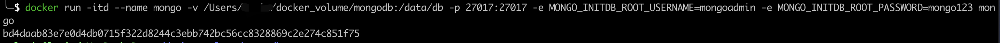
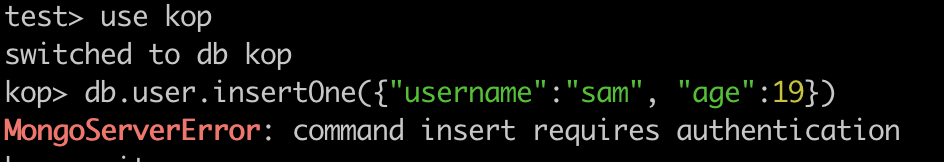
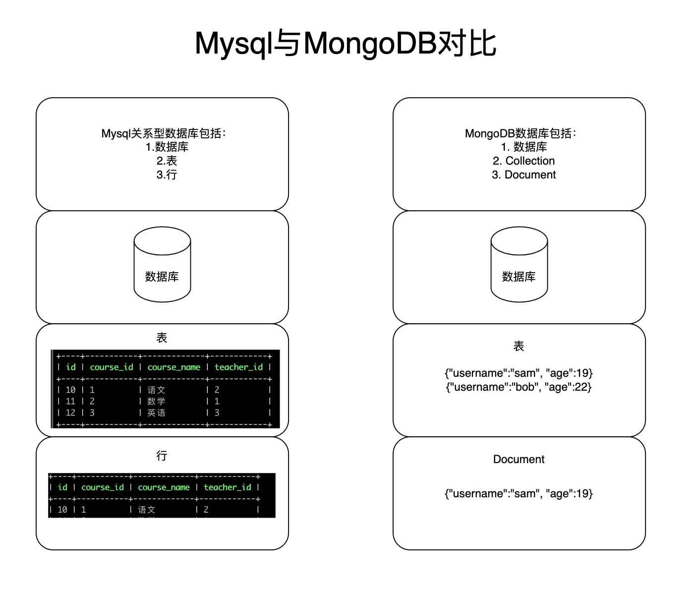

## 一、MongoDB介绍

### 1、什么是mongoDB

> 官网：https://www.mongodb.com/zh-cn
>
> mongoDB操作文档：https://www.mongodb.com/docs/v5.0/

#### 1.1 mongoDB特点

> - MongoDB是一个开源、高性能、无模式的文档型数据库，是NoSQL数据库的其中一种，是最像关系型数据库的非关系型数据库
>     - 无模式：是指mongoDB在创建表时，不需要像关系型数据库(mysql)预先指定字段列名
> - MongoDB的数据结构比较散列，是一种类似于JSON格式的BSON，可以存储比较复杂的数据
> - MongoDB中记录的每一行都是由key/value组成（也称为field:value）的数据结构，每一行是指一个文档，一个文档是指一个JSON对象
> - MongoDB中支持基本类型外，还支持数组、文档数组等

### 2、创建mongoDB

> 推荐使用docker创建mongoDB容器来学习，减少mongoDB安装的成本
>
> docker镜像地址：https://hub.docker.com/_/mongo
>
> - 这个镜像中有如何创建容器、如何设置MongoDB容器用户和密码、如何将MongoDB容器数据落盘有详细记录

#### 2.1 拉取mongoDB镜像

```bash
docker pull mongo
```


#### 2.2 创建mongoDB容器

```bash
docker run -itd --name mongo -v /my/own/datadir:/data/db -p 27017:27017 -e MONGO_INITDB_ROOT_USERNAME=mongoadmin -e MONGO_INITDB_ROOT_PASSWORD=mongo123 mongo
```



#### 2.3 连接mongoDB数据库

> 使用docker创建了mongodb的容器，下面来对mongoDB进行下连接验证
>
> 需要提前安装mongosh软件来连接mongoDB：https://www.mongodb.com/docs/mongodb-shell/

##### 2.3.1 无认证连接

```bash
# 无用户名与密码连接命令，连接后无法插入数据，会提示无权限
mongosh "mongodb://localhost:27017"
```


> 从上图看出，本地用docker创建的monngoDB容器，通过mongosh已经成功连接到了mongodb数据库中了，但因为无用户和密码连接，所以无法插入数据，会提示无权限



##### 2.3.2 认证连接

```bash
# 用户名与密码连接命令，连接后可以插入数据，下面命令输入后回车会提示需要输入密码
mongosh "mongodb://localhost:27017" --username mongoadmin --authenticationDatabase admin

# --username mongoadmin 表示mogodb用户名为mongoadmin
# --authenticationDatabase admin 表示授权用户名mongoadmin的用户有admin数据库权限，即mongoDB数据库的最高权限
```


> 从上图看到有了admin权限，就可以插入数据了，并且返回了插入数据的结果，并且返回了一个insertedId，这是MongoDB为插入的数据生成的唯一ID

### 3、MongoDB与Mysql对比

> mongoDB是最像关系型数据库的非关系型数据库，所以MongoDB的很多操作、数据库表的定义和mysql很类似



| MYSQL概念           | MongoDB概念         | 备注                                           |
| ------------------- | ------------------- | ---------------------------------------------- |
| database            | database            | 数据库                                         |
| table（表）         | collection（集合）  | 数据库表/集合                                  |
| row（行）           | document（文档）    | 数据库表行/文档                                |
| column（字段）      | field（域）         | 数据库表字段/域                                |
| index               | index               | 索引                                           |
| table joins         |                     | 表连接，MongoDB不支持                          |
|                     | 嵌入式文档          | MongoDB通过嵌入式文档来代替多表连接            |
| primary key(主键ID) | primary key(主键ID) | 数据库表的主键ID，MongoDB会自动将_id设置为主键 |

### 4、MongoDB数据模型

> 
