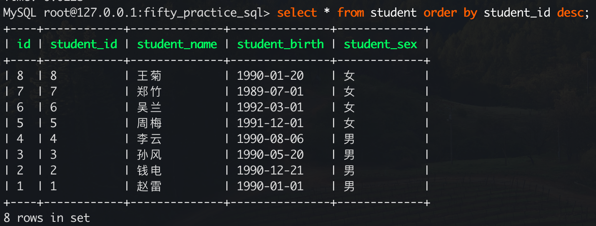

## 一、mysql安装

> 推荐使用Docker安装mysql
>
> [https://registry.hub.docker.com/_/mysql](https://registry.hub.docker.com/_/mysql)
>
> 黑马程序员
>
> [https://www.bilibili.com/video/BV1Kr4y1i7ru?spm_id_from=333.999.0.0&vd_source=501c3f3a75e1512aa5b62c6a10d1550c](https://www.bilibili.com/video/BV1Kr4y1i7ru?spm_id_from=333.999.0.0&vd_source=501c3f3a75e1512aa5b62c6a10d1550c)

### 1、拉取mysql镜像

```shell
# 拉取最新的mysql镜像
docker pull mysql
```

### 2、创建mysql容器

#### 1.1 设置国内时区

> 时区参考：[https://blog.csdn.net/w8y56f/article/details/115445442](https://blog.csdn.net/w8y56f/article/details/115445442)

> 因为mysql镜像里的时区默认是UTC时区，这样和国内就差了8个小时，所以为了后面创建了mysql容器能够获取时间和国内一致，所以需要提前修改时区
>
> 基于当前的mysql镜像创建一个支持国内时区的镜像，然后基于创建的镜像启动容器，就支持国内时区了
>

##### 1.1.1 新镜像的DockerFile

> 下面镜像的DockerFile用来创建支持国内的时间的镜像，需要提前拉取`mysql:latest`镜像

```bash
# Desc: 用来构建自定义的Docker镜像
# Author: 刘阳
# Time: 2021-04-21 17:59:00

# 基础镜像，来自官方的centos7版本，默认的centos镜像是centos8版本
FROM mysql:latest

# 基础描述信息
LABEL version="V1.0"
LABEL author="刘阳"
LABEL description="基础镜像来自官方mysql，设置时区为中国，然后编码方式为utf8"

# 设置工作目录
WORKDIR /root/

# 指定执行命令的用户
USER root

# 时区变量
ENV TZ="Asia/Shanghai"
```

##### 1.1.2 用DockerFile创建镜像

```bash
# 步骤一：创建一个目录，将上面的DockerFile内容复制进去，并且文件命名为Dockerfile
# 步骤二：当上面存放Dockerfile的文件目录下执行下面命令，后面的.(点)不能忘了，因为是用来关系上下文的
docker build -t mysqlzh:v1.0 .
# 构建完成后查看镜像就有了支持国内时区的mysql镜像
docker image ls -a
```


> 到这里镜像创建完毕，就可以使用这个镜像开始创建`mysql`容器了

#### 1.2 创建Mysql容器

> 使用新的`mysqlzh`镜像来创建`mysql`容器
>
> 字符序解释看这里：[https://www.cnblogs.com/lxyit/p/9359325.html](https://www.cnblogs.com/lxyit/p/9359325.html)
>
> docker的mysql容器配置文件映射：https://www.jb51.net/server/321611iv8.htm

```shell
docker run  -dit -u root --name mysql -p 3306:3306 -v /home/ly/docker_volumn/mysql:/var/lib/mysql -e MYSQL_ROOT_PASSWORD=123456  mysqlzh:v1.0 --character-set-server=utf8mb4 --collation-server=utf8mb4_unicode_ci 
# --name mysql 表示创建的容器名字是mysql
# -u root 表示容器的用户是root
# -p 3306:3306 表示将容器的3306映射到宿主机的3306端口
# MYSQL_ROOT_PASSWORD后面跟的是数据库用户root的登录密码
# -v /home/ly/docker_volumn/mysql:/var/lib/mysql 表示容器中数据存储的位置

# 下面两个参数必须放到镜像名后面，如果创建容器时出现3306端口占用，需要先关掉端口被占用的程序，再来创建容器
# --character-set-server=utf8mb4 表示设置mysql字符集支持是utf-8编码，可以支持中文
# --collation-server=utf8mb4_unicode_ci 表示字符序（collation），定义了字符的比较规则
```


> 从上图的Image的ID可以看出和使用DockerFile创建的镜像是同一个

#### 1.3 mysql容器数据持久化

> 参考：[https://www.jianshu.com/p/530d00f97cbf](https://www.jianshu.com/p/530d00f97cbf)
>
> 持久化的作用：
>
> - 当没有mysql容器持久化，当mysql容器被删除或者故障时，对应的mysql里的数据也会随着mysql容器被删除
> - 当mysql容器被删除或者故障时，可以快速启动另一个mysql容器，只需要将持久化的数据挂载到新的mysql容器上，就可以快速使用mysql

> mysql容器内的默认数据存储位置：
>
> - mysql容器将容器内的`/var/lib/mysql`路径作为默认的volume挂载

> 如何持久化？
>
> - 使用docker的逻辑卷功能，将宿主机的一个存储mysql数据的文件夹与容器内的`/var/lib/mysql`路径作为volume挂载

```bash
docker run  -dit -u root --name mysql -p 3306:3306 -e MYSQL_ROOT_PASSWORD=123456  mysqlzh:v1.0 --character-set-server=utf8mb4 --collation-server=utf8mb4_unicode_ci 
```

### 3、docker搭建mysql主从复制

#### 1.1 搭建主mysql

```bash
docker run  -dit -u root --name master_mysql --net mysql-net -p 3308:3306 -v ~/mysql_docker/master_sql/conf:/etc/mysql/conf.d -v ~/mysql_docker/master_sql/logs:/logs -v ~/mysql_docker/master_sql/data:/var/lib/mysql -e MYSQL_ROOT_PASSWORD=123456  mysqlzh:v1.0 --character-set-server=utf8mb4 --collation-server=utf8mb4_unicode_ci
```

#### 1.2 搭建从mysql

```mysql
docker run  -dit -u root --name slave_mysql --net mysql-net -p 3309:3306 -v ~/mysql_docker/slave_sql/conf:/etc/mysql/conf.d -v ~/mysql_docker/slave_sql/logs:/logs -v ~/mysql_docker/slave_sql/data:/var/lib/mysql -e MYSQL_ROOT_PASSWORD=123456  mysqlzh:v1.0 --character-set-server=utf8mb4 --collation-server=utf8mb4_unicode_ci
```

### 4、命令行连接mysql

#### 1.1 登录mysql

> 可以使用`mycli`这个连接工具，安装以来python环境

```shell
# 输入创建mysql容器时设置的root密码，就可以登录mysql中了
mycli -h127.0.0.1 -uroot -p
```

#### 1.2 查看时区

```bash
show variables like '%time_zone%'
```


> 可以看到时区：
>
> - system_time_zone是CST
>     - CST表示China Standard Time UT+8:00 中国标准时间
> - time_zone 的值是SYSTEM
>     - 表示跟system_time_zone取值一样，安装MySQL后默认就是SYSTEM，就是新镜像里设置的Asia/Shanghai时间

#### 1.3 查看字符集

```bash
show variables like '%character%';
```


> 可以看到数据库都是utf8编码

### 5、SQL语法分类

| 分类 | 英文名称                   | 说明                                                     |
| ---- | -------------------------- | -------------------------------------------------------- |
|      | Data Definition Language   | 数据定义语言，用来定义数据库对象，比如数据库、表、字段等 |
| DML  | Data Manipulation Language | 数据库操作语言，对数据库表进行增删改                     |
| DQL  | Data Query Language        | 数据库查询语言，对数据库表进行查询                       |
| DCL  | Data Control Language      | 数据库控制语言，对数据库进行创建用户，分配访问权限       |


## 二、mysql基础

> 老男孩 老郭
>
> https://www.bilibili.com/video/BV1bJ411k7ET?p=27&vd_source=501c3f3a75e1512aa5b62c6a10d1550c

> 黑马程序员：
>
> https://www.bilibili.com/video/BV1vi4y137PN/?spm_id_from=333.999.0.0&vd_source=501c3f3a75e1512aa5b62c6a10d1550c
>
> https://www.bilibili.com/video/BV1M541147Cn?p=9&vd_source=501c3f3a75e1512aa5b62c6a10d1550c
>
> https://www.bilibili.com/video/BV1Kr4y1i7ru?p=4&vd_source=501c3f3a75e1512aa5b62c6a10d1550c
>
> 数据库调优
>
> https://www.bilibili.com/video/BV1zJ411M7TB?p=4&vd_source=501c3f3a75e1512aa5b62c6a10d1550c

### 1、数据库操作(DDL)

#### 1.1 创建数据库

> - default character set utf8：
>     - 数据库字符集，设置数据库的默认编码为utf8，utf8中间不要"-"
> - default collate utf8_general_ci:
>     - 数据库校对规则，ci是case insensitive的缩写，意思是大小写不敏感；
>     - 相对的是cs，即case sensitive，大小写敏感；

```
MySQL root@localhost:(none)> create database goods default utf8 collate utf8_general_ci;
Query OK, 1 row affected
Time: 0.062s
```

#### 1.2 查看数据库

> 查看数据库：show databases;

```mysql
MySQL root@localhost:(none)> show databases;
+--------------------+
| Database           |
+--------------------+   |
| information_schema |
```

#### 1.2 使用数据库

> 使用数据库：use 数据库名称

```mysql
MySQL root@localhost:(none)> use goods;
You are now connected to database "goods" as user "root"
Time: 0.007s
```

#### 1.4 删除数据库

> 删除数据库：drop database 数据库名称

```mysql
MySQL root@localhost:goods> drop database goods;
You're about to run a destructive command.
Do you want to proceed? (y/n): y
Your call!
Query OK, 0 rows affected
Time: 0.124s
```

### 2、数据表的操作

#### 1.1 创建表

> 创建表需要使用： `create table 表名`语句

```mysql
create table 表名(
	列名 类型,
    列名 类型,
    列名 类型
) default charset=utf8;
```

##### 1.1.1 建表语句注释

> 在建表语句中，两个`-`表示注释

##### 1.1.2 not null

```mysql
-- mysql中 not null 表示不允许为空
create table m1(
	name not null -- 表示name字段不可以为空
)default charset=utf8;
```

##### 1.1.1 null

```mysql
-- mysql中null表示允许为空
create table m1(
	name null -- 表示name字段可以为空
)default charset=utf8;
```

##### 1.1.4 default

> 插入数据时，如果没有给该字段设置值，该字段的值就是设置的默认值

```mysql
create table m1(
	name default sam -- 表示name字段默认值是sam
)default charset=utf8;
```

##### 1.1.5 primary key

> 主键的意思，不允许为空，不可以重复

```mysql
create table m1(
	id int primary key -- id是主键
    name default sam -- 表示name字段默认值是sam
)default charset=utf8;
```

##### 1.1.6 auto_incremnet

> 表示该字段的值会随着插入数据自己进行自增

```mysql
create table m1(
	id int primary key auto_increment -- id是主键且自增
    name default sam -- 表示name字段默认值是sam
)default charset=utf8; 
```

#### 1.2 查看所有表

> 查看表需要经过两步
>
> - 第一步：进入数据库 use 数据库名称
> - 第二步：查看数据库 show tables

```mysql
use 数据库名称;
show tables;
```

#### 1.3 删除表

##### 1.1.1 drop

```mysql
-- 会将表和表里的数据全部删除
drop table 表名
```

##### 1.1.2 delete

```mysql
-- 会将表里的数据全部删除，表仍然留着
delete from 表名
```

##### 1.1.3 truncate

> 速度很快，不可回滚

```mysql
-- 会将表里的数据全部删除，表仍然留着
truncate table 表名
```

#### 1.4 修改表

##### 1.1.1 添加列

```mysql
-- 给表增加字段
alter table 表名 add 列名 类型;

-- 给表增加字段并设置默认值
alter table 表名 add 列名 类型 default 默认值;

-- 给表增加字段并设置默认值，且该列不能为空
alter table 表名 add 列名 类型 not null default 默认值;

-- 给表添加列指定位置
-- 指定在第一个位置
alter table 表名 add 列名 类型 default 默认值 first;

-- 指定在某个字段后面: existing_column表示将新添加的列放在某个列后面，并且某个列必须存在
alter table 表名 add 列名 类型 default 默认值 after existing_column; 
```

##### 1.1.2 删除列

```mysql
alter table 表名 drop column 列名;
```

##### 1.1.3 修改列的类型

```mysql
alter table 表名 modify column 列名 类型
```

##### 1.1.4 修改列的类型和名称

```mysql
alter table 表名 change 原列名 新列名 新类型;

-- 下面语句时将tb1的原name列修改为username，并且给username设置了类型为varchar(32)
alter table tb1 change name username varchar(32);
```

##### 1.1.5 修改列的默认值

```mysql
alter table 表名 alter 列名 set default 新默认值;
```

##### 1.1.6 删除列的默认值

```mysql
alter table 表名 alter 列名 drop default;
```

#### 2.5 表的字段类型

> 下面列出来的是经常用到的建表语句字段

##### 1.1.1 int

> int表示整型
>
> - int 表示有符号，取值范围`-2147483648 ~ 2147483648`
>     - 有符号表示可以为`负值`
> - int unsigned 表示无符号，取值范围`0 ~ 4294967295`
>     - 无符号表示必须是正整数，从0开始计数
> - int(5)zerofill 仅用于显示，当不满足5位时，给左边补0
>     - 比如02不满足五位，就会显示为：00002
> - 需要注意，当给字段设置类型后，超过了类型的范围，就会报`out of range value for column 列名`的错误

```mysql
create table m1(
	id int primary key  -- 表示id是一个int整数
    name default sam
)default charset=utf8;
```

##### 1.1.2 tinyint

> 用来表示整型，不能范围比较小
>
> - tinyint 表示有符号，取值范围`-128 ~ 127`
> - tinyint unsigned 表示无符号，取值范围`0 ~ 255`
> - tinyint(5)zerofill 和int使用一样

##### 1.1.3 bigint

> 用来表示整型，范围更大
>
> - bigint 表示有符号，取值范围`-922337203685477808 ~ 922337203685477808`
> - bigint unsigned 表示无符号，取值范围`0 ~ 18446744073709551615`
> - bigint(5)zerofill 和int使用一样

##### 1.1.4 decimal

> 用来表示小数，准确的小数，decimal需要写两个值，第一个是数字总个数(总个数=整数部分数字个数+小数部分数字个数)，第二个是小数点后的个数
>
> - 第一个数最大值是65
>     - 如果有符号，不算进去
> - 第二个数最大值时30
>
> - 如果插入数据时小数点的位数大于列的字段设置的值，那么对进行四舍五入

```mysql
create table m1(
	id int primary key  -- 表示id是一个int整数
    price decimal(4, 2) -- 4表示price最多接收的数字个数，2表示小数点后的位数
)default charset=utf8;
```

##### 1.1.6 char

> - 定长字符串，`char(m)`表示字符串的长度，最多可以容纳`255`个字符
>     - 字符可以是一个英文字母，可以是一个汉字，只要满足设置的`m`长度，都可以被存进去
> - 定长理解
>     - 存储固定字符长度的内容
>     - 即使内容长度小于m，也会占用`m`个长度，不够会用空格来补齐，但是查询时，会将空白自动去除
>     - 如果超过了`m`的长度，就会报错

##### 1.1.7 varchar

> - 可变长字符串，`varchar(m)`表示字符串的长度，最多可以容纳`65535`个字符
> - 变长理解
>     - 插入的值长度小于m，会按照真实数据长度存储
>     - 如果超过了`m`设置的值，就会报错
> - 这里可以借助`length`函数查询字段所占用的字符长度

##### 1.1.8 text

> 用来保存变长的大字符串
>
> 用来存储文章、新闻才会用到

##### 1.1.9 datetime

> 用来表示时间日期，存储和取出的时间不做任何转换
>
> 范围：1000-01-01 00:00:00 到 9999-12-31 23:59:59

```mysql
表示格式：YYYY-MM-DD HH:MM:SS
比如： 2022-01-02 10:00:22
```

```mysql
MySQL root@localhost:goods> create table user(
                         ->  id int not null auto_increment primary key,
                         ->  create_time datetime,
                         ->  update_time timestamp) default charset=utf8;
```

##### 1.1.10 timestamp

> timestamp会把客户端时间插入的时间从当前时区转换为UTC时间进行存储，查询时又会将时间转换为客户端当前时区进行返回
>
> - 范围：1970-01-01 00:00:00 到 2037年

```mysql
MySQL root@localhost:goods> create table user(
                         ->  id int not null auto_increment primary key,
                         ->  create_time datetime,
                         ->  update_time timestamp) default charset=utf8;
```


> 从上面图中查看：
>
> - create_time是datetime类型，update_time是timestamp类型

##### 1.1.11 current_timestamp

> 官网解释：[current_timestamp](https://dev.mysql.com/doc/refman/5.7/en/timestamp-initialization.html)

> 下面来自官网的翻译
>
> - TIMESTAMP或DATETIME列的定义可以为默认值和自动更新值都指定当前的时间戳，也可以为其中一个而不是另一个，或者两者都不指定。不同的列可以有不同的自动属性组合。下面的规则描述了这些可能性。
> - 在DEFAULT CURRENT_TIMESTAMP和ON UPDATE CURRENT_TIMESTAMP这两种情况下，该列的默认值是当前的时间戳，并自动更新为当前的时间戳。

```mysql
CREATE TABLE t1 (
  ts TIMESTAMP DEFAULT CURRENT_TIMESTAMP ON UPDATE CURRENT_TIMESTAMP,
  dt DATETIME DEFAULT CURRENT_TIMESTAMP ON UPDATE CURRENT_TIMESTAMP
);
```

> - timestamp
>     - 表示该字段在插入和更新时都不会自动设置为当前时间。
> - timestamp default current_timestamp
>     - 字段插入时如果没有时间则自动设置为当前时间，更新没有变化。
> - timestamp on update current_timestamp
>     - 字段插入不会自动设置，字段更新时没有指定时间则自动设置为当前时间。
> - default current_timestamp on update current_timestamp (常用)
>     - 插入和修改字段时如果没有指定时间则会自动设置为当前时间

> current_timestamp使用示例
>
> - create_time默认是当前时间
> - update_time默认也是当前时间，但是当数据表数据有修改时，该字段会更新为修改的时间

```mysql
DROP TABLE IF EXISTS `user_address`;
CREATE TABLE `user_address` (
    `id` int not null auto_increment comment '主键Id',
    `user_id` int not null comment '用户uid',
    `name` varchar(32) not null comment '用户名',
    `city` varchar(64) not null comment '城市',
    `create_time` timestamp not null default current_timestamp comment '创建时间',
    `update_time` timestamp not null default current_timestamp on update current_timestamp comment '更新时间',
    primary key(`id`)
) ENGINE=InnoDB DEFAULT CHARSET=utf8;
```

### 3 表数据的增删改

#### 1.1 新增数据

```mysql
-- 插入一条数据
insert into 表名(列名,列名,列名) values(对应列的值,对应列的值,对应列的值);

-- 插入多条数据
insert into 表名(列名,列名,列名) values(对应列的值,对应列的值,对应列的值),(对应列的值,对应列的值,对应列的值);
```

#### .2 删除数据

```mysql
-- 清空所有表数据
delete from 表名

-- 按条件删除数据
delete from 表名 where 条件
```

#### .3 更新数据

```mysql
-- 将表中该列全部修改为该值
update 表名 set 列名=值;

-- 修改多个列的值
update 表名 set 列名=值,列名=值;

-- 按照条件进行更新
update 表名 set 列名=值 where 条件;
```

### 4、查询语句

#### 1.1 查询所有数据

```sql
-- 查看表里所有数据
select * from 表名;
```

#### 1.2 条件查询语句

> 使用where与条件列表，可以进行条件查询

```mysql
-- 查询符合条件的所有数据
select * from 表名 where 条件;

-- 查询符合条件的列数据
select 列名 from 表名 where 条件;
```

> 下面是支持的条件

|      比较运算符      |                说明                |
| :------------------: | :--------------------------------: |
|          >           |                大于                |
|          >=          |              大于等于              |
|          <           |                小于                |
|          <=          |              小于等于              |
|          =           |                等于                |
|       <> 或 !=       |               不等于               |
| between  ... AND ... | 在某个范围，并且包含最小值和最大值 |
|       IN (...)       |      在in之后的列表中任选一个      |
|     LIKE 占位符      | 模糊匹配：_匹配单个字符 %模糊匹配  |
|       IS NULL        |               是NULL               |

| 逻辑运算符 | 说明                                       |
| ---------- | ------------------------------------------ |
| AND 或 &&  | 且，多个条件都需要匹配才会查询到哦数据true |
| OR 或 \|\| | 或，多个条件只要有一个满足就会查到数据     |
| NOT 或 !   | 非，不满足条件                             |

```sql
-- 有下面一张表
CREATE TABLE `user_info` (
  `id` int NOT NULL AUTO_INCREMENT COMMENT '主键ID',
  `age` int NOT NULL DEFAULT '0' COMMENT '用户年龄',
  `uid` bigint NOT NULL COMMENT '用户UID',
  `name` varchar(255) NOT NULL COMMENT '用户名',
  `create_time` timestamp NOT NULL DEFAULT CURRENT_TIMESTAMP COMMENT '创建时间',
  `update_time` timestamp NOT NULL DEFAULT CURRENT_TIMESTAMP ON UPDATE CURRENT_TIMESTAMP COMMENT '更新时间',
  PRIMARY KEY (`id`)
) ENGINE=InnoDB AUTO_INCREMENT=7 DEFAULT CHARSET=utf8mb4 COLLATE=utf8mb4_0900_ai_ci COMMENT='用户信息表'
```

> `user_center`表中数据如下


##### 1.1.1 大于和大于等于查询

```sql
select * from user_center where id > 3;
select * from user_center where id >= 3;
```


##### 1.1.2 小于和小于等于查询

```sql
select * from user_center where id < 3;
select * from user_center where id <= 3;
```


##### 1.1.3 等于和不等于查询

```sql
select * from user_center where id = 3;
```


> 不等于符号`<>`可以想象成`<`和`>`的组合，当这两个拼接在一起，也就是表示既要大于还要小于，那就是不等于的意思

```sql
select * from user_center where id != 3;
select * from user_center where id <> 3;
```


##### 1.1.4 between范围查询

> 使用between时，会将最小值和最大值的数据也查出来，比如下面的查询id在2和4之间的数据，可以看到将2和4这两条数据也查询出来了

```sql
select * from user_center where id between 2 and 4;
```


##### 1.1.5 in查询数据

> in查询数据会匹配列表中的数据

```sql
select * from user_center where id in (2, 13, 14);
```


##### 1.1.6 like模糊查询

> 单个字符匹配，只会匹配单个字符的数据，注意只是单个字符

```sql
select * from user_info where name like "王_";
select * from user_info where name like "_敏";
```


> - 通配符：%，任意多个字符，包含0个字符
>
> - 模糊匹配，匹配所有数据中都有`王`字的数据，该sql查询效率比较低，慎用

```sql
select * from user_info where name like "%王%";
```


##### 1.1.7 is null查询

> 注意=或<>(不等于)不能判断是不是null值
>
> - 下面这两个可以来判断null值
>
>   - is null
>
>   - is not null 

```sql
select * from user_info where name is null;
```

##### 1.1.8 逻辑运算-与

```sql
select * from user_info where `id`=3 and `name`="王敏";
```


##### 1.1.9 逻辑运算-或

```sql
select * from user_info where `id`=3 or `id`=5;
```


##### 1.1.10 逻辑运算-非

```sql
select * from user_info where `id`!=3;
```


#### 1.3 起别名

```mysql
select name as "姓名" from user_info;
```

#### 1.4 去重

```mysql
select distinct uid from user_info;
```

#### 1.5 +号作用

> 在mysql中，+号只有一个功能，做运算符

```mysql
-- 两个操作数都是数值型，则会进行加法运算
select 100+90;
```


```mysql
-- 其中一个数字为字符串型，则mysql会尝试将字符串型转为数值型，
-- 转换成功，则字符串型数值会转为数值型，然后继续进行加法运算
-- 转换失败，则字符串型数值会转为0，然后继续进行加法运算
```


#### 1.6 字符串拼接

> 使用concat函数拼接2个或多个字符串

```mysql
select concat("alex ", "Luis");
```


#### 1.7、排序查询order by

> order by [field] ASC  正向排序
>
> order by [field] DESC  逆向排序
>
> filed支持多个字段、表达式

```mysql
select * from student order by student_id desc;
```



### 5、函数调用

> 函数是MySql内置的函数，可以用来快速实现一些功能

#### 1.1 单行函数

> 如concat、length、ifnull、upper、lower等
>
> - length统计个数时，需要关注当前mysql的字符集是什么，
>   - 当为utf-8时，一个中文词表示3个字节，一个英文字母表示1个字节
>   - 当为gbk时，一个中文词表示2个字节

```mysql
select length(student_name) from student;
```


#### 1.2 聚合函数

> - 聚合函数主要是对数据进行处理，主要是将一列数据作为一个整体进行纵向计算
>
>   - 比如获取数据的条数、最大、最小、平均值等
>
>
>   - 聚合函数是作用于某一列数据的，也就是数据库表的字段
>   - 需要注意的是字段有null值是不参与运算的

> 同样的表和数据使用第四小节查询语句的表数据


##### 1.1.1 count函数

> - 统计某一列的数量
>   - `count(*)`是用来统计行数，当一行数据只要有一个字段不为null，都可以统计上，所以一般来讲会用到`count(*)`
>   - count(1)表示每一行都是1，所以把这些1都加起来来统计行数
>
> INNODB存储引擎下，`count(*)`和`count(1)`效率差不多

```sql
select count(*) from user_info;
```


##### 1.1.2 max函数

> 求某一列的数据中的最大值

```sql
select max(age) from user_info;
```


##### 1.1.3 min函数

> 求某一列的数据中的最小值

```sql
select min(age) from user_info;
```


##### 1.1.4 avg函数

> 求某一列的数据的平均值

```sql
select avg(age) from user_info;
```


##### 1.1.5 sum函数

> 对某一列数据进行求和

```sql
select sum(age) from user_info;
```


> sum与distinct搭配
>
> 当使用sum求和时，可以用distinct去重，然后再求和

```mysql
select sum(distinct course_id), sum(course_id) from score;
```


#### 1.3 日期函数

##### 1.1.1 当前系统日期与时间

```mysql
select NOW();
```


##### 1.1.2 当前时间

```mysql
select curtime();
```


##### 1.1.3 获取年月日

```mysql
-- 年
select year(now());

-- 月
select month(now());

-- 日
select day(now());
```


### 6、分组查询

> 分组查询是指使用group by子句将表中的数据分为若干组
>
> 分组查询时一般都是要配合聚合函数来使用，即`5.2聚合函数`小节
>
> 与聚合函数一起查询的字段，必须是group by后跟的字段

```mysql
-- name 与count()函数一起出现在select后面时，name字段必须是跟在group by后面的字段
select count(score), name from student group by name;
```

#### 1.1 分组查询特点

```sql
-- 分组查询的语法
select 字段列表 from 表名 [where 条件] group by 字段分组名 [having 分组后过滤条件] 
```

> where和having的区别：
>
> - 执行时机不同：
>   - where是分组之前进行过滤，不满足where条件，不参与分组
>   - having是在分组之后对结果进行过滤
> - 判断条件不同：
>   - where不能对聚合函数进行判断
>   - having可以对聚合函数进行判断

> 下面是分组查询用的表以及数据


#### 1.1 分组查询示例1

```sql
-- 根据性别分组，统计男生、女生的数量
select gender,count(*) from emp group by gender;
```


> 编写sql上面问题的思路：
>
> 1、首先按照性别分组，那么就先写下面的语句

```sql
select gender from emp group by gender;
```

> 2、然后是需要统计男生、女生的数量，那么需要对分组后的数据进行统计，很容易就联想到聚合函数的count函数

```sql
select gender,count(*) from emp group by gender;
```

### 7、表关系

> 表关系有下面三种
>
> - 单表关系
> - 一对多关系
> - 多对多关系

#### 1.1 单表关系

> 单独一张表就可以存储数据，不需要其他表的数据

#### 1.2 一对多表关系

> `一对多`需要两张表存储数据，并且两张表有`一对多`或`多对一`关系

##### 1.1.1 创建表时添加外键约束

> 下面的depart表的id字段关联了employee表的depart_id字段，且depart表的id字段关联了employee表的多条数据
>
> - 比如depart的id等于1，关联了employee表的`sam`、`jam`两条数据，这就形成了一对多的表关系

```sql
-- 部门表depart字段
id  int
depart_name varchar(32)

-- 员工表employee字段
id  int
name varchar(32)
age int
depart_id
```


> - 在一对多关系中，会给一对多关系中`多`的表添加一个**`外键约束`**，保证某一列的值必须是其它表中的特定已存在的值
>
> - 如果在给`关系【多】`的表中插入数据时，如果关联字段插入时，在`关系【一】`的表里不存在时，就会报错

```sql
-- 下面是depart表
create table depart(
	id int not null auto_increment primary key,
    depart_name varchar(15) not null
)default charset=utf8;

-- 下面是employee表
create table employee(
	id int not null auto_increment primary key,
    name varchar(15) not null,
    age int not null,
    depart_id int not null,
    constraint fk_employee_depart foreign key (depart_id) references depart(id) -- 创建外键约束
)default charset=utf8;
```

```sql
-- 创建外键约束语法
constraint fk_employee_depart foreign key (depart_id) references depart(id)

-- constraint 约束
-- fk_employee_depart 表示外键的名字，是"foreignkey_当前表名_需要被关联表名”格式
-- foreign key 表示外键
-- (depart_id) 表示当前表需要被外键约束的字段
-- references depart(id) 表示需要被关联的表和字段，格式：需要被关联表名(约束字段)
```

##### 1.1.2 表存在添加外键约束

> 当表存在时，想要添加外键约束

```sql
alter table employee add constraint fk_employee_depart foreign key (depart_id) references depart(id)
```

##### 1.1.3 删除添加的外键约束

```sql
alter table employee drop foreign key fk_employee_depart;

-- fk_employee_depart 是外键名字
```

##### 1.1.4 外键约束示例

> 查看depart表和employee表语句

```sql
-- depart表
CREATE TABLE `depart` (
  `id` int NOT NULL AUTO_INCREMENT,
  `depart_name` varchar(15) NOT NULL,
  PRIMARY KEY (`id`)
) ENGINE=InnoDB AUTO_INCREMENT=2 DEFAULT CHARSET=utf8

-- employee表
CREATE TABLE `employee` (
  `id` int NOT NULL AUTO_INCREMENT,
  `name` varchar(15) NOT NULL,
  `age` int NOT NULL,
  `depart_id` int NOT NULL,
  PRIMARY KEY (`id`),
  KEY `fk_employee_depart` (`depart_id`),
  CONSTRAINT `fk_employee_depart` FOREIGN KEY (`depart_id`) REFERENCES `depart` (`id`) -- 添加了外键约束
) ENGINE=InnoDB AUTO_INCREMENT=3 DEFAULT CHARSET=utf8
```


> 当depart表中存在id为1的数据时，给employee表插入数据，并且depart_id为1

```sql
-- 先给depart表插入数据，并且id为1，因为是第一次插入数据，id默认从1开始
insert into depart(depart_name) values("研发");

-- 再给employee表插入数据，指定depart_id为1
insert into employee(name, age, depart_id) values("sam", 21, 1);

-- 此时depart表和employee表插入数据都没问题
```


> 但给employee表插入数据时，指定depart_id为2，但是id为2的数据再depart表中不存在，就会提示插入数据错误

```sql
insert into employee(name, age, depart_id) values("jam", 22, 2);
```

> - 会提示报错：(1452, 'Cannot add or update a child row: a foreign key constraint fails (`lyuse`.`employee`, CONSTRAINT `fk_employee_depart` FOREIGN KEY (`depart_id`) REFERENCES `depart` (`id`))')
> - 翻译：(1452, '无法添加或更新子行：外键约束失败 (`lyuse`.`employee`, CONSTRAINT `fk_employee_depart` FOREIGN KEY (`depart_id`) REFERENCES `depart` (`id`)))


#### 1.3 多对多表关系

> `多对多`需要三张表来存储数据，两张单表+关系表，创造出两个单表之间多对多关系

##### 1.1.1 创建表时添加外键约束

> 下面的表
>
> - course表是课程表，单表
> - student表是学生信息表，单标
> - class表是学生选课表，是关联表
>     - 关联了学生id和课程id
>     - 其中既有学生id关联了多个课程id的数据
>     - 也有多个课程id关联了多个学生id的数据
>     - 这就形成了多对多的表关系


```sql
-- course表
CREATE TABLE `course` (
  `id` int NOT NULL AUTO_INCREMENT,
  `course_name` varchar(15) NOT NULL,
  PRIMARY KEY (`id`)
) ENGINE=InnoDB DEFAULT CHARSET=utf8

-- stuudent表
CREATE TABLE `student` (
  `id` int NOT NULL AUTO_INCREMENT,
  `name` varchar(15) NOT NULL,
  `age` int NOT NULL,
  PRIMARY KEY (`id`)
) ENGINE=InnoDB DEFAULT CHARSET=utf8


-- class表
CREATE TABLE `class` (
  `id` int NOT NULL AUTO_INCREMENT,
  `student_id` int NOT NULL,
  `course_id` int NOT NULL,
  PRIMARY KEY (`id`),
  constraint fk_class_student foreign key (student_id) references student(id), -- 添加student表外键约束
  constraint fk_class_course foreign key (couser_id) references couser(id),  -- 添加course表外键约束
) ENGINE=InnoDB DEFAULT CHARSET=utf8
```

##### 1.1.2 表存在添加外键约束

```sql
alter table class add constraint fk_class_student foreign key (student_id) references student(id), -- 添加student表外键约束
alter table class add constraint fk_class_course foreign key (couser_id) references couser(id),  -- 添加course表外键约束
```

##### 1.1.3 删除添加的外键约束

```sql
alter table class drop foreign key fk_class_student;
alter table class drop foreign key fk_class_course;
```

##### 1.1.4 外键约束示例

> 

## 三、Mysql进阶

### 1、事务

#### 1.1 事务介绍

> 事务是一组操作的集合，是一个不可分割的工作单位，事务会把所有的操作作为一个整体一起向系统提交或撤销操作请求，即这些操作要么同时成功，要么同时失败
>
> - 当开启事务后，如果出现异常，那么就会回滚事务，那就保证了数据的完整性和一致性
>
> Mysql的增删改会默认开启事务，也就是事务是自动提交的，当执行一条DML语句，那么Mysql就会立即隐式提交事务

#### 1.2 事务操作

> 查看/设置事务提交方式

##### 1.1.1 查看事务提交状态

> 默认是开启事务的，所以查询结果是1

```mysql
-- 查看事务
select @@autocommit;
```


##### 1.1.2 开启手动事务

> 关闭自动事务提交，设置autocommit=0就是关闭自动提交，开启为手动提交

```mysql
-- 设置为手动提交，禁用自动提交，从而允许手动控制事务的开始和结束
set @@autocommit=0;

-- 开启事务
start transaction  或  begin
```

> 提交事务

```mysql
commit;
```

> 遇到执行sql出现问题，那就回滚事务

```mysql
rollback;
```

#### 1.3 事务四大特性ACID

##### 1.1.1 原子性-A

> 原子性（Atomicity）：事务是不可分割的最小操作单元，要么全部成功，要么全部失败

##### 1.1.2 一致性-C

> 一致性（Consistency）：事务完成时，必须使所有的数据都保持一致状态

##### 1.1.3 隔离性-I

> 隔离性（Isolation）：数据库系统提供的隔离机制，保证事务在不收外部并发操作影响的独立环境下运行
>
> - 有若干个并发事务，多个事务之间互相独立，比如A事务、B事务都对数据库有操作，那么A事务的操作不会对B事务有影响，是在独立环境下运行的

##### 1.1.4 持久性-D

> 持久性（Durability）：事务一旦提交或回滚，对数据库中的数据的改变是永久的
>
> - 数据库中的数据是最终存储在磁盘中，那么就会永久保存下来

#### 1.4 并发事务问题

> 并发事务问题一般会出现在A事务、B事务同时操作某个数据库或某张表的问题，会有如下问题
>
> - 脏读
> - 不可重复度
> - 幻读

##### 1.1.1 脏读

> 是指事务读到另一个事务还没提交的数据

> 假设有两个事务 A 和 B，数据库中的某个表 `users` 有一条记录 `id=1`，初始值为 `name='Alice'`。

> **事务 A：**

```
-- 开始事务
START TRANSACTION;

-- 读取 id=1 的数据
SELECT name FROM users WHERE id = 1;  -- 返回 'Alice'

-- 更新 id=1 的数据
UPDATE users SET name = 'Bob' WHERE id = 1;

-- 此时事务 A 还没有提交
```

> **事务 B：**

```
-- 开始事务
START TRANSACTION;

-- 读取 id=1 的数据
SELECT name FROM users WHERE id = 1;  -- 返回 'Bob'，即使事务 A 还没有提交

-- 提交事务 B
COMMIT;
```

> 在这个例子中，事务 B 读取到了事务 A 尚未提交的更新数据 `name='Bob'`，这就是脏读。

> 如何解决脏读？
>
> - 脏读问题可以通过提高事务的隔离级别来解决。MySQL 提供了四种事务隔离级别：
>   1. **READ UNCOMMITTED**：最低的隔离级别，允许脏读、不可重复读和幻读。
>   2. **READ COMMITTED**：不允许脏读，但允许不可重复读和幻读。
>      1. 隔离级别设置为 `READ COMMITTED`，那么事务 B 在读取数据时，只会读取到已经提交的数据，而不会读取到事务 A 尚未提交的数据。
>   3. **REPEATABLE READ**：不允许脏读和不可重复读，但允许幻读。
>   4. **SERIALIZABLE**：最高的隔离级别，不允许脏读、不可重复读和幻读。
> - 还可以通过加锁来避免脏读。例如，使用 `SELECT ... FOR UPDATE` 或 `SELECT ... LOCK IN SHARE MODE` 来显式地锁定数据。

##### 1.1.2 不可重复读

> 是指一个事务先后读取同一条记录，但两次读取的数据不同，称为不可重复读，这种情况通常发生在事务隔离级别较低的情况下，例如 `READ COMMITTED`
>
> 核心理解：
>
> - 在一个事务中，两次读取`同一行`数据时，得到的结果不一致
> - 是对同一条数据

> 假设有两个事务 A 和 B，数据库中的某个表 `users` 有一条记录 `id=1`，初始值为 `name='Alice'`。

> **事务 A：**

```
-- 开始事务
START TRANSACTION;

-- 读取 id=1 的数据
SELECT name FROM users WHERE id = 1;  -- 返回 'Alice'

-- 此时事务 A 还没有提交
```

> **事务 B：**

```
-- 开始事务
START TRANSACTION;

-- 更新 id=1 的数据
UPDATE users SET name = 'Bob' WHERE id = 1;

-- 提交事务 B
COMMIT;
```

> **事务 A：**

```
-- 再次读取 id=1 的数据
SELECT name FROM users WHERE id = 1;  -- 返回 'Bob'，因为事务 B 已经提交

-- 提交事务 A
COMMIT;
```

> 在这个例子中，事务 A 在第一次读取和第二次读取之间，事务 B 对 `id=1` 的数据进行了更新并提交，导致事务 A 两次读取的结果不一致，这就是不可重复读。

> 如何解决不可重复读？
>
> - 提高事务隔离级别（如 `REPEATABLE READ`）

##### 1.1.3 幻读

> 一个事务按照提交查询数据时，没有对应的数据行，但是在插入数据时，又发现这行数据已经存在了，好像出现了”幻影“
>
> 核心理解：
>
> - 两次查询同一范围的数据时，得到的结果集不一致
> - 是同一范围内的数据

> 假设有两个事务 A 和 B，数据库中的某个表 `users` 有一条记录 `id=1`，初始值为 `name='Alice'`。
>
> **事务 A：**

```
-- 开始事务
START TRANSACTION;

-- 查询所有数据
SELECT * FROM users;  -- 返回一条记录 'Alice'

-- 此时事务 A 还没有提交
```

> **事务 B：**

```
-- 开始事务
START TRANSACTION;

-- 插入一条新记录
INSERT INTO users (id, name) VALUES (2, 'Bob');

-- 提交事务 B
COMMIT;
```

> **事务 A：**

```
-- 再次查询所有数据
SELECT * FROM users;  -- 返回两条记录 'Alice' 和 'Bob'

-- 提交事务 A
COMMIT;
```

> 在这个例子中，事务 A 在第一次查询和第二次查询之间，事务 B 插入了一条新记录 `id=2`，导致事务 A 两次查询的结果集不一致，这就是幻读。

> 幻读解决？
>
> - 提高事务隔离级别（如 `SERIALIZABLE`），有效地避免幻读问题，确保数据的一致性和完整性，但是会带来性能的额外开销

#### 1.5 事务隔离级别

##### 1.1 查看当前事务隔离级别

```mysql
select @@transaction_isolation;
```


### 2、索引

> - 索引是帮助`Mysql高效获取数据`的数据结构（有序）
>
> - 在数据之外，数据库系统还维护者满足特定查找算法的数据结构，这些数据结构以某种方式引用数据，这样就可以在数据结构实现高级查找算法，这种数据结构就是`索引`

#### 1.1 无索引

> 下面这条语句，即使查询到了id=1，也会继续往下找，这就全表扫描

```mysql
select * from user where id = 1;
```

#### 1.2 索引分类

##### 1.1.1 索引分类

> 主键索引
>
> - 针对表中主键创建的索引
> - 默认自动创建，只能有一个
> - 关键字：primary
>
> 唯一索引
>
> - 避免同一个表中某个数据列中的数据重复
> - 可以有多个
> - 关键字：unique
>
> 常规索引
>
> - 快速定位特定数据
> - 可以有多个
> - 关键字：无
>
> 全文索引
>
> - 全文索引查找的是文本中的关键词，而不是比较索引中的值
> - 可以有多个
> - 关键字：fulltext

##### 1.1.2 InnoDB按存储分类

> 聚集索引
>
> - 将数据存储与索引放到一起，索引结构的叶子结点保存了行数据
> - 特点：必须有，而且只有一个
>
> 二级索引
>
> - 将数据域索引分开存储，索引结构的叶子结点关联的是对应的主键
> - 特点：可以存在多个

> 聚集索引选取规则：
>
> - 如果有主键，主键索引就是聚集索引
> - 如果不存在主键，将使用第一个唯一(unique)索引作为聚集索引
> - 如果表没有主键，或没有合适的唯一索引，则InnoDB会自动生成一个rowId作为隐藏的聚集索引

#### 1.3 索引语法

##### 1.1.1 创建索引

```mysql
create [unique|fulltext] index index_name on table_name (index_col_name,...);
```

##### 1.1.2 查看索引

```mysql
show index from table_name;
```


> 可以看到
>
> - Key_name：primary，表示主键ID
>
> - Index_type：BTREE的类型

##### 1.1.3 删除索引

```mysql
drop index index_name on table_name;
```

#### 1.4 索引实操

##### 1.1.1 创建常规索引

```mysql
create index idx_user_name on user(user_name);

-- 详细解释
-- create 后的index是指这是创建常规索引索引，并且没有用[unique|fulltext]
-- idx_user_name 是索引名称，idx是索引的简写，一般推荐都这么写，user_name是索引的字段，所以见到idx_user_name名就是表示给user_name字段加了索引，且索引名称叫idx_user_name
-- on user(user_name) 是指给表里的哪个字段
```

> 查看索引

```mysql
show index from user;
```


> 可以看到有两个索引
>
> - id：唯一索引
> - idx_user_name：普通索引

##### 1.1.2 创建联合索引

> 联合索引就是多个字段创建的一个索引
>
> 注意：
>
> - 创建联合索引需要关注`字段顺序`

```mysql
create index idx_phone_gender_nickname on user(phone,gender,nickname);
```


##### 1.1.3 删除索引

```mysql
drop index idx_user_name on `user`;
```


#### 1.5 最左前缀法则

> - 最左前缀法则
>   - 当索引是多列（联合索引），要遵守最左前缀法则。
>   - 最左前缀法则指的是查询从索引的最左列开始，并且不跳过索引中的列，如果跳过某一列，索引将部分失效（后面的字段索引失效）
>   - 当联合索引的索引字段没有跳过，只不过缺失了后面的某个索引字段，使用explain查询执行计划，那也可以走到联合索引，但是索引长度会减少
> - 注意：
>   - 联合索引字段使用时，和索引字段写的顺序无关，而是必须包含所有联合索引字段，就可以满足最左前缀法则

#### 1.6 索引失效情况

> - 不要在索引列上做运算操作，会导致索引失效，比如`substring`函数

> - 字符串类型索引字段使用时不加`单引号`，会导致索引失效

> - 模糊查询
>   - 如果仅是尾部模糊搜索，索引不会失效
>   - 但是头部模糊匹配，索引失效

```mysql
-- 尾部模糊搜索，索引不会失效
select * from tb_user where username like '张%';

-- 头部模糊匹配，索引失效
select * from tb_user where username like '%张';

-- 头部和尾部都模糊匹配，索引失效
select * from tb_user where username like '%张%';
```

> - or连接的条件
>
>   用or分隔开的条件，如果or前的条件中列有索引，但后面的列中没有索引，那么涉及到的索引不会被使用，索引失效

```mysql
-- phone字段有索引，age字段没有索引，这条语句的索引也会失效
select * from tb_user where phone='15310002245' or age = 23;
```

#### 1.7 覆盖索引

> 尽量使用覆盖索引，查询使用索引，并且需要返回的列，在该索引中已经全部能找到，减少`select *`
>
> 也就是返回所以字段，且不是用`select *`代替查询


### 3、SQL性能分析

#### 1.1 查看SQL执行频次

> SQL执行频率
>
> Mysql客户端连接成功后，可以查看当前数据库的`insert`、`update`、`delete`、`select`的访问频率

```mysql
# Com后面是7个下划线
show global status like 'Com_______';
```


#### 1.2 慢查询日志

> 慢查询日志记录了所有执行时间超过指定参数(long_query_time，单位:秒，默认10秒)的所有SQL语句的日志
>
> Mysql的慢查询日志默认没有开启，需要在Mysql的配置文件(/etc/my.cnf)中配置
>
> 慢查询日志路径：/var/lib/mysql

> 查看慢查询日志开关

```mysql
show variables like 'slow_query_log';
```


> 开启慢查询日志

```bash
# 开启慢查询日志查询开关
slow_query_log=1

# 设置慢日志的时间2秒，SQL语句执行时间超过2秒，就会被视为慢查询，记录慢查询日志
long_query_time=2
```

> 在docker启动mysql中，将配置文件做逻辑卷映射出来，那么就可以在宿主机上配置额外的mysql配置
>
> 1. 创建一个新的配置文件，例如 `mycustom.cnf`。
> 2. 添加所需的配置选项。
> 3. 注意顶部一定要加[mysqld]这个节点
> 4. 重启mysql

> 示例配置文件 `mycustom.cnf` 内容：

```mysql
[mysqld]

# 开启慢查询日志查询开关
slow_query_log=1

# 设置慢日志的时间2秒，SQL语句执行时间超过2秒，就会被视为慢查询，记录慢查询日志
long_query_time=2
```

> 再次查看慢查询日志已经打开了


##### 1.1.1 查看慢查询SQL

> 登录mysql容器

```mysql
docker exec -it mysql /bin/bash
```

> 查看慢查询日志文件路径

```bash
cd /var/lib/mysql
```


> 慢查询日志内容

```mysql
-- 模拟超时查询
 SELECT * FROM `order` WHERE (SELECT SLEEP(3)) = 0;
```

> 下面是慢查询的SQL日志详细内容
>
> 观察到显示了查询的时间、谁登陆的、查询的SQL语句

```json
# Time: 2024-10-15T05:20:26.271069Z
# User@Host: root[root] @  [192.168.0.100]  Id:     9
# Query_time: 15.007334  Lock_time: 0.000003 Rows_sent: 5  Rows_examined: 5
SET timestamp=1728969611;
SELECT * FROM `order` WHERE (SELECT SLEEP(3)) = 0;
```


#### 1.3 explain执行计划

> explain执行计划可以获取到如何执行select语句的信息，包括SELECT语句执行过程中表如何连接和连接的顺序

```mysql
explain select * from `order`;
```


> 字段详细解释：
>
> - id：select查询的序列号
>   - 表示查询中执行select子句或操作标的顺序（id相同，执行顺序从上到下，id不同，值越大，越先执行）
>   - 对于单表执行，查询计划是一条
>   - 对于多表查询，查询计划是多条
>
> - select_type：表示SELECT的类型，常见的有
>   - SIMPLE（简单表，即不用表连接或子查询）
>   - PRIMARY（主查询，即外层的查询）
>   - UNION（UNION中的第二个或后面的查询语句）
>   - SUBQUERY（SELECT/WHERE后面包含了子查询）
>
> - type：表示连接类型，所以优化SQL最好往前优化
>   - 性能从好到差：
>     - NULL：不访问任何表是NULL
>     - system：访问一张mysql的系统表
>     - const：使用主键或唯一索引查询会是const
>     - eq_ref：连接查询（JOIN）中，MySQL 使用唯一索引（如主键或唯一索引）来查找匹配的行。
>     - ref：使用非唯一索引查询会是ref
>     - range：一种范围扫描访问类型，表示 MySQL 使用索引来查找满足某个范围条件的行
>     - index：用了索引，但是也会扫描所有索引
>     - all：全表扫描
>
> - possible_keys:
>   - 在这张表上使用的索引，一个或多个
> - Key：
>   - 实际使用的索引，如果为NULL，表示没有走到索引
> - Key_len：
>   - 表示索引中使用的字节数，该值为索引字段最大可能长度，并且实际使用长度，在不损失精确性的前提下，长度越短越好
> - rows：
>   - Mysql必须要执行查询的行数，在innodb引擎的表中，是一个预估值
> - filtered：
>   - 表示返回结果的行数占读取行数的百分比，值越大越好
> - extra：
>   - 额外信息


### 4、锁

#### 1.1 锁的分类

> 锁是计算机协调多个进程或线程并发访问某一资源的机制，在数据库中，除传统的计算机资源（CPU、RAM、I/O）的征用意外，数据也是一种供许多用户共享的资源，如何保证数据并发访问的一致性、有效性是所有数据库必须解决的一个问题，锁冲突也是数据库并发访问性能的一个重要因数。从这个角度来说，锁对数据库而言显得尤为重要

> Mysql的锁分类
>
> - 全局锁
>   - 锁定数据库中的所有表
> - 表级锁
>   - 每次操作锁住整张表
> - 行级锁
>   - 每次操作锁住对应的行数据

#### 1.2 全局锁

> 全局锁是对整个数据库实例加锁，加锁以后整个实例就处于只读状态，后续的DML的写语句，DDL语句，已经更新操作的事务提交语句都会被阻塞
>
> 典型的使用场景是做`全库的逻辑备份`，对所有的表进行锁定，从而获取一致性视图，保证数据的完整性

##### 1.1.1 未加锁使用场景

> 有三张表tb_stock、tb_order、tb_orderlog 举例：
>
> - 备份tb_stock表的时候，出现业务扣减库存、生成订单
> - 备份tb_order表的时候，出现业务插入订单日志
> - 备份tb_orderlog表
>
> 上面的备份数据操作，是不能保证`数据的一致性`，因为在备份的还有业务数据在写入中，那么这份数据是没有的

##### 1.1.2 加锁使用场景

> 使用mysqldump时加锁，然后再进行备份，
>
> 但是加了全局锁是可以实现查询语句的，但是不能写入

##### 1.1.3 全局锁语句

```mysql
flush tables with read lock;
```

#### 1.3 表级锁

> 表级锁每次操作锁住整张表，锁定粒度大，发生所冲突的概率最高，并发度最低，应用在MyISAM/InnoDB/BDB等存储引擎中
>
> 对于表级锁又可以分为：
>
> - 表锁
> - 元数据锁
> - 意向锁

##### 1.1.1 表锁

> 表锁分为：
>
> - 表共享读锁（read lock）
> - 表独占写锁（write lock）

> 语法：
>
> - 加锁：lock tables 表名... read/write
>   - 这里的表明可以一次锁定单个、多个表
> - 释放锁：unlock tables 

```mysql
# 加读锁，只能读，不能写
lock tables xxx read;

# 客户端断开连接
unlock tables
```

#### 1.4 行级锁

> 行级锁，每次操作锁住对应的行数据。锁定粒度最小，发生锁冲突的概率最低，并发度最高，应用在InnoDB存储引擎中
>
> InnoDB数据是基于索引组织的，行锁是通过对索引上的索引项加锁来实现的，而不是对记录加的锁。对于行级锁，主要分为以下三类：
>
> - 行锁（Record Lock）：锁定单个行记录的锁，防止其他事务对此进行update和delete，在RC、RR隔离级别下都支持
> - 间隙锁（Gap Lock）：锁定索引记录间隙（不含该记录），确保索引记录间隙不变，防止其他事务在这个间隙进行insert产生幻读，在RR隔离级别下都支持
> - 临键锁（Next-Key Lock）：行锁和间隙锁组合，同时锁住数据，病锁住数据前面的间隙Gap，在RR隔离级别下支持

##### 1.1.1 行锁
