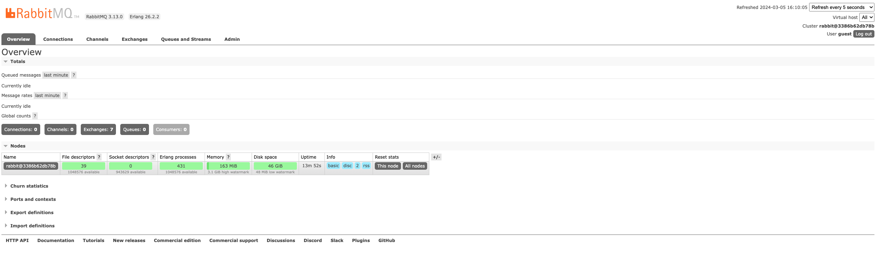

## 一、安装rabbitmq

> RabbitMQ官网文档：https://www.rabbitmq.com/docs/download

### 1、docker安装

> 如下是解释如何使用使用docker安装rabbitmq，可以跳过

```shell
# There is a second set of tags provided with the management plugin installed and enabled by default, which is available on the standard management port of 15672, with the default username and password of guest / guest:

# You can access it by visiting http://container-ip:15672 in a browser or, if you need access outside the host, on port 8080:
docker run -d --hostname my-rabbit --name some-rabbit rabbitmq:3-management

# You can then go to http://localhost:8080 or http://host-ip:8080 in a browser.
docker run -d --hostname my-rabbit --name some-rabbit -p 8080:15672 rabbitmq:3-management
```

> 官网推荐的docker安装命令

```shell
# latest RabbitMQ 3.13
docker run -itd --rm --name rabbitmq -p 5672:5672 -p 15672:15672 rabbitmq:3.13-management
```

### 2、web界面

> 打开页面:http://localhost:15672
>
> 用户名和密码都是`guest `



## 二、Go使用RabbitMQ

> rabbitmq官网文档对各个语言支持的使用解释的非常清楚，建议直接从官网开始看
>
> go语言使用rabbitmq，官方文档：https://www.rabbitmq.com/tutorials/tutorial-one-go
