## 一、搭建Redis环境

> 前言：使用Docker 来搭建Redis环境
>
> 镜像官网：[https://hub.docker.com/_/redis](https://hub.docker.com/_/redis)

### 1、创建redis容器

> 使用redis-cli客户端连接方式创建redis容器

#### 1.1 创建redis容器命令

```bash	
 # 创建redis容器
 docker run -idt --name redisly -p 6379:6379 redis
 
 # 命令参数解释
 -idt: i表示可以进行交互，t表示开启一个tty终端，d表示在后台运行容器
 --name: 表示自定义容器名，进入容器时可以使用该名字进入
 --rm: 表示创建redis容器时候，如果存在redis 、redis-cli先删除再创建
 -p: 表示将容器内端口映射到宿主机的端口
 
 # 创建有密码的redis
 docker run -itd --name redisly -p 6379:6379 redis --requirepass "123456"
```

####  1.2 创建redis容器

> 下面创建的redis容器，无密码


### 2、连接redis服务器

#### 2.1 redis-cli工具

> `redis`服务器可以通过`redis-cli`工具进行连接

```shell
# 连接redis命令，进入上面创建的redis容器，进行redis链接
redis-cli -h 127.0.0.1
```


## 二、Redis介绍

### 1、Redis介绍

> Redis官网：https://redis.io/docs/get-started/

> Redis是NoSQL(Not Only SQL)数据库，是指非关系型的数据库
>
> Redis是以`key-value`模式存储数据

> Redis适用场景
>
> - 对数据高并发的读写
> - 海量数据的读写
> - 对数据高扩展性的

> Redis不适用场景
>
> - 需要事务支持
> - 处理较为复杂的查询

#### 1.1 Memcache和Redis

|          | Redis                                                        | Memcache                                                     |
| -------- | ------------------------------------------------------------ | ------------------------------------------------------------ |
| 区别     | 几乎覆盖Memcache的绝大多数功能<br />数据都在内容中，支持持久化，可以用于备份恢复<br />除了支持简单的key-value，还支持较多种数据结构，比如list、set、hash、zset等 | 较早出现的NoSQL数据库<br />数据都在内存中，一般不持久化<br />支持简单的key-value，支持类型较少<br /> |
| 技术实现 | 单线程+多路IO复用                                            | 多线程+锁                                                    |

#### 1.2 Redis的特点

> - Redis是单线程+多路IO复用技术实现
> - 是一个开源的key-value存储系统，数据都是存储在内存中
> - 支持的类型非常多
>     - string：字符串
>     - hash：哈希表，对应python中的字典类型
>     - list：链表
>     - set：集合
>     - zset：有序结合
> - 数据支持push、pop、add、remove等操作，支持排序
> - Redis会周期性把更新的数据写入磁盘还活着吧修改操作写入追加的记录文件

> - redis配合关系型数据库做高速缓存
>     - 对高频次、热门访问的数据进行redis缓存，见到数据库压力
> - 多样的数据结构存储持久化数据
>     - 最新N个数据：
>         - 通过list实现按自然时间排序的数据
>     - 排行榜，Top N：
>         - 利用zset（有序集合）
>     - 时效性数据，比如手机验证码
>         - 利用Expire过期机制，设置60秒过期
>     - 计数器，秒杀
>         - 原子性，使用incr、decr
>     - 去除大量数据中的重复项
>         - 利用set集合
>     - 构建队列
>         - 利用list集合
>     - 发布订阅消息系统
>         - pub/sub模式

#### 1.3 Redis相关知识

> - redis的端口是6379
> - redis默认有16个数据库，从下标0开始，默认使用的是0号数据库，最大到15号库
>     - 使用select dbid切换数据库，比如select 1

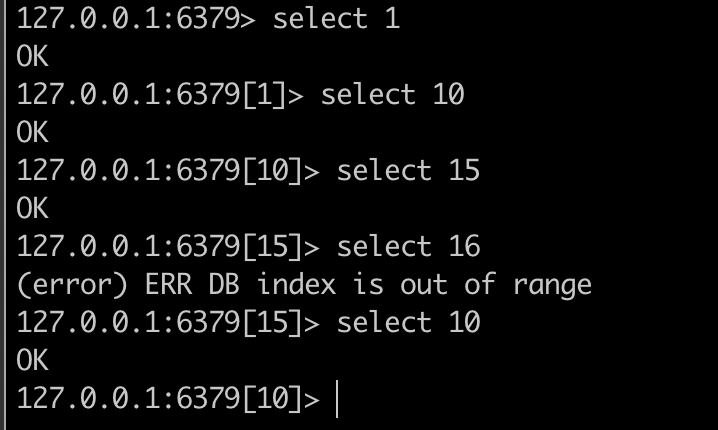

```bash
# 查看当前Redis的x号数据库的key数量
dbsize

# 清空当前库，谨慎操作
flushdb

# 通杀清理全部库，谨慎操作
flushall
```

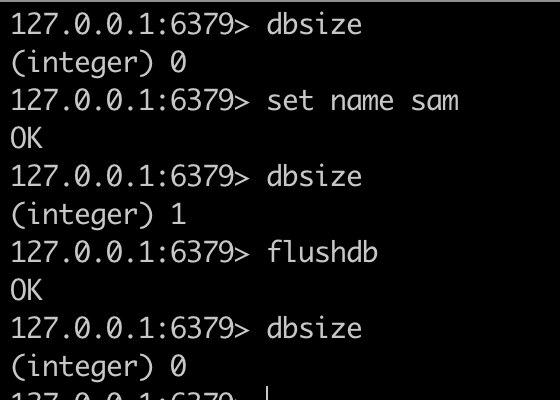


### 2、Redis键(Key)

```bash
# 查看当前库所有的key
keys *
```

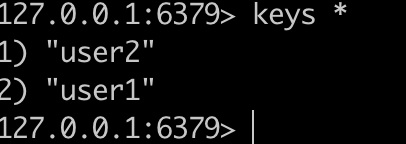

```bash
# 判断某个是否存在，返回值是1表示存在，0表示不存在 
exists key
```

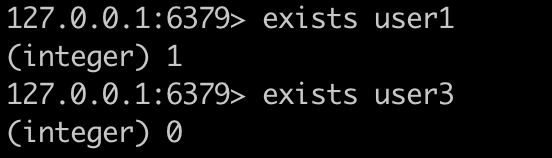

```bash
# 查看key的类型
type key 

# 不存在的key的类型为none，如下面的user3就是不存在的key
```

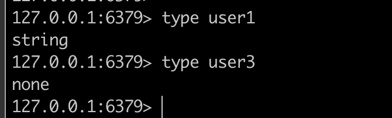


```bash
# 删除指定key的数据
del key

# 删除user1成功，返回值是1
# 删除user3(key不存在)成功，返回值是0
```

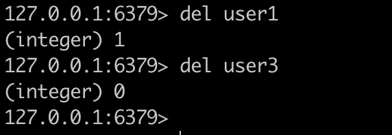

```bash
# 为key设置过期时间，10表示10秒
expire key 10 

# 查看还有多少秒过期，-1表示永不过期，-2表示已过期
ttl key
```

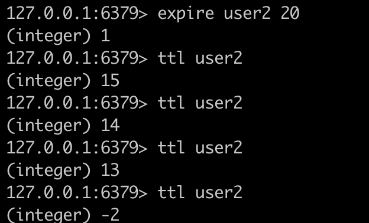

## 三、Redis的数据类型

### 1、string类型

> - string是Redis最基本的类型
> - string类型是二进制安全的，所以redis的string可以包含任何数据，比如图片或序列化的对象
> - 一个redis字符串的value最大是512M

#### 1.1 set

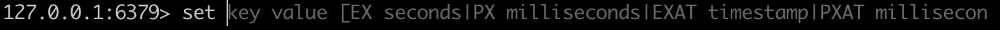

```bash
NX：当数据中key不存在时，可以将key-value加到数据库
XX：当数据中key存在时，可以将key-value加到数据库，与NX互斥
EX：key的超时秒数
NX：key的超时毫秒数，与EX互斥
```

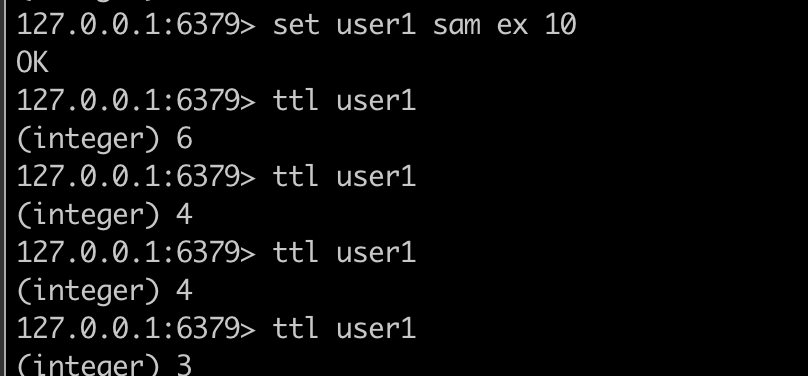

> 注意：
>
> - 当key的值存在时，继续对同一个key设置值时，会覆盖key原有的值

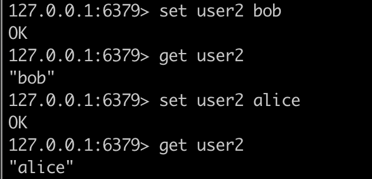

#### 1.2 get

> 查询redis的值

```bash
get key
```

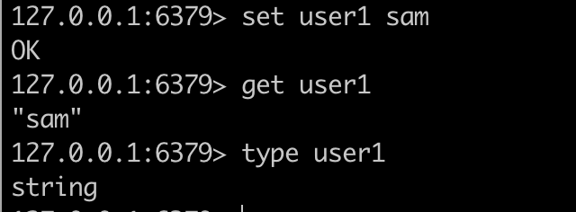

#### 1.3 append

> 将指定的新value追加到原始key的原始值的末尾

```bash
append key new_value
```

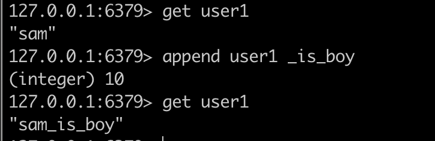

> 注意：
>
> append的返回值，会把原始value和新value的总体长度返回，上面的`sam_is_boy`就是10个字符

#### 1.4 strlen

> 获取指定key的值的长度

```bash
strlen key
```

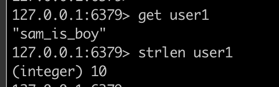

> 可以看到和上面`append`命令返回值长度一样

#### 1.5 setnx

> 只有key不存在时，才可以设置key的值，如果key存在，则不可以设置

```bash
setnx key value
```

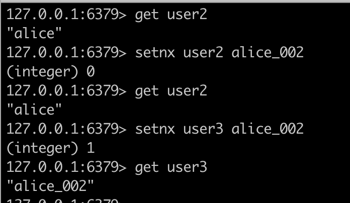

> 从上图可以看出：
>
> - `user2`这个key存在，并且有值为`alice`，所以使用`setnx`再设置新值`alice_002`，返回值为0，表示没有设置成功，重新查看`user2`的值仍是`alice`
> - `user3`这个key不存在，`setnx`设置新值`alice_002`，返回值为1，表示设置成功，查看`user3`的值是`alice_002`

#### 1.6 incr

> 对key中存储的数字值增1，只能对数值值操作，如果为空，新增值为1
>
> 原子操作

```bash
incr key
```

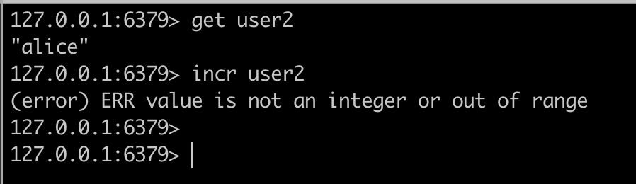

> user2的值是英文字母，所以incr设置时会提示不是一个整型

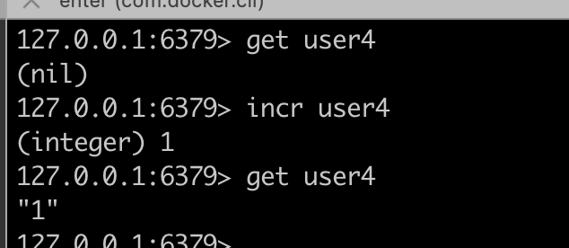

> user4这个key不存在表示值为空，使用incr对user4这个key进行增加，那么会新增值为1
>
> 查看user4的值就是1

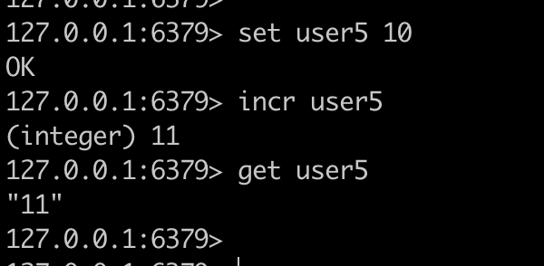

> 设置user5的值是10，使用incr对user5增1，incr的返回值就是增1后返回的新值
>
> 重新查看user5的值就是11

#### 1.7 decr

> 对key中存储的数字值减1，只能对数值值操作，如果为空，新增值为-1
>
> 原子操作

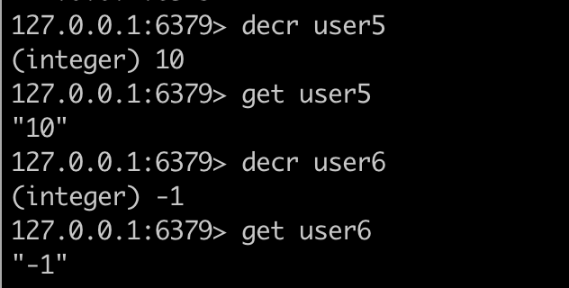

#### 1.8 incrby/decrby

> 对存储的数字值增、减，也就是可以做数值减法，比如直接减少10、20等等

```bash
# 对值增加任意值
incrby key 步长

# 对值减少任意值
decrby key 步长
```

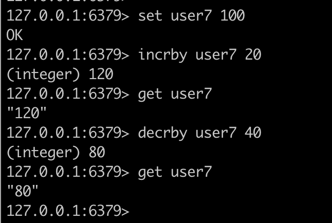

#### 1.9 原子操作

> 原子操作是指不会被线程调度机制打断的操作，这种操作一旦开始就一直运行到结束，不会有任何的切换行为
>
> - 在单线程中，能在单条指令中完成的操作都是`原子操作`
> - 在多线程中，不能再其他进程或线程打断的操作就叫`原子操作`

#### 1.10 mset/mget

> mset：一次设置多个值
>
> mget：获取多个值

```bash
mset key1 value1 key2 value2 ...
```

```bash
mget key1 value1 key2 value2 ...
```

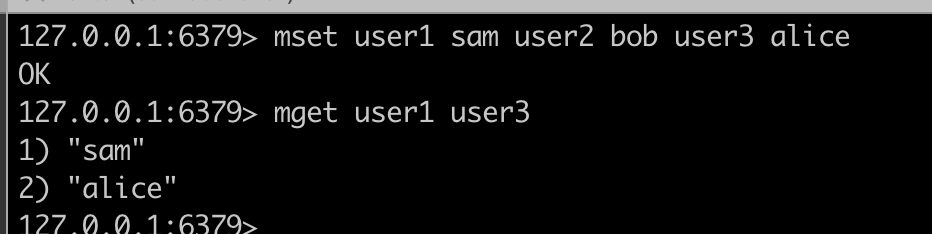

> 使用`set`设置的单个key，也可以用mget获取值

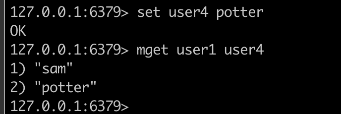

#### 1.11 msetnx

> 同时设置一个或多个key-value，当且仅当给定所有key都不存在
>
> 具有原子性，有一个失败则都失败

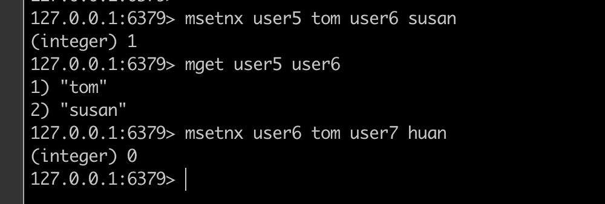

#### 1.12 getrange/setrange

> getrange：获取值的返回，类似于python的字符串的切片索引取值，并且是左闭右闭
>
> setrange：用新值覆盖key的原始值，从起始位置开始，也就是说对key的部分值进行替换

```bash
getrange key start end
```

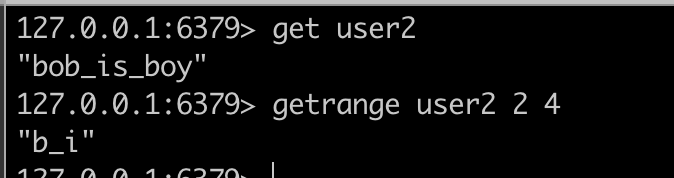

> getrange就是对这个key的值进行切片，并且起始和结束索引都是包含的，那么值就是`b_i`，而python中切片是左闭右开，右边索引值不包含

```bash
setrange key 起始索引 新值
```

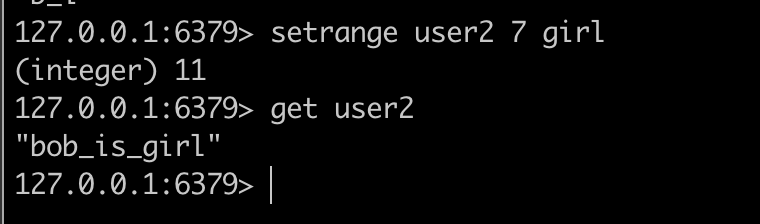

> setrange就是可以对key的原始值的某一个部分进行替换，上面的`boy`换成了`girl`

#### 1.13 setex

> 设置带过期时间的key-value，过期时间是秒

```bash
setex key expire value

# expire 过期时间，单位是秒
```

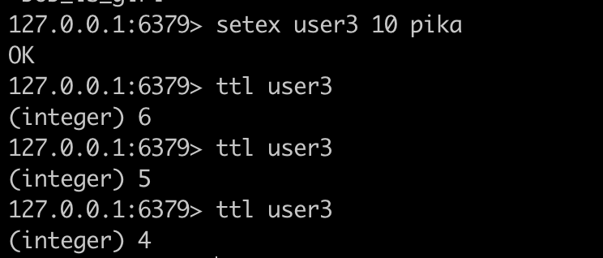

#### 1.14 getset

> 以新换旧，设置新值且获得旧值

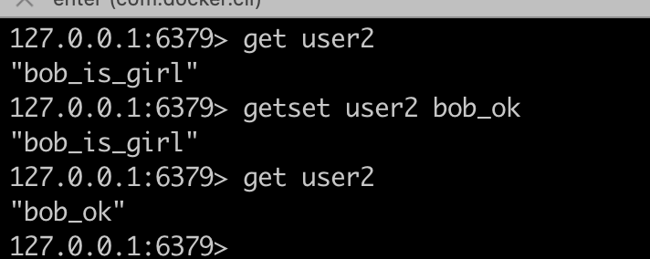

### 2、Hash类型

> - Hash类型是一个键值对集合
>
> - Hash类型时一个string类型的key-value的映射表，特别适合用来存储对象，对比到python的字典
>     - 比如存储用户信息，用用户UID作为key，value为用户的属性，比如姓名、年龄、性别等

```python
# hash的存储格式形似python的字典，如下
user1 = {"id":1, "name":"sam", "age":20}

# key是user1
# value是{"id":1, "name":"sam", "age":20}
```

#### 2.1 hset

> 设置hash值
>
> 针对一个对象多个属性字段，需要挨个设置，不能批量设置

```bash
hset key field1 value 
hset key field2 value
hset key field3 value
```

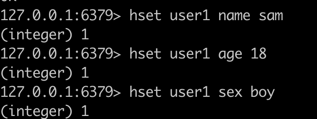

> 给同一个名为user1的key分别设置`name`、`age`、`sex`属性

#### 2.2 hget

> 获取hash的key对应的属性值

```bash
hget key field
```

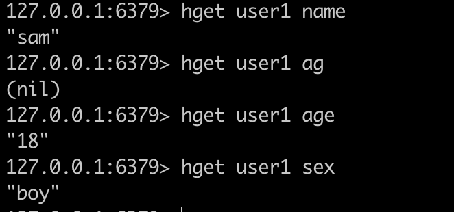

#### 2.3 hmset

> - 因为hset是对同一个key，需要多次设置不同的属性，适用于属性字段比较少的情况
> - 当属性字段值非常多时，可以用hmset一次设置多个字段值

```bash
hmset key field1 value1 field2 value2 field3 value3
```

#### 2.4 hexists

> 判断在一个key中，某个field字段是否存在

```bash
hexists key field
```

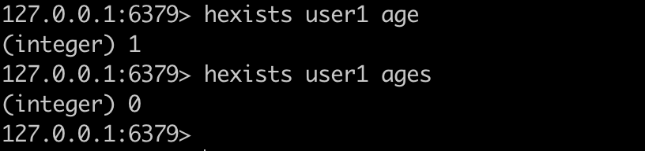

> - user1中存在age这个字段，返回值为1
> - user1中不存在ages这个字段，返回值为0

#### 2.5 hkeys/hvals

> Hkeys：列出key对应的所有的field属性

> hvals：列出key对应的所有的value属性

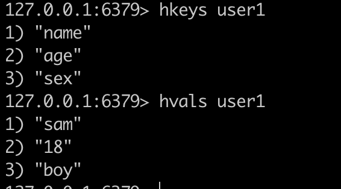

#### 2.6 hsetnx

> 将key中的field属性的值设置为value，当且仅当field不存在时才可以设置成功，当field存在，则设置不成功

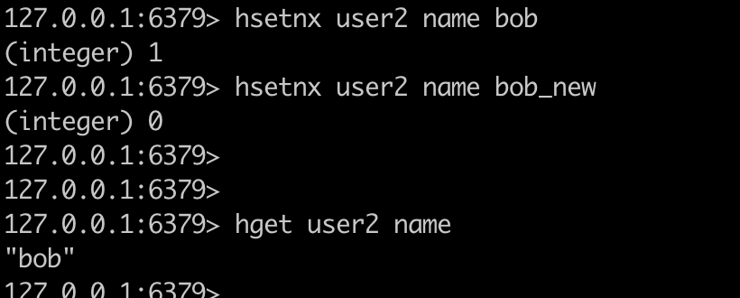

> - 可以看到用hsetnx对user2设置name属性
>     - 第一次设置为bob，返回值为1表示成功
>     - 第二次设置为bob_new，返回值为0表示失败

### 3、List

> Redis列表是简单的`字符串列表`，按照插入顺序排序，可以添加一个元素到列表的头部（左边）或者尾部（右边）

> Redis列表底层是双向链表，对两端的操作性能很高，但是通过索引下标操作列表中间的元素会性能较差

> 可以类比为python的list

#### 3.1 lpush

> lpush：从左边插入一个值或多个值

```bash
lpush key value1 value2 value3 ...
```

 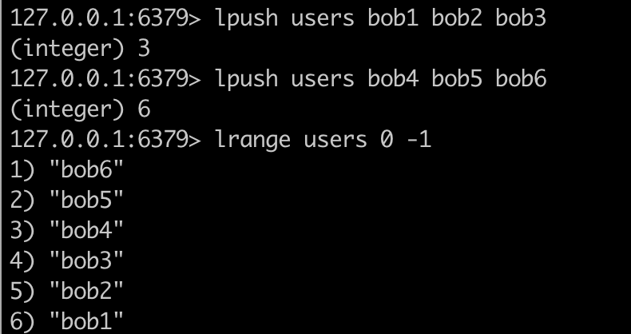

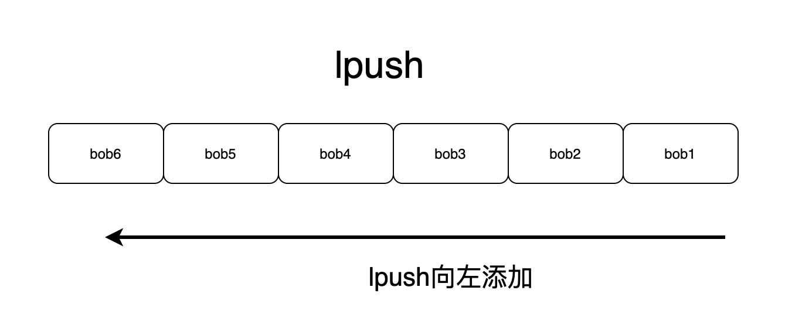

> lpush是向左添加元素，也就是给列表的头部(左边)一直添加元素，并且可以添加相同重复的值

#### 3.2 rpush

> rpush：从右边插入一个值或多个值

```bash
rpush key value1 value2 value3 ...
```

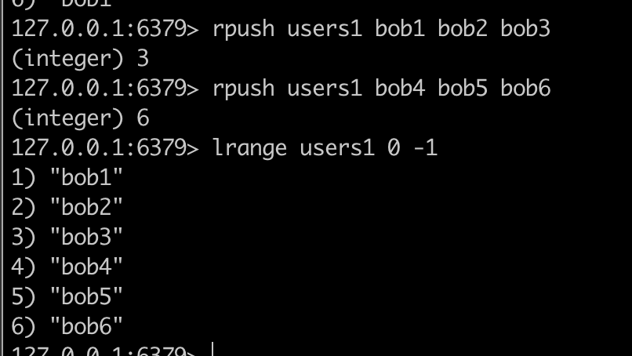

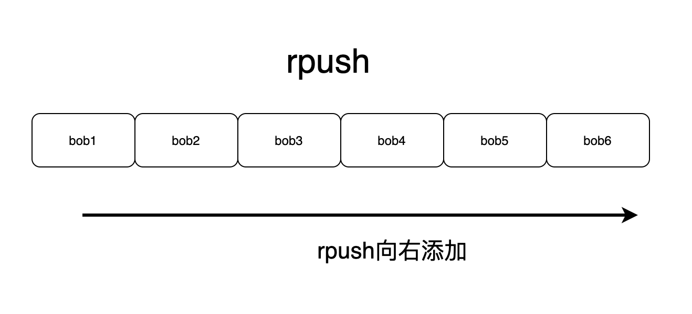

> rpush给右边一直插入值，所以是从左到右添加值

#### 3.3 lpop/rpop

> lpop：从左边吐出一个值
>
> rpop：从右边吐出一个值
>
> 当把列表中值都取完以后，对应的key也都不存在了

```bash
# 从左边吐出一个值
lpop key

# 从右边吐出一个值
rpop key
```


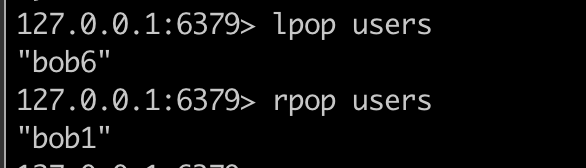

#### 3.4 rpoplpush

> 表示从key1列表右边吐出一个值，插入到key2列表左边

```bash
rpoplpush key1 key2
```

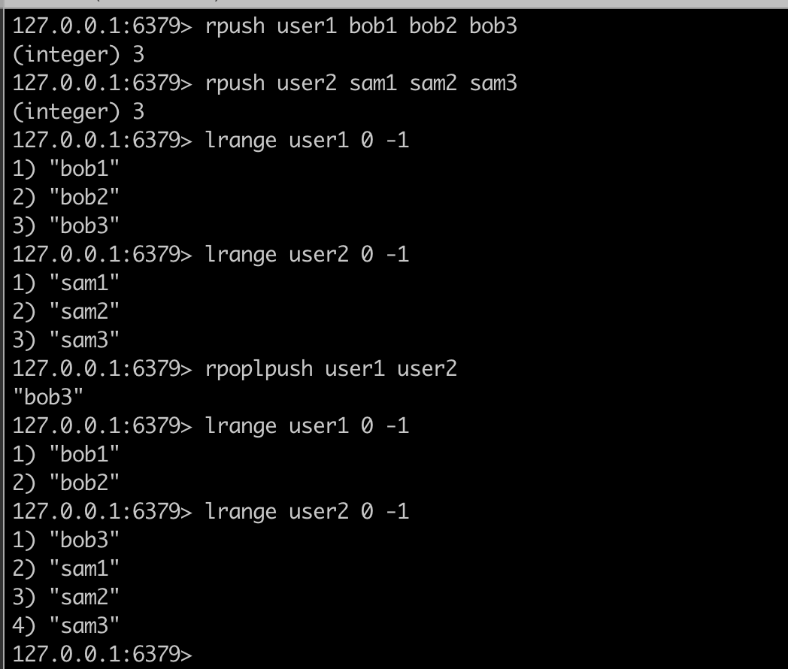

> - user1、user2列表中用`rpush`插入三个值
> - rpoplpush user1 user2
>     - 这条命令返回值为user1的最右边的值即bob3
>     - 并且插入到user2的最左边
> - 分别查看user1、user2列表中元素
>     - user1列表最右边少了bob3
>     - user2列表最左边多了bob3

#### 3.5 lrange

> 查看列表所有元素，需要跟上索引
>
> - 0表示左边第一个
>
> - -1表示右边第一个，也就是列表最后一个

```bash
lrange key 0 -1
```

#### 3.6 lindex

> 根据索引下标获取元素，索引从0开始
>
> 当索引不存在时，值为空

```bash
lindex key index
```

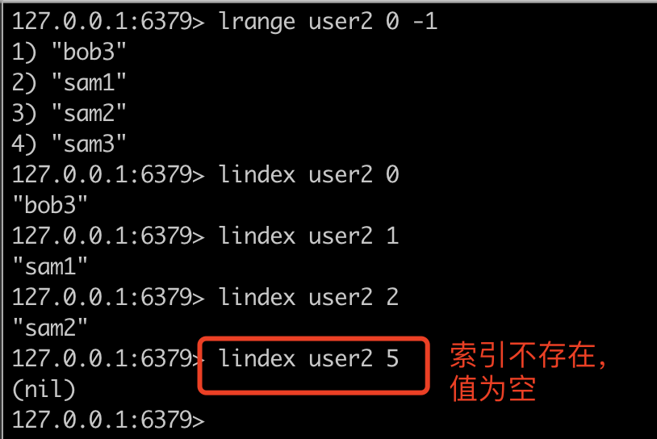

#### 3.7 llen

> 获取列表长度

```bash
llen key
```

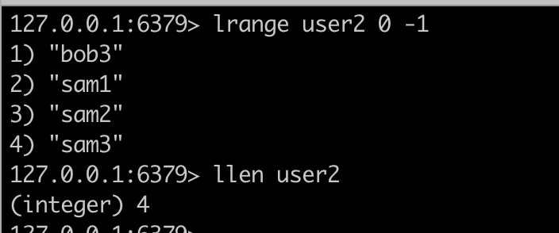

#### 3.8 lset

> 将列表中指定索引的值换为新值

```bash
lset key index value
```

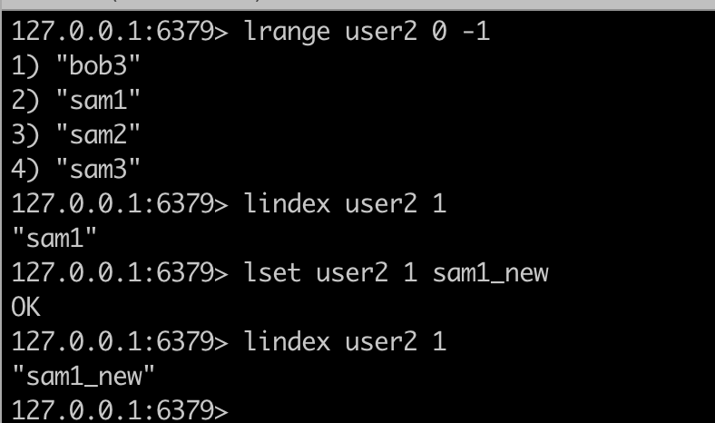

### 4、set

> 集合

### 5、zset

> - zset是有序集合，是一个没有重复元素的字符串集合
> - 有序集合的每个成员都关联了一个评分，评分主要用来从最低分到最高分方式排序集合中的成员
>     - 集合中的成员是唯一的，但是评分可以重复，也就是说不同成员的评分可能会一样
> - 因为元素是有序的，所以根据评分很快获取一个范围的元素
> - 反问有序集合的中间元素非常快，所以可以用有序集合作为一个没有重复成员的智能列表

#### 5.1 zadd

> 将一个或多个元素及其score值加入到有序集合key当中
>
> 默认是根据score值从小到大排序

```bash
zadd key score1 value1 score2 value2 ...
```

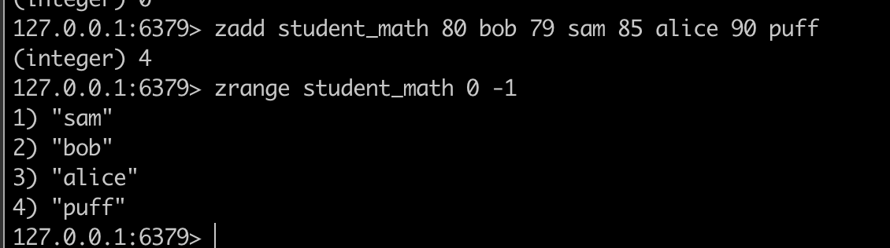

> 设置key为：student_math
>
> 分数和值为：
>
> - 80 bob
> - 79 sam
> - 85 alice
> - 90 puff
>
> 使用zrange查看student_math所有值
>
> - 值为：sam、bob、alice、puff
> - 所以可以看到根据score排序从小排序

#### 5.2 zrange

> 返回有序集合key中，下标在start、stop之间的元素
>
> start为0表示有序集合第一个元素
>
> Stop为-1表示有序集合最后一个元素

```bash
zrange key start stop
```

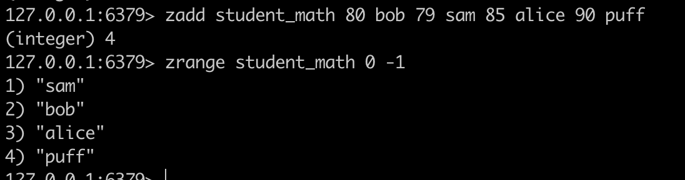

```bash
# withscores 表示将scores和值一起返回
zrange key start stop withscores
```

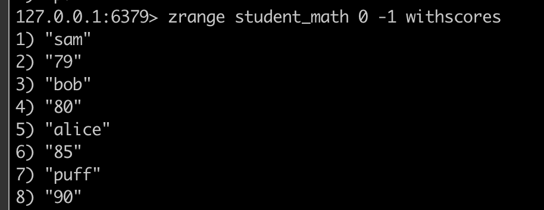

> 可以更清晰看到值和值对应的score一起返回了

#### 5.3 zrangebyscore

> **按分数的范围取值**
>
> - 返回有序集合中，所有score值介于min和max之间（包含等于min或max）的值
>
> - 有序集合成员按照score值从小到大排序

```bash
zrangebyscore key min max [withscores] [limit offset count] 
```

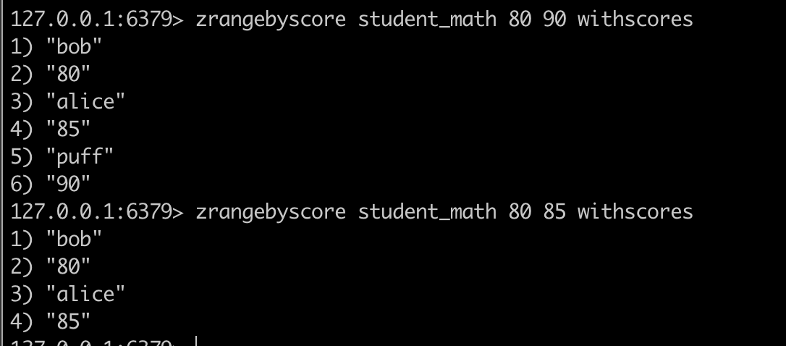

> 可以看到返回了80到85之间的值和值对应的分数

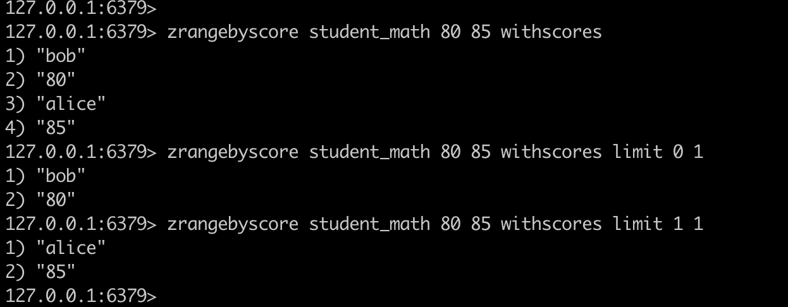

> 使用`limit offset count`
>
> - offset：表示偏移量，zrangebyscore筛选出一个范围后，从第几个值开始取值
>     - 0表示从偏移量为0，要从第一个值左边开始取值，count为1时，表示只取最左边第一个值
> - count：表示从偏移量开始取几个值

#### 5.4 zrevrangebyscore

> 命令作用同zrangebyscore，只不过是排序为从大到小
>
> 并且max位置在min前面

```bash
zrevrangebyscore key max min [withscores] [limit offset count] 
```

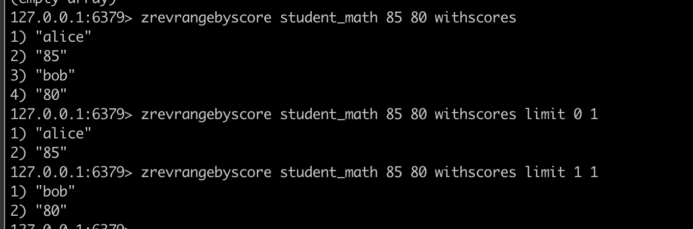

#### 5.5 zincrby

> 为集合中指定值的score加上增量（增量可以是任意数字）

```bash
 zincrby key incrment value
```

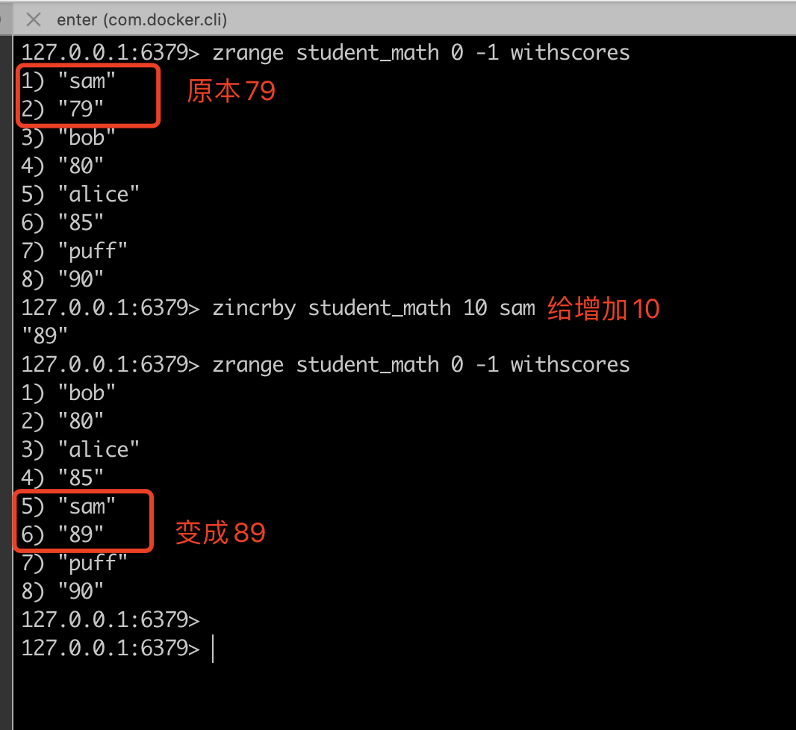

#### 5.6 zrem

> 删除该集合下指定的值

```bash
zrem key value
```

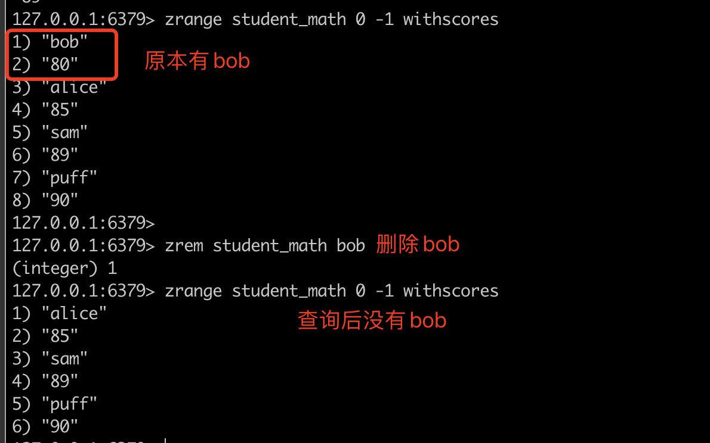

#### 5.7 zcount

> 统计该集合，分数区间内的元素个数

```bash
zcount key min max

# min是区间最小分数
# max是区间最大分数
```

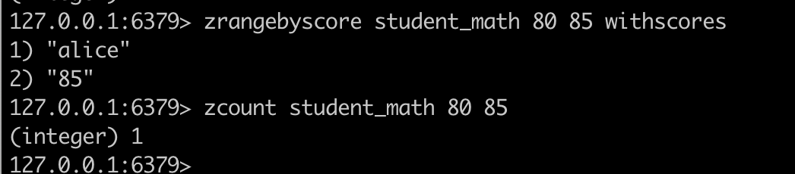

#### 5.8 zrank

> 返回该值在集合中的排名，默认从0开始

```bash
zrank key value
```

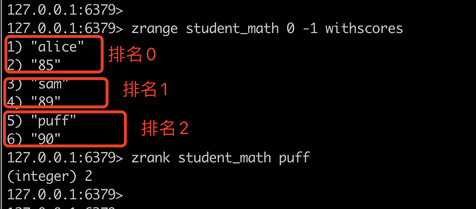

> 从上图可看到，使用zrank查询student_math中puff值的排名

### 6、发布订阅

> redis发布订阅是一种消息通信模式
>
> - 类似于现在的B站用户（订阅者）的关注喜欢的up主（消息生产者），up主有新作品关注的用户的用户就会收到消息
>
> - 发送者发送消息
> - 订阅者接收消息
> - redis客户端可以订阅任意数量的频道

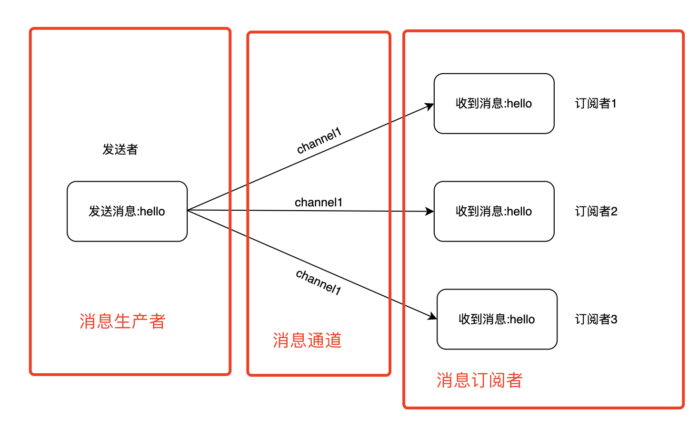

#### 6.1 给channel发送消息

> 打开另外一个客户端，给channel发送消息，是消息生产者

```bash
publish channel message

# channel是channel的名称
# message是要给channel发送的消息，字符串类型
```

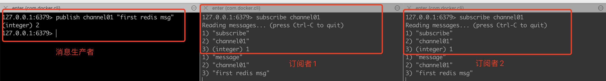

> 可以看到，消息发送后，返回了2，表示订阅者数量，刚好中间和右边就是2个订阅者

#### 6.2 订阅channel

> 打开一个redis的客户端订阅channel，是订阅者
>
> 注意发布的消息没有持久化，如果在订阅的客户端收不到消息，那么只能收到订阅后发布的新消息

```bash
subscribe channel

# channel是channel的名称
```

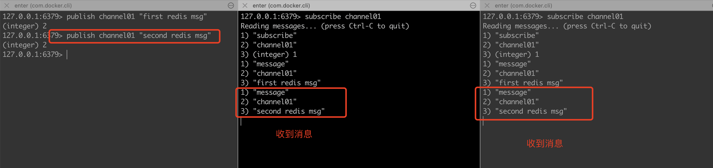