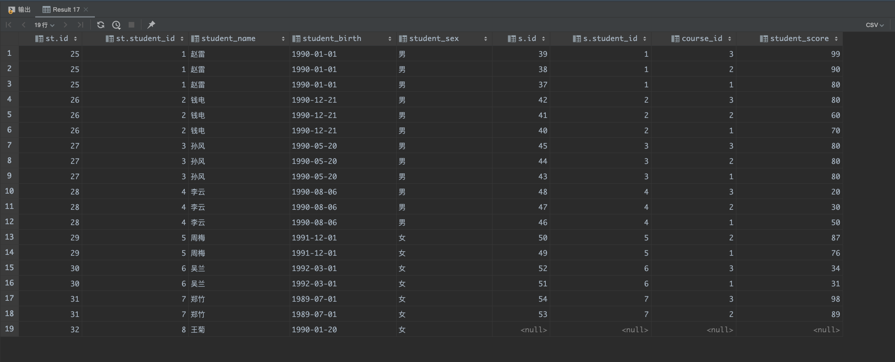

## 一、前言

> 本篇主要是知乎的[50道SQL练习题](https://zhuanlan.zhihu.com/p/43289968)和[B站对50道SQL练习题配套视频](https://www.bilibili.com/video/BV1q4411G7Lw/?spm_id_from=333.999.0.0)的学习记录
>
> 参考：
>
> https://zhuanlan.zhihu.com/p/38354000（对题目做了分类）
>
> https://zhuanlan.zhihu.com/p/43289968（原始题目）

### 1、数据准备

#### 1.1 sql表语句

```sql
-- 学生表
create table if not exists `student`
(
    `id`            bigint      not null auto_increment comment '主键ID',
    `student_id`    bigint      not null default 0 comment '学生ID',
    `student_name`  varchar(32) not null default '' comment '学生姓名',
    `student_birth` varchar(32) not null default '' comment '学生生日',
    `student_sex`   varchar(10) not null default '' comment '学生性别',
    primary key (`id`),
    unique index `idx_student_id` (`student_id`)
) default charset = utf8mb4;

-- 课程表
create table if not exists `course`
(
    `id`          bigint      not null auto_increment comment '主键ID',
    `course_id`   bigint  not null default 0 comment '课程ID',
    `course_name` varchar(20) not null default '' comment '课程名称',
    `teacher_id`  bigint not null default 0 comment '教师ID',
    PRIMARY KEY (`id`),
    unique index `idx_course_id` (`course_id`)
) default charset = utf8mb4;

-- 教师表
create table if not exists `teacher`
(
    `id`           bigint      not null auto_increment comment '主键ID',
    `teacher_id`   bigint not null default 0 comment '教师ID',
    `teacher_name` varchar(20) not null default '' comment '教师名称',
    primary key (`id`)
) default charset = utf8mb4;

-- 成绩表
create table if not exists `score`
(
    `id`            bigint     not null auto_increment comment '主键ID',
    `student_id`    bigint not null default 0 comment '学生ID',
    `course_id`     bigint not null default 0 comment '课程ID',
    `student_score` int        not null default 0 comment '学生成绩',
    primary key (`id`)
) default charset = utf8mb4;
```

#### 1.2 sql插表数据

```sql
-- 插入学生表测试数据
insert into student(`student_id`,`student_name`,`student_birth`,`student_sex`) values('01', '赵雷' , '1990-01-01' , '男');
insert into student(`student_id`,`student_name`,`student_birth`,`student_sex`) values('02' , '钱电' , '1990-12-21' , '男');
insert into student(`student_id`,`student_name`,`student_birth`,`student_sex`) values('03' , '孙风' , '1990-05-20' , '男');
insert into student(`student_id`,`student_name`,`student_birth`,`student_sex`) values('04' , '李云' , '1990-08-06' , '男');
insert into student(`student_id`,`student_name`,`student_birth`,`student_sex`) values('05' , '周梅' , '1991-12-01' , '女');
insert into student(`student_id`,`student_name`,`student_birth`,`student_sex`) values('06' , '吴兰' , '1992-03-01' , '女');
insert into student(`student_id`,`student_name`,`student_birth`,`student_sex`) values('07' , '郑竹' , '1989-07-01' , '女');
insert into student(`student_id`,`student_name`,`student_birth`,`student_sex`) values('08' , '王菊' , '1990-01-20' , '女');
-- 课程表测试数据
insert into course(`course_id`,`course_name`,`teacher_id`) values('01' , '语文' , '02');
insert into course(`course_id`,`course_name`,`teacher_id`) values('02' , '数学' , '01');
insert into course(`course_id`,`course_name`,`teacher_id`) values('03' , '英语' , '03');

-- 教师表测试数据
insert into teacher(`teacher_id`,`teacher_name`) values('01' , '张三');
insert into teacher(`teacher_id`,`teacher_name`) values('02' , '李四');
insert into teacher(`teacher_id`,`teacher_name`) values('03' , '王五');

-- 成绩表测试数据
insert into score(`student_id`,`course_id`,`student_score`) values('01' , '01' , 80);
insert into score(`student_id`,`course_id`,`student_score`) values('01' , '02' , 90);
insert into score(`student_id`,`course_id`,`student_score`) values('01' , '03' , 99);
insert into score(`student_id`,`course_id`,`student_score`) values('02' , '01' , 70);
insert into score(`student_id`,`course_id`,`student_score`) values('02' , '02' , 60);
insert into score(`student_id`,`course_id`,`student_score`) values('02' , '03' , 80);
insert into score(`student_id`,`course_id`,`student_score`) values('03' , '01' , 80);
insert into score(`student_id`,`course_id`,`student_score`) values('03' , '02' , 80);
insert into score(`student_id`,`course_id`,`student_score`) values('03' , '03' , 80);
insert into score(`student_id`,`course_id`,`student_score`) values('04' , '01' , 50);
insert into score(`student_id`,`course_id`,`student_score`) values('04' , '02' , 30);
insert into score(`student_id`,`course_id`,`student_score`) values('04' , '03' , 20);
insert into score(`student_id`,`course_id`,`student_score`) values('05' , '01' , 76);
insert into score(`student_id`,`course_id`,`student_score`) values('05' , '02' , 87);
insert into score(`student_id`,`course_id`,`student_score`) values('06' , '01' , 31);
insert into score(`student_id`,`course_id`,`student_score`) values('06' , '03' , 34);
insert into score(`student_id`,`course_id`,`student_score`) values('07' , '02' , 89);
insert into score(`student_id`,`course_id`,`student_score`) values('07' , '03' , 98);
```

> 下图是上面四张表的关系图


## 二、SQL题目

### 1、(重点)查询课程编号为“01”的课程比“02”的课程成绩高的所有学生的学号

#### 1.1 分析

> 根据题目，我们可以构思出一张临时表，临时表字段有学号、课程01的成绩、课程02的成绩，那么执行一条最简单的sql中的大于判断，就可以得到我们需要的数据


```sql
-- 构思临时表
-- a、需要课程01的成绩以及学号
select student_id,student_score from score where course_id='01';

-- b、需要课程02的成绩以及学号
select student_id,student_score from score where course_id='02';

-- c、将上面两个子查询进行inner join，以student_id为inner join的条件，那我们就有了一张上图表格中的临时表数据了
select a.*, b.*
from (select student_id, student_score from score where course_id = '01') a
         inner join (select student_id, student_score from score where course_id = '02') b
                    on a.student_id = b.student_id;
```

> 从下图的结果来看：
>
> - 我们得到a表中学过01课程的学生以及分数，b表中学过02课程的学生以及分数
> - 先忽略student_id列，因为都是a表和b表每一行都是一样的，所以我们只关心student_score这一列就可以，那就是得到了我们上面表格中的那张临时表了
> - 接下来要做的就是进行下01课程成绩大于02课程成绩的判断就可以了


#### 1.2 解答

```sql
-- 最终题目sql
select a.student_id,a.student_score '01课成绩', b.student_score '02课成绩'
from (select student_id, student_score from score where course_id = '01') a
         inner join (select student_id, student_score from score where course_id = '02') b
                    on a.student_id = b.student_id
where a.student_score > b.student_score;
```


> 根据上面分析中的inner join拿到的那张临时表再加下01课程成绩大于02课程成绩的判断，select 后面加上题目要求的学号，就得到了我们想要的数据

### 2、(重点)查询平均成绩大于60分的学生的学号和平均成绩

> 在score表中就有我们需要的学号、成绩字段，那么不要多表连接查询了，对于平均成绩，使用avg这个聚合函数就可以得到平均成绩，平均成绩大于60可以使用group by的条件查询语句having来过滤出需要的数据

```sql
select student_id, avg(student_score) from score group by student_id having avg(student_score) > 60;
```


### 3、查询所有学生的学号、姓名、选课数、总成绩

#### 3.1 分析

> 要查询上面的条件，那我们可以构思出一张临时表，像下面这样
>
> 临时表的字段：
>
> - 学号
> - 姓名
> - 课程编号
> - 该课程成绩（单独一门课程的成绩）
>
> 题目要求求出选课数、总成绩，那就涉及到了聚合函数，选课数用count，总成绩用sum


> 构造临时表步骤

```sql
-- 在学生表可以拿到学号、姓名
select student_id,student_name from student;

-- 在成绩表可以拿到课程编号、该课成绩
select course_id,student_score from score;

-- 可以在两张表中看到都有student_id字段，那么使用左连接那就可以拿到student表和score表所有的字段了
select st.*,s.* from student as st left join score s on st.student_id = s.student_id;
```



#### 3.2 疑问解答

> 为什么要用左连接？
>
> 可以从上面左连接的结果看出，使用左连接，那么学生信息一定会有的，但是成绩不一定会有，也就表示该学生可能没有学该门课程，这是符合正常逻辑的，可以看到图中的王菊就是这样一条数据，这样就不会漏掉任何一个学生

> 如果使用了内连接会怎样？
>
> 可以看到王菊那一条数据没有了，因为内连接是按照只返回两个表中连接字段相等的行，因为王菊的学号是8，但是score表没有学号为8的数据，那么内连接就不会有王菊这条数据，相当于是漏数据了


#### 3.3 解答

> 最终的题目sql如下
>
> 为什么要使用group by呢？
>
> - 因为要统计选课数、总成绩，那第一时间想到的就是聚合函数，聚合函数一般都是和group by搭配使用的
> - 注意点：
>   - 没有在group by中出现的字段，不建议出现在select语句中，那为什么s.student_score可以在select中出现呢？
>     - `SELECT`子句中可以包含任何可以被唯一确定的列。在我们的查询中，使用了聚合函数`SUM(s.student_score)`，这意味着虽然`student_score`这个字段没有出现在`GROUP BY`中，但是它实际上被`SUM()`函数处理过，系统会对每个分组中的所有`student_score`进行求和，求出的结果是唯一的，所以可以出现在`SELECT`中。
>     - 如果在`SELECT`子句中使用了没有出现在`GROUP BY`子句中的列，并且这个列没有被聚合函数处理，那你可能得到的结果就是不确定的，因为在每个分组中，这个列可能有多个不同的值，系统不知道应该选择哪一个，所以这种做法通常是不被推荐的
>   - 因为题目要求还需要输出学生姓名，那么也需要将st.student_name放到group by语句后。

```sql
-- 使用
select st.student_id '学号', st.student_name '姓名', count(s.student_id) '选课数', sum(s.student_score) '总成绩'
from student as st
         left join score s on st.student_id = s.student_id
group by st.student_id,st.student_name;
```


> 可以看到结果已经出来，但是有个小瑕疵，就是选课数为0时，总成绩为null，一般不太希望出现null，那就可以使用case when语句来处理一下

```sql
-- case when语句，和if-else语句逻辑是一样的
CASE WHEN sex = '1' THEN '男'
     WHEN sex = '2' THEN '女'
ELSE '其他' END   
```

```sql
select st.student_id '学号', st.student_name as '姓名', count(s.student_id) as '选课数', sum(case when s.student_score is null then 0 else s.student_score end) as '总成绩'
from student as st
         left join score s on st.student_id = s.student_id
group by st.student_id;
```


> 思路：写多表sql时，就是先构造出自己想要的表字段，看看是一张表能不能搞定，如果一张表搞定不了，那就关联多张表来构思出一张我们想要字段的表，然后再进行数据处理
>
> 参考：https://juejin.cn/post/6844903902366662670?searchId=20230911141919C406DDF1D71FA5DBBC8F

### 4、查询姓“猴”的老师的个数

> 该题目主要考察聚合函数count和like这两个语法，比较简单，直接来看sql语句

```sql
-- 查找姓猴的老师
select count(teacher_id) from `teacher` where teacher_name like '猴%';

-- 因为教师表中没有姓猴的老师，所以个数为0
```


### 5、(重点)查询没学过“张三”老师课的学生的学号、姓名

> 
