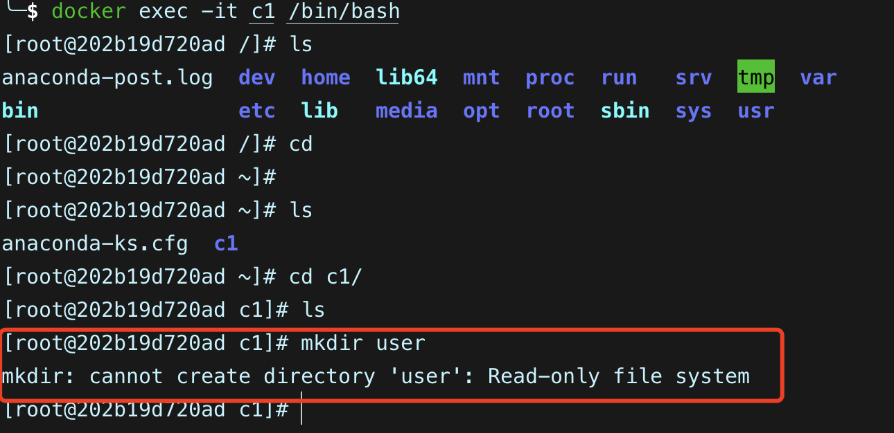
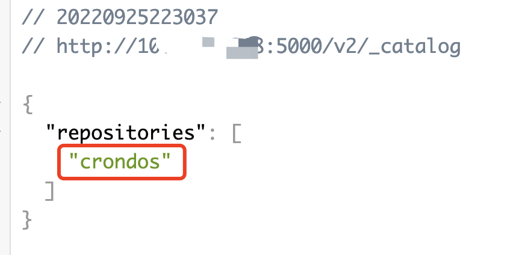

## 一、Docker安装

### 1、官网教程

> https://docs.docker.com/engine/install/centos/
>
> https://www.bilibili.com/video/BV1MJ411R7EP?spm_id_from=333.999.0.0&vd_source=501c3f3a75e1512aa5b62c6a10d1550c
>
> https://www.bilibili.com/video/BV17g411c7T4?spm_id_from=333.999.0.0&vd_source=501c3f3a75e1512aa5b62c6a10d1550c

### 2、自行安装步骤

> 依据官网安装教程，记录自己安装时的步骤，并且配置国内镜像源

#### 2.1 卸载老版本的`docker`

```bash	
 $ sudo yum remove docker \
                  docker-client \
                  docker-client-latest \
                  docker-common \
                  docker-latest \
                  docker-latest-logrotate \
                  docker-logrotate \
                  docker-engine
```

#### 2.2 配置安装/更新`docker`的仓库

> 官方解释：Before you install Docker Engine for the first time on a new host machine, you need to set up the Docker repository. Afterward, you can install and update Docker from the repository.
>
> 大体意思是在安装docker引擎之前，需要先配置下docker引擎的仓库，方便后续更新或安装
>
> `--add-repo`后面跟的是仓库地址，这个是国外的地址，国内访问比较慢，所以需要替换成国内的仓库地址，推荐使用阿里云，下载速度会很快
>
> 阿里云docker引擎地址：`http://mirrors.aliyun.com/docker-ce/linux/centos/docker-ce.repo`

- 替换仓库源后

  ```bash
   $ sudo yum install -y yum-utils
   $ sudo yum-config-manager --add-repo http://mirrors.aliyun.com/docker-ce/linux/centos/docker-ce.repo
  ```

  

#### 2.1.3 安装`docker-ce`引擎

```bash
$ sudo yum install docker-ce docker-ce-cli containerd.io
```


#### 2.1.4 检查docker版本

```bash
[root@dns ~]# docker --version
Docker version 20.10.7, build f0df350
```

### 3、镜像源加速

> 因为docker镜像中心[`docker hub`](https://hub.docker.com/)在国外，拉取镜像时因为网络会很慢，所以需要替换国内镜像源

#### 3.1 修改镜像源

> 目录：`vi /etc/docker/daemon.json`
>
> 编辑 docker 的 daemon.json 配置文件，docker刚安装完是没有的这个文件，需要新建一个，添加如下内容，镜像源可以配置多个

```json
{
  "registry-mirrors": ["https://docker.mirrors.ustc.edu.cn", "http://hub-mirror.c.163.com"]
}
```

#### 3.1.2 让配置生效

```bash
# 重启守护进程
$ systemctl daemon-reload

# 重启docker
$ systemctl restart docker
```

#### 3.3 查看docker配置

```bash
$ docker info
```

> 上述命令可以看到docker的仓库镜像地址已经替换成配置的地址了


### 4、Hello-World测试

```bash
[root@dns ~]# docker run hello-world 
Unable to find image 'hello-world:latest' locally  # 从本地找，找不到去仓库拉取
latest: Pulling from library/hello-world
b8dfde127a29: Pull complete
Digest: sha256:5122f6204b6a3596e048758cabba3c46b1c937a46b5be6225b835d091b90e46c
Status: Downloaded newer image for hello-world:latest

# 安装成功
Hello from Docker!
This message shows that your installation appears to be working correctly.

To generate this message, Docker took the following steps:
 1. The Docker client contacted the Docker daemon.
 2. The Docker daemon pulled the "hello-world" image from the Docker Hub.
    (amd64)
 3. The Docker daemon created a new container from that image which runs the
    executable that produces the output you are currently reading.
 4. The Docker daemon streamed that output to the Docker client, which sent it
    to your terminal.

To try something more ambitious, you can run an Ubuntu container with:
 $ docker run -it ubuntu bash

Share images, automate workflows, and more with a free Docker ID:
 https://hub.docker.com/

For more examples and ideas, visit:
 https://docs.docker.com/get-started/
```

## 二、Docker基础概念

### 1、docker架构

> 官网架构概括：https://docs.docker.com/get-started/overview/#docker-architecture
>
> 相关博客：https://www.cnblogs.com/mrhelloworld/p/docker2.html

#### 1.1 docker是什么？

> Docker是基于GO语言编写的云开源项目
>
> Docker怎么来的:
>
> - Linux容器化技术，通过对应用组件的封装、分发、部署、运行等生命周期的管理，将`应用`和`应用使用的环境`打包成镜像，能够做到`一次镜像，处处运行`
> - 而Docker就是在Linux容器化技术上发展来的，将应用打包成镜像，通过镜像去创建Docker容器，而Docker容器在任何操作系统上都是一样的，就做到了跨平台使用同一份应用和环境
>
> Docker特点：
>
> - Docker是通过内核虚拟化技术来提供容器的资源隔离和安全保障
> - 由于Docker是通过操作系统层的虚拟化来实现隔离，所以Docker在运行的时候，不需要类似虚拟机额外的操作系统开销，从而进一步提高资源利用率

#### 1.2 docker架构介绍

> - Docker使用客户端-服务器架构。Docker客户端与Docker守护进程对话，后者负责构建、运行和分发Docker容器的重任。Docker客户端和守护进程可以在同一系统上运行，或者你可以将Docker客户端连接到远程Docker守护进程。
> - Docker客户端和守护进程使用REST API，通过UNIX套接字或网络接口进行通信。另一个Docker客户端是Docker Compose，它可以让你处理由一组容器组成的应用程序


### 2、客户端

> - Docker 是一个客户端-服务器（C/S）架构程序。
> - Docker 客户端只需要向 Docker 服务器或者守护进程发出请求，服务器或者守护进程将完成所有工作并返回结果。
> - Docker 提供了一个命令行工具 Docker 以及一整套 RESTful API。
> - 你可以在同一台宿主机上运行 Docker 守护进程和客户端，也可以从本地的 Docker 客户端连接到运行在另一台宿主机上的远程 Docker 守护进程。

### 3、Host 宿主机

> 宿主机就是Docker 引擎安装所在的机器，一个物理或者虚拟的机器用于执行 Docker 守护进程和容器。
>

### 4、镜像

#### 4.1  什么是 Docker 镜像？

> - 镜像是一个只读的模板，带有创建Docker容器的说明。通常情况下，一个镜像是基于另一个镜像的，并进行了一些额外的定制。
>     - 例如，你可以建立一个基于ubuntu镜像的镜像，但会安装Apache网络服务器和你的应用程序，以及使你的应用程序运行所需的配置细节。
> - 你可以创建你自己的镜像，也可以只使用那些由他人创建并发布在注册表上的镜像。
>     - 要建立你自己的镜像，你要创建一个Docker文件，用简单的语法来定义创建镜像和运行它所需的步骤。
>     - Dockerfile中的每个指令都会在镜像中创建一个层。
>     - 当你改变Dockerfile并重建镜像时，只有那些已经改变的层被重建。
>     - 与其他虚拟化技术相比，这是使镜像如此轻便、小巧和快速的部分原因。

#### 4.2 镜像分层

> Copy-on-Write : 写时复制

> Docker 支持通过扩展现有镜像，创建新的镜像。实际上，Docker Hub 中 99% 的镜像都是通过在 base 镜像中安装和配置需要的软件构建出来的。
>


> - 从上图可以看到，新镜像是从 base 镜像一层一层叠加生成的。每安装一个软件，就在现有镜像的基础上增加一层。
> - 镜像分层最大的一个好处就是共享资源。
>     - 比如说有多个镜像都从相同的 base 镜像构建而来，那么 Docker Host 只需在磁盘上保存一份 base 镜像；同时内存中也只需加载一份 base 镜像，就可以为所有容器服务了。
>     - 而且镜像的每一层都可以被共享。
>
> - 如果多个容器共享一份基础镜像，当某个容器修改了基础镜像的内容，比如 /etc 下的文件，这时其他容器的 /etc 是不会被修改的，修改只会被限制在单个容器内。
> - 这就是容器 **「Copy-on-Write」** 特性。

> Docker镜像是分层构建的，Dockerfile 中每条指令都会新建一层。例如以下 Dockerfile:
>

```docker
FROM ubuntu:18.04
COPY . /app
RUN make /app
CMD python /app/app.py
```

> - 以上四条指令会创建四层，分别对应基础镜像、复制文件、编译文件以及入口文件，每层只记录本层所做的更改，而这些层都是只读层。
> - 当你启动一个容器，Docker 会在最顶部添加读写层，你在容器内做的所有更改，如写日志、修改、删除文件等，都保存到了读写层内，一般称该层为容器层
>
> - 事实上，容器（container）和镜像（image）的最主要区别就是容器加上了顶层的读写层。
>     - 所有对容器的修改都发生在此层，镜像并不会被修改，也即前面说的 COW(copy-on-write)技术。
>     - 容器需要读取某个文件时，直接从底部只读层去读即可，而如果需要修改某文件，则将该文件拷贝到顶部读写层进行修改，只读层保持不变。
>
> - 每个容器都有自己的读写层，因此多个容器可以使用同一个镜像，另外容器被删除时，其对应的读写层也会被删除（如果你希望多个容器共享或者持久化数据，可以使用 Docker volume）。
> - 最后，执行命令 docker ps -s，可以看到最后有两列 size 和 virtual size。
>     - 其中 size就是容器读写层占用的磁盘空间，而 virtual size 就是读写层加上对应只读层所占用的磁盘空间。
>     - 如果两个容器是从同一个镜像创建，那么只读层就是 100%共享，即使不是从同一镜像创建，其镜像仍然可能共享部分只读层（如一个镜像是基于另一个创建）。
>     - 因此，docker 实际占用的磁盘空间远远小于 virtual size 的总和。


> - 以上就是Docker镜像分层的主要内容，至于这些层的交互、管理就需要存储驱动程序，也即联合文件系统（**UnionFS**）。
> - Docker 可使用多种驱动，如目前已经合并入 Linux 内核、官方推荐的overlay，曾在 Ubuntu、Debian等发行版中得到广泛使用的 AUFS，以及devicemapper、zfs等等，需要根据 Docker以及宿主机系统的版本，进行合适的选择。

### 5、容器

> - 容器是一个可运行的镜像实例。你可以使用Docker API或CLI创建、启动、停止、移动或删除一个容器。你可以将一个容器连接到一个或多个网络，为其附加存储，甚至可以根据其当前状态创建一个新的镜像。
> - 默认情况下，一个容器与其他容器和它的主机是相对隔离的。你可以控制一个容器的网络、存储或其他基础子系统与其他容器或主机的隔离程度。
> - 一个容器是由它的镜像以及你在创建或启动它时提供给它的任何配置选项所定义的。
>     - 当一个容器被删除时，对其状态的任何改变，如果没有存储在持久性存储中，就会消失。
>
> - 镜像（Image）和容器（Container）的关系，就像是面向对象程序设计中的类和实例一样，镜像是静态的定义，容器是镜像运行时的实体。容器可以被创建、启动、停止、删除、暂停等。
>

| Docker | 面向对象 |
| :----- | :------- |
| 容器   | 对象     |
| 镜像   | 类       |

### 6、数据卷

> https://docs.docker.com/storage/volumes/

> - 每个容器每次启动时都是从镜像定义开始的。虽然容器可以创建、更新和删除文件，但当容器被删除时，这些变化就会丢失，所有的变化都被隔离在该容器之外。通过卷，我们可以改变这一切。
>
> - 卷提供了将容器的特定文件系统路径连接回主机的能力。如果容器中的一个目录被挂载，该目录的变化也会在主机上看到。如果我们跨容器重启时挂载同一个目录，我们会看到相同的文件。
>
> - 卷是保存由Docker容器产生和使用的数据的首选机制，绑定挂载依赖于主机的目录结构和操作系统，而卷则完全由Docker管理。
>
> - 卷比绑定挂载有几个优势：
>
>     - 卷比绑定挂载更容易备份或迁移。
>
>     - 你可以使用Docker CLI命令或Docker API来管理卷。
>
>     - 卷在Linux和Windows容器上都可以工作。
>
>     - 卷可以更安全地在多个容器之间共享。
>
>     - 卷的驱动可以让你在远程主机或云供应商上存储卷，对卷的内容进行加密，或添加其他功能。
>
>     - 新的卷可以由容器预先填充其内容。


### 7、Docker作用

> 没有Docker技术：
>
> - 开发完成对应需求功能编码后，测试人员需要搭建一套相同的测试环境来测试功能，那么就出现环境配置相当麻烦，费时费力的情况，很多问题的出现都是由于环境配置不正确引发的
>     - 常见的就是开发在自己环境可以跑通，在测试环境跑不通
>
> 使用Docker后：
>
> - 开发、测试人员可以更快速的构建相同操作环境，免去各种语言环境安装配置的麻烦，大大提高工作效率
> - 做到了开发测试之间的系统平滑移植，也就是Docker引出的`容器虚拟化`技术
> - Docker对于测试来说，真正意义上做到了`开箱即测`

> - 更快速的应用交付和部署
> - 更便捷的升级和扩缩容
> - 更简单的系统运维
> - 更高效的计算机资源利用

### 8、Docker快的原因

> - Docker比虚拟机快拥有更少的抽象层
>     - 因为Docker不需要虚拟机来实现硬件资源虚拟化，运行在Docker容器上的程序直接使用的是实际物理机的硬件资源，所以在CPU、内存利用率上有很大的优势
> - Docker使用的是宿主机内核
>     - 虚拟机在启动时，是需要加载操作系统内核的，加载操作系统内核等资源消耗的时间会非常长
>     - Docker在创建容器时，不需要和虚拟机一样加载一个操作系统内核，而是直接使用宿主机的操作系统，节省了加载操作系统内核等费时的资源，所以Docker容器的创建都是秒级别的

### 9、Docker和虚拟机对比

|          | Docker                     | 虚拟机                  |
| -------- | -------------------------- | ----------------------- |
| 操作系统 | 使用物理机的操作系统       | 虚拟出来的一套操作系统  |
| 占用存储 | 镜像占用很少               | 镜像特别大              |
| 运行性能 | 没有额外的性能损耗         | 需要额外的CPU、内存消耗 |
| 启动个数 | 单台可以同时启动上百个容器 | 单台最多十来个          |


## 三、Docker镜像

> docker官方文档：[https://docs.docker.com/reference/](https://docs.docker.com/reference/)

### 1、拉取镜像

> 拉取镜像时，不声明`tag`镜像标签信息，则默认拉取`latest`版本

```bash
# 不指定tag，默认拉取latest版本
docker pull 镜像名

# 指定tag，则拉取指定tag版本的镜像
docker pull 镜像名:tagname
```

### 2、查看镜像

```bash
docker images
# 等价于
docker image ls -a
```


> REPOSITORY： 镜像在仓库的名字
>
> TAG：镜像标签
>
> IMAGE ID：镜像ID
>
> CREATED：镜像创建的日期，不是获取这个镜像的日期
>
> SIZE：镜像的大小
>
> 下载下来的镜像都存储在Docker宿主机的`/var/lib/docker`目录下

### 3、搜索镜像

> 需要从dockerHub中查找自己的想要的镜像

```bash
docker search 镜像名称
```


> NAME：镜像名称
>
> DESCRIPTION：镜像描述
>
> STARS：镜像获得的星星数
>
> OFFICIAL：是否为官方构建
>
> AUTOMATED：自动构建，表示该镜像由Docker Hub自动构建流程创建的

### 4、删除镜像

```bash
docker rmi 镜像名
```


## 四、Docker容器

### 1、查看所有容器命令

> 查看目前所有的容器，包括运行中、停止、退出等所有容器

```bash
docker ps -a
# -a 查看所有容器
```


### 2、查看正在运行的容器

```bash
docker ps
```


### 3、创建容器

```bash
docker run [OPTIONS] IMAGE [COMMAND] [ARG...]
```

```bash
# 下面命令是创建一个私有仓库的容器
docker run -idt --name registry -p 5000:5000 -v /Users/xxx/docker_registry:/var/lib/registry registry
```

> - -i：表示要运行容器
> - -t：表示容器启动以后会进入命令行，-i和-t参数就可以做到容器创建以后可以登录进去，分配一个伪终端
> - --name：创建的容器名
> - -p：表示端口映射，前者是宿主机端口，后者是容器内的映射端口，可以用多个-p做多个端口映射
> - -v：表示将容器内`/var/lib/registry`目录下的数据挂载到宿主机的`/Users/xxx/docker_registry`目录下
>     - 表示目录映射关系，前面试宿主机目录，后面是映射到容器内的目录
>     - 可以使用-v做多个目录的文件映射
> - -d：在run后面添加-d参数，表示会创建一个守护式容器，在后台运行，这样创建的容器就不会自动登录容器，如果只有`-i`和`-t`两个参数，创建容器以后会自动登录进入容器中
> - -P(大写的p)：随机使用宿主机的可用端口和容器内暴露的端口做映射

#### 3.1 创建并进入容器

> 下面命令会通过镜像创建一个容器，运行容器并且进入容器的`/bin/bash`

> - 特别注意：
>     - Docker容器运行必须要有一个前台进程，如果没有前台进程，则容器创建完以后是空闲状态，就会自动退出
>     - 前台程序意思就是一定要在运行的程序，但如果是运行的后台进程，容器也会被退出

```bash
docker run -it --name 容器名称 镜像名称:标签 /bin/bash
```


#### 3.2 守护方式创建容器

```bash
docker run -itd --name 容器名称 镜像名称
```

#### 3.3 登录守护式容器方式

```bash
docker exec -it 容器名|容器ID /bin/bash

# 可以通过容器名或容器ID进行登录容器
```

### 4、容器的启动、停止、删除

#### 4.1 启动容器

```bash
docker start 容器名|容器I
```

#### 4.2 停止容器

```bash
docker stop 容器名|容器ID
```

#### 4.4 删除容器

> 删除容器必须先将容器停止，否则会报错

```bash
docker rm 容器名|容器ID
```

> 如果容器不停止就删除，会报错
>
> - 会提示在删除容器前应该停止容器


### 5、容器的文件拷贝命令

#### 5.1 拷贝文件:从宿主机到容器内

> 拷贝文件到容器里面

```bash
docker  cp   需要拷贝的文件  容器名或容器id:容器目录
```

> 复制文件示例
>

```bash
# 容器名：lyos
# 待复制的文件：dockercp.txt
# 下面是操作步骤

# step1: 在宿主机上创建测试文件
$ echo "docker cp func" > dockercp.txt

# step2: 在容器内创建复制文件存放的目录
# enter命令： 是自己封装的快速进入docker container 的命令
$ enter lyos
$ mkdir testdir

# step3: 进行文件拷贝
$ docker cp dockercp.txt lyos:/root/testdir

# step4: 查看复制到container内的文件
$ enter lyos
$ cd testdir
$ ls
dockercp.txt
```

#### 5.2 拷贝文件:容器内到宿主机

> 从容器内拷贝文件出来

```bash
# 格式
docker  cp   容器名或容器id:容器目录  拷贝出来文件的存放目录  
```

> 往外复制文件示例

```bash
# 容器名：lyos
# 待复制的文件：dockercp.txt
# 拷贝文件的目标目录：testdir
# 下面是操作步骤

# step1: 在宿主机内创建需要的复制文件目录
$ mkdir  testdir

# enter命令： 是自己封装的快速进入docker container 的命令
$ enter lyos
$ echo "docker cp: container to host" > dockercp.txt

# step3: 在宿主机上将容器内的文件拷贝到宿主机
# 需要先确认从容器里拷贝文件出来到什么位置下，然后执行拷贝命令
$ docker cp lyos:/root/testdir  testdir
 
# step4: 查看复制出来的文件
$ cd testdir
$ ls
dockercp.txt
```

### 6、容器的数据卷操作

#### 6.1 指定目录挂载

> - 创建容器`-v`参数，格式为`宿主机目录:容器目录`，具体格式如下:
> - 创建容器时，需要挂载到容器内的目录也会自动创建
>   - 比如：`/mydata/data:/root/test`
>   - `/root/test`目录在容器创建时会自动创建，并和`/mydata/data`产生挂载关系
>   - 这两个目录里的文件是共享的，在容器内修改或在宿主机修改文件，这个文件的内容是同步的
>

```bash
# 挂载命令
$ docker run -di -v /宿主机目录/文件:/容器目录/文件  --name 容器名  容器镜像

# 单目录挂载，例如:
$ docker run -di -v /mydata/data:/root/test  --name ctos  centos:7

# 多目录挂载，多个 -v 操作，例如:
$ docker run -di -v /mydata/data1:/root/test1 -v /mydata/data2:/root/test2  --name ctos  centos
```

#### 6.2 匿名挂载

> - 匿名挂载只需要填写容器内的目录，容器外的目录会在`/var/lib/docker/volumes`中生成，也就是默认数据卷存在的目录
> - 匿名挂载在宿主机对应的存储目录名是随机生成的，在`/var/lib/docker/volumes`下可以看到，另外想单独看某个容器的在宿主机的挂载文件名，可以使用
>

```bash
docker  inspect  容器名
# 找到mount字段就可以看到对应的文件目录名
```

> 匿名挂载的具体操作

```bash
# 匿名挂载命令格式
$ docker run -di /容器目录  --name 容器名  容器镜像

# 例如
$ docker run -di -v /root/test  --name ctos  centos:7

# 查看volume数据卷信息
$ docker volume ls
DRIVER    VOLUME NAME
local     2f8a3e6ec12189a750b6a3bee24590f3fdcaa1ac3b9c80d41b6e634ce5aa79b0
local     62cd892d6a7716f062c2f1c012713395c173011200ff37a7c66b3ae9008d8c72
local     641c7bc01008d547d869f6cc2458c9122fea17dc56a0291012542ed1fe1911e9
local     a56431ba58c1e74de3b0504eb74985822a62ab442b1bc3b226b9b597afe8540d
local     c0af6a00a21d3245646728ff14f33c7e9d100fe4b9fd4017126dba1d969bf485
local     d1727e79445f30255ae5409f53c929bd75f43cccfd231fcf5be4c10a4c59fe70
local     d6030a2c751d7dbf53197ec454985bf7787688a19f49e58fd3e411deb3552995
local     de49f332d21c3330cf678fd8f31de9346e5075b59eda8ae7c1a811da849b89e1
local     e30d8a3c9ac0a274541fe94b8f48e89537bc51966e4cbdbaf22bbc7dad7c9514
local     f1b27849ba9d520e776d891e826eb65f3c06be5888ed322ebfce4bbf6e639b90
```

#### 6.3 具名挂载

> - 具名挂载就是给数据卷起了个名字，同样容器外的目录是在`/var/lib/docker/volumes`下，不过文件目录名不再是随机数字，而是创建容器时指定的名字
> - 具名挂载就是给匿名挂载在宿主机内对应的目录起了个名字，而不是一串随机数字
>

```bash
# 命令
docker run -di -v 指定的目录名:容器内的目录  --name ctos  centos:7

# 例如
# dockervol: 这个目录是在宿主机的/var/lib/docker/volumes目录下看到文件名
# /roo/test：对应容器内的路径，创建容器时会自动创建这个目录
docker run -di -v dockervol:/root/test  --name ctos  centos:7
```

#### 6.4 查看目录挂载关系

> 可以查看当前数据卷对应宿主机的目录地址，目前应该只能适用于具名挂载方式来查看

```bash
docker volume inspect 数据卷名称
```


#### 6.5 数据卷的读写操作

> docker可以在挂载数据卷时设置读写权限

##### 6.5.1 只读权限

> - 只能通过修改宿主机内容实现对容器的数据管理
> - 容器内是没有权限进行对数据卷的写入操作的

> - 下面命令通过创建了`c1`容器，并且将宿主机的`/Users/xxxx/c1`挂载到容器内的`/root/c1`目录下，并且设置了`ro`只读权限

```bash
docker run -itd --name c1 -v /Users/xxxx/c1:/root/c1:ro centos:7
```


> 登录容器，在`/root/c1`目录下创建文件，可以看到提示是一个只读的文件系统，不允许进行创建动作



> 宿主机的`/Users/xxxx/c1`目录里创建内容不受影响，并且也能同步在容器的`c1`目录下看到宿主机内创建的文件


##### 6.5.2 读写权限

> 宿主机和容器内都可以进行操作创建文件

```bash
docker run -itd --name c1 -v /Users/lyzin/c1:/root/c1:rw centos:7
```


> - 从上图看出：
>     - 在容器内创建了`sam.txt`文件，在宿主机中`c1`目录也能看到容器内创建的`sam.txt`文件
>     - 在宿主机内创建了`john.txt`文件，在容器内的`c1`目录下也能看到宿主机创建的`john.txt`文件
>     - 打到了宿主机和容器内进行了双向读写

##### 6.6 逻辑卷继承

> 单个容器内逻辑卷的目录挂载，其他容器可以来继承，打到快速使用同一个逻辑卷

```bash
# 使用--volumes-from命令来继承
# 容器c2继承了c1容器的挂载目录
docker run -itd --volumes-from c1 --name c2 centos:7
```


> 登录到c1和c2容器查看`c1`目录中的文件


### 7、查看容器的详细信息

> 可以查看容器状态、容器IP、容器挂载信息等所有信息

```bash
docker inspect 容器名|容器ID
```


## 五、镜像构建

### 1、镜像创建

> - 为什么要创建镜像？
>     - 因为大多时候我们都是通过dockerhub拉取镜像，然后启动容器进行使用
>     - 但实际上从dockerhub上拉取下来的镜像，往往有时候满足不了我们的需求，当我们想对其添加功能满足自身功能，比如包含项目的整体运行环境，并且想将其创建为一个新的镜像，那就需要自行构建镜像

> - docker支持两种镜像创建方式
>     - 从容器创建一个新的镜像
>     - 编写Docker文件来创建新镜像

### 2、从容器创建镜像


### 3、Dockerfile创建镜像


## 六、Docker仓库

### 1、仓库利弊

> Docker官方提供一个叫 [dockerHub](http://dockerhub.com/) 的仓库，这个仓库存储了大量的官方镜像和个人制作的镜像，所有人都可以下载使用，但是又面临一些缺点，比如：
>
> - dockerhub在国外，拉取镜像时受网络影响，容易失败
> - 自己构建的镜像有时候会包含一些敏感数据，不希望上传到dockerHub，让所有人都能看到
>
> 问题解决：
>
> - 为了解决上面的问题，Docker官方支持创建私有仓库，在内部网络搭建私有仓库，供内部人员下载使用
> - 并且私有仓库支持加密验证，进一步保证镜像的安全性
> - Docker官方提供了一个叫[registry](https://hub.docker.com/_/registry)的镜像用来搭建本地的私有仓库

### 2、搭建私有镜像仓库

#### 2.1 拉取私有仓库镜像

> 拉取搭建私有仓库的镜像命令

```bash
docker pull registry
```


#### 2.2 修改docker的配置

> 在linux下修改docker配置，一般是在`/etc/docker/daemon.conf`文件中

> 在mac下修改docker配置，主要还是使用docker desktop进行修改
>
> 增加完以后需要重启docker

```bash
# 增加一列
"insecure-registries": ["10.1.24.5:5050"]  
# 10.1.24.5:5050 表示私有仓库的主机IP，5050为私有仓库容器的端口
```


#### 2.3 创建私有仓库容器

> 创建私有仓库容器

```bash
docker run -idt --name registry -p 5000:5000 -v /Users/xxx/docker_registry:/var/lib/registry registry
```

> -d: 后台运行容器
>
> --name: 给容器起的名字
>
> -p: 表示端口映射，前者是宿主机端口，后者是容器内的映射端口，可以用多个-p做多个端口映射
>
> -v: 表示将容器内`/var/lib/registry`目录下的数据挂载到宿主机的`/Users/xxx/docker_registry`目录下

> 可以看到创建的`registry`容器已经在启动中了


> 访问私有仓库的管理页面：http://私有仓库的主机ID:5000/v2/_catalog
>
> 可以看到有`{"repositories": []}`就表示私有仓库搭建成功并且内容为空


#### 2.4 推送镜像到私有仓库

##### 2.4.1 推送步骤

> 可以先给镜像打标签

```bash
docker tag local-image:tagname new-repo:tagname
```

> 在推送镜像到私有仓库

```bash
docker push new-repo:tagname
```

##### 2.4.2 推送实践

> 下面是实践过程，本地有一个叫`crondos`的镜像，主要用来执行定时任务的，可以将该镜像推送到私有仓库备份


> 下面是详细步骤


> 访问私有仓库的管理页面：http://私有仓库的主机ID:5000/v2/_catalog
>
> 可以看到有刚才推送的镜像了



> 从宿主机的挂载目录也能看到上传的镜像


##### 2.5 搭建企业级私有镜像仓库

> 可以使用`harbor`来搭建企业级私有镜像仓库

