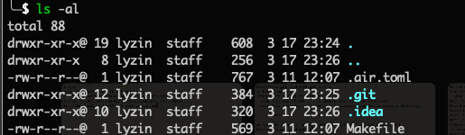
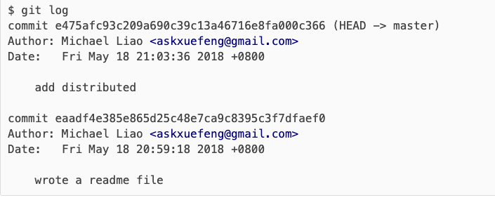

## 一、Git简介

> git教程：https://www.liaoxuefeng.com/wiki/896043488029600

> Git官网：https://git-scm.com/
>
> - Git是一个免费且开源的分布式版本控制系统，旨在以高效的方式处理从小型到大型项目的所有内容。
> - Git学习起来简单，占用空间小，性能极快。它通过本地分支廉价、方便的暂存区和多工作流等功能，超越了Subversion、CVS、Perforce和ClearCase等SCM工具


## 二、Git使用

### 1、本地仓库操作

#### 1.1 创建git仓库

> 在本地创建git仓库
>
> - 创建git仓库以后，在当前目录下多了一个`.git`的目录，这个目录是Git来跟踪管理版本库的，千万不要手动修改这个目录里面的文件，不然改乱了，就把Git仓库给破坏了
> - 如果你没有看到`.git`目录，那是因为这个目录默认是隐藏的，用`ls -ah`命令就可以看见

```bash
# 在对应项目的目录下
git  init
```

```bash
# 查看隐藏的.git目录
ls -la
```




#### 1.2 添加文件到git仓库

> 本步骤仅仅是添加文档到本地的git仓库

```bash
# 添加文件到Git仓库，分两步：

# 第一步，注意，可反复多次使用，添加多个文件；
git add <file>

# 使用命令
git commit -m <message>
```

#### 1.3、查看仓库状态

> 查看工作区的状态

```bash
git status
```

#### 1.4 查看git日志

> 查看从最近到最远的提交日志

```bash
git log
```

#### 1.5 回退版本

##### 1.5.1 查看当前HEAD

> HEAD指向的版本就是当前版本，可以看到当前HEAD指向master分支

```bash
git log
```



##### 1.5.2 回退版本

> 假设当前的HEAD是master，但当在master上修改了内容，之后不想要修改的内容了，想回退到master的修改前的状态，就需要回退版本到原始master

```bash
# 此时HEAD指向master，下面命令表示回退到master原始版本
git reset --hard HEAD
```

> 另外--hard后面可以跟任意commitId，都可以回退到制定的提交版本，commitId可以从git log中找到

```bash
# commit 后面一长串就是commitId
$ git log
commit e475afc93c209a690c39c13a46716e8fa000c366 (HEAD -> master)
Author: Michael Liao <askxuefeng@gmail.com>
Date:   Fri May 18 21:03:36 2018 +0800

    add distributed

commit eaadf4e385e865d25c48e7ca9c8395c3f7dfaef0   
Author: Michael Liao <askxuefeng@gmail.com>
Date:   Fri May 18 20:59:18 2018 +0800

    wrote a readme file
```

> commitId版本号没必要写全，前几位就可以了，Git会自动去找。当然也不能只写前一两位，因为Git可能会找到多个版本号，就无法确定是哪一个了。

```bash
git reset --hard eaadf4e3
```

1.5.3 查看历史

```bash
git reflog查看命令历史，以便确定要回到未来的哪个版本
```

