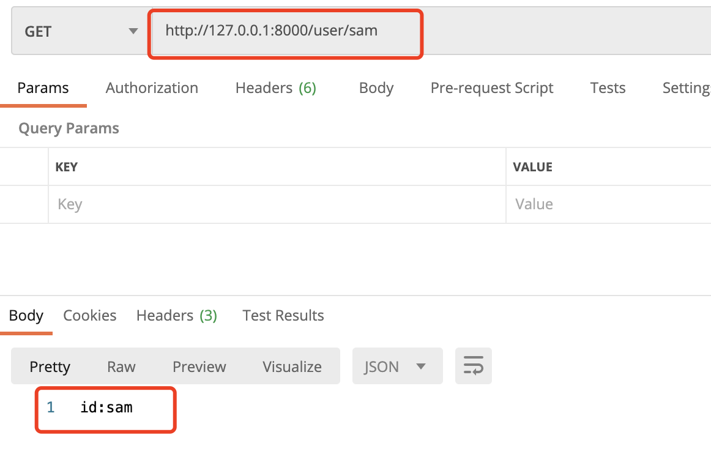
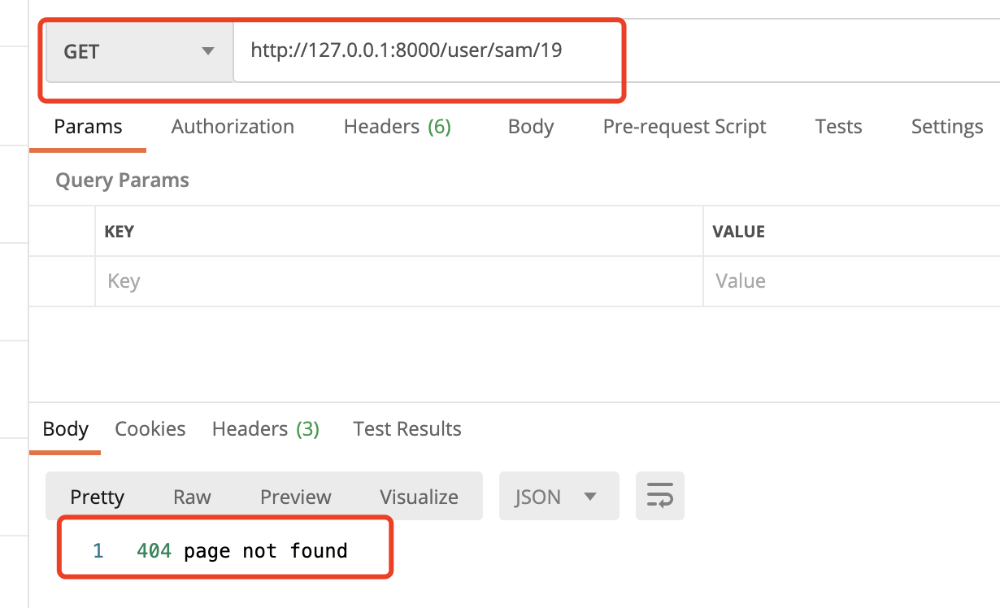
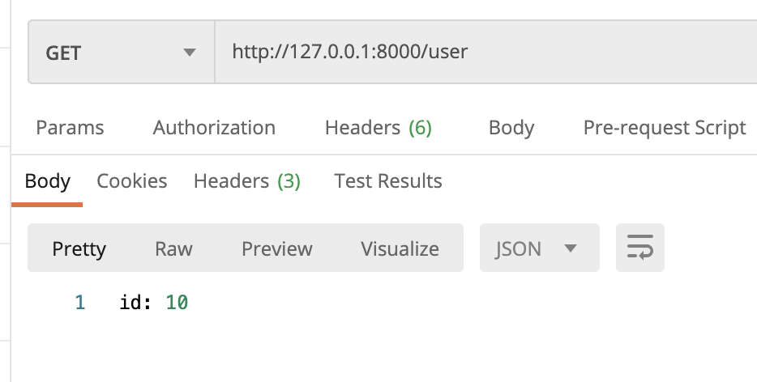
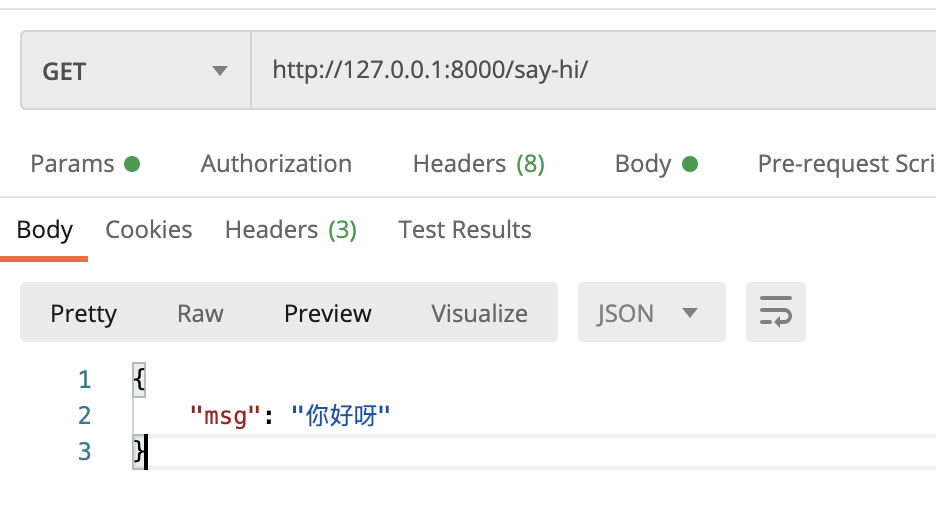

## 一、Web框架

> 框架是一系列工具的集合,可以让开发变得更加便捷
>
> 下方表格罗列了go常见的web框架

| 框架             | 特点                                                         | 备注 |
| ---------------- | ------------------------------------------------------------ | ---- |
| go原生的net/http | 支持快速开发一个简单的web应用                                |      |
| gin框架          | go官方推荐相当流行的一个轻量级的web框架，性能高效，非常推荐学习 |      |
| Beego            | 最早的web框架，工具比较全，但是性能较差                      |      |
| fiber            | 202年发布的框架，性能比较高，上手较快，和gin类似             |      |

### 1、gin框架介绍

> gin框架的官网：[https://gin-gonic.com/](https://gin-gonic.com/)
>
> go官方文档的一个Gin快速教程：[https://golang.google.cn/doc/tutorial/web-service-gin](https://golang.google.cn/doc/tutorial/web-service-gin)
>
> Bilibili的Gin视频教程：https://www.bilibili.com/video/BV1gJ411p7xC?p=3

#### 1.1 gin框架的特点

> gin框架的特点（以下来自官网介绍）：
>
> - 快速
>     - 基于 Radix 树的路由，小内存占用。没有反射。
>     - 可预测的 API 性能
> - 支持路由组
>     - Gin帮助您更好地组织您的路由，例如，按照需要授权和不需要授权和不同API版本进行分组。
>     - 此外，路由分组可以无限嵌套而不降低性能。
> - 支持中间件
>     - 传入的 HTTP 请求可以由一系列中间件和最终操作来处理。 例如：Logger，Authorization，GZIP，最终操作 DB。
> - crash处理
>     - Gin 可以 catch 一个发生在 HTTP 请求中的 panic 并 recover 它。这样你的服务器将始终可用。例如，你可以向 Sentry 报告这个 panic！
> - JSON 验证
>     - Gin 可以解析并验证请求的 JSON，例如检查所需值的存在。
> - 错误管理
>     - Gin 提供了一种方便的方法来收集 HTTP 请求期间发生的所有错误。
>     - 最终，中间件可以将它们写入日志文件，数据库并通过网络发送。
> - 内置渲染
>     - Gin 为 JSON，XML 和 HTML 渲染提供了易于使用的 API。

### 2、gin框架初体验

> 在`go1.11`以后的版本推荐使用`go mod`管理版本依赖的问题，关于`go mod`的使用，可移步`go语言基础`中查看

#### 1.1 创建项目目录

> 1. 打开goland，找一个需要存放gin代码的文件夹，比如`gin_demo`这个文件夹
> 2. 然后使用goland以项目形式打开`gin_demo`，此时`gin_demo`文件夹下会显示什么内容都没有

#### 1.2 go mod管理依赖

> 此时goland打开以后，`gin_demo`文件夹下什么东西都没有，所以需要使用如下命令进行`mod依赖`配置文件的初始化

```bash
# 以当前的gin_demo文件夹作为mod里的模块名
go mod init gin_demo
# go mod 此时可能会提示需要go mod tidy，如果提示了就执行，没提示可以先忽略
# go mod tidy主要用来根据go.mod里的依赖包进行自动拉取或者将不用的包删除
```


#### 1.3 安装gin

> 至此，我们项目初始化已经做好了，可以安装gin框架进行使用了，这里需要注意有两种方式可以安装gin
>
> - 第一种，可以写一个main.go文件，里面写上gin的样板代码
>   - 样板代码可以从gin官网复制并且可以跑起来的
>   - 然后执行`go mod tidy`，此时go会自动拉取github上最新的gin包
>   - 需要注意的是如果拉不下需要看下`GO111MODULE`和`GOPROXY`有没有设置，
> - 第二种，当go.mod创建好以后，直接使用go get拉取gin这个包
>   - `go get github.com/gin-gonic/gin`命令来下载安装gin框架
>   - 此时下载以后还看不到包被拉到哪了，所以可以创建一个main.go，使用gin的样板代码，然后再执行，就可以看到goland引入了外部的包


#### 1.4 发起请求基础版

> 下面代码来自Gin的官网

```go
package main

import "github.com/gin-gonic/gin"

func main() {
	r := gin.Default()
	r.GET("/ping", func(c *gin.Context) {
		c.JSON(200, gin.H{
			"message": "pong",
		})
	})
	r.Run() // listen and serve on 0.0.0.0:8080
}
```

#### 1.5 发起请求进阶版

> 抽离`r.GET`里的匿名函数，`r.GET`里除了传`访问路径`，还需要传一个函数名，先看源码
>
> 从源码可以看到，HandlerFunc需要传入的参数类型是`*Context`。所以抽离出来以后，传入的参数指定类型必须是`*gin.Context`

```go
// GET方法源码
func (group *RouterGroup) GET(relativePath string, handlers ...HandlerFunc) IRoutes {
	return group.handle(http.MethodGet, relativePath, handlers)
}
//  参数handlers ...HandlerFunc 这个HandlerFunc是解释如下
// HandlerFunc defines the handler used by gin middleware as return value.
type HandlerFunc func(*Context)

// func(*Context)里面的的Context是一个结构体，因为这个结构体字段很多，所以需要使用指针来接收
```

```go
/*
  @Author: lyzin
    @Date: 2022/03/07 21:35
    @File: gin_demo
    @Desc: 
*/
package main

import (
	"github.com/gin-gonic/gin"
)

func getMethod(c *gin.Context) {
	c.JSON(200, gin.H{
		"name": "sam",
		"age" : 19,
		"method": "get",
	})
}

func postMethod(c *gin.Context) {
	c.JSON(200, gin.H{
		"name": "sam",
		"age" : 19,
		"method": "post",
	})
}

func putMethod(c *gin.Context) {
	c.JSON(200, gin.H{
		"name": "sam",
		"age" : 19,
		"method": "put",
	})
}

func deleteMethod(c *gin.Context) {
	c.JSON(200, gin.H{
		"name": "sam",
		"age" : 19,
		"method": "delete",
	})
}

func main() {
	r := gin.Default()
	r.GET("/ping", getMethod)
	r.POST("/ping", postMethod)
	r.PUT("/ping", putMethod)
	r.DELETE("/ping", deleteMethod)
	r.Run(":8090")
}
```

## 二、gin常用操作

### 1、操作GET请求

> gin操作GET请求，主要用来获取资源

#### 1.1 GET函数源码

```go
// GET is a shortcut for router.Handle("GET", path, handle).
func (group *RouterGroup) GET(relativePath string, handlers ...HandlerFunc) IRoutes {
	return group.handle(http.MethodGet, relativePath, handlers)
}
```

> 从英文的注释可以看出来，GET哈桉树是router.Handle("GET", path, handle)的简写，需要传入3个参数
>
> - relativePath：相对地址，也就是path路径，是个字符串类型
> - handlers：类型是...HandlerFunc，表示是可变长参数，可以接受多个形参，每个形参的类型是HandlerFunc，HandlerFunc类型的声明如下，可以看到类型其实是一个函数类型，并且函数中的形参是*gin.Context，所以给handlers这个形参传入实参时，类型也必须为HandlerFunc

```go
// HandlerFunc：定义了gin中间件使用的处理程序作为返回值
type HandlerFunc func(*Context)
```

#### 1.2 GET请求示例

> 下面是简单的一个GET请求示例，并且使用c.String函数返回字符串响应

```go
package main

import "github.com/gin-gonic/gin"

func main() {
	r := gin.Default()
	r.GET("/user", func(c *gin.Context) {
		c.String(200, "this is first gin api")
	})

	err := r.Run(":8000")
	if err != nil {
		panic(err)
	}
}
```

#### 1.3 获取GET请求PATH参数

##### 1.3.1 精准匹配

> 当GET请求中的PATH参数写成 `:id`形式，表示精准匹配，在路由处理函数中需要使用`c.Param`函数来根据PATH参数获取传入的参数值

```go
package main

import "github.com/gin-gonic/gin"

func main() {
	r := gin.Default()
  
  // 精准匹配id
	r.GET("/user/:id", func(c *gin.Context) {
    
    // 获取路由上传入的id参数值
		id := c.Param("id")
		c.String(200, "id:%v", id)
	})

	err := r.Run(":8000")
	if err != nil {
		panic(err)
	}
}
```



> 其实可以看到/user/后面传入的参数，赋值给了代码里的路由`/user/:id`中的id参数，后续可以在路由处理函数中获取

##### 1.3.2 模糊匹配

> 精准匹配只能匹配一次，当路由有多个/隔开是，比如'/user/sam/19'，此时精准匹配就匹配不到了，因为路由`/user/:id`只能接收到传入的sam值，19没有对应的参数接收，gin会认为该路径不存在，就会报404



> 使用模糊匹配，路由改写为`/user/:id/*action`，使用`*action`去模糊匹配剩余的路由内容，无论`/user/:id`路由后面的剩余内容有多少
>
> 模糊匹配使用星号标记的变量，会以*标记的部分开始，一直获取到路径末尾，并且会追加一个`/`在获取到的值的开头
>
> 模糊匹配严格意义上来说，是匹配的一部分路由内容，并非某个特定参数的值

```go
package main

import "github.com/gin-gonic/gin"

func main() {
	r := gin.Default()
	r.GET("/user/:id/*action", func(c *gin.Context) {
		id := c.Param("id")
		action := c.Param("action")
		c.String(200, "id: %v \naction: %v", id, action)
	})

	err := r.Run(":8000")
	if err != nil {
		panic(err)
	}
}
```


#### 1.4 获取GET请求query参数

> query参数是指URI中以`?`号隔开的右边内容，比如：http://127.0.0.1:8000/user?name=sam&age=19
>
> query参数就是`name=sam&age=19`，query参数以`&`隔开

##### 1.4.1 Query方法

> gin中使用Query()方法来获取参数以及值，从Query方法源码也可以看出来用法
>
> 注意：
>
> - Query有返回值，是个string
> - 获取不到就是一个空的字符串

```go
// Query源码
// Query returns the keyed url query value if it exists,
// otherwise it returns an empty string `("")`.
// It is shortcut for `c.Request.URL.Query().Get(key)`
//     GET /path?id=1234&name=Manu&value=
// 	   c.Query("id") == "1234"
// 	   c.Query("name") == "Manu"
// 	   c.Query("value") == ""
// 	   c.Query("wtf") == ""
func (c *Context) Query(key string) string {
	value, _ := c.GetQuery(key)
	return value
}
```

```go
package main

import (
	"github.com/gin-gonic/gin"
)

func getMethod(c *gin.Context) {
	// 获取参数
	name := c.Query("name")
	age := c.Query("age")
	c.JSON(200, gin.H{
		"status" : "ok",
		"name": name,
		"age": age,
	})
}

func main() {
	r := gin.Default()
	r.GET("/user", getMethod)
	r.Run(":8090")
}
```


##### 1.4.2 GetQuery方法

> GetQuery方法也可获取参数值，但是除了会返回查到的值，也会返回一个布尔类型，当布尔为`true`表示可以获取值，否则获取不到就返回`false`
>
> 多个参数取值，然后通过返回的布尔值进行判断时，需要注意不能用`&&`(逻辑与)操作符，需要使用`||`（逻辑或），意思是只要有一个为false，就直接返回到错误

```go
package main

import (
	"fmt"
	"github.com/gin-gonic/gin"
)

func getMethod(c *gin.Context) {
	// 获取参数
	name, nameOk := c.GetQuery("name")
	age, ageOk := c.GetQuery("age")
	fmt.Printf("name:%v nameOk:%v\n", name, nameOk)
	fmt.Printf("age:%v ageOk:%v\n", age, ageOk)
	if !nameOk || !ageOk {
		fmt.Printf("name参数和age参数未获取到")
		c.JSON(404, gin.H{
			"error": "",
		})
	} else{
		c.JSON(200, gin.H{
			"status" : "ok",
			"name": name,
			"age": age,
		})
	}
}

func main() {
	r := gin.Default()
	r.GET("/user", getMethod)
	r.Run(":8090")
}
```


##### 1.4.3 DefaultQuery方法

> DefaultQuery方法在获取不到指定参数的值时，给定一个默认值，比如这样一个场景，接口需要传入一个bool值，不传默认是false，传了就是用传的bool值，就可以使用DefaultQuery方法来做这个事

```go
package main

import "github.com/gin-gonic/gin"

func main() {
	r := gin.Default()
	r.GET("/user/", func(c *gin.Context) {
		id := c.DefaultQuery("id", "10")
		c.String(200, "id: %v", id)
	})

	err := r.Run(":8000")
	if err != nil {
		panic(err)
	}
}
```



> 直接请求`/user`接口不传id参数，那么id参数的值默认就是设置的10

#### 1.5 返回响应数据

> gin中提供N种返回响应的函数，常见的有
>
> - 返回json数据：[func (c *Context) JSON(code int, obj any)](https://pkg.go.dev/github.com/gin-gonic/gin@v1.8.1#Context.JSON)
> - 返回string数据：[func (c *Context) String(code int, format string, values ...any)](https://pkg.go.dev/github.com/gin-gonic/gin@v1.8.1#Context.String)
> - 返回jsonnp数据：[func (c *Context) JSONP(code int, obj any)](https://pkg.go.dev/github.com/gin-gonic/gin@v1.8.1#Context.JSONP)

##### 1.5.1 返回string数据

> 使用gin中Context的String方法，不在此做赘述

##### 1.5.2 使用gin.H返回json数据

> gin返回json数据，也是目前比较流行的API接口返回响应数据格式
>
> gin中返回json数据使用的是使用gin包中Context的JSON方法
>
> 在gin中，提供了`gin.H`类型来定义返回的json数据，`gin.H`本质是一个`map`类型

```go
// ginn.H源码，从哪个注释可以看出来其实就是map，key是字符串类型，value是空接口类型
// H is a shortcut for map[string]interface{}
type H map[string]any
```

```go
// 使用C.JSON进行数据返回
c.JSON(200, gin.H{
		"name": uName,
		"age" : 19,
		"method": "get",
})

//  gin.H 是 map[string]interface{}的简写
// H is a shortcut for map[string]interface{}
type H map[string]interface{}
```

```go
package main

import (
	"github.com/gin-gonic/gin"
	"fmt"
)

func getMethod(c *gin.Context) {
	c.JSON(200, gin.H{
		"name": uName,
		"age" : 19,
		"method": "get",
	})
}

func main() {
	r := gin.Default()
	r.GET("user", getMethod)
	r.Run(":8090")
}
```


##### 1.5.3 使用map返回json数据

> 可以使用map来返回数据

```go
package main

import (
	"github.com/gin-gonic/gin"
)

func getMethod(c *gin.Context) {
	// 使用map
	data := map[string]interface{}{
		"name": "hum",
		"age": 18,
	}
	c.JSON(200, data)
}

func main() {
	r := gin.Default()
	r.GET("/user", getMethod)
	r.Run(":8090")
}
```


##### 1.5.4 返回json数据流程解析

> 当我们写了如下代码，并且请求接口时返回了一个json的响应，gin底层是怎么处理的，做了哪些事情，可以通过代码断点查看出具体的流转处理逻辑

```go
r.GET("/say-hi/", func(c *gin.Context) {
   c.JSON(200, gin.H{
      "msg": "你好呀",
   })
})
```

> 可以看到/say-hi/请求接口返回了json格式的响应



> 接下来使用goland的断点功能，一步一步来分析gin是如何返回json数据的，由于链路较长，所以如下只展示对应的代码，是按照调用顺序显示

> 第一步：
>
> - 先调用了`gin`包中定义的`Context`结构体的JSON方法
> - 需要传入code和obj两个参数，对应的就是在代码中调用JSON方法时，传入的状态码200和响应数据gin.H{}
> - 在JSON方法中调用了`Context`结构体的`Render`方法
> - 在`Render`方法中传入两个参数
>     - code参数：也就是传入的状态码200
>     - render.JSON{Data: obj}参数：表示是gin框架中render包中的`JSON`结构体，并且render包中的`JSON`结构体里面的字段类型为`any`，并且因为render包中的`JSON`结构体实现了render包中的Render接口类型定义的Render(http.ResponseWriter) error和WriteContentType(w http.ResponseWriter)方法，所以render包中的`JSON`结构体初始化的类型也是render包中的Render接口类型，所以能够将render.JSON{Data: obj}参数传给`Context`结构体的`Render`方法

```go
// JSON将给定的结构体序列化为JSON，放入响应体
// 还会将Content-Type设置为"application/json"
func (c *Context) JSON(code int, obj any) {
	c.Render(code, render.JSON{Data: obj})
}
```

```go
// render包中的`JSON`结构体
type JSON struct {  
  Data any
}
```

> 第二步：
>
> - 在JSON方法中调用了`Context`结构体的`Render`方法，需要传入两个参数：
>     - code参数：也就是传入的状态码200
>     - r参数，并且类型是render.Render，所以将render.JSON{Data: obj}参数传入，为什么可以传入第一步中已经解释过了
> - 接下来看下Render方法的实现，在Render方法中调用了三个方法
>     - c.Status(code)
>     - bodyAllowedForStatus(code)
>     - r.Render(c.Writer)

```go
// Render写下响应头并调用render.Render来渲染数据
func (c *Context) Render(code int, r render.Render) {
	c.Status(code)

	if !bodyAllowedForStatus(code) {
		r.WriteContentType(c.Writer)
		c.Writer.WriteHeaderNow()
		return
	}

	if err := r.Render(c.Writer); err != nil {
		panic(err)
	}
}
```

### 2、操作POST请求

#### 2.1 使用form表单提交数据

> 获取form参数，其实就是通过form表单提交的数据，也就是post请求提交的数据，请求的参数数据是放在了body里面，这种的就是form表单数据

```go
// 使用PostForm方法来获取参数
// PostForm returns the specified key from a POST urlencoded form or multipart form
// when it exists, otherwise it returns an empty string `("")`.
func (c *Context) PostForm(key string) string {
	value, _ := c.GetPostForm(key)
	return value
}
```

```go
package main

import (
	"github.com/gin-gonic/gin"
)

func postMethod(c *gin.Context) {
	// 获取请求方法
	method := c.Request.Method
	// 获取post参数
	name := c.PostForm("name")
	age := c.PostForm("age")

	c.JSON(200, gin.H{
		"status": "ok",
		"name": name,
		"age": age,
		"method": method,
	})

}

func main() {
	r := gin.Default()
	r.POST("/user", postMethod)
	r.Run(":8090")
}
```


### 3、使用结构体获取请求参数

> [https://blog.csdn.net/wohu1104/article/details/121928193](https://blog.csdn.net/wohu1104/article/details/121928193)

> - gin中使用结构体获取请求参数
>     - 第2、第3章获取请求参数的方式比较单一，gin中提供了更便捷的获取请求参数的方式
>     - 可以通过请求的`Content-Type`的类型通过反射来自动提取请求中的`querystring(GET方式)、form表单(POST方式)、json、xml`等参数到结构体
>     - 可以使用`.ShouldBind()`来自动提取这几种类型的数据，并把值绑定到对应的结构体对象上
>     - 绑定参数也就是不需要通过上面的第2、第3章的方式去获取参数了，统一使用结构体来提取参数

```go
// ShouldBind
// ShouldBind checks the Content-Type to select a binding engine automatically,
// Depending the "Content-Type" header different bindings are used:
//     "application/json" --> JSON binding
//     "application/xml"  --> XML binding
// otherwise --> returns an error
// It parses the request's body as JSON if Content-Type == "application/json" using JSON or XML as a JSON input.
// It decodes the json payload into the struct specified as a pointer.
// Like c.Bind() but this method does not set the response status code to 400 and abort if the json is not valid.
func (c *Context) ShouldBind(obj interface{}) error {
	b := binding.Default(c.Request.Method, c.ContentType())
	return c.ShouldBindWith(obj, b)
}
```

> - shouldBind绑定数据顺序
>     - 如果是get请求，只是用form绑定引擎(query)
>     - 如果是post请求，先检查content-type是不是JSON/XML，然后再使用form(form-data)

#### 5.1 结构体字段小写

> 使用结构体绑定传过来的参数，当结构体里的字段都是小写的时候，会发现请求时传过来的值获取不到，如下代码

```go
package main

import (
	"github.com/gin-gonic/gin"
)

type UserInfo struct {
	name string
	age string
}

func bindUserData(c *gin.Context) {
	var userObj UserInfo
	err := c.ShouldBind(&userObj)
	if err != nil {
		c.JSON(404, gin.H{
			"errNo": 404,
			"msg": err,
		})
	} else{
		c.JSON(200, gin.H{
			"errNo": 200,
			"msg": userObj,
		})
	}
}

func main() {
	r := gin.Default()
	r.GET("/userinfo", bindUserData)
	err := r.Run(":8090")
	if err != nil {
		return
	}
}
```


#### 5.2 结构体字段大写

> - 为什么获取不到呢？
>     - 因为结构体是`gin`这个包要访问我们在自己包里定义的结构体里的字段，
>     - 在o语言中，一个包要访问另一个包里的字段，这个字段首字母必须是大写的才可以被访问到
>     - 那么将结构体字段改成大写试试

```go
package main

import (
	"github.com/gin-gonic/gin"
)

type UserInfo struct {
	Name string
	Age string
}

func bindUserData(c *gin.Context) {
	var userObj UserInfo
	err := c.ShouldBind(&userObj)
	if err != nil {
		c.JSON(404, gin.H{
			"errNo": 404,
			"msg": err,
		})
	} else{
		c.JSON(200, gin.H{
			"errNo": 200,
			"msg": userObj,
		})
	}
}

func main() {
	r := gin.Default()
	r.GET("/userinfo", bindUserData)
	err := r.Run(":8090")
	if err != nil {
		return
	}
}
```


> 可以看到结构体字段被返回了，但是返回值是空的？
>
> - 从结果来看，结构体字段的值都是对应类型的零值，其实就说明了即使进行了请求参数的`shouldBind`，但是并没有获取请求参数里的值给`UserInfo`这个结构体中的对应字段，也就是`shouldBind`的时候，传进来的参数`name`和`age`仍然没有找到对应字段进行绑定

> - 由于`UserInfo`结构体字段修改成了首字母大写的，那么我们把`GET`请求里的`name`和`age`改成首字母大写试试重新请求，看看`shouldBind`是否可以获取到请求参数里对应`Name`和`Age`传进来的值


> 可以看到请求参数首字母大写后，`UserInfo`这个结构体里设置的`Name`和`Age`字段通过`ShouldBind`方法成功绑定了请求参数的值

#### 5.3 接口请求字段都小写

> 从第5.2章看到有数据返回了，但是前后端交互时肯定不能是请求和返回时的字段值都是首字母大写，那么就需要使用结构体tag了，让字段都变为小写，tag表示是用了反射来获取结构体中的字段：
>
> - Gin中的GET请求大多用`form`这个tag

```go
package main

import (
	"github.com/gin-gonic/gin"
)

type UserInfo struct {
	Name string `form:"name"`
	Age string `form:"age"`
}

func bindUserData(c *gin.Context) {
	var userObj UserInfo
	err := c.ShouldBind(&userObj)
	if err != nil {
		c.JSON(404, gin.H{
			"errNo": 404,
			"msg": err,
		})
	} else{
		c.JSON(200, gin.H{
			"errNo": 200,
			"msg": userObj,
		})
	}
}

func main() {
	r := gin.Default()
	r.GET("/userinfo", bindUserData)
	err := r.Run(":8090")
	if err != nil {
		return
	}
}
```


#### 5.4 json请求结构体字段小写

> 这里处理的json方式请求gin框架时，对所有参数进行小写

```go
package main

import (
	"github.com/gin-gonic/gin"
)

type UserInfo struct {
	Name string `form:"name" json:"name"`
	Age string `form:"age" json:"age"`
}

func bindUserData(c *gin.Context) {
	var userObj UserInfo
	err := c.ShouldBind(&userObj)
	if err != nil {
		c.JSON(404, gin.H{
			"errNo": 404,
			"msg": err,
		})
	} else{
		c.JSON(200, gin.H{
			"errNo": 200,
			"msg": userObj,
		})
	}
}

func main() {
	r := gin.Default()
	r.GET("/userinfo", bindUserData)
	err := r.Run(":8090")
	if err != nil {
		return
	}
}
```


#### 5.5 请求和响应使用的tag总结

> `form`这个tag负责将接收进来的参数进行转化，让内部的结构体可以接收到并赋值
>
> `json`这个tag负责将对应结构体字段以小写形式给返回

#### 5.6 json数据请求

> 在前后端分离的项目，前端请求的参数也大多是以json格式来发请求，所以绑定参数也可以来处理json的请求

```go
package main

import (
	"github.com/gin-gonic/gin"
)

type UserInfo struct {
	Name string `form:"name" json:"name"`
	Age int `form:"age" json:"age"`
}

func bindUserData(c *gin.Context) {
	var userObj UserInfo
	err := c.ShouldBind(&userObj)
	if err != nil {
		c.JSON(404, gin.H{
			"errNo": 404,
			"msg": err,
		})
	} else{
		c.JSON(200, gin.H{
			"errNo": 200,
			"msg": userObj,
		})
	}
}

func main() {
	r := gin.Default()
	r.POST("/jsondata", bindUserData)
	err := r.Run(":8090")
	if err != nil {
		return
	}
}
```


### 4、文件上传

#### 6.1 单个文件上传

> 处理multipart forms提交文件时默认的内存限制是32MiNB
>
> 可以通过gin中的MaxMultipartMemory 进行修改

```go
package main

import (
	"fmt"
	"github.com/gin-gonic/gin"
	"path"
)

func uploadFile(c *gin.Context) {
	// 从请求中读取文件
	//fobj, err := c.FormFile("pic")
	fobj, err := c.FormFile("pic")
	if err != nil {
		c.JSON(500, gin.H{
			"errNo": 500,
			"action": "读取文件错误",
			"msg": err.Error(),
			"fobj": fobj,
		})
	} else{
		fmt.Printf("fobj:%v\n", fobj)
		// 将读取的文件保存在本地(服务端本地)
		dst := path.Join("./", fobj.Filename)
		err := c.SaveUploadedFile(fobj, dst)
		if err != nil {
			c.JSON(500, gin.H{
				"errNo": 500,
				"action": "保存文件错误",
				"msg": err,
			})
		}
		c.JSON(200, gin.H{
			"errNo": 200,
			"msg": "保存文件成功",
		})

	}
}


func main() {
	r := gin.Default()
	r.POST("/uploadfile", uploadFile)
	err := r.Run(":8090")
	if err != nil {
		return
	}
}
```

> 下图是在postman请求的截图
>
> - 第一张是设置`header`里的`Content-Type`为：`multipart/form-data; boundary=<calculated when request is sent>`
>   - 这个`boundary`一定要有，否则会爆这个错误：`no multipart boundary param in Content-Type`
> - 第二张图是设置body里的请求，设置`pic`参数的类型为`file`，然后进行上传


### 5、重定向

> gin中可以对路由进行重定向，当前这部分是前端需要干的活

#### 7.1 请求重定向

```go
//表示将`index`这个函数的请求转发到百度
c.Redirect(301, "http://www.baidu.com")
```

```go
package main

import (
	"github.com/gin-gonic/gin"
)

func indexFunc(c *gin.Context) {
	// 请求重定向
	c.Redirect(301, "http://www.baidu.com")
}


func main() {
	r := gin.Default()
	r.GET("/index", indexFunc)
	err := r.Run(":8090")
	if err != nil {
		return
	}
}
```

#### 7.2 路由重定向

> 请求时转换到/xx的路由处理函数

```go
// 路由重定向,将请求转给user这个路由对应的函数
c.Request.URL.Path = "/user"
// 用router下的HandleContext处理上下文
r.HandleContext(c)
```

```go
package main

import (
	"github.com/gin-gonic/gin"
)

var r = gin.Default()

func indexFunc(c *gin.Context) {
	// 路由重定向
	c.Request.URL.Path = "/user"
	r.HandleContext(c)
}

func userFunc(c *gin.Context) {
	// 请求重定向
	c.JSON(200, gin.H{
		"action": "this is userFunc",
		"msg": "ok",
	})
}


func main() {
	r.GET("/index", indexFunc)
	r.GET("/user", userFunc)
	err := r.Run(":8090")
	if err != nil {
		return
	}
}
```


> 从上图可以看出，访问`/index`返回了`/user`对应函数的结果

### 6、路由操作

#### 8.1 路由 

> 路由是指URI到函数的映射
>
> 一个UIR示例：http://127.0.0.1:8080/api/user/?uid=123&age=19
>
> - 协议：http/https等
> - 域名与端口：比如：127.0.0.1:8000
> - path：/api/user
> - query参数：uri以?隔开，后面的uid=123&age=19

> gin中路由使用的是`httprouter`这个库
>
> 路由就是访问的`url`，`url`在`gin`中指向了处理的函数

```go
package main

import (
	"github.com/gin-gonic/gin"
)

var r = gin.Default()

func userFunc(c *gin.Context) {
	c.JSON(200, gin.H{
		"action": "this is userFunc",
		"msg": "ok",
	})
}

func main() {
	r.GET("/user", userFunc)
	err := r.Run(":8090")
	if err != nil {
		return
	}
}
```


#### 8.2 路由组

> 路由组就是将一组拥有共同前缀的路由，将公共前缀提取出来，组件一个组，然后这个组里再进行其他路由划分

```go
// Group前缀
// Group creates a new router group. You should add all the routes that have common middlewares or the same path prefix.
// For example, all the routes that use a common middleware for authorization could be grouped.
// 翻译
/*
    组创建一个新的路由器组。你应该添加所有有共同的中间件或相同路径前缀的路由。
    例如，所有使用共同的中间件进行授权的路由都可以被分组。
*/

func (group *RouterGroup) Group(relativePath string, handlers ...HandlerFunc) *RouterGroup {
	return &RouterGroup{
		Handlers: group.combineHandlers(handlers),
		basePath: group.calculateAbsolutePath(relativePath),
		engine:   group.engine,
	}
}
```

```go
package main

import (
	"fmt"
	"github.com/gin-gonic/gin"
)

var r = gin.Default()

func userAddr(c *gin.Context) {
	c.JSON(200, gin.H{
		"msg": "this is user addr",
	})
}

func userInfo(c *gin.Context) {
	c.JSON(200, gin.H{
		"msg": "this is user info",
	})
}

func main() {
	userGroup := r.Group("/user")
	fmt.Printf("userGroup: %+v\n", *userGroup)
	{
		userGroup.GET("/addr", userAddr)
		userGroup.GET("/info", userInfo)
	}
	err := r.Run(":8090")
	if err != nil {
		return
	}
}
```

#### 8.3 路由组的值


> 从启动gin的截图来看，userGroup是RouterGroup结构体类型，里面有`basePath`这个字段，表示是公共的路径，所以访问`/user/info`时，先找`/user`这个路由组，再从`/user`这个路由组里去找`/info`这个路由，找到就返回值，找不到就提示404


#### 8.4 路由组嵌套

> 路由组也支持嵌套，就是路由组里继续套用一个路由组，那么访问的链接就是形如：/group1/group2/xxx

```go
package main

import (
	"fmt"
	"github.com/gin-gonic/gin"
)

var r = gin.Default()

func userAddr(c *gin.Context) {
	c.JSON(200, gin.H{
		"msg": "this is user addr",
	})
}

func userInfo(c *gin.Context) {
	c.JSON(200, gin.H{
		"msg": "this is user info",
	})
}

func main() {
	userGroup := r.Group("/user")
	fmt.Printf("userGroup: %+v\n", *userGroup)
	{
		userGroup.GET("/addr", userAddr)
		infoGroup := userGroup.Group("/info")
		{
			infoGroup.GET("/pinfo", userInfo)
		}
	}
	err := r.Run(":8090")
	if err != nil {
		return
	}
}
```


#### 8.5 路由组用处

> 可以看到有共同的路由前缀，就可以表示不同的业务线，或者Api版本区分

### 7、Any任意请求

> any函数可以接收任意请求方法，下面是代码和截图可以看出来不管是get还是post都可以来请求
>
> 从源代码可以看出来，any包装了所有的请求方式

```go
// any源代码
// Any registers a route that matches all the HTTP methods.
// GET, POST, PUT, PATCH, HEAD, OPTIONS, DELETE, CONNECT, TRACE.
func (group *RouterGroup) Any(relativePath string, handlers ...HandlerFunc) IRoutes {
	group.handle(http.MethodGet, relativePath, handlers)
	group.handle(http.MethodPost, relativePath, handlers)
	group.handle(http.MethodPut, relativePath, handlers)
	group.handle(http.MethodPatch, relativePath, handlers)
	group.handle(http.MethodHead, relativePath, handlers)
	group.handle(http.MethodOptions, relativePath, handlers)
	group.handle(http.MethodDelete, relativePath, handlers)
	group.handle(http.MethodConnect, relativePath, handlers)
	group.handle(http.MethodTrace, relativePath, handlers)
	return group.returnObj()
}
```

```go
package main

import (
	"github.com/gin-gonic/gin"
)

var r = gin.Default()

func userAddr(c *gin.Context) {
	c.JSON(200, gin.H{
		"msg": "this is user addr",
	})
}

func main() {
	r.Any("/useraddr", userAddr)
	err := r.Run(":8090")
	if err != nil {
		return
	}
}
```


### 8、NoRoute函数

> gin中有一个NoRoute函数，可以定义当路由找不到时的错误信息，表示所有找不到路由都指到这个函数下，当然也可以对路由组设定自己的NoRoute处理函数
>
> - NoRoute不需要指定路由，直接传入处理NoRoute的函数即可

```go
package main

import (
	"github.com/gin-gonic/gin"
)

var r = gin.Default()

func notFoundErr(c *gin.Context) {
	c.JSON(404, gin.H{
		"msg": "router not found in server",
	})
}

func main() {
	r.NoRoute(notFoundErr)
	err := r.Run(":8090")
	if err != nil {
		return
	}
}
```


## 三、gin中间件

### 1、中间件简介

> gin允许在处理请求过程中，加入开发者自己的处理函数，这些函数就是中间件，中间件适合处理：
>
> - 公共的业务逻辑
>   - 比如登录认证、权限校验、数据分页、记录日志等等


> 从上图就可以看出来，当浏览器发起请求时，先经过中间件处理以后，再转给真正的路由函数处理，最后再将结果返回给浏览器
>
> 这样就做到了拦截请求，然后对请求做处理后再转给真正的路由函数，这也是钩子函数

### 2、中间件注册

> `gin`的中间件
>
> - 中间件方法定义的时候，必须是`gin.HandlerFunc`类型，这个类型也是路由处理函数的类型
> - 中间件方法是可以有值的
> - 路由组支持注册中间件
> - 设置好中间件以后，中间件后面的路由都会使用这个中间件
> - 设置在中间件之前的路由则不会生效
> - 中间件可以注册N个，不受个数限制

#### 2.1 路由处理函数中注册中间件

> 可以在每个路由请求前加入中间件注册函数
>
> - 当请求路由时，如果存在中间件，会先执行中间件，再执行路由处理函数

```go
// mw1 就是中间件函数
r.GET("/user", mw1, userInfo)
```

```go
package main

import (
	"fmt"
	"github.com/gin-gonic/gin"
)

var r = gin.Default()

func userInfo(c *gin.Context) {
	fmt.Printf("这是userInfo函数\n")
	c.JSON(200, gin.H{
		"msg": "这是userInfo函数",
	})
}

// 自定义的中间件函数
func mw1(c *gin.Context) {
	fmt.Printf("这是中间件函数mw1\n")
	c.JSON(200, gin.H{
		"msg": "这是中间件函数mw1",
	})
}


func main() {
	r.GET("/user", mw1, userInfo)
	err := r.Run(":8090")
	if err != nil {
		return
	}
}
```


> 从执行结果来看，中间件函数先执行，再执行的后面的路由函数

#### 2.2 全局注册中间件

> 当有很多个函数都需要中间件函数的时候，每个路由函数注册的前面都需要写中间件函数就比较麻烦，所以可以设置为全局注册模式

```go
// 使用Use方法来注册中间件
// 通过Use()注册的中间件将被包含在每个请求的处理程序链中。即使是404，405，静态文件...，
// 例如日志、权限等
func (engine *Engine) Use(middleware ...HandlerFunc) IRoutes {
	engine.RouterGroup.Use(middleware...)
	engine.rebuild404Handlers()
	engine.rebuild405Handlers()
	return engine
}
```

```go
package main

import (
	"fmt"
	"github.com/gin-gonic/gin"
)

var r = gin.Default()

func userInfo(c *gin.Context) {
	fmt.Printf("这是userInfo函数\n")
	c.JSON(200, gin.H{
		"msg": "这是userInfo函数",
	})
}

func userAddr(c *gin.Context) {
	fmt.Printf("这是userAddr函数\n")
	c.JSON(200, gin.H{
		"msg": "这是userAddr函数",
	})
}

// 自定义的中间件函数
func mw1(c *gin.Context) {
	fmt.Printf("这是中间件函数mw1\n")
	c.JSON(200, gin.H{
		"msg": "这是中间件函数mw1",
	})
}

func main() {
	r.Use(mw1)
	r.GET("/userinfo", userInfo)
	r.GET("/useraddr", userAddr)
	err := r.Run(":8090")
	if err != nil {
		return
	}
}
```


### 3、中间件中的Next方法

> 既然中间件执行完以后就会执行路由函数，那么为什么还需要`Next`函数呢？从下面的分析可以看出来
>

#### 3.1 中间件中没有Next方法

> 中间函数里没有Next方法：
>
> - 相当于先把中间件方法的`所有代码`执行完以后，再执行后面的路由函数
> - 如果想在中间件里执行一部分代码后，再执行后续的路由函数，等路由函数执行完成再返回来执行剩下的中间件函数，这样就做不到，因为中间件函数全部执行完成了，从下面的执行结果图就可以看到

```go
// 自定义的中间件函数
func mw1(c *gin.Context) {
	fmt.Printf("这是中间件函数mw1开始执行了\n")
	c.JSON(200, gin.H{
		"msg": "这是中间件函数mw1",
	})
	fmt.Printf("这是中间件函数mw1执行完了\n")
}
```


> 从打印的结果来看，将mw1中间件方法的两条fmt打印语句都执行完了，采取执行的userAddr路由函数

#### 3.2 中间件有Next方法

> 中间函数里的Next函数，相当于是遇到Next函数是，会先调用后面的路由处理函数，当后面的路由处理函数处理完成以后，再来执行中间件函数剩余部分代码，这样就可以做到以一些条件来控制是否要执行路由函数，比如权限控制等功能
>
> - 从下图也可以看出来，先执行了中间件函数的开始部分，`遇到Next函数`后去处理后面的userAddr这个路由函数了，当userAddr路由函数处理完成后，并将路由函数处理的基础进行返回，再又回来接着处理中间件函数的剩余代码功能了

```go
// 自定义的中间件函数
func mw1(c *gin.Context) {
	fmt.Printf("这是中间件函数mw1开始执行了\n")
	c.JSON(200, gin.H{
		"msg": "这是中间件函数mw1",
	})
	c.Next()
	fmt.Printf("这是中间件函数mw1执行完了\n")
}

```


### 4、中间件中的Abort方法

> Abort函数用户`不处理`中间件后面的路由函数，表示放弃执行
>
> 从下图可以看出只执行了中间件函数，中间件后面的路由函数并没有执行

```go
package main

import (
	"fmt"
	"github.com/gin-gonic/gin"
)

var r = gin.Default()

func userInfo(c *gin.Context) {
	fmt.Printf("这是userInfo函数\n")
	c.JSON(200, gin.H{
		"msg": "这是userInfo函数",
	})
}

func userAddr(c *gin.Context) {
	fmt.Printf("这是userAddr函数\n")
	c.JSON(200, gin.H{
		"msg": "这是userAddr函数",
	})
}

// 自定义的中间件函数
func mw1(c *gin.Context) {
	fmt.Printf("这是中间件函数mw1开始执行了\n")
	c.JSON(200, gin.H{
		"msg": "这是中间件函数mw1",
	})
	c.Abort()
	fmt.Printf("这是中间件函数mw1执行完了\n")
}

func main() {
	r.Use(mw1)
	r.GET("/userinfo", userInfo)
	r.GET("/useraddr", userAddr)
	err := r.Run(":8090")
	if err != nil {
		return
	}
}
```


### 5、多个中间件函数

> 当有多个中间件函数时，执行的顺序如下

```go
package main

import (
	"fmt"
	"github.com/gin-gonic/gin"
)

var r = gin.Default()

func userInfo(c *gin.Context) {
	fmt.Printf("这是userInfo函数\n")
	c.JSON(200, gin.H{
		"msg": "这是userInfo函数",
	})
}

func userAddr(c *gin.Context) {
	fmt.Printf("这是userAddr函数\n")
	c.JSON(200, gin.H{
		"msg": "这是userAddr函数",
	})
}

// 自定义的中间件函数
func mw1(c *gin.Context) {
	fmt.Printf("这是中间件函数mw1开始执行了\n")
	c.JSON(200, gin.H{
		"msg": "这是中间件函数mw1",
	})
	c.Next()
	fmt.Printf("这是中间件函数mw1执行完了\n")
}

// 自定义的中间件函数
func mw2(c *gin.Context) {
	fmt.Printf("这是中间件函数mw2开始执行了\n")
	c.JSON(200, gin.H{
		"msg": "这是中间件函数mw2",
	})
    // 继续调用后面的路由函数
	c.Next()
	fmt.Printf("这是中间件函数mw2执行完了\n")
}

func main() {
	r.Use(mw1, mw2)
	r.GET("/userinfo", userInfo)
	r.GET("/useraddr", userAddr)
	err := r.Run(":8090")
	if err != nil {
		return
	}
}
```


> 可以看到是按中间件函数注册的顺序，先执行中间件函数开始的代码，遇到Next函数时，转过头去执行路由处理函数，当路由处理函数执行完以后，再来执行和路由函数挨得最近的那个中间件函数，依次往外执行中间件函数，直到执行完成


> 从上图可以看出
>
> - 执行mw1函数开始时，接着遇到Next函数，mw1里的Next函数执行的就是mw2函数里的代码
> - 接着执行mw2函数里的代码开始，接着遇到Next函数，mw2里的Next函数执行的就是useraddr路由函数的代码
> - useraddr路由函数执行完成以后，mw2里的Next函数执行完成，接着执行mw2函数结束代码
> - mw2函数结束代码执行完成以后， mw1的next函数执行完成
> - 最后执行mw1函数结束代码，请求结束完成

### 6、中间件的传参

> 定义一个闭包函数，返回一个匿名函数，匿名函数的类型是`gin.HandlerFunc`，这那么这样就做到了一个中间件既可以传参，返回值又符合gin需要的中间件函数类型

```go
// 中间件函数可以传参的写法
// 自定义的中间件函数
func authV1(checkLogin bool) gin.HandlerFunc{
	return func(c *gin.Context) {
		if checkLogin {
			fmt.Println("校验权限通过")
			c.Next()
		} else {
			fmt.Println("校验权限失败")
			c.Abort()
		}
	}
}
```

```go
// 完整代码
package main

import (
	"fmt"
	"github.com/gin-gonic/gin"
)

var r = gin.Default()

func userInfo(c *gin.Context) {
	fmt.Printf("这是userInfo函数\n")
	c.JSON(200, gin.H{
		"msg": "这是userInfo函数",
	})
}

func userAddr(c *gin.Context) {
	fmt.Printf("这是userAddr函数\n")
	c.JSON(200, gin.H{
		"msg": "这是userAddr函数",
	})
}

// 自定义的中间件函数
func authV1(checkLogin bool) gin.HandlerFunc{
	return func(c *gin.Context) {
		if checkLogin {
			fmt.Println("校验权限通过")
			c.Next()
		} else {
			fmt.Println("校验权限失败")
			c.Abort()
		}
	}
}

func main() {
	r.Use(authV1(false))
	r.GET("/userinfo", userInfo)
	r.GET("/useraddr", userAddr)
	err := r.Run(":8090")
	if err != nil {
		return
	}
}
```

> 当传参为false时，不会执行路由处理函数


> 当传参为true时，则执行路由处理函数


### 7、路由组注册中间件

> 路由组也可以注册中间件，有两种方式

#### 7.1 注册方式一

> 在初始化路由组的时候，将中间件注册到路由组中，这样这个路由组中所有的路由都会应用到该中间件

```go
// 将中间件函数注册到初始化路由组的位置
userGroup := r.Group("/user", authV1(true))
```

```go
package main

import (
	"fmt"
	"github.com/gin-gonic/gin"
)

var r = gin.Default()

func userInfo(c *gin.Context) {
	fmt.Printf("这是userInfo函数\n")
	c.JSON(200, gin.H{
		"msg": "这是userInfo函数",
	})
}

func userAddr(c *gin.Context) {
	fmt.Printf("这是userAddr函数\n")
	c.JSON(200, gin.H{
		"msg": "这是userAddr函数",
	})
}

// 自定义的中间件函数
func authV1(checkLogin bool) gin.HandlerFunc{
	return func(c *gin.Context) {
		if checkLogin {
			fmt.Println("校验权限通过")
			c.Next()
		} else {
			fmt.Println("校验权限失败")
			c.Abort()
		}
	}
}

func main() {
	// 将中间件函数注册到初始化路由组的位置
	userGroup := r.Group("/user", authV1(true))
	userGroup.GET("/info", userInfo)
	userGroup.GET("/addr", userAddr)
	err := r.Run(":8090")
	if err != nil {
		return
	}
}
```


#### 7.2 注册方式二

> 先声明路由组，然后在路由组中使用`Use`方法来注册中间件

```go
// 在路由组使用Use方法来注册中间件
userGroup := r.Group("/user")
userGroup.Use(authV1(true))
```

```go
package main

import (
	"fmt"
	"github.com/gin-gonic/gin"
)

var r = gin.Default()

func userInfo(c *gin.Context) {
	fmt.Printf("这是userInfo函数\n")
	c.JSON(200, gin.H{
		"msg": "这是userInfo函数",
	})
}

func userAddr(c *gin.Context) {
	fmt.Printf("这是userAddr函数\n")
	c.JSON(200, gin.H{
		"msg": "这是userAddr函数",
	})
}

// 自定义的中间件函数
func authV1(checkLogin bool) gin.HandlerFunc{
	return func(c *gin.Context) {
		if checkLogin {
			fmt.Println("校验权限通过")
			c.Next()
		} else {
			fmt.Println("校验权限失败")
			c.Abort()
		}
	}
}

func main() {
	// 将中间件函数注册到路由组的Use方法
	userGroup := r.Group("/user")
	userGroup.Use(authV1(true))
	userGroup.GET("/info", userInfo)
	userGroup.GET("/addr", userAddr)
	err := r.Run(":8090")
	if err != nil {
		return
	}
}
```

> 执行结果和注册方式一一样

### 8、中间件向后续处理方法传值

> 可以将中间件获取到的值，传递给中间件后面的路由处理函数，比如用户名，日志，关键参数等

#### 8.1 中间件设置值

> 中间件用Set方法，进行对请求获取到值传递给后面的路由处理函数

```go
// 自定义的中间件函数
func authV1(checkLogin bool) gin.HandlerFunc{
	return func(c *gin.Context) {
		if checkLogin {
			fmt.Println("校验权限通过")
			var uObj UserData
			bindErr := c.ShouldBind(&uObj)
			if bindErr != nil {
				c.JSON(500, gin.H{
					"msg": "绑定参数时失败",
					"binErr": bindErr.Error(),
				})
			} else{
				// 在中间件函数里设置获取到name, password值
				c.Set("name", uObj.Name)
				c.Set("password", uObj.Password)
				c.JSON(500, gin.H{
					"msg": "绑定参数成功",
					"setName": uObj.Name,
					"setPawword": uObj.Password,
				})
			}
			c.Next()
		} else {
			fmt.Println("校验权限失败")
			c.Abort()
		}
	}
}
```

#### 8.2 路由方法获取中间件设置的值

> 中间件设置请求里获取到的参数名和参数值，传递给后面的路由处理函数，使用`GET`获取

```go
func userInfo(c *gin.Context) {
	fmt.Printf("这是userInfo函数\n")
	name, nameOk := c.Get("name")
	password, pwdOk := c.Get("password")
	if !nameOk && !pwdOk {
		c.JSON(500, gin.H{
			"msg": "获取参数值错误",
			"name": name,
			"password": password,
		})
	} else {
		if name == "tom" && password == 123 {
			c.JSON(200, gin.H{
				"msg": "获取参数值正确",
				"name": name,
				"password": password,
				"登录状态": true,
			})
		} else{
			c.JSON(500, gin.H{
				"msg": "获取参数值错误",
				"name": name,
				"password": password,
				"登录状态": false,
			})
		}
	}
}
```

> 使用中间件获取请求值，并set进去，然后传递给后面的路由处理函数，路由处理函数获取值以后，做对应的处理
>

```go
// 完整代码
package main

import (
	"fmt"
	"github.com/gin-gonic/gin"
)

var r = gin.Default()

type UserData struct{
	Name string `form:"name"`
	Password int `form:"password"`
}


func userInfo(c *gin.Context) {
	fmt.Printf("这是userInfo函数\n")
	name, nameOk := c.Get("name")
	password, pwdOk := c.Get("password")
	if !nameOk && !pwdOk {
		c.JSON(500, gin.H{
			"msg": "获取参数值错误",
			"name": name,
			"password": password,
		})
	} else {
		if name == "tom" && password == 123 {
			c.JSON(200, gin.H{
				"msg": "获取参数值正确",
				"name": name,
				"password": password,
				"登录状态": true,
			})
		} else{
			c.JSON(500, gin.H{
				"msg": "获取参数值错误",
				"name": name,
				"password": password,
				"登录状态": false,
			})
		}
	}
}

// 自定义的中间件函数
func authV1(checkLogin bool) gin.HandlerFunc{
	return func(c *gin.Context) {
		if checkLogin {
			fmt.Println("校验权限通过")
			var uObj UserData
			bindErr := c.ShouldBind(&uObj)
			if bindErr != nil {
				c.JSON(500, gin.H{
					"msg": "绑定参数时失败",
					"binErr": bindErr.Error(),
				})
			} else{
				// 在中间件函数里设置获取到name, password值
				c.Set("name", uObj.Name)
				c.Set("password", uObj.Password)
				c.JSON(500, gin.H{
					"msg": "绑定参数成功",
					"setName": uObj.Name,
					"setPawword": uObj.Password,
				})
			}
			c.Next()
		} else {
			fmt.Println("校验权限失败")
			c.Abort()
		}
	}
}

func userAddr(c *gin.Context) {
	fmt.Printf("这是userAddr函数\n")
	c.JSON(200, gin.H{
		"msg": "这是userAddr函数",
	})
}

func main() {
	// 将中间件函数注册到路由组的Use方法
	userGroup := r.Group("/user")
	userGroup.Use(authV1(true))
	userGroup.GET("/info", userInfo)
	userGroup.GET("/addr", userAddr)
	err := r.Run(":8090")
	if err != nil {
		return
	}
}
```


## 四、gin使用swagger

> https://www.liwenzhou.com/posts/Go/gin-swagger/
>
> https://swaggo.github.io/swaggo.io/declarative_comments_format/api_operation.html
>
> https://github.com/swaggo/swag/blob/master/README.md#declarative-comments-format

## 五、validator

> https://www.liwenzhou.com/posts/Go/validator-usages/

## 六、其他

### 1、go程序瘦身

> http://www.meilongkui.com/archives/1012
>
> https://zhuanlan.zhihu.com/p/313053187

### 2、打第三方文件到程序中

> https://www.bilibili.com/read/cv12161591/

## 七、gin常见错误

#### 1、redirecting request 307

> 原因是因为路径的问题，例如 Gin路由中的的url是`/a/b`, 如果客户端发送的请求是 `/a/b/` 就会出现这个问题，因为请求路径多了个`/`

## 八、jaeger链路追踪

> https://www.jaegertracing.io/docs/1.41/
>
> https://www.lixueduan.com/posts/tracing/05-jaeger-deploy/

