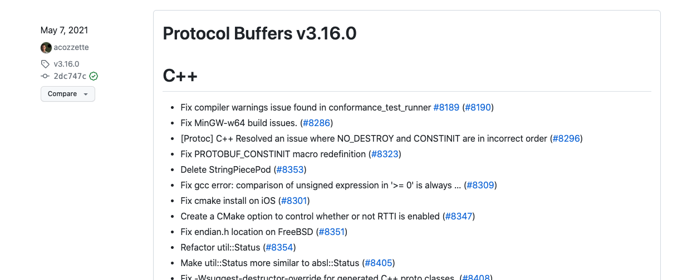
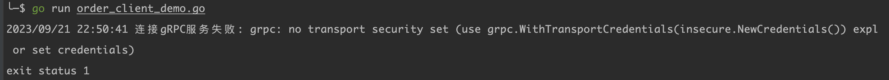

## 一、RPC协议

> [https://www.jianshu.com/p/5ade587dbc58](https://www.jianshu.com/p/5ade587dbc58)
>
> [https://zhuanlan.zhihu.com/p/506415782](https://zhuanlan.zhihu.com/p/506415782)
>
> [https://www.cnblogs.com/wongbingming/p/11086773.html](https://www.cnblogs.com/wongbingming/p/11086773.html)
>
> [https://zhuanlan.zhihu.com/p/524902149](https://zhuanlan.zhihu.com/p/524902149)

### 1、RPC概念

> RPC（Remote Procedure Call Protocol）是远程过程调用的缩写，通俗的说就是调用远处服务器的一个函数，与之相对应的是本地函数调用
>
> PRC的理解：
>
> - 像调用本地函数一样，去调用远程服务器上的函数
> - 进程间通信–应用层协议(http协议同层)，底层使用TCP实现

> 一般调用函数时，最常见的就是本地调用和RPC调用，下面就来说说二者的区别

### 2、本地调用

> 当在本地调用代码时，就是定义函数，然后函数名()调用
>
> 下面代码：
>
> - 先定义了一个`useError`函数
> - 然后在main函数中调用
> - 这是在本地调用的方式

```go
package main

import (
	"example.com/studygo/cerror"
	"fmt"
)

func useError(x, y uint8) (uint8, error) {
	if x < 10 {
		err := cerror.New("x小于0", "2022-08-08")
		return 0, err
	}
	return x + y, nil
}

func main() {
	u1, err := useError(9, 12)
	fmt.Printf("u1:%v ,u1 type:%T\n", u1, u1)
	fmt.Printf("err:%v ,err type:%T\n", err, err.Error())
}
```


> - 本地过程调用发生在同一进程中的，所以可以正常调用
> - 但是我们无法直接在另一个构建的程序直接调用上面代码中的`userError`函数，因为它们是两个程序，内存空间是相互隔离的

### 3、RPC调用

> RPC调用解决了什么问题
>
> - 为了解决类似远程、跨内存空间、的函数/方法调用
> - 比起以往的通过HTTP的Restful-API风格调用，使用RPC能够让我们调用远程方法像调用本地方法一样无差别
>     - 基于RESTful风格的API通常是基于HTTP协议，传输数据采用JSON等文本协议
>     - RPC可以使用TCP协议，传输数据采用二进制协议来说，相比RESTful的API来说性能会更好

> 实现RPC的步骤以及办法
>
> - 确定要执行的函数？ 
>     - 在本地调用中，函数主体通过函数指针函数指定，然后调用对应的函数，编译器通过函数指针函数自动确定被调用函数在内存中的位置。
>     - 在 RPC 中，调用不能通过函数指针完成，因为它们的内存地址可能完全不同。
>         - 调用方和被调用方都需要维护一个{ function <-> ID }映射表，以确保调用正确的函数。
> - 如何传递调用的参数？ 
>     - 本地过程调用中传递的参数是通过堆栈内存结构实现的
>     - RPC不能直接使用内存传递参数，因此参数或返回值需要在传输期间序列化并转换成字节流，因为网络传输都是使用的二进制格式，所以需要序列化或反序列化
> - 如何进行网络传输？ 
>     - 函数的调用方和被调用方通常是通过网络连接的
>     - function ID 和序列化字节流需要通过网络传输
>         - 只要能完成调用，调用方和被调用方就不受现有特定网络协议的限制。
>         - 比如有的RPC框架使用TCP协议，有的的使用HTTP协议

#### 3.1 rpc包实现rpc调用步骤

> go语言内置的net/rpc包可以通过网络导出一个需要被远程调用的对象方法
>
> - 编写一个需要被远程调用的对象方法
>     - 所以导出对象和对象方法都需要首字母大写
> - rpc服务器注册一个对象，暴露到外部网络可见，并且服务名称就是被导出的对象类型的名称
> - 接着对象的导出方法就可以支持远程调用访问

#### 3.2 rpc代码调用示例

##### 3.2.1 rpc服务端代码

```go
package main

import (
	"fmt"
	"net"
	"net/rpc"
)

// 定义导出对象结构体
type SayHiService struct{}

// 定义导出对象的方法，建议定义为指针接收者
func (s *SayHiService) SayGreet(sayStr string, reply *string) error {
	fmt.Printf("我说啦：:%v\n", sayStr)
	*reply = "你好呀，" + sayStr
	return nil
}

func main() {
  RpcSayHiService := new(SayHiService)
  
  // 注册rpc服务
	_ = rpc.Register(RpcSayHiService)
  
  // 使用TCP协议s
	listener, err := net.Listen("tcp", ":1234")
	if err != nil {
		fmt.Printf("listen tcp rpc err:%v\n", err)
	}
	conn, err := listener.Accept()
	fmt.Printf("conn==>:%v\n", conn)
	if err != nil {
		fmt.Printf("conn rpc err:%v\n", err)
	}
	rpc.ServeConn(conn)
}
```

##### 3.2.2 rpc客户端代码

```go
package main

import (
	"fmt"
	"net/rpc"
)

func main() {
	address := "127.0.0.1:1234"
  
  // 与服务端使用tcp建立链接
	client, err := rpc.Dial("tcp", address)
	if err != nil {
		fmt.Printf("client dial err:%v\n", err)
		return
	}
	
  // 同步调用服务端函数
	var reply string
	sayStr := "忠实的仆人"
	err = client.Call("SayHiService.SayGreet", sayStr, &reply)
	if err != nil {
		fmt.Printf("client call err:%v\n", err)
		return
	}
	fmt.Printf("reply val:%v\n", reply)
}
```

### 4、RPC原理图

> 下图来自李文周老师博客


> 1. 服务调用方（client）以本地调用方式调用服务；
> 2. client stub接收到调用后负责将方法、参数等组装成能够进行网络传输的消息体；
> 3. client stub找到服务地址，并将消息发送到服务端；
> 4. server 端接收到消息；
> 5. server stub收到消息后进行解码；
> 6. server stub根据解码结果调用本地的服务；
> 7. 本地服务执行并将结果返回给server stub；
> 8. server stub将返回结果打包成能够进行网络传输的消息体；
> 9. 按地址将消息发送至调用方；
> 10. client 端接收到消息；
> 11. client stub收到消息并进行解码；
> 12. 调用方得到最终结果
>
> 使用RPC框架的目标是只需要关心第1步和最后1步，中间的其他步骤统统封装起来，让使用者无需关心。例如社区中各式RPC框架（grpc、thrift等）就是为了让RPC调用更方便。

## 二、gRPC框架

> 从第一章可以看出来go内置的rpc包就可以实现rpc功能，不过go社区提供了比较成熟的RPC框架，来简化平时使用RPC的一些步骤，后面的章节来学习理解gRPC框架

### 1、gRPC是什么

> gRPC官网：[https://grpc.io/docs/what-is-grpc/introduction/](https://grpc.io/docs/what-is-grpc/introduction/)

> 从gRPC官网介绍可以得知gRPC是做什么用的？
>
> - 在gRPC中，客户端应用程序可以直接调用不同机器上的服务器应用程序的方法，就像它是一个本地对象一样，使你更容易创建分布式应用程序和服务。
> - 就像许多RPC系统一样，gRPC是围绕着定义服务(Interface Definition Language)的想法，指定可以远程调用的方法及其参数和返回类型。
> - 在服务器端，服务器实现这个接口并运行gRPC服务器来处理客户端的调用。
> - 在客户端，客户端有一个存根（在某些语言中被称为只是一个客户端），提供与服务器相同的方法。

> gRPC客户端和服务器可以在各种环境中运行并相互交谈--从谷歌内部的服务器到你自己的桌面--并且可以用gRPC支持的任何语言编写。
>
> 因此，举例来说，你可以很容易地用Java创建一个gRPC服务器，客户端用Go、Python或Ruby。
>
> 此外最新的谷歌API将有gRPC版本的接口，让你轻松地在你的应用程序中建立谷歌功能。


> 上图来自gRPC官网，从上图可以看出：
>
> - 客户端（gRPC Stub）在自己的程序中调用某个函数或者方法，此时发起了RPC调用
>     - 对请求信息使用Protobuf进行对象序列化压缩
> - 服务端（gRPC Server）收到请求信息以后，解码请求体，进行业务逻辑处理并返回
>     - 对响应结果使用Protobuf进行对象序列化压缩
> - 客户端接收到服务端响应结果后，解码请求体。
>     - 回调被调用的A方法，唤醒正在被等待响应（阻塞）的客户端调用并返回响应结果

### 2、Protobuf介绍

> 在`gRPC是什么`这一小节中，反复提到Protobuf这个名词，那Protobuf是什么？gRPC与Protobuf的关系是什么？如何使用Protobuf？是我们接下来需要探讨的事情

#### 2.1 Protobuf是什么

> Protobuf官网：[https://protobuf.dev/overview/](https://protobuf.dev/overview/)

> Protobuf介绍
>
> - Protocol Buffers是一种语言中立、平台中立的可扩展机制，用于序列化结构化数据
>
> - Protocol Buffers提供了一种语言中立、平台中立、可扩展的机制，用于以向前兼容和向后兼容的方式序列化结构化数据。
>
> - 它就像JSON，只是它更小、更快，而且能生成本地语言绑定。
>
> - 你只需定义一次你希望你的数据如何被结构化，然后你就可以使用特殊生成的源代码，轻松地从各种数据流和使用各种语言写入和读取你的结构化数据。
> - Protocol Buffers是定义语言（在.proto文件中创建）、proto编译器生成的与数据接口的代码、特定语言的运行库以及写入文件（或通过网络连接发送）的数据的序列化格式的组合

> Protobuf解决了什么问题？
>
> - Protocol Buffers为大小不超过几兆字节的类型化、结构化数据包提供了一种序列化格式，该格式适用于短暂的网络通信和长期的数据存储。
> - Protocol Buffers可以用新的信息进行扩展，而不会使现有的数据失效或需要更新代码。
> - Protocol Buffers是谷歌最常使用的数据格式。它们被广泛用于服务器间的通信以及磁盘上的数据存档存储。
> - Protocol Buffers的信息和服务由工程师编写的.proto文件描述。

> Protobuf的作用与特点
>
> - Protocol Buffers是任何需要以语言中立、平台中立、可扩展的方式序列化结构化、类似记录、类型化数据的情况的理想选择。它们最常被用于定义通信协议（与gRPC一起）和数据存储。
> - 使用Protocol Buffers的一些优点包括：
>     - 紧凑的数据存储
>     - 快速解析
>     - 在许多编程语言中可用
>         - Dart、Go、C++、C#、Java、Kotlin、Objective-C、PHP、Python、Ruby
>         - 由于Dart和Go语言是谷歌公司出品的语言，所以这两个语言的protoc编译器是由谷歌公司维护的
>         - 本笔记只探讨Go语言，这里是Go语言的编译器插件：[https://github.com/protocolbuffers/protobuf-go](https://github.com/protocolbuffers/protobuf-go)
>     - 通过自动生成的类来优化功能
>     - 跨语言的兼容性
>     - 用任何支持的编程语言编写的代码都可以读取相同的信息。
>         - 你可以让一个平台上的Java程序从一个软件系统中捕获数据，根据.proto定义将其序列化，然后在另一个平台上运行的单独的Python应用程序中从该序列化数据中提取特定值

> 对于Protobuf的介绍先到这里，需要更详细的信息可以查看Protobuf官网

#### 2.2 gRPC与Protobuf关系

> 默认情况下，gRPC使用谷歌成熟的开源机制Protocol Buffers来序列化结构化数据（尽管它也可以用于其他数据格式，如JSON）
>
> 这就说明gRPC使用的是Protobuf进行序列化数据的，那么就需要熟悉对Protobuf的使用

#### 2.3 Protobuf编译器安装

> protobuf编译器的作用，就是根据定义的.proto文件，编译出对应编程语言的代码文件
>
> protobuf官方安装参考文档：[https://grpc.io/docs/protoc-installation/](https://grpc.io/docs/protoc-installation/)
>
> 如果按照上述文档安装，我们无法安装想要的protobuf指定版本，那么就需要去下载指定版本的protobuf，然后放置到自己电脑的PATH中
>
> 编写此文档时，protobuf编译器使用的版本是`v3.20.0`
>
> 下载地址在github中找到：[https://github.com/protocolbuffers/protobuf/releases](https://github.com/protocolbuffers/protobuf/releases)



> 在下载地址页面下载适合你平台的预编译好的二进制文件（`protoc-<version>-<platform>.zip`），下面是不同版本的解释

| 版本                                                         | 说明                                                         |
| ------------------------------------------------------------ | ------------------------------------------------------------ |
| [protobuf-all-3.20.0.zip](https://github.com/protocolbuffers/protobuf/releases/download/v3.20.0/protobuf-all-3.20.0.zip) | 这是未编译成可执行的protobuf二进制程序的源文件，一般不选择这个 |
| [protoc-3.20.0-osx-aarch_64.zip](https://github.com/protocolbuffers/protobuf/releases/download/v3.20.0/protoc-3.20.0-osx-aarch_64.zip) | 适用于Mac ARM 64位系统，可执行的protobuf二进制程序           |
| [protoc-3.20.0-osx-x86_64.zip](https://github.com/protocolbuffers/protobuf/releases/download/v3.20.0/protoc-3.20.0-osx-x86_64.zip) | 适用于Mac Intel 64位系统，可执行的protobuf二进制程序         |
| [protoc-3.20.0-win64.zip](https://github.com/protocolbuffers/protobuf/releases/download/v3.20.0/protoc-3.20.0-win64.zip) | 适用Windows 64位系统，可执行的protobuf二进制程序             |
| [protoc-3.20.0-linux-x86_64.zip](https://github.com/protocolbuffers/protobuf/releases/download/v3.20.0/protoc-3.20.0-linux-x86_64.zip) | 适用Linux 64位系统，可执行的protobuf二进制程序               |

> 编写此文档时使用的macos系统，电脑芯片是Intel的，所以选择`protoc-3.20.0-osx-x86_64.zip`这个版本
>
> 下载上面版本以后，解压并配置bin目录到环境变量中，查看protoc的版本


> 从上面可以看出，当运行help出现的语言参数，说明protoc本身已经内置该语言对应的编译插件，无需安装再安装对应语言的编译插件，但是go语言的编译插件是由谷歌公司单独维护的，所以需要单独安装
>
> [GO protobuf仓库](https://github.com/protocolbuffers/protobuf-go)

#### 2.4 Protobuf语法版本

> 官方的建议：
>
> - 虽然Protocol Buffers已经向开源用户提供了一段时间，但官方的大多数例子都使用了Protocol Buffers第3版（proto3），它的语法稍微简化，有一些有用的新功能，并支持更多的语言。
> - Proto3目前有Java、C++、Dart、Python、Objective-C、C#、一个ite-runtime（Android Java）、Ruby和JavaScript版本，来自protocol buffers GitHub repo，以及来自golang/protobuf官方软件包的Go语言生成器，还有更多语言正在开发中。
> - 可以在proto3语言指南和每种语言的参考文档中找到更多信息。参考文档还包括一个.proto文件格式的正式规范
> - 一般来说，虽然可以使用proto2（目前默认的Protocol Buffers），但官方建议使用proto3与gRPC，因为它可以让你使用全部的gRPC支持的语言，以及避免proto2客户端与proto3服务器之间的兼容性问题。

### 3、Protobuf语法

> 下面文档来自proto3版本语法文档：[https://protobuf.dev/programming-guides/proto3/](https://protobuf.dev/programming-guides/proto3/)

#### 3.1 首行语法声明

> 下面是官方提供的第一个示例，定义一个消息类型

```protobuf
syntax = "proto3";
```

> 需要注意：
>
> - 文件的第一行指定使用的是proto3语法，如果不这样做，Protocol Buffers编译器会认为你使用的是proto2
> - 第一行指定语法必须是文件中第一行非空的、非注释的行
> - 每一句都以英文的`;`结束

#### 3.2 注释语法

> 在`.proto` 文件中, 使用C/C++-风格的`//`and`/* ... */`语法来表示注释

```protobuf
syntax = "proto3";

/*
	这是多行注释
*/

// 定义一个消息
message SearchRequest {
  string query = 1;
  int32 page_number = 2;
  int32 result_per_page = 3
}
```

#### 3.3 Message类型

> Message类型可以理解为go中的结构体，承载请求消息的字段和响应消息的字段
>
> 文档参考：https://protobuf.dev/programming-guides/proto3/#simple

```protobuf
syntax = "proto3";

message SearchRequest {
  string query = 1;
  int32 page_number = 2;
  int32 result_per_page = 3
}
```

> 从上面代码可以看出：
>
> - 指定了三个字段（变量名与值对）每个字段代表你想在这种类型的消息中包含的数据
> - 每个字段都有一个名称和一个类型。
>   - query变量的类型是一个字符串
>   - page_number和result_per_page类型是整型

##### 3.3.1 声明字段编号

> 从前面定义的message中，可以看到每个变量等号右边都有数字，数字就是message类型中变量的编号
>
> - 在 Protocol Buffers（protobuf）中，等号右边的数字（如 1、2、3）表示字段的唯一标识符（Tag），这些标识符在编码消息时用于标记字段。它们在整个消息定义中必须是唯一的。
> - 每个字段有一个唯一的数字标识符，这是在序列化和反序列化过程中使用的。
> - 此标识符并不会影响消息字段的顺序，但它们在定义.proto 文件时必须是唯一的。
> - 在更新.proto 文件时，请注意：不要更改现有字段的标识符，因为这会破坏向后兼容性。当需要为消息添加新字段时，可以分配一个新的、尚未使用过的标识符。
>
> 注意：
>
> - 字段编号的值范围限定为 1 ~ 536870911（不包括 19000 到 19999 区间的保留值）
>   - 字段编号 19,000 至 19,999 保留给协议缓冲区实现。如果在报文中使用了这些保留字段编号，协议缓冲区编译器将发出报警。
> - 最常设置的字段应使用字段编号1至15。较低的字段编号值在导线格式中占用的空间较少。
>   - 例如，字段编号范围为 1 至 15 的字段编号只需一个字节进行编码
>   - 16 至 2047 范围内的字段编号需要两个字节
> - 重复使用字段编号会使解码线格式消息变得模糊，其实就是导致解码时不知道该用哪个字段

##### 3.3.2 指定字段标签

> 字段标签支持：
>
> - optional：
>
>   - 字段已设置，包含一个显式设置或从电文中解析的值。它将被序列化到电文中。
>
>   - 字段未设置，将返回默认值。它不会被序列化到数据线上。
>
>   - 您可以检查该值是否已明确设置。
>
> - repeated：该字段类型可以在格式良好的报文中重复零次或多次。重复值的顺序将被保留。
>
> - map：这是一个成对的键/值字段类型。有关此字段类型的更多信息，请参阅[map](https://protobuf.dev/programming-guides/encoding/#maps)。
>
> - 注意：
>
>   - 如果没有应用显式字段标签，则默认使用字段标签，称为 "隐式字段存在"。
>   - (格式良好的报文可以有 0 个或 1 个这种字段（但不能多于 1 个）。
>   - 您也无法确定这种类型的字段是否是从电文中解析出来的。
>   - 隐式存在字段将被序列化到电文中，除非它是默认值。有关这方面的更多信息，请参阅字段存在。
>   - 在 proto3 中，标量数字类型的重复字段默认使用打包编码。
>
>   参考：https://protobuf.dev/programming-guides/proto3/#field-labels

> TODO：这一部分暂时没用用到，等后续用到再来补充知识

##### 3.3.3 多个message类型

> 在一个`.proto`文件中，可以存在多个message，比如有requestMessage，那就可以定义responseMessage

```protobuf
syntax = "proto3";

message SearchRequest {
  string query = 1;
  int32 page_number = 2;
  int32 result_per_page = 3
}

message SearchResponse {
  string result = 1;
}
```

##### 3.3.4 删除字段

> 下面为官网翻译，了解到时再来补充
>
> 删除字段如果操作不当，删除字段可能会导致严重问题。
>
> - 当您不再需要非必填字段，并且已从客户端代码中删除所有引用时，您可以从报文中删除字段定义。但必须保留已删除的字段编号。如果不保留字段编号，开发人员将来有可能重新使用该编号。
> - 您还应保留字段名称，以便继续解析消息的 JSON 和 TextFormat 编码。

##### 3.3.5 Proto变量类型与Go变量类型

> 在.proto文件中消息类型声明的变量类型与go语言对应的消息类型是有映射规则的，下面是最常用的几个类型的映射
>
> 注意：
>
> - 在官方文档中对应proto变量类型未找到int类型的说明，所以暂时先理解为proto定义整型时不支持int类型

| **.proto中类型** | **Go中类型** |
| :--------------: | :----------: |
|      int32       |    int32     |
|      int64       |    int64     |
|       bool       |     bool     |
|      string      |    string    |
|      bytes       |   []bytes    |
|      float       |   float32    |
|      double      |   float64    |

> proto文件中声明的变量默认值和Go里面不同变量类型的默认值类似
>
> - 对于string，默认值是空字符串
> - 对于bytes，默认值是空字节
> - 对于bool，默认值是false
> - 对于int32、int64等整型类型，默认值是零

##### 3.3.6 字段类型为message类型

> message支持可以把一个message类型当成某一个字段的类型

```protobuf
message SearchResponse {
  // 把Result消息作为results字段的类型
  repeated Result results = 1;
}
 
// 定义了Result消息体
message Result {
  string url = 1;
  string title = 2;
  repeated string snippets = 3;
}
```

##### 3.3.7 message嵌套

> message类型可以在其他消息类型中定义和使用已有的消息类型，就形成了message嵌套

```protobuf
message SearchResponse {
  message Result {
    string url = 1;
    string title = 2;
    repeated string snippets = 3;
  }
  repeated Result results = 1;
}
```

> 如果要在嵌套message类型之外的其他message中，使用被嵌套的message类型，则语法Parent.Type

```protobuf
message SearchResponse {
  message Result {
    string url = 1;
    string title = 2;
    repeated string snippets = 3;
  }
  repeated Result results = 1;
}

message SomeOtherMessage {
  // 使用上面的SearchResponse中的Result类型
  SearchResponse.Result result = 1;
}
```

> 嵌套的层数，这块需要编写proto文件时特别关注，

```protobuf
message Outer {                  // Level 0
  message MiddleAA {  // Level 1
    message Inner {   // Level 2
      int64 ival = 1;
      bool  booly = 2;
    }
  }
  message MiddleBB {  // Level 1
    message Inner {   // Level 2
      int32 ival = 1;
      bool  booly = 2;
    }
  }
}
```

##### 3.3.8 枚举类型

> 待补充
>
> https://protobuf.dev/programming-guides/proto3/#enum

#### 3.4 定义服务

> - 可以在.proto文件中定义一个RPC服务接口，协议缓冲区编译器将会在你选择的语言中生成服务接口代码和存根。
> - 当想定义一个RPC服务，包含一个接收你的SearchRequest并返回SearchResponse的方法
> - 可以在你的.proto文件中像下面这样定义：

```protobuf
service SearchService {
  rpc Search(SearchRequest) returns (SearchResponse);
}
```

> 注意：
>
> - rpc方法中的参数、返回值只能有一个，如果有多个字段需要返回，那就定义到message类型中
> - service在go语言中表示需要实现接口类型
> - 建议service后的服务名、rpc方法名都首字母大写，这也符合go语言首字母大写表示公共方法，其它包可以导入访问到

#### 3.5 导入proto文件

> 用到再来补充

> 导入定义 在上述例子中，Result消息类型在与SearchResponse相同的文件中定义 - 如果你想要使用的作为字段类型的消息类型已经在其他的.proto文件中定义了呢？
>
> 你可以通过导入它们来使用其他.proto文件中的定义。要导入另一个.proto的定义，你需要在文件的顶部添加一个import语句：

```protobuf
import "myproject/other_protos.proto"; 
```

> 默认情况下，你只能使用直接导入的.proto文件中的定义。然而，有时你可能需要将.proto文件移动到新的位置。
>
> 你可以在旧位置放置一个占位符.proto文件，使用import public的概念，将所有的导入转发到新的位置，而不是直接移动.proto文件，并在一次更改中更新所有的调用位置。
>
> 注意，Java中不提供public import功能。
>
> 可以在任何导入包含import public声明的proto的代码中依赖import public依赖。例如：

```protobuf
// new.proto
// 所有的定义都移动到这里
// old.proto
// 这是所有客户端都在导入的proto。
import public "new.proto";
import "other.proto";
// client.proto
import "old.proto";
// 你使用来自old.proto和new.proto的定义，但不使用other.proto
```

> 协议编译器在使用-I/--proto_path标志指定的一系列目录中搜索导入的文件。如果没有给出标志，它会在调用编译器的目录中查找。一般情况下，你应该将--proto_path标志设置为你的项目的根目录，并且对所有的导入使用完全限定的名字。

### 4、go与gRPC工具

> 在第三节的`Protobuf语法`中介绍了protobuf的语法，学习到了Message、服务的定义，这节来熟悉go根据.proto文件生成.pb代码、生成gRPC代码

#### 4.1、相关工具介绍

> 生成grpc的代码时，需要用到 protoc 、protoc-gen-go  、protoc-gen-go-grpc 、grpc 这几个库

##### 4.1.1 protoc编译器

> - **protoc**编译器 
>   - 这是 Protocol Buffers 编译器（`protoc` 命令）。
>   - 它能够根据 .proto 文件生成各种编程语言（如 Go、Python、Java 等）的数据结构、序列化和反序列化代码。
>   - 这个编译器非常重要，因为它是 Protocol Buffers 为各种编程语言生成代码的核心工具。

> - protoc编译器重要参数
>   - -IPATH
>     - --proto_path=PATH 表示的是我们要在哪个路径下搜索`.proto`文件，这个参数既可以用`-I`指定，也可以使用`--proto_path=`指定，可能多次指定，将按顺序搜索目录。
>     - 如果不指定该参数，则默认在**当前路径**下进行搜索。
>     - 如果在这些目录中都找不到，将检查 --descriptor_set_in 描述符所需的proto文件

##### 4.1.2 protoc-gen-go插件

> 为什么有这个插件？
>
> - 非内置的语言支持就得自己单独安装语言插件
> - 从`proto --help`命令看出，protoc没有内置go语言的插件，那么就需要单独安装go语言插件，另外可以看到其它语言都是类似`--java_out=OUT_DIR`、`--php_out=OUT_DIR`这样的，那么在编译go代码时，命令就应该是`--go_out=OUT_DIR`，表示生成go的pb文件的路径

> 插件的作用：
>
> - `protoc-gen-go`将 .proto 文件中声明的消息和枚举类型转换为 Go 语言中的数据结构，并实现序列化和反序列化方法。
> - 重要提示：纯粹用来生成pb序列化相关的文件，不再承载gRPC代码生成功能
> - 这个插件是为 Go 语言开发者提供的，用于生成 Go 语言的 Protocol Buffers 代码。

##### 4.1.3 protoc-gen-go-grpc插件

> - 这也是一个protoc插件，主要用来生成gRPC相关代码
> - 基于.proto文件声明的服务接口，这个插件为 gRPC 自动生成对应的客户端和服务端代码。这使得开发者可以只关心业务逻辑，而无需操心底层的网络通信实现。
> - `protoc-gen-go-grpc` 插件与 `protoc-gen-go` 插件配合使用，提供完整的 gRPC Go 语言编程支持。

##### 4.1.4 gRPC库

> -  `grpc` 库提供了 gRPC 框架的核心实现，包括客户端、服务端及拦截器等一系列功能。在编写实际的 gRPC 代码时，需要用到这个库（如调用 API、处理底层网络操作等）。
> -  对于 Go 语言，`grpc` 库对应的包路径是 `google.golang.org/grpc`。这些组件在 gRPC 开发过程中扮演着不同的角色。
> -  `protoc` 和相应的插件（`protoc-gen-go` 和 `protoc-gen-go-grpc`）用于根据 .proto 文件生成客户端和服务端的代码；而 `grpc` 库提供了 gRPC 运行时的核心实现。在执行 gRPC 调用时，我们需要使用由这些组件生成的代码，以及基于 `grpc` 库的核心功能。

#### 4.2 protoc-gen-go插件单独使用

> 从上面对于插件的介绍可以知道，protoc-gen-go插件纯粹用来生成pb序列化相关的文件，那么可以先单独使用protoc-gen-go插件来看看会生成什么内容

> `protoc-gen-go`插件的安装命令如下：

```bash
# 最新版
$ go install google.golang.org/protobuf/cmd/protoc-gen-go@latest

# 指定版本
$ go install google.golang.org/protobuf/cmd/protoc-gen-go@v1.3.0
```

##### 4.2.1 定义.proto文件

> 定义订单的proto文件，名称为：order.proto

```protobuf
syntax = "proto3"; 

// 定义包名
package order;

// 定义go包名
option go_package = "lytest.com/orders";

// 定义订单请求消息
message OrderRequest {
  int64 uid = 1;
  int64 goodsId = 2;
  string userName = 3;
}

// 定义订单响应消息
message OrderResponse {
  int64 orderId = 1;
  bool payResult = 2;
}

// 定义订单RPC服务
service OrderService{
  // GetOrderInfo rpc方法，用来获取订单信息
  rpc GetOrderInfo(OrderRequest) returns (OrderResponse);
}
```

##### 4.2.2 编译.proto文件

> 接下来就是对上面的.proto文件进行编译，生成go的pb序列化相关的文件，
>
> 下面命令是使用 `protoc`（即Protocol Buffers编译器）对.proto文件进行编译，生成 Go 代码的命令

```bash
protoc --proto_path=src --go_out=goods_demo --go_opt=paths=source_relative order.proto
```


> - `--proto_path=src`：这是指定.proto文件的源文件路径。
>   - 这里是指.proto文件路径为当前目录（项目）下的 `src` 文件夹，也就是上面order.proto文件所在的目录
>   - 当指定了--proto_path=src参数，那么表示`order.proto`文件一定是在src这个目录中，在命令最后指定proto文件时，就不需要显明的写`src/order.proto`了，，只写order.proto即可，因为已经--proto_path=src指定了proto文件所在的目录了
>   - 当不指定这个参数时，会以当前执行`procto`命令所在的当前目录为order.proto文件所在的目录，如果order.proto文件不在执行proto命令时的当前目录，就会提示proto文件不存在的报错

> - `--go_out=goods_demo`：这是指定Go代码的输出目录。
>   - 这里将编译后的Go文件输出到goods_demo目录，当--go_out指定的目录不存在，则会提示目录不存在的报错，所以在执行命令前创建好即可
>   - 这个参数不能省略，否则会报错提示:"缺少输出的指令的错误"


> --go_opt：主要是给proto-gen-go插件设定插件参数，有三个参数可以设置：
>
> - paths=import
> - module=$PREFIX（不常用）
> - paths=source_relative

> - --go_opt=paths=import
>   - 生成的文件会按proto文件中指定的`optional go_package`声明的路径来生成，以斜杠(/)表示一层目录
>   - 如上面order.proto文件中声明了`option go_package = "lytest.com/orders";`，且--go_out=goods_demo，那么生成的pb文件就会在这个目录下：goods_demo/lytest.com/orders
>   - 如果没有指定生成pb文件时不指定这个参数`--go_opt=paths=import`，那pathsimport是--go_out的默认参数


> - --go_opt=paths=source_relative：
>   - `source_relative`：表示生成的pb.go文件将使用与源.proto文件所在的相对路径，但是也分情况
>     - 当--go_out=. 等号后面的点表示生成pb.go文件的存放目录为源文件所在的目录，那么生成的pb.go文件就会和源.porto文件在同一个目录，也就是在：src目录下有`order.proto`、`order.pb.go`两个文件
>     - 当--go_out=goods_demo 等号后面的目录表示pb.go文件的存放目录为指定的goods_demo目录(需要goods_demo目录存在)，那么生成的pb.go文件所在目录为：goods_demo/order.pb.go


> - `order.proto`：这是源.proto 文件名称
>   - 源文件可以指定一个或多个

##### 4.2.3 编译的pb.go文件解析

> 从上面protoc命令我们仅得到了order.pb.go文件，没有gRPC相关的文件，生成gRPC文件需要`protoc-gen-go-grpc`插件支持，下节介绍，本小节来看看我们生成的order.pb.go文件内容


> - 从上面的注释看到protoc、protoc-gen-go的版本，源.proto文件的名称是`order.proto`
> - 接着看到一个注释："// 定义包名"，这个注释是从order.proto中的package order上方来的，且在order.proto文件中还声明pb文件的包名为`option go_package = lytest.com/orders，从order.pb.go代码中也看到当前包名为斜杠后的orders


> 上面可以看到：
>
> - 在proto中定义的OrderRequest消息、OrderResponse消息会转换为go语言的结构体，并且字段都变为首字母大写，且还加了`protobuf`、`json`的结构体tag
> - 下面是对上面生成go结构体字段的protobuf标签解释如下：
>   - varint： 表示这个字段的数据类型是变长的整数类型。
>   - 1： 这是这个字段在 protobuf 消息中的序号，也称作字段编号(field number)，每个字段都有一个唯一的编号，protobuf 不关心字段的名字，而是通过这个编号来标识字段的。
>   - opt： 表示这是一个可选字段（optional）。在 proto3 中，所有的字段都是可选的，这个可选实际上是相对于 proto2 中的 required（必选）字段而言的。
>   - name=uid： 在 protobuf 中，这个字段的名字为 "uid"。
>   - proto3： 表示这是 protobuf v3 的字段。
> - 结构体字段的 json 标签解释如下：
>   - uid：在转为 JSON 时，这个字段的名字为 "uid"。
>   - omitempty：如果这个字段为 0值（对于整型是0，对于字符串是空字符串，对于布尔型是false等等），那么在转为 JSON 时就忽略（省略）该字段。


> 另外在源.proto文件中还定义了一个OrderService，但是编译生成的pb.go文件没有改部分的代码，能搜到的只是图中的注释，看来pb.go仅仅是生成message消息对应的结构体，对定义的服务不会生成代码

> 总结：
>
> - 源proto文件中的message消息会生成go中的对应的结构体
> - 源.proto文件中定义了的rpc 服务，在只编译生成pb.go文件时不会生成rpc服务的代码

#### 4.3 protoc-gen-go与protoc-gen-go-grpc插件搭配使用

> 从4.2小节可以得知，使用protoc-gen-go插件只能生成pb文件，仅仅用作序列化和反序列化，生成grpc相关的代码，还需要protoc-gen-go-grpc插件

> 安装protoc-gen-go-grpc插件

```bash
go install google.golang.org/grpc/cmd/protoc-gen-go-grpc@v1.2
```

##### 4.3.1 定义.protoc文件

> 定义的proto文件和4.2.1小节中的一样，不做重复说明

##### 4.3.2 编译.proto文件

> 因为从4.2小节中，可以得知，protoc-gen-go插件只能生成仅仅序列化的pb.go文件，gRPC相关的go代码文件需要protoc-gen-go-grpc插件，所以编译命令中需要指定使用protoc-gen-go-grpc插件

```bash
protoc --proto_path=src --go_out=goods_demo  --go_opt=paths=source_relative --go-grpc_out=goods_demo --go-grpc_opt=paths=source_relative src/order.proto
```


> 从上面的命令可以看到，使用了下面几个参数：
>
> - --go-grpc_out参数：指定gRPC代码生成的路径
> - --go-grpc_opt参数和--go_opt一致，不做重复解释

> 从上图看出，我们把pb.go和xx_grpc.pb.go文件都生成在了goods_demo目录。
>
> 至于编译proto文件为go代码的参数使用就灵活多变，根据具体场景去使用

##### 4.3.3 编译的xx_grpc.pg.go文件解析

> 注意：
>
> - proto编译gRPC代码时，会同时把gRPC的server端代码和client端代码都自动生成
> - 需要自己去单独实现server端的RPC方法，然后由client端来调用，这块具体要看下节解释

> 从上面编译的goods_demo/order_grpc.pb.go文件，来看看编译的内容是什么


> - 可以看到首部的注释内容和编译出来的order.pb.go文件中的一致
> - 包名也是orders，和order.pb.go文件的包名也一致，那么外部调用时，既可以调用order.pb.go的序列化代码，还可以调用order_grpc.pb.go中的gRPC代码，因为都属于同一个orders包，也是因为都是从同一个源.proto文件生成的


> 可以看到根据源.proto文件的定义的OrderService服务，生成了如下内容
>
> - OrderServiceServer接口类型
>   - OrderServiceServer是OrderService服务的服务器API。
>   - 所有rpc方法实现都必须内嵌UnimplementedOrderServiceServer结构体（是为了保证UnimplementedOrderServiceServer结构体也是OrderServiceServer接口类型）中以保证向前兼容性，这块是由proto编译时自动完成，不需要我们人为手动去实现接口的方法
>   - 接口中有2个需要实现的方法
>     - GetOrderInfo方法，方法中的第一个参数为context（用来传递上下文，不在此解释），第二个参数和我们在源.proto的rpc方法定义的参数一样，返回值也是一样，还多了一个error。
>     - mustEmbedUnimplementedOrderServiceServer方法，中文翻译过来：“必须嵌入未实现的订单服务”，作用是为了向后兼容，这块在下节解释
> - UnimplementedOrderServiceServer结构体，从名字翻译到中文来看"未实现的OrderServiceServer"，那就说明需要我们人为手动去实现这个结构体，而且结构体还有两个方法：
>   - GetOrderInfo方法，这个方法中都是空，没有具体的业务逻辑，看来是需要把业务逻辑实现在这个方法里
>   - mustEmbedUnimplementedOrderServiceServer方法是个空
>   - 从go接口定义来看，UnimplementedOrderServiceServer结构体实现了OrderServiceServer接口类型的两个方法，那么UnimplementedOrderServiceServer结构体的类型也可以是OrderServiceServer接口类型（隐式实现）


> 前面提到过proto编译gRPC代码时，会同时把gRPC的server端代码和client端代码都自动生成，已经介绍完server端代码了，那来介绍下gRPC的client代码，可以看到根据源.proto文件定义的OrderService服务，生成了如下的client端内容
>
> - OrderServiceClient接口类型
>   - 表示是OrderServiceClient是OrderService服务的客户端API
>   - 接口中有1个需要实现的方法
>     - GetOrderInfo方法，方法中的第一个参数为context（用来传递上下文，不在此解释），第二个参数有一个和我们在源.proto中定义的一样，第三个参数为可变长参数，用来传一个gRPC库内置的一些方法，返回值也是一样，还多了一个error
> - orderServiceClient结构体，这是客户端调用时使用的结构体
>   - orderServiceClient结构体的初始化方法NewOrderServiceClient来初始化客户端，并且入参为grpc.ClientConnInterface类型，看来是需要传入一个gRPC客户端连接进来，由客户端连接进行后续的操作
>   - GetOrderInfo方法，这个方法里写好了客户端调用的逻辑，这块是gRPC自己生成好的，我们不需要修改，只需要在客户端调用时，按参数传参即可
>   - 从从go接口定义来看，orderServiceClient结构体实现了OrderServiceClient接口类型的方法，那么orderServiceClient结构体就可以是OrderServiceClient接口类型了（隐式实现）
> - 为什么orderServiceClient结构体要实现OrderServiceClient接口类型？
>   - 因为orderServiceClient结构体的初始化方法NewOrderServiceClient的返回值是OrderServiceClient接口类型，而且在外部调用时，肯定会调用NewOrderServiceClient初始化方法，没法调用到orderServiceClient结构体，因为orderServiceClient结构体首字母是小写的

> 至此对编译生成的xx_grpc.pb.go文件解析就到这里，文件中的其余代码我们先不用关注

### 5、gRPC交互模式

#### 5.1 Simple RPC

> 客户端发送请求，服务端响应请求，一问一答的模式在gRPC里叫做`Simple RPC` (也称`Unary RPC)`，这也是最基本的一种gRPC交互方式，下面介绍下`Simple RPC`这种方式如何使用

##### 5.1.1 前置知识

> 在使用gRPC之前，先补充一个必须了解或者熟悉的知识点，那就是结构体嵌套，为什么这么说呢？
>
> - 从4.3.3小节可以看出，生成的gRPC的Server端和Client代码中，大量用到了接口、结构，
> - 在讲到生成Server端代码时，发现生成的结构体、rpc方法都是未实现的，需要我们自己去实现，那么在一个已有的结构体、结构体方法的前提下，想对它实现，能想到就是继承，但是在go中没有继承的概念，那就是结构体嵌套
> - 也就是说我们实现gPRC的Server端时，需要定义自己的结构体来嵌套gRPC生成的结构体和结构体方法，因为有了结构体嵌套了，那嵌套的结构体本身就有个被嵌套结构体的类型和方法，就和python中的父子继承逻辑一样，就可以对被嵌套的结构体的方法进行重写（编写属于我们的业务逻辑），那达成实现了被嵌套结构体方法的目的

##### 5.1.2 编写自己的server端

> 到此我们就需要去实现自己的server代码，编写自己的server端最好管理在新的文件或目录里，不要和gRPC生成的代码混在一起

```go
package ordersSvr

import (
	"context"
	"errors"
	orders "example.com/studygo/grpc_study/goods_demo"
	"google.golang.org/grpc/metadata"
	"log"
)

// OrderService 嵌套了orders.UnimplementedOrderServiceServer
type OrderService struct {
	orders.UnimplementedOrderServiceServer
}

func NewOrderService() *OrderService {
	return &OrderService{}
}

// 重写GetOrderInfo方法，实现我们的业务逻辑
func (o *OrderService) GetOrderInfo(c context.Context, orderReq *orders.OrderRequest) (*orders.OrderResponse, error) {
	log.Printf("orderReq is : %#+v\n", orderReq)
	log.Printf("context is : %#+v\n", c)
	md, _ := metadata.FromIncomingContext(c)
	traceId := md["traceid"][0]
	log.Printf("context val is : %#+v\n", traceId)
	uid := orderReq.Uid
	if uid == 0 {
		log.Printf("uid为0，traceId: %v", traceId)
		return nil, errors.New("uid为0")
	}
	var payRet bool
	if orderReq.GoodsId <= 0 && len(orderReq.UserName) <= 0 {
		log.Printf("goodsId为0且userName为空，traceId: %v", traceId)
		return nil, errors.New("goodsId为0且userName为空")
	}
	payRet = true
	return &orders.OrderResponse{
		OrderId:   uid + 10,
		PayResult: payRet,
	}, nil
}
```

> 代码解释：
>
> - 首先导入了编译生成的gRPC的orders_grpc.pb.go文件中的相关代码
> - 定义了OrderService结构体，嵌套了orders_grpc.pb.go中需要被实现的UnimplementedOrderServiceServer结构体，并且OrderService结构体还重写了UnimplementedOrderServiceServer结构体的GetOrderInfo方法，编写了我们自己的业务逻辑

##### 5.1.3 启动gRPC服务

> server端需要实现的功能编写完以后，就可以注册启动gRPC服务了

```go
package main

import (
	orders "example.com/studygo/grpc_study/goods_demo"
	ordersSvr "example.com/studygo/grpc_study/orders"
	"fmt"
	"google.golang.org/grpc"
	"log"
	"net"
)

func main() {
	// 创建tcp链接，拿到一个tcp的listener
	port := 9999
	lis, err := net.Listen("tcp", fmt.Sprintf("localhost:%d", port))
	if err != nil {
		log.Fatalf("failed to listen: %v", err)
	}

	// 创建一个grpc服务，并且没有服务注册，而且也没有开始接收gRPC请求
	gRpcSvr := grpc.NewServer()

	// 声明一个我们编写的NewOrderService服务对象
	orderService := ordersSvr.NewOrderService()

	// 给grpc服务注册orders服务，需要传入一个gRPC服务对象，以及我们实现的orderService对象
	orders.RegisterOrderServiceServer(gRpcSvr, orderService)

	// Serve在监听器lis上接受传入的连接，为每个连接创建一个新的ServerTransport和服务goroutine。服务goroutine读取gRPC请求，然后调用注册的处理器来回复它们。当lis.Accept因致命错误失败时，Serve返回。当这个方法返回时，lis将被关闭。
	log.Printf("gRPC server running at: %v\n", port)
	err = gRpcSvr.Serve(lis)
	if err != nil {
		panic(fmt.Sprintf("start gRpc Serve err:%v", err.Error()))
	}

}
```

> 代码说明：
>
> - 先用net包创建了一个tcp连接，获取到一个网络监听器(network listener)
> - 然后使用grpc.NewServer创建gPRC服务，返回值是gRPC的Server类型，Server是gRPC server来为gRPC请求服务的
> - 然后需要实例化我们自己编写的server端，拿到我们定义的OrderService对象

> - 到这里时网络监听(network listener)创建成功了、gRPC服务也创建好了，那就需要给gRPC服务注册我们自己编写的gRPC服务，也就是OrderService
> - 在编译好的gRPC代码中有一个RegisterOrderServiceServer方法就是用来注册gRPC服务的，下面是源码


> 第一个参数是grpc.ServiceRegistrar接口类型，那要给RegisterOrderServiceServer方法第一个参数传值，就需要传一个满足grpc.ServiceRegistrar接口类型的变量

```go
// 下面是grpc.ServiceRegistrar接口的源码
// ServiceRegistrar 包装了一个支持服务注册的单个方法。它使用户能够将除 grpc.Server 之外的具体类型传递给由IDL生成的代码导出的服务注册方法。
type ServiceRegistrar interface {
	// RegisterService 将服务及其实现注册到实现此接口的具体类型。
    // 一旦服务器开始服务，它可能不会被调用。desc描述了服务及其方法和处理器。
    // impl 是传递给方法处理器的服务实现
	RegisterService(desc *ServiceDesc, impl interface{})
}
```

> 那就可以把grpc.NewServer()生成的gRPC server对象传给第一个参数
>
> 为什么说grpc.NewServer()的返回值可以是grpc.ServiceRegistrar接口类型？
>
> - 首先grpc.NewServer()方法返回的是gRPC.Server类型（结构体类型），但是Server结构体实现了grpc.ServiceRegistrar接口的RegisterService方法，所以可以传给第一个参数

```go
// 下面是gRPC.Server实现的RegisterService方法源码
// RegisterService 将服务及其实现注册到gRPC服务器。它是从IDL生成的代码中调用的。这必须在调用gRPC进行Serve之前被调用。如果ss非空（用于传统代码）,则会检查其类型以确保其实现了sd.HandlerType。
func (s *Server) RegisterService(sd *ServiceDesc, ss interface{}) {
	if ss != nil {
		ht := reflect.TypeOf(sd.HandlerType).Elem()
		st := reflect.TypeOf(ss)
		if !st.Implements(ht) {
			logger.Fatalf("grpc: Server.RegisterService found the handler of type %v that does not satisfy %v", st, ht)
		}
	}
	s.register(sd, ss)
}
```


> 第二个参数是源.proto文件生成gRPC代码中的OrderServiceServer接口类型，从之前的小节知识我们很容易知道，我们自己编写的server端实现了OrderServiceServer接口，那就把我们自己编写的server实例化的orderService传给第二个参数就可以了
>
> 那源.proto文件生成gRPC代码中的有没有我们可以给传的参数？
>
> - 没有，而且生成的代码中的UnimplementedOrderServiceServer结构体仅仅是实现了OrderServiceServer接口类型，但是没有实际的业务逻辑代码（比如GetOrderInfo），所以即使传了UnimplementedOrderServiceServer结构体也没有用

> 接着就是启动gRPC服务，使用grpc.NewServer()生成的gRPC server对象，再调用serve方法来启动gRPC服务
>
> - 从Serve方法源码中可以看出，使用for死循环来监听tcp链接，然后处理gRPC请求。
> - 这也是gRPC服务启动后会一直处于运行中，等待客户端来发起请求，然后处理请求返回远程调用结果

```go
// 下面是Serve源码
func (s *Server) Serve(lis net.Listener) error {
	...
    // for死循环启动tcp连接监听
	for {   
		rawConn, err := lis.Accept()
		if err != nil {
			if ne, ok := err.(interface {
				Temporary() bool
			}); ok && ne.Temporary() {
				if tempDelay == 0 {
					tempDelay = 5 * time.Millisecond
				} else {
					tempDelay *= 2
				}
				if max := 1 * time.Second; tempDelay > max {
					tempDelay = max
				}
				s.mu.Lock()
				s.printf("Accept error: %v; retrying in %v", err, tempDelay)
				s.mu.Unlock()
				timer := time.NewTimer(tempDelay)
				select {
				case <-timer.C:
				case <-s.quit.Done():
					timer.Stop()
					return nil
				}
				continue
			}
			s.mu.Lock()
			s.printf("done serving; Accept = %v", err)
			s.mu.Unlock()

			if s.quit.HasFired() {
				return nil
			}
			return err
		}
		tempDelay = 0
		// Start a new goroutine to deal with rawConn so we don't stall this Accept
		// loop goroutine.
		//
		// Make sure we account for the goroutine so GracefulStop doesn't nil out
		// s.conns before this conn can be added.
		s.serveWG.Add(1)
		go func() {
			s.handleRawConn(lis.Addr().String(), rawConn)
			s.serveWG.Done()
		}()
	}
}
```

##### 5.1.4 启动gRPC客户端

```go
package main

import (
	"context"
	orders "example.com/studygo/grpc_study/goods_demo"
	"fmt"
	"github.com/google/uuid"
	"google.golang.org/grpc"
	"google.golang.org/grpc/credentials/insecure"
	"google.golang.org/grpc/metadata"
	"log"
	"strings"
)

func genUUID() string {
	uuidStr := uuid.New().String()
	uuidStrList := strings.Split(uuidStr, "-")
	return uuidStrList[len(uuidStrList)-1]
}

func main() {
	creds := insecure.NewCredentials()
	// 连接gRPC服务， 拿到一个连接
	conn, err := grpc.Dial(":9999", grpc.WithTransportCredentials(creds))
	if err != nil {
		log.Fatalf("连接gRPC服务失败: %v\n", err.Error())
	}

	// 执行完关闭连接
	defer conn.Close()

	// 用连接去执行本地gRPC方法 先根据创建的连接拿到一个gRPC的客户端
	client := orders.NewOrderServiceClient(conn)

	// 调用client对象的方法，就像是调用grpc服务中本地方法一样
	orderReq := &orders.OrderRequest{
		Uid:      50,
		GoodsId:  10,
		UserName: "风情万种",
	}

	// 带参数的ctx
	md := metadata.New(map[string]string{"traceId": fmt.Sprintf("%v", genUUID())})
	ctx := metadata.NewOutgoingContext(context.Background(), md)

	info, orderErr := client.GetOrderInfo(ctx, orderReq)
	if orderErr != nil {
		log.Fatalf("client调用方法失败: %v\n", orderErr.Error())
	}
	log.Printf("client调用GetOrderInfo获取到的结果:%#+v\n", info)
	log.Printf("client调用GetOrderInfo获取到的info.OrderId:%#+v\n", info.OrderId)
	log.Printf("client调用GetOrderInfo获取到的info.PayResult:%#+v\n", info.PayResult)
}
```

> 客户端的代码相对来说就比较简单好理解
>
> - grpc.Dial()用来连接gRPC服务，并且使用defer在调用完以后关闭本次rpc请求，保证连接的安全释放
> - 需要注意，连接gRPC服务时，需要传证书保证传输安全，但是一开始我们没有证书，那就需要先略过传输证书，但是如果不传证书，启动gRPC客户端时就会有如下报错，提示需要设置证书



> 那gRPC也考虑到了这一点，给我们提供了禁用传输安全证书的方法，也就是表示不需要传证书也可以发起gRPC连接，主要会用到如下2个方法
>
> - grpc.WithInsecure方法，但是这个方法在gRPC的1.55版本中被废弃了，推荐使用gRPC.WithTransportCredentials 和 insecure.NewCredentials()
> - gRPC.WithTransportCredentials方法，需要传credentials.TransportCredentials类型参数，使用insecure.NewCredentials()返回的就是credentials.TransportCredentials类型，传给gRPC.WithTransportCredentials方法即可

> - 然后调用源.proto文件中的客户端代码，即NewOrderServiceClient方法拿到客户端对象，需要把第一步创建的gRPC连接作为第一个参数传进去
>
> - 客户端对象就可以调用它的GetOrderInfo方法
>   - GetOrderInfo方法需要传递的参数其实就是源.proto中定义的OrderRequest类型，即编译生成gRPC的go代码中的OrderRequest结构体
>   - GetOrderInfo方法还会把调用结果返回，类型是编译生成gRPC的go代码中的OrderResponse结构体

> 下面就是一次gRPC调用过程的截图


##### 5.1.5 gRPC调用传值

> 从上面代码可以看到:
>
> - 无论是客户端调用、还是服务端重写GetOrderInfo方法，第一个参数都是context
> - 客户端调用时，给context设置值，然后gRPC服务端的context可以接收到客户端传过来的值，那就可以做日志的链路追踪，可以根据traceId，追踪到每一次调用的请求以及响应，对查问题有很大帮助
> - 在gRPC中不能直接用go的context包来设置值，因为只会在客户端运行时生效，不会传递到gRPC请求中的
> - 而是需要用grpc封装的metadata包来传值，这样gRPC服务端才可以接收到客户端设置在context中的值
>   - metadata.NewOutgoingContext方法返回的也是一个context对象，那就可以作为第一个参数来传递
>   - metadata.FromIncomingContext方法来解析传递过来的值
>
> 参考：https://www.yht7.com/news/264670

```go
import  "google.golang.org/grpc/metadata"

func genUUID() string {
	uuidStr := uuid.New().String()
	uuidStrList := strings.Split(uuidStr, "-")
	return uuidStrList[0]
}

// 客户端设置需要传递的值，NewOutgoingContext方法返回的是context.Context类型
...
md := metadata.New(map[string]string{"traceId": fmt.Sprintf("%v", genUUID())})
ctx := metadata.NewOutgoingContext(context.Background(), md)
...


// 服务端从客户端传递的context中解析值，FromIncomingContext方法返回的是map[string][]string
// 需要注意取值的索引
md, _ := metadata.FromIncomingContext(c)
traceId := md["traceid"][0]
```

> 下面就客户端把traceId传给了gRPC服务端


> 注意：
>
> - 在客户端使用metadata.New方法设置需要传递的值时，即使设置值的key为小驼峰格式(xxXX格式)，服务端解析传递的值的key时，会把key解析为全小写，这一点需要留意，否则会出现服务端解析不到值的情况
