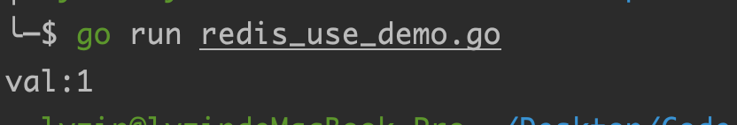
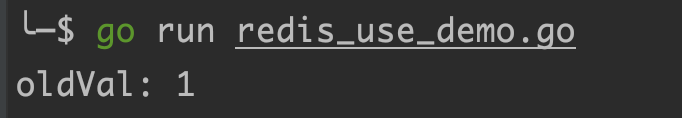
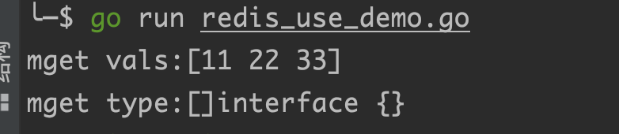
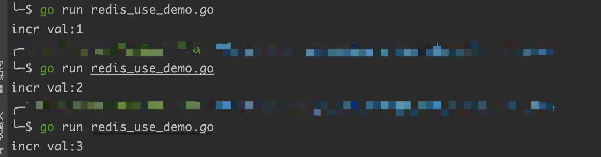
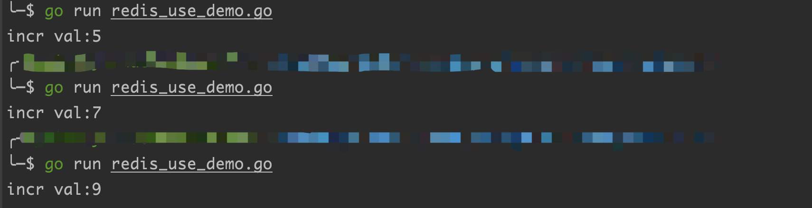
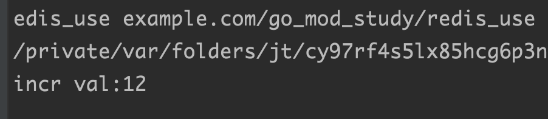

## 一、搭建Redis环境

> 前言：使用Docker 来搭建Redis环境
>
> 镜像官网：[https://hub.docker.com/_/redis](https://hub.docker.com/_/redis)

### 1. 创建redis容器

#### 1.1 创建redis容器命令

> 使用redis-cli客户端连接方式创建redis容器

```bash	
 # 创建redis容器
 docker run -idt --name redisly -p 6379:6379 redis
 
 # 命令参数解释
 -idt: i表示可以进行交互，t表示开启一个tty终端，d表示在后台运行容器
 --name: 表示自定义容器名，进入容器时可以使用该名字进入
 --rm: 表示创建redis容器时候，如果存在redis 、redis-cli先删除再创建
 -p: 表示将容器内端口映射到宿主机的端口
```

####  1.2 创建无密码redis容器


### 2. 连接redis服务端

#### 2.1 redis-cli命令介绍

> `redis`服务器可以通过`redis-cli`工具进行连接

```shell
// redis-cli --help 帮助文档
redis-cli 6.0.1

Usage: redis-cli [OPTIONS] [cmd [arg [arg ...]]]
  -h <hostname>      Server hostname (default: 127.0.0.1).
  -p <port>          Server port (default: 6379).
  -s <socket>        Server socket (overrides hostname and port).
  -a <password>      Password to use when connecting to the server.
                     You can also use the REDISCLI_AUTH environment
                     variable to pass this password more safely
                     (if both are used, this argument takes predecence).
  --user <username>  Used to send ACL style 'AUTH username pass'. Needs -a.
  --pass <password>  Alias of -a for consistency with the new --user option.
  --askpass          Force user to input password with mask from STDIN.
                     If this argument is used, '-a' and REDISCLI_AUTH
                     environment variable will be ignored.
  -u <uri>           Server URI.
  -r <repeat>        Execute specified command N times.
  -i <interval>      When -r is used, waits <interval> seconds per command.
                     It is possible to specify sub-second times like -i 0.1.
  -n <db>            Database number.
  -3                 Start session in RESP3 protocol mode.
  -x                 Read last argument from STDIN.
  -d <delimiter>     Multi-bulk delimiter in for raw formatting (default: \n).
  -c                 Enable cluster mode (follow -ASK and -MOVED redirections).
  --raw              Use raw formatting for replies (default when STDOUT is
                     not a tty).
  --no-raw           Force formatted output even when STDOUT is not a tty.
  --csv              Output in CSV format.
  --stat             Print rolling stats about server: mem, clients, ...
  --latency          Enter a special mode continuously sampling latency.
                     If you use this mode in an interactive session it runs
                     forever displaying real-time stats. Otherwise if --raw or
                     --csv is specified, or if you redirect the output to a non
                     TTY, it samples the latency for 1 second (you can use
                     -i to change the interval), then produces a single output
                     and exits.
  --latency-history  Like --latency but tracking latency changes over time.
                     Default time interval is 15 sec. Change it using -i.
  --latency-dist     Shows latency as a spectrum, requires xterm 256 colors.
                     Default time interval is 1 sec. Change it using -i.
  --lru-test <keys>  Simulate a cache workload with an 80-20 distribution.
  --replica          Simulate a replica showing commands received from the master.
  --rdb <filename>   Transfer an RDB dump from remote server to local file.
  --pipe             Transfer raw Redis protocol from stdin to server.
  --pipe-timeout <n> In --pipe mode, abort with error if after sending all data.
                     no reply is received within <n> seconds.
                     Default timeout: 30. Use 0 to wait forever.
  --bigkeys          Sample Redis keys looking for keys with many elements (complexity).
  --memkeys          Sample Redis keys looking for keys consuming a lot of memory.
  --memkeys-samples <n> Sample Redis keys looking for keys consuming a lot of memory.
                     And define number of key elements to sample
  --hotkeys          Sample Redis keys looking for hot keys.
                     only works when maxmemory-policy is *lfu.
  --scan             List all keys using the SCAN command.
  --pattern <pat>    Useful with --scan to specify a SCAN pattern.
  --intrinsic-latency <sec> Run a test to measure intrinsic system latency.
                     The test will run for the specified amount of seconds.
  --eval <file>      Send an EVAL command using the Lua script at <file>.
  --ldb              Used with --eval enable the Redis Lua debugger.
  --ldb-sync-mode    Like --ldb but uses the synchronous Lua debugger, in
                     this mode the server is blocked and script changes are
                     not rolled back from the server memory.
  --cluster <command> [args...] [opts...]
                     Cluster Manager command and arguments (see below).
  --verbose          Verbose mode.
  --no-auth-warning  Don't show warning message when using password on command
                     line interface.
  --help             Output this help and exit.
  --version          Output version and exit.

Cluster Manager Commands:
  Use --cluster help to list all available cluster manager commands.

Examples:
  cat /etc/passwd | redis-cli -x set mypasswd
  redis-cli get mypasswd
  redis-cli -r 100 lpush mylist x
  redis-cli -r 100 -i 1 info | grep used_memory_human:
  redis-cli --eval myscript.lua key1 key2 , arg1 arg2 arg3
  redis-cli --scan --pattern '*:12345*'

  (Note: when using --eval the comma separates KEYS[] from ARGV[] items)

When no command is given, redis-cli starts in interactive mode.
Type "help" in interactive mode for information on available commands
and settings.
```

#### 2.2 redis-cli连接redis服务端

```shell
# 连接命令，这个命令行工具是单独下载安装的
redis-cli -h 127.0.0.1
```


## 二、Redis介绍

> [redis菜鸟教程](https://www.runoob.com/redis/redis-intro.html)

### 1、Redis介绍

#### 1.1 Redis介绍

> redis是一个开源的内存数据库
>
> redis提供了多种不同类型的数据结构，很多业务场景下的问题都可以映照到这些数据类型上
>
> 通过复制、持久化、客户端分片等特性，可以很快捷的把Redis扩展成一个能包含数GB数据、处理百万级别的请求的系统

> redis应用场景
>
> - 缓存系统，减轻主数据库MYSQL压力
> - 计数场景，比如微博、抖音的关注数和粉丝数
> - 热门排行榜，需要排序的场景比较适合ZSET
> - 利用LIST可以实现队列功能

#### 1.2 Redis支持而数据结构

> 支持的数据类型
>
> - 字符串
> - 哈希
> - 列表
> - 集合
>
> - 带查询范围的排序集合
> - 位图
>

#### 1.3 Redis和Memcached区别

> Memcached的值只支持简单的字符串
>
> Redis支持更丰富的多种数据类型
>
> Redis性能比Memcached好的多
>
> Redis支持持久化
>
> Redis支持master/slave模式

## 三、Golang操作Redis

> https://www.bilibili.com/video/BV1FY411d7JF/?p=2&spm_id_from=333.1007.top_right_bar_window_history.content.click&vd_source=501c3f3a75e1512aa5b62c6a10d1550c

### 1、安装redis依赖库

> go使用第三方库`github.com/go-redis/redis`，是目前使用最多的库之一
>
> github地址：[https://github.com/go-redis/redis](https://redis.uptrace.dev/guide/go-redis.html)
>
> 官方文档地址：[https://redis.uptrace.dev/guide/go-redis.html](https://redis.uptrace.dev/guide/go-redis.html)

#### 1.1 查看redis服务的版本

```bash
127.0.0.1:6379> info Server
# Server
redis_version:6.2.4
redis_git_sha1:00000000
redis_git_dirty:0
```

#### 1.2 按redis版本安装依赖库

> 如果redis服务的版本是6，则需要安装go-redis的v8版本

```bash
# 终端执行
go get github.com/go-redis/redis/v8
```

> 如果redis服务的版本是7，则需要安装go-redis的v9版本

```bash
go get github.com/go-redis/redis/v9
```

#### 1.3、go操作redis的注意事项

> 导入时需要注意是v8版本的redis
>
> 在设置值，获取值时需要注意传入context上下文

#### 2.1 设置值和获取值

```go
package main

import (
	"context"
	"fmt"
	"github.com/go-redis/redis/v8"   // 注意这里导入的是v8版本的redis
	"time"
)

// 定义全局redis变量
var redisdb *redis.Client

func init() {
	redisdb = redis.NewClient(&redis.Options{
		Addr: "127.0.0.1:6379",
		Password: "",
		DB: 0,
	})
}

func main() {
	ctx := context.Background()
	
	key := "feet_sam"
	
	// 设置值
	err := redisdb.Set(ctx, key, "1", 3 * time.Second).Err()
	if err != nil {
		fmt.Printf("set %v error: %v\n", key, err)
		return
	}
	
	// 获取值
	val, valErr := redisdb.Get(ctx, key).Result()
	if valErr != nil {
		panic(valErr)
	}
	fmt.Printf("val:%v\n", val)
}
```




### 2、string类型操作

#### 2.1 Set方法

> 设置redis的key、value、过期时间
>
> Set方法的参数
>
> - ctx context.Context：需要传入上下文
> - key string：设置的redis的key
> - value interface{}：设置的redis的值
> - expiration time.Duration：设置redis的过期时间，传0表示永不过期，传入的类型是time.Duration

```go
package main

import (
	"context"
	"fmt"
	"github.com/go-redis/redis/v8"   // 注意这里导入的是v8版本的redis
	"time"
)

// 定义全局redis变量
var redisdb *redis.Client

func init() {
	redisdb = redis.NewClient(&redis.Options{
		Addr: "127.0.0.1:6379",
		Password: "",
		DB: 0,
	})
}

func main() {
	ctx := context.Background()
	
  key := "answer:record"
	
	// 设置值，表示60秒后过期
	err := redisdb.Set(ctx, key, "1123", 60 * time.Second).Err()
	if err != nil {
		fmt.Printf("set %v error: %v\n", key, err)
		return
	}
}
```

#### 2.2 Get方法

> 根据key获取值，使用result方法接收获取到的值，而且会返回一个err

```go
key := "answer:record"
// 获取值
val, err := redisdb.Get(ctx, key).Result()
if err != nil {
	fmt.Printf("获取 %v error: %v\n", key, err)
	return
}
fmt.Printf("获取[%v]的值: %v\n", key, val)
```


> 当传入的key在redis中不存在时，err的值：`redis: nil`

> 使用原生redis命令

```go
// 调用原生redis命令
key := "feet_sam"
res, _ := redisdb.Do(ctx, "get", key).Result()
fmt.Printf("do 方法获取值：%v\n", res.(string))
```

#### 2.3 GetSet方法

> 设置一个key的值，并返回这个key的旧值

```go
package main

import (
	"context"
	"fmt"
	"github.com/go-redis/redis/v8"
)

// 定义全局redis变量
var redisdb *redis.Client

func init() {
	redisdb = redis.NewClient(&redis.Options{
		Addr: "127.0.0.1:6379",
		Password: "",
		DB: 0,
	})
}

func main() {
	ctx := context.Background()
	
	key := "feet_sam"
	
	// 先设置一个值
	err := redisdb.Set(ctx, key, "1", 0).Err()
	if err != nil {
		fmt.Printf("set %v error: %v\n", key, err)
		return
	}
	
	// 设置一个新值，并且返回原来的旧值
	oldVal, _ := redisdb.GetSet(ctx, key, "new_1").Result()
	fmt.Printf("oldVal: %v\n", oldVal)
}
```



> 代码是先Set了`feet_name`这个key的值为`1`，然后使用GetSet设置了`feet_name`这个key的值为`new_1`,而且GetSet还返回了之前的旧值

#### 2.4 SetNX方法

> 如果key不存在，则设置这个key的值
>
> - 如果这个key之前存在，则返回值是false，并且不会设置新的值，此时key的值还是之前的值
> - 如果这个key之前不存在，则返回值是true

```go
	// 设置一个新值，并且返回原来的旧值
ok, err := redisdb.SetNX(ctx, key, "2", 0).Result()
if err != nil {
	fmt.Printf("SetNX %v error: %v\n", key, err)
	return
}
fmt.Printf("SetNX ok:%v\n", ok)
```

#### 2.5 MSet方法

> 批量设置值

```go
err := redisdb.MSet(ctx, "key1", 11, "key2", 22, "key3", 33).Err()
if err != nil {
	fmt.Printf("mset err:%v\n", err)
	return
}
```

#### 2.6 MGet方法

> 批量查询值

```go
package main

import (
	"context"
	"fmt"
	"github.com/go-redis/redis/v8"
	"time"
)

// 定义全局redis变量
var redisdb *redis.Client

func init() {
	redisdb = redis.NewClient(&redis.Options{
		Addr: "127.0.0.1:6379",
		Password: "",
		DB: 0, // 默认设置为0
	})
}

func main() {
	ctx := context.Background()
	
	key1 := "feet_name1"
	key2 := "feet_name2"
	key3 := "feet_name3"
	
	err := redisdb.MSet(ctx, key1, 11, key2, 22, key3, 33).Err()
	if err != nil {
		fmt.Printf("mset err:%v\n", err)
		return
	}
	
	// 批量获取值
	vals, err := redisdb.MGet(ctx, key1, key2, key3).Result()
	if err != nil {
		fmt.Printf("mget err:%v\n", err)
		return
	}
	fmt.Printf("mget vals:%v\n", vals)
	fmt.Printf("mget type:%T\n", vals)
}
```



> - 上述代码先批量设置了三个key，分别为key1、key2、key3
> - 然后使用MGet方法进行批量查询，并且返回值是一个空接口类型的切片

#### 2.7 Incr方法

> 对一个key的值进行递增，每次都自增1

```go
package main

import (
	"context"
	"fmt"
	"github.com/go-redis/redis/v8"
)

// 定义全局redis变量
var redisdb *redis.Client

func init() {
	redisdb = redis.NewClient(&redis.Options{
		Addr: "127.0.0.1:6379",
		Password: "",
		DB: 0,
	})
}


func main() {
	ctx := context.Background()
	
	// incr每次加1
	val, err := redisdb.Incr(ctx, "age_sam").Result()
	if err != nil{
		fmt.Printf("incr err:%v\n", err)
		return
	}
	fmt.Printf("incr val:%v\n", val)
	
}
```



> 从图中可以看到每次值都是+1

#### 2.8 IncrBy方法

> 递增的时候设置步长，表示每次递增多少，单位为正整数

```go
package main

import (
	"context"
	"fmt"
	"github.com/go-redis/redis/v8"
)

// 定义全局redis变量
var redisdb *redis.Client

func init() {
	redisdb = redis.NewClient(&redis.Options{
		Addr: "127.0.0.1:6379",
		Password: "",
		DB: 0,
	})
}

func main() {
	ctx := context.Background()
	
	// incrBy每次加2
	val, err := redisdb.IncrBy(ctx, "age_sam", 2).Result()
	if err != nil{
		fmt.Printf("incr err:%v\n", err)
		return
	}
	fmt.Printf("incr val:%v\n", val)
}
```



#### 2.9 IncrByFloat方法

> key的值每次新增的是一个浮点值

```go
package main

import (
	"context"
	"fmt"
	"github.com/go-redis/redis/v8"
)

// 定义全局redis变量
var redisdb *redis.Client

func init() {
	redisdb = redis.NewClient(&redis.Options{
		Addr: "127.0.0.1:6379",
		Password: "",
		DB: 0,
	})
}

func main() {
	ctx := context.Background()
	
	// IncrByFloat每次加0.5
	val, err := redisdb.IncrByFloat(ctx, "age_sam", 0.5).Result()
	if err != nil{
		fmt.Printf("incr err:%v\n", err)
		return
	}
	fmt.Printf("incr val:%v\n", val)
}
```



#### 2.10 Decr方法

> 对一个key的值进行递减操作

```go
package main

import (
	"context"
	"fmt"
	"github.com/go-redis/redis/v8"
)

// 定义全局redis变量
var redisdb *redis.Client

func init() {
	redisdb = redis.NewClient(&redis.Options{
		Addr: "127.0.0.1:6379",
		Password: "",
		DB: 0,
	})
}


func main() {
	ctx := context.Background()
	
	// Decr递减
	val, err := redisdb.Decr(ctx, "age_sam").Result()
	if err != nil{
		fmt.Printf("incr err:%v\n", err)
		return
	}
	fmt.Printf("incr val:%v\n", val)
}
```

#### 2.11 DecrBy方法

> 按多少进行递减，并且是可以一直递减到负值的

```go
package main

import (
	"context"
	"fmt"
	"github.com/go-redis/redis/v8"
)

// 定义全局redis变量
var redisdb *redis.Client

func init() {
	redisdb = redis.NewClient(&redis.Options{
		Addr: "127.0.0.1:6379",
		Password: "",
		DB: 0,
	})
}


func main() {
	ctx := context.Background()
	
	// DecrBy递减
	val, err := redisdb.DecrBy(ctx, "age_sam", 2).Result()
	if err != nil{
		fmt.Printf("incr err:%v\n", err)
		return
	}
	fmt.Printf("incr val:%v\n", val)
}
```

#### 2.12 Del方法

> 删除key操作，并且支持批量删除
>
> - key存在删除，可以进行删除动作
> - key不存在删除，也可以进行删除动作

```go
package main

import (
	"context"
	"fmt"
	"github.com/go-redis/redis/v8"
)

// 定义全局redis变量
var redisdb *redis.Client

func init() {
	redisdb = redis.NewClient(&redis.Options{
		Addr: "127.0.0.1:6379",
		Password: "",
		DB: 0,
	})
}


func main() {
	ctx := context.Background()
	
	// del单个删除
	val, err := redisdb.Del(ctx, "age_sam").Result()
	if err != nil{
		fmt.Printf("del err:%v\n", err)
		return
	}
	fmt.Printf("del val:%v\n", val)
	
	multiDelVal, multErr := redisdb.Del(ctx, "feet_name1", "feet_name2", "feet_name3s").Result()
	if multErr != nil{
		fmt.Printf("del multi err:%v\n", multErr)
		return
	}
	fmt.Printf("del multi val:%v\n", multiDelVal)
}
```

#### 2.13 Expire方法

> 重新设置key的过期时间

```go
package main

import (
	"context"
	"fmt"
	"github.com/go-redis/redis/v8"
	"time"
)

// 定义全局redis变量
var redisdb *redis.Client

func init() {
	redisdb = redis.NewClient(&redis.Options{
		Addr: "127.0.0.1:6379",
		Password: "",
		DB: 0,
	})
}


func main() {
	ctx := context.Background()
	
	// 设置过期时间，比如10秒后过期
	err := redisdb.Expire(ctx, "feet_name", 10 * time.Second).Err()
	if err != nil{
		fmt.Printf("del err:%v\n", err)
		return
	}
	
}
```

### 3、hash类型操作

#### 3.1 HSet方法

> 根据key和字段名设置字段名的值

```go
```

