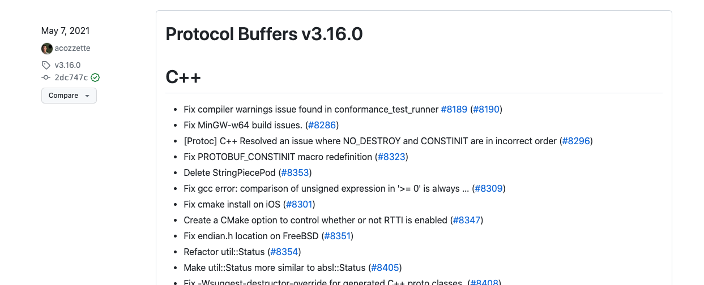

## 一、RPC协议

> [https://www.jianshu.com/p/5ade587dbc58](https://www.jianshu.com/p/5ade587dbc58)
>
> [https://zhuanlan.zhihu.com/p/506415782](https://zhuanlan.zhihu.com/p/506415782)
>
> [https://www.cnblogs.com/wongbingming/p/11086773.html](https://www.cnblogs.com/wongbingming/p/11086773.html)
>
> [https://zhuanlan.zhihu.com/p/524902149](https://zhuanlan.zhihu.com/p/524902149)

### 1、RPC概念

> RPC（Remote Procedure Call Protocol）是远程过程调用的缩写，通俗的说就是调用远处服务器的一个函数，与之相对应的是本地函数调用
>
> PRC的理解：
>
> - 想调用本地函数一样，去调用远程服务器上的函数
> - 进程间通信–应用层协议(http协议同层)，底层使用TCP实现

> 一般调用函数时，最常见的就是本地调用和RPC调用，下面就来说说二者的区别

### 2、本地调用

> 当在本地调用代码时，就是定义函数，然后函数名()调用
>
> 下面代码：
>
> - 先定义了一个`useError`函数
> - 然后在main函数中调用
> - 这是在本地调用的方式

```go
package main

import (
	"example.com/studygo/cerror"
	"fmt"
)

func useError(x, y uint8) (uint8, error) {
	if x < 10 {
		err := cerror.New("x小于0", "2022-08-08")
		return 0, err
	}
	return x + y, nil
}

func main() {
	u1, err := useError(9, 12)
	fmt.Printf("u1:%v ,u1 type:%T\n", u1, u1)
	fmt.Printf("err:%v ,err type:%T\n", err, err.Error())
}
```


> - 本地过程调用发生在同一进程中的，所以可以正常调用
> - 但是我们无法直接在另一个构建的程序直接调用上面代码中的`userError`函数，因为它们是两个程序，内存空间是相互隔离的

### 3、RPC调用

> RPC调用解决了什么问题
>
> - 为了解决类似远程、跨内存空间、的函数/方法调用
> - 比起以往的通过HTTP的Restful-API风格调用，使用RPC能够让我们调用远程方法像调用本地方法一样无差别
>     - 基于RESTful风格的API通常是基于HTTP协议，传输数据采用JSON等文本协议
>     - RPC可以使用TCP协议，传输数据采用二进制协议来说，相比RESTful的API来说性能会更好

> 实现RPC的步骤以及办法
>
> - 确定要执行的函数？ 
>     - 在本地调用中，函数主体通过函数指针函数指定，然后调用对应的函数，编译器通过函数指针函数自动确定被调用函数在内存中的位置。
>     - 在 RPC 中，调用不能通过函数指针完成，因为它们的内存地址可能完全不同。
>         - 调用方和被调用方都需要维护一个{ function <-> ID }映射表，以确保调用正确的函数。
> - 如何传递调用的参数？ 
>     - 本地过程调用中传递的参数是通过堆栈内存结构实现的
>     - RPC不能直接使用内存传递参数，因此参数或返回值需要在传输期间序列化并转换成字节流，因为网络传输都是使用的二进制格式，所以需要序列化或反序列化
> - 如何进行网络传输？ 
>     - 函数的调用方和被调用方通常是通过网络连接的
>     - function ID 和序列化字节流需要通过网络传输
>         - 只要能完成调用，调用方和被调用方就不受现有特定网络协议的限制。
>         - 比如有的RPC框架使用TCP协议，有的的使用HTTP协议

#### 3.1 rpc包实现rpc调用步骤

> go语言内置的net/rpc包可以通过网络导出一个需要被远程调用的对象方法
>
> - 编写一个需要被远程调用的对象方法
>     - 所以导出对象和对象方法都需要首字母大写
> - rpc服务器注册一个对象，暴露到外部网络可见，并且服务名称就是被导出的对象类型的名称
> - 接着对象的导出方法就可以支持远程调用访问

#### 3.2 rpc代码调用示例

##### 3.2.1 rpc服务端代码

```go
package main

import (
	"fmt"
	"net"
	"net/rpc"
)

// 定义导出对象结构体
type SayHiService struct{}

// 定义导出对象的方法，建议定义为指针接收者
func (s *SayHiService) SayGreet(sayStr string, reply *string) error {
	fmt.Printf("我说啦：:%v\n", sayStr)
	*reply = "你好呀，" + sayStr
	return nil
}

func main() {
  RpcSayHiService := new(SayHiService)
  
  // 注册rpc服务
	_ = rpc.Register(RpcSayHiService)
  
  // 使用TCP协议s
	listener, err := net.Listen("tcp", ":1234")
	if err != nil {
		fmt.Printf("listen tcp rpc err:%v\n", err)
	}
	conn, err := listener.Accept()
	fmt.Printf("conn==>:%v\n", conn)
	if err != nil {
		fmt.Printf("conn rpc err:%v\n", err)
	}
	rpc.ServeConn(conn)
}
```

##### 3.2.2 rpc客户端代码

```go
package main

import (
	"fmt"
	"net/rpc"
)

func main() {
	address := "127.0.0.1:1234"
  
  // 与服务端使用tcp建立链接
	client, err := rpc.Dial("tcp", address)
	if err != nil {
		fmt.Printf("client dial err:%v\n", err)
		return
	}
	
  // 同步调用服务端函数
	var reply string
	sayStr := "忠实的仆人"
	err = client.Call("SayHiService.SayGreet", sayStr, &reply)
	if err != nil {
		fmt.Printf("client call err:%v\n", err)
		return
	}
	fmt.Printf("reply val:%v\n", reply)
}
```

### 4、RPC原理图

> 下图来自李文周老师博客


> 1. 服务调用方（client）以本地调用方式调用服务；
> 2. client stub接收到调用后负责将方法、参数等组装成能够进行网络传输的消息体；
> 3. client stub找到服务地址，并将消息发送到服务端；
> 4. server 端接收到消息；
> 5. server stub收到消息后进行解码；
> 6. server stub根据解码结果调用本地的服务；
> 7. 本地服务执行并将结果返回给server stub；
> 8. server stub将返回结果打包成能够进行网络传输的消息体；
> 9. 按地址将消息发送至调用方；
> 10. client 端接收到消息；
> 11. client stub收到消息并进行解码；
> 12. 调用方得到最终结果
>
> 使用RPC框架的目标是只需要关心第1步和最后1步，中间的其他步骤统统封装起来，让使用者无需关心。例如社区中各式RPC框架（grpc、thrift等）就是为了让RPC调用更方便。

## 二、gRPC框架

> 从第一章可以看出来go内置的rpc包就可以实现rpc功能，不过go社区提供了比较成熟的RPC框架，来简化平时使用RPC的一些步骤，后面的章节来学习理解gRPC框架

### 1、gRPC是什么

> gRPC官网：[https://grpc.io/docs/what-is-grpc/introduction/](https://grpc.io/docs/what-is-grpc/introduction/)

> 从gRPC官网介绍可以得知gRPC是做什么用的？
>
> - 在gRPC中，客户端应用程序可以直接调用不同机器上的服务器应用程序的方法，就像它是一个本地对象一样，使你更容易创建分布式应用程序和服务。
> - 就像许多RPC系统一样，gRPC是围绕着定义服务(Interface Definition Language)的想法，指定可以远程调用的方法及其参数和返回类型。
> - 在服务器端，服务器实现这个接口并运行gRPC服务器来处理客户端的调用。
> - 在客户端，客户端有一个存根（在某些语言中被称为只是一个客户端），提供与服务器相同的方法。

> gRPC客户端和服务器可以在各种环境中运行并相互交谈--从谷歌内部的服务器到你自己的桌面--并且可以用gRPC支持的任何语言编写。
>
> 因此，举例来说，你可以很容易地用Java创建一个gRPC服务器，客户端用Go、Python或Ruby。
>
> 此外最新的谷歌API将有gRPC版本的接口，让你轻松地在你的应用程序中建立谷歌功能。


> 上图来自gRPC官网，从上图可以看出：
>
> - 客户端（gRPC Stub）在自己的程序中调用某个函数或者方法，此时发起了RPC调用
>     - 对请求信息使用Protobuf进行对象序列化压缩
> - 服务端（gRPC Server）收到请求信息以后，解码请求体，进行业务逻辑处理并返回
>     - 对响应结果使用Protobuf进行对象序列化压缩
> - 客户端接收到服务端响应结果后，解码请求体。
>     - 回调被调用的A方法，唤醒正在被等待响应（阻塞）的客户端调用并返回响应结果

### 2、Protobuf介绍

> 在`gRPC是什么`这一小节中，反复提到Protobuf这个名词，那Protobuf是什么？gRPC与Protobuf的关系是什么？如何使用Protobuf？是我们接下来需要探讨的事情

#### 2.1 Protobuf是什么

> Protobuf官网：[https://protobuf.dev/overview/](https://protobuf.dev/overview/)

> Protobuf介绍
>
> - Protocol Buffers是一种语言中立、平台中立的可扩展机制，用于序列化结构化数据
>
> - Protocol Buffers提供了一种语言中立、平台中立、可扩展的机制，用于以向前兼容和向后兼容的方式序列化结构化数据。
>
> - 它就像JSON，只是它更小、更快，而且能生成本地语言绑定。
>
> - 你只需定义一次你希望你的数据如何被结构化，然后你就可以使用特殊生成的源代码，轻松地从各种数据流和使用各种语言写入和读取你的结构化数据。
> - Protocol Buffers是定义语言（在.proto文件中创建）、proto编译器生成的与数据接口的代码、特定语言的运行库以及写入文件（或通过网络连接发送）的数据的序列化格式的组合

> Protobuf解决了什么问题？
>
> - Protocol Buffers为大小不超过几兆字节的类型化、结构化数据包提供了一种序列化格式，该格式适用于短暂的网络通信和长期的数据存储。
> - Protocol Buffers可以用新的信息进行扩展，而不会使现有的数据失效或需要更新代码。
> - Protocol Buffers是谷歌最常使用的数据格式。它们被广泛用于服务器间的通信以及磁盘上的数据存档存储。
> - Protocol Buffers的信息和服务由工程师编写的.proto文件描述。

> Protobuf的作用与特点
>
> - Protocol Buffers是任何需要以语言中立、平台中立、可扩展的方式序列化结构化、类似记录、类型化数据的情况的理想选择。它们最常被用于定义通信协议（与gRPC一起）和数据存储。
> - 使用Protocol Buffers的一些优点包括：
>     - 紧凑的数据存储
>     - 快速解析
>     - 在许多编程语言中可用
>         - Dart、Go、C++、C#、Java、Kotlin、Objective-C、PHP、Python、Ruby
>         - 由于Dart和Go语言是谷歌公司出品的语言，所以这两个语言的protoc编译器是由谷歌公司维护的
>         - 本笔记只探讨Go语言，这里是Go语言的编译器插件：[https://github.com/protocolbuffers/protobuf-go](https://github.com/protocolbuffers/protobuf-go)
>     - 通过自动生成的类来优化功能
>     - 跨语言的兼容性
>     - 用任何支持的编程语言编写的代码都可以读取相同的信息。
>         - 你可以让一个平台上的Java程序从一个软件系统中捕获数据，根据.proto定义将其序列化，然后在另一个平台上运行的单独的Python应用程序中从该序列化数据中提取特定值

> 对于Protobuf的介绍先到这里，需要更详细的信息可以查看Protobuf官网

#### 2.2 gRPC与Protobuf关系

> 默认情况下，gRPC使用谷歌成熟的开源机制Protocol Buffers来序列化结构化数据（尽管它也可以用于其他数据格式，如JSON）
>
> 这就说明gRPC使用的是Protobuf进行序列化数据的，那么就需要熟悉对Protobuf的使用

#### 2.3 Protobuf编译器安装

> protobuf编译器的作用，就是根据定义的.proto文件，编译出对应编程语言的代码文件
>
> protobuf官方安装参考文档：[https://grpc.io/docs/protoc-installation/](https://grpc.io/docs/protoc-installation/)
>
> 如果按照上述文档安装，我们无法安装想要的protobuf指定版本，那么就需要去下载指定版本的protobuf，然后放置到自己电脑的PATH中
>
> 编写此文档时，protobuf编译器使用的版本是`v3.20.0`
>
> 下载地址在github中找到：[https://github.com/protocolbuffers/protobuf/releases](https://github.com/protocolbuffers/protobuf/releases)



> 在下载地址页面下载适合你平台的预编译好的二进制文件（`protoc-<version>-<platform>.zip`），下面是不同版本的解释

| 版本                                                         | 说明                                                         |
| ------------------------------------------------------------ | ------------------------------------------------------------ |
| [protobuf-all-3.20.0.zip](https://github.com/protocolbuffers/protobuf/releases/download/v3.20.0/protobuf-all-3.20.0.zip) | 这是未编译成可执行的protobuf二进制程序的源文件，一般不选择这个 |
| [protoc-3.20.0-osx-aarch_64.zip](https://github.com/protocolbuffers/protobuf/releases/download/v3.20.0/protoc-3.20.0-osx-aarch_64.zip) | 适用于Mac ARM 64位系统，可执行的protobuf二进制程序           |
| [protoc-3.20.0-osx-x86_64.zip](https://github.com/protocolbuffers/protobuf/releases/download/v3.20.0/protoc-3.20.0-osx-x86_64.zip) | 适用于Mac Intel 64位系统，可执行的protobuf二进制程序         |
| [protoc-3.20.0-win64.zip](https://github.com/protocolbuffers/protobuf/releases/download/v3.20.0/protoc-3.20.0-win64.zip) | 适用Windows 64位系统，可执行的protobuf二进制程序             |
| [protoc-3.20.0-linux-x86_64.zip](https://github.com/protocolbuffers/protobuf/releases/download/v3.20.0/protoc-3.20.0-linux-x86_64.zip) | 适用Linux 64位系统，可执行的protobuf二进制程序               |

> 编写此文档时使用的macos系统，电脑芯片是Intel的，所以选择`protoc-3.20.0-osx-x86_64.zip`这个版本
>
> 下载上面版本以后，解压并配置bin目录到环境变量中，查看protoc的版本


#### 2.4 Protobuf语法版本

> 官方的建议：
>
> - 虽然Protocol Buffers已经向开源用户提供了一段时间，但官方的大多数例子都使用了Protocol Buffers第3版（proto3），它的语法稍微简化，有一些有用的新功能，并支持更多的语言。
> - Proto3目前有Java、C++、Dart、Python、Objective-C、C#、一个ite-runtime（Android Java）、Ruby和JavaScript版本，来自protocol buffers GitHub repo，以及来自golang/protobuf官方软件包的Go语言生成器，还有更多语言正在开发中。
> - 可以在proto3语言指南和每种语言的参考文档中找到更多信息。参考文档还包括一个.proto文件格式的正式规范
> - 一般来说，虽然可以使用proto2（目前默认的Protocol Buffers），但官方建议使用proto3与gRPC，因为它可以让你使用全部的gRPC支持的语言，以及避免proto2客户端与proto3服务器之间的兼容性问题。

### 3、Protobuf语法

> 下面文档来自proto3版本语法文档：[https://protobuf.dev/programming-guides/proto3/](https://protobuf.dev/programming-guides/proto3/)

#### 3.1 首行语法

> 下面是官方提供的第一个示例，定义一个消息类型

```protobuf
syntax = "proto3";

message SearchRequest {
  string query = 1;
  int32 page_number = 2;
  int32 result_per_page = 3
}
```

> 需要注意：
>
> - 文件的第一行指定使用的是proto3语法，如果不这样做，Protocol Buffers编译器会认为你使用的是proto2
> - 第一行指定语法必须是文件中第一行非空的、非注释的行
> - 每一句都以英文的`;`结束

#### 3.3 注释语法

> 在`.proto` 文件中, 使用C/C++-风格的`//`and`/* ... */`语法来表示注释

```protobuf
syntax = "proto3";

/*
	这是多行注释
*/

// 定义一个消息
message SearchRequest {
  string query = 1;
  int32 page_number = 2;
  int32 result_per_page = 3
}
```

#### 3.2 message介绍

```protobuf
syntax = "proto3";

message SearchRequest {
  string query = 1;
  int32 page_number = 2;
  int32 result_per_page = 3
}
```

> 从上面代码可以看出
>
> - 指定了三个字段（名称与值对）每个字段代表你想在这种类型的消息中包含的数据
> - 每个字段都有一个名称和一个类型。可以看到query变量的类型是一个字符串，page_number和result_per_page类型是整型

#### 3.x Proto变量类型与Go变量类型

> 在.proto文件中消息类型声明的变量类型与go语言对应的消息类型是有映射规则的，下面是最常用的几个类型的映射
>
> 注意：
>
> - 在官方文档中对应proto变量类型未找到int类型的说明，所以暂时先理解为proto定义整型时不支持int类型

| **.proto中类型** | **Go中类型** |
| :--------------: | :----------: |
|      int32       |    int32     |
|      int64       |    int64     |
|       bool       |     bool     |
|      string      |    string    |
|      bytes       |   []bytes    |
|      float       |   float32    |
|      double      |   float64    |

#### 3.x Protobuf变量的默认值

> proto文件中声明的变量默认值和Go里面不同变量类型的默认值类似
>
> - 对于string，默认值是空字符串
> - 对于bytes，默认值是空字节
> - 对于bool，默认值是false
> - 对于int32、int64等整型类型，默认值是零


