## 一、air包

### 1、air介绍

> air包可以用来热加载项目，而不用每次修改完代码以后重启项目，只要项目文件有修改，air会监听文件是否有修改，有修改的话就会自动重新编译运行
>
> air特点：
>
> - 彩色的日志输出
> - 自定义构建或必要的命令
> - 支持外部子目录
> - 在 Air 启动之后，允许监听新创建的路径
> - 更棒的构建过程
>
> 下图来自[官方介绍](https://github.com/cosmtrek/air)

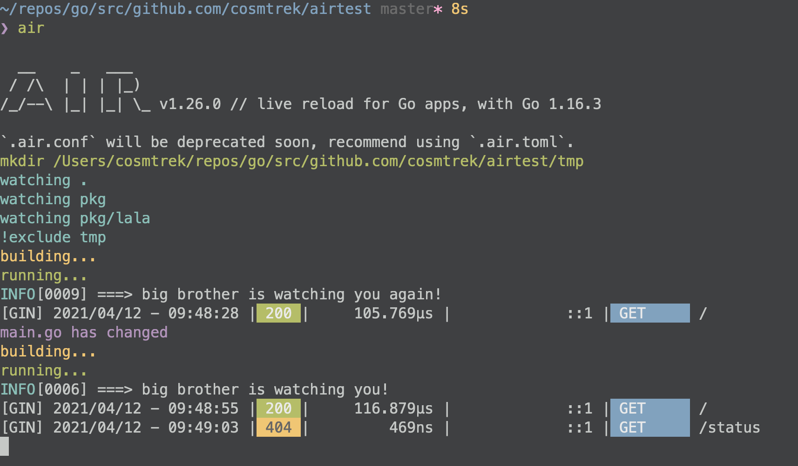

### 2、air安装

> 前提要在环境变量中设置`GOPATH`，因为下面两种方式都会安装在`GOPATH`目录下的bin目录中
>
> 如果没有设置`GOPATH`，那么下面两种方式安装完以后，在命令行输入`air`，会出现`air`命令未找到的错误

> 下图是GOPATH设置方式，mac中如果安装了iterm2，则需要修改的配置文件是`~/.zshrc`

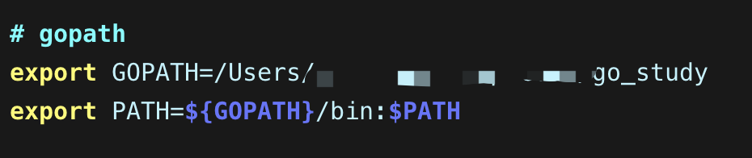

#### 2.1 使用go install(个人推荐)

> 使用Go的版本为1.16或更高

```bash
go install github.com/cosmtrek/air@latest
```

#### 2.2 使用install.sh(官方推荐)

> 安装的binary文件会存在目录`GOPATH/bin/air`

```bash
curl -sSfL https://raw.githubusercontent.com/cosmtrek/air/master/install.sh | sh -s -- -b $(go env GOPATH)/bin
```

### 3、air如何使用

1、首先，进入你的项目文件夹

```
cd /path/to/your_project
```

2、最简单的方法是执行air命令

```
# 优先在当前路径查找 `.air.toml` 后缀的文件，如果没有找到，则使用默认的
air -c .air.toml
```

您可以运行以下命令初始化，把默认配置添加到当前路径下的`.air.toml` 文件。

```
air init
```

4、在这之后，你只需执行 `air` 命令，无需添加额外的变量，它就能使用 `.air.toml` 文件中的配置了。

```
air
```

5、下图是air启动后的样例

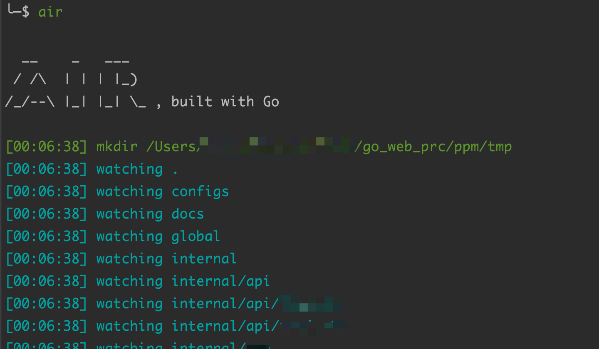

6、air的debug模式会输出更详细信息，air使用`-d`命令

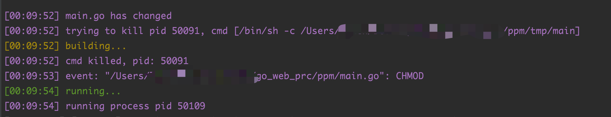

### 4、air内容模板

#### 4.1 官方模板

> 下图是官方提供的模板内容

```toml
# Config file for [Air](https://github.com/cosmtrek/air) in TOML format

# Working directory
# . or absolute path, please note that the directories following must be under root.
root = "."
tmp_dir = "tmp"

[build]
# Just plain old shell command. You could use `make` as well.
cmd = "go build -o ./tmp/main ."
# Binary file yields from `cmd`.
bin = "tmp/main"
# Customize binary, can setup environment variables when run your app.
full_bin = "APP_ENV=dev APP_USER=air ./tmp/main"
# Watch these filename extensions.
include_ext = ["go", "tpl", "tmpl", "html"]
# Ignore these filename extensions or directories.
exclude_dir = ["assets", "tmp", "vendor", "frontend/node_modules"]
# Watch these directories if you specified.
include_dir = []
# Watch these files.
include_file = []
# Exclude files.
exclude_file = []
# Exclude specific regular expressions.
exclude_regex = ["_test\\.go"]
# Exclude unchanged files.
exclude_unchanged = true
# Follow symlink for directories
follow_symlink = true
# This log file places in your tmp_dir.
log = "air.log"
# It's not necessary to trigger build each time file changes if it's too frequent.
delay = 0 # ms
# Stop running old binary when build errors occur.
stop_on_error = true
# Send Interrupt signal before killing process (windows does not support this feature)
send_interrupt = false
# Delay after sending Interrupt signal
kill_delay = 500 # ms
# Add additional arguments when running binary (bin/full_bin). Will run './tmp/main hello world'.
args_bin = ["hello", "world"]

[log]
# Show log time
time = false

[color]
# Customize each part's color. If no color found, use the raw app log.
main = "magenta"
watcher = "cyan"
build = "yellow"
runner = "green"

[misc]
# Delete tmp directory on exit
clean_on_exit = true
```

#### 4.2 七米老师的模板

> 下面是七米老师提供的air的模板内容[中文版本](https://www.liwenzhou.com/posts/Go/live_reload_with_air/)

```toml
# [Air](https://github.com/cosmtrek/air) TOML 格式的配置文件

# 工作目录
# 使用 . 或绝对路径，请注意 `tmp_dir` 目录必须在 `root` 目录下
root = "."
tmp_dir = "tmp"

[build]
# 只需要写你平常编译使用的shell命令。你也可以使用 `make`
# Windows平台示例: cmd = "go build -o tmp\main.exe ."
cmd = "go build -o ./tmp/main ."
# 由`cmd`命令得到的二进制文件名
# Windows平台示例：bin = "tmp\main.exe"
bin = "tmp/main"
# 自定义执行程序的命令，可以添加额外的编译标识例如添加 GIN_MODE=release
# Windows平台示例：full_bin = "tmp\main.exe"
full_bin = "APP_ENV=dev APP_USER=air ./tmp/main"
# 监听以下文件扩展名的文件.
include_ext = ["go", "tpl", "tmpl", "html"]
# 忽略这些文件扩展名或目录
exclude_dir = ["assets", "tmp", "vendor", "frontend/node_modules"]
# 监听以下指定目录的文件
include_dir = []
# 排除以下文件
exclude_file = []
# 如果文件更改过于频繁，则没有必要在每次更改时都触发构建。可以设置触发构建的延迟时间
delay = 1000 # ms
# 发生构建错误时，停止运行旧的二进制文件。
stop_on_error = true
# air的日志文件名，该日志文件放置在你的`tmp_dir`中
log = "air_errors.log"

[log]
# 显示日志时间
time = true

[color]
# 自定义每个部分显示的颜色。如果找不到颜色，使用原始的应用程序日志。
main = "magenta"
watcher = "cyan"
build = "yellow"
runner = "green"

[misc]
# 退出时删除tmp目录
clean_on_exit = true
```

## 二、net/http包

> 

### 1、net包介绍

## 三、time包

> 时间概念解释

> **GMT**：Greenwich Mean Time [[1\]
>
> 格林威治标准时间 ; 英国伦敦格林威治定为0°经线开始的地方，地球每15°经度 被分为一个时区，共分为24个时区，相邻时区相差一小时；例: 中国北京位于东八区，GMT时间比北京时间慢8小时。

> **UTC**: Coordinated Universal Time
>
> 世界协调时间；经严谨计算得到的时间，精确到秒，误差在0.9s以内， 是比GMT更为精确的世界时间

> **DST**: Daylight Saving Time
>
> 夏季节约时间，即夏令时；是为了利用夏天充足的光照而将时间调早一个小时，北美、欧洲的许多国家实行夏令时；

> **CST**:
>
> 四个不同时区的缩写：
>
> 1. Central Standard Time (USA) UT-6:00   美国标准时间
> 2. Central Standard Time (Australia) UT+9:30  澳大利亚标准时间
> 3. China Standard Time UT+8:00     中国标准时间
> 4. Cuba Standard Time UT-4:00     古巴标准时间

### 1、获取当前时间

> 用来表示时间，可以通过`time.Now()`函数获取本地的时间(东八区)，以及年、月、日等对象信息

```go
/*
  @Author: lyzin
    @Date: 2022/02/17 22:51
    @File: basic_study
    @Desc: 
*/
package main

import (
	"fmt"
	"time"
)

func main() {
	now := time.Now()
	fmt.Printf("now:%v\n", now) // now:2022-02-20 22:00:21.9037896 +0800 CST m=+0.002991401
	year := now.Year()
	fmt.Printf("year:%v\n", year) 
	
	month := now.Month()
	fmt.Printf("month:%v\n", month)
	
	day := now.Day()
	fmt.Printf("day:%v\n", day)
	
	hour := now.Hour()
	fmt.Printf("hour:%v\n", hour)
	
	minute := now.Minute()
	fmt.Printf("minute:%v\n", minute)
	
	second := now.Second()
	fmt.Printf("second:%v\n", second)
}
```

### 2、获取时间戳

> 时间戳是最长用的一个时间格式
>
> 表示从1970年至当前时间的总毫秒数，被称为`unix时间戳`
>
> 使用`now.Unix()`获取当前时间戳

```go
/*
  @Author: lyzin
    @Date: 2022/02/17 22:51
    @File: basic_study
    @Desc: 
*/
package main

import (
	"fmt"
	"time"
)

func main() {
	now := time.Now()
	// 秒时间戳
	timeStamp1 := now.Unix()
	fmt.Printf("timeStamp1:%v\n", timeStamp1)

	// 毫秒时间戳
	timeStamp2 := (now.Unix()) * 1000
	fmt.Printf("timeStamp2:%v\n", timeStamp2)
	
	// 纳秒时间戳
	timeStamp3 := now.UnixNano()
	fmt.Printf("timeStamp3:%v\n", timeStamp3)
}
```

### 3、时间间隔常量

> `time`包可以用来快速获取一个时间的常量
>
> 时间间隔只有时、分、秒，没有天、年、日

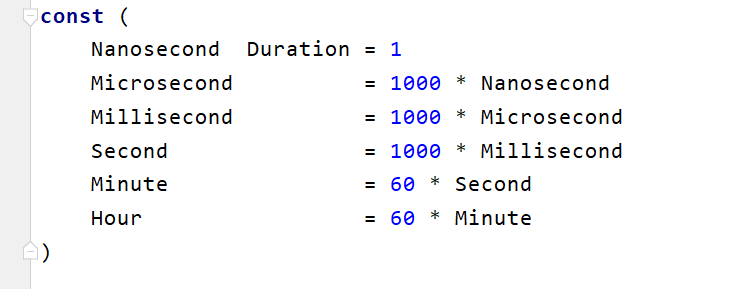

```go
/*
  @Author: lyzin
    @Date: 2022/02/17 22:51
    @File: basic_study
    @Desc: 
*/
package main

import (
	"fmt"
	"time"
)

func main() {
	// 时间间隔秒数, 1秒
	sec := time.Second
	fmt.Printf("sec:%v\n", sec) // 1s

	// 时间间隔分, 1分
	min := time.Minute
	fmt.Printf("min:%v\n", min) // 1m0s

	// 时间间隔小时, 1小时
	hour := time.Hour
	fmt.Printf("hour:%v\n", hour) // 1h0m0s
}
```

#### 3.1 时间后延Add

> 时间可以往后延续
>
> `now.Add()`函数传参里就是对应的时间数，可以是时分秒

```go
/*
  @Author: lyzin
    @Date: 2022/02/17 22:51
    @File: basic_study
    @Desc: 
*/
package main

import (
	"fmt"
	"time"
)

func main() {
	// 时间间隔小时, 1小时
	hour := time.Hour
	fmt.Printf("hour:%v\n", hour) // 1h0m0s

	// 24小时以后，需要先拿到当前时间，再去当前时间的基础上再添加
	now := time.Now()
	afterTime := now.Add(24 * (time.Hour))
	fmt.Printf("afterTime:%v\n", afterTime)
}
```

#### 3.2 时间格式化

##### 3.2.1 当前时间转换为字符串时间

> `go`语言中使用时间模块的`Format`进行格式化，但是不是常见的`%Y-%m-%d %X`，而是用`20061234`来表示，因为`go`语言诞生于2006年1月2号15点04分
>
> 时间格式化是将时间对象转换为字符串类型时间

```go
// 于常见格式对比
Y   		m		d		H		M		S
2006		1		2		3		4		5

// 15:04:05表示24小时计时法
// 03:04:05表示12小时计时法，可以添加AM/PM用来表示上午或下午
```

```go
/*
  @Author: lyzin
    @Date: 2022/02/17 22:51
    @File: basic_study
    @Desc: 
*/
package main

import (
	"fmt"
	"time"
)

func main() {
	// 当前时间
	now := time.Now()

	// 格式化时间
	str1 := now.Format("2006-01-02 03:04")
	fmt.Printf("str1:%v\n", str1)

	// 15:04:05表示24小时计时法
	// 03:04:05表示12小时计时法，可以添加AM/PM用来表示上午或下午
	str2 := now.Format("2006/01/02 15:04:05")
	fmt.Printf("str2:%v\n", str2)
}
```

##### 3.2.2 字符串时间转换为时间戳(parse/ParseInLocation)

> `time.Parse()` 按照对应的格式解析字符串类型的时间，再转换为时间戳
>
> `Parse`函数：
>
> - 解析一个格式化的时间字符串并返回它代表的时间
> - 如果缺少表示时区的信息，Parse会将时区设置为UTC
>     - 当解析具有时区缩写的时间字符串时，如果该时区缩写具有已定义的时间偏移量，会使用该偏移量。如果时区缩写是"UTC"，会将该时间视为UTC时间，不考虑Location

```go
/*
  @Author: lyzin
    @Date: 2022/02/17 22:51
    @File: basic_study
    @Desc: 
*/
package main

import (
	"fmt"
	"time"
)

func main() {
	// timeObj 是返回了字符串类型的时间格式
	timeObj, err := time.Parse("2006-01-02", "2010-10-10")
	if err != nil {
		fmt.Printf("parse time failed:%v\n", err)
	}
	fmt.Printf("timeObj:%v\n", timeObj) // 2010-10-10 00:00:00 +0000 UTC
	fmt.Printf("timeObj:%v\n", timeObj.Unix()) // 1286668800
}
```

> `time.ParseInLocation()`和`time.Parse()`的区别
>
> - 第一，当缺少时区信息时，Parse将时间解释为UTC时间，而ParseInLocation将返回值的Location设置为loc，即作为本地的时区
> - 第二，当时间字符串提供了时区偏移量信息时，Parse会尝试去匹配本地时区，而ParseInLocation会去匹配loc

```go
// ParseInLocation源码
func ParseInLocation(layout, value string, loc *Location) (Time, error)

/* 
	layout: 布局;安排，用来指定时间的格式
	 value: 需要转换的时间字符串
		 loc: 指定时区
*/
```

> 下面代码可以看出来:
>
> - `Parse`函数转换出来的时区是`+0000 UTC`时间，不是东八区
> - `time.LoadLocation`先加载时区，再将获取的时区值传递给`ParseInLocation`函数，这样转换出来的就是东八区时间

```go
package main

import (
	"fmt"
	"time"
)

func main() {
	nowTime := time.Now()
	fmt.Printf("nowTime:%v\n\n", nowTime)
	
	// 手动指定一个时间，计算差值
	specTime := "2019-12-22 12:12:12"
	specTimeFmt, _ := time.Parse("2006-01-02 15:04:05", specTime)
	
	// 可以看到specTimeFmt:2022-02-22 13:12:12 +0000 UTC， 默认不是东八区时间
	fmt.Printf("specTimeFmt:%v\n", specTimeFmt)
	
	// 先加载时区，东八区
	loc, _ := time.LoadLocation("Asia/ShangHai")
	
	// 再将时区传递给ParseInLoaction函数，这样转换出来的时间格式时区也是东八区
	specTimeFmtNew, _ := time.ParseInLocation("2006-01-02 15:04:05", specTime, loc)
	fmt.Printf("\nspecTimeFmtNew:%v\n", specTimeFmtNew)
}
```

##### 3.2.3 时间戳转换为字符串时间

> 使用`time.Unix(时间戳, 0)`转为字符串可读的时间格式
>
> - `0`表示一个标志位
> - `time.Unix()`函数返回的对象继续可以调用`Format`函数进行时间格式化

```go
/*
  @Author: lyzin
    @Date: 2022/02/17 22:51
    @File: basic_study
    @Desc: 
*/
package main

import (
	"fmt"
	"time"
)

func main() {
	// 当前时间
	now := time.Now()

	// 时间戳
	timeStamp1 := now.Unix()
	fmt.Printf("timeStamp1:%v\n", timeStamp1)

	// 时间戳转换为字符串时间
	cu := time.Unix(timeStamp1, 0)
	fmt.Printf("cu:%v\n", cu) // 2022-02-20 22:50:47 +0800 CST

	// cu对象继续调用Format方法进行格式化时间
	fcu := cu.Format("2006/01/02 15:04:05")
	fmt.Printf("fcu:%v\n", fcu) // 2022/02/20 22:50:47
}
```

### 4、time.Sleep

> 下面是`Sleep`的源码

```go
// Sleep源码
// Sleep pauses the current goroutine for at least the duration d.
// A negative or zero duration causes Sleep to return immediately.
func Sleep(d Duration)

// Duration源码
// A Duration represents the elapsed time between two instants
// as an int64 nanosecond count. The representation limits the
// largest representable duration to approximately 290 years.
type Duration int64

const (
	minDuration Duration = -1 << 63
	maxDuration Duration = 1<<63 - 1
)
```

> 从源码可以看出来，Sleep函数需要传入的形参类型是`Duration`，所以不能将一个`int`类型的变量传给它，需要进行转换
>
> 直接在`Sleep()`函数里只写数字，表示单位是`纳秒`

```go
/*
  @Author: lyzin
    @Date: 2022/02/17 22:51
    @File: basic_study
    @Desc: 
*/
package main

import (
	"fmt"
	"time"
)

func main() {
	// 时间间隔
	n := 5
	// 不能直接给Sleep里传入time.Sleep(n)，需要先进行类型转换
	// 下面是休息了5s
	fmt.Printf("5s前开始了:%v\n", time.Now())
	time.Sleep(time.Duration(n) * time.Second)
	fmt.Printf("5s后结束了:%v\n", time.Now())

	fmt.Printf("3s前开始了:%v\n", time.Now())
	time.Sleep(3 * time.Second)
	fmt.Printf("3s后结束了:%v\n", time.Now())
}

```

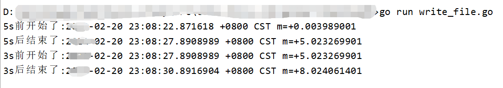

### 5、时间差Sub

> 利用`Sub`函数可以快速计算出两个时间的差值
>
> 需要注意的是，`Sub`时，开始时间、结束时间的时区一定要一致

```go
时间差值 := 结束时间.Sub(开始时间)
```

```go
	nowTime := time.Now()
	fmt.Printf("nowTime:%v\n", nowTime)
	
	// 今天和两天后的时间差
	dt := afterTime.Sub(nowTime)
	fmt.Printf("dt:%v\n", dt)
```

## 四、filepath包

> 文档地址：[https://pkg.go.dev/path/filepath](https://pkg.go.dev/path/filepath)

## 五、os包

> [os包](https://pkg.go.dev/os)提供了操作系统函数的不依赖平台的接口。设计为Unix风格的，虽然错误处理是go风格的；失败的调用会返回错误值而非错误码。
>
> 通常错误值里包含更多信息:
>
> - 例如，如果某个使用一个文件名的调用（如Open、Stat）失败了，打印错误时会包含该文件名，错误类型将为*PathError，其内部可以解包获得更多信息。
> - os包的接口规定为在所有操作系统中都是一致的。非公用的属性可以从操作系统特定的[syscall](http://godoc.org/syscall)包获取。

## 六、类型转换常用方法与包

> Go语言中可以对基础数据类型与字符串之间进行相互转换

### 1、string方法

> string是go的内置方法，不需要引包，直接调用即可
>
> string方法不能将数字转换为string
>
> - 下面代码里因为string会拿着传进来的数字根据utf-8编码去找97对应的符号了，所以是a

```go
package main

import (
	"fmt"
)

func main() {
	i := int32(97)

	// string方法不能将数字转换为string，因为string会拿着传进来的数字根据utf-8编码去找97对应的符号了，所以是a
	ret := string(i)
	fmt.Printf("ret=%v\n", ret) // "a"

	
}
```

### 2、fmt包

> fmt.Sprintf支持类型转换，比如：转换数字为string

```go
package main

import (
	"fmt"
)

func main() {
	i := int32(97)
	// fmt.Sprintf转换数字为string
	ret1 := fmt.Sprintf("%d", i)
	fmt.Printf("ret1 = %#v\n", ret1) // "97"
}
```

### 3、strconv包

> strconv包实现了基本数据类型和其(其是指基本数据类型)字符串之间的相互转换

#### 3.1 ParseInt字符串转数字

> 使用`ParseInt`方法进行转换，返回的值的类型都是`int64`
>
> - 需要注意的是，`ParseInt`方法里的`bitSize`如果指定为了32位，返回结果是int64，那么可以用int32再把结果从int64强制转换为int32，这样结果精度就不会丢
> - 当bitSize为0时，表示是int类型

```go
// ParseInt interprets a string s in the given base (0, 2 to 36) and
// bit size (0 to 64) and returns the corresponding value i.
// ParseInt在给定的base（0，2到36）和 bit 大小（0到64）中解释一个字符串s，并返回相应的值i。
// 位数（0-64），并返回相应的值i。
// The string may begin with a leading sign: "+" or "-".
// 字符串可以以一个前导符号开始。"+"或"-"。
// If the base argument is 0, the true base is implied by the string's
// prefix following the sign (if present): 2 for "0b", 8 for "0" or "0o",
// 16 for "0x", and 10 otherwise. Also, for argument base 0 only,
// underscore characters are permitted as defined by the Go syntax for
// integer literals.
// 如果基数参数为0，则真正的基数是由字符串的
// 符号后面的前缀（如果存在）：2代表 "0b"，8代表 "0 "或 "0o"。
// 16代表 "0x"，否则就是10。另外，仅对参数base 0而言。
// 允许使用下划线字符，这是由Go的语法定义的
// 整数字元。
// The bitSize argument specifies the integer type
// that the result must fit into. Bit sizes 0, 8, 16, 32, and 64
// correspond to int, int8, int16, int32, and int64.
// If bitSize is below 0 or above 64, an error is returned.
// 比特尺寸参数指定了结果必须符合的整数类型。
// 结果必须符合的整数类型。比特大小为0、8、16、32和64
// 对应于int、int8、int16、int32和int64。
// 如果bitSize低于0或高于64，将返回一个错误。
// The errors that ParseInt returns have concrete type *NumError
// and include err.Num = s. If s is empty or contains invalid
// digits, err.Err = ErrSyntax and the returned value is 0;
// if the value corresponding to s cannot be represented by a
// signed integer of the given size, err.Err = ErrRange and the
// returned value is the maximum magnitude integer of the
// appropriate bitSize and sign.
// ParseInt返回的错误有具体类型*NumError
// 如果s是空的或者包含无效的数字，err.Er就会返回错误。
// err.Err = ErrSyntax，返回值为0。
// 如果对应于s的值不能由给定的有符号整数表示
// 如果s对应的值不能由给定大小的有符号整数表示，err.Err = ErrRange，返回值为0。
// err.Err = ErrRange，并且返回值是最大量级的整数。
// 适当的bitSize和符号。
func ParseInt(s string, base int, bitSize int) (i int64, err error) {
	const fnParseInt = "ParseInt"

	if s == "" {
		return 0, syntaxError(fnParseInt, s)
	}

	// Pick off leading sign.
	s0 := s
	neg := false
	if s[0] == '+' {
		s = s[1:]
	} else if s[0] == '-' {
		neg = true
		s = s[1:]
	}

	// Convert unsigned and check range.
	var un uint64
	un, err = ParseUint(s, base, bitSize)
	if err != nil && err.(*NumError).Err != ErrRange {
		err.(*NumError).Func = fnParseInt
		err.(*NumError).Num = s0
		return 0, err
	}

	if bitSize == 0 {
		bitSize = IntSize
	}

	cutoff := uint64(1 << uint(bitSize-1))
	if !neg && un >= cutoff {
		return int64(cutoff - 1), rangeError(fnParseInt, s0)
	}
	if neg && un > cutoff {
		return -int64(cutoff), rangeError(fnParseInt, s0)
	}
	n := int64(un)
	if neg {
		n = -n
	}
	return n, nil
}

```

```go
package main

import (
	"fmt"
	"strconv"
)

// strconv
func main() {
	// 从字符串中解析对应的数字数据，字符串不能有非数字的字符
	str := "100"
    
    // str是需要转换的字符串
    // 10表示转换成10进制
    // 64表示结果必须符合的整数类型，也就是10进制的64位
	ret, err := strconv.ParseInt(str, 10, 64)
	if err != nil {
		fmt.Printf("转换失败:%v\n", err)
		return
	}
	fmt.Printf("ret=%v ret type=%T\n", ret, ret)
}

/* 
	执行结果
	ret=100 ret type=int64
*/
```

> 注意字符串里面不能有非数字的字符，否则会报错

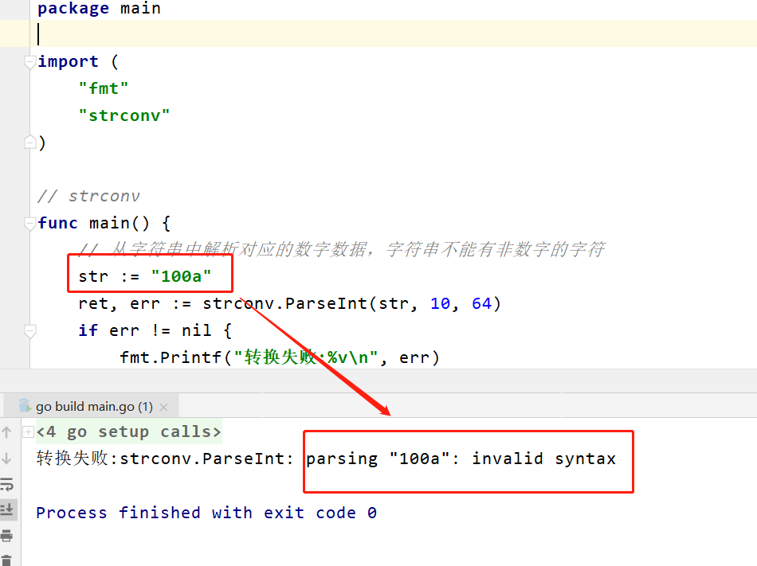

#### 3.2 ParseBool字符串布尔值转成布尔值

> `ParseBool`将字符串的布尔值转为真正的布尔值

```go
package main

import (
	"fmt"
	"strconv"
)

// strconv
func main() {
	// 从字符串中解析对应的数字数据，字符串不能有非数字的字符
	s := "true"
	ret, _ := strconv.ParseBool(s)
	fmt.Printf("ret=%v ret_type=%T\n", ret, ret)
}
```

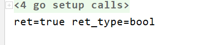

#### 3.4 ParseFloat字符串浮点型转为浮点型

> `ParseFloat`需要传入`bitSize`

```go
package main

import (
	"fmt"
	"strconv"
)

// strconv
func main() {
	// 从字符串中解析对应的数字数据，字符串不能有非数字的字符
	s := "3.1415"
	ret, _ := strconv.ParseFloat(s, 64)
	fmt.Printf("ret=%v ret_type=%T\n", ret, ret)
}
```

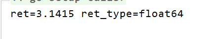

#### 3.5 Atoi字符串转数字

> strconv包里有个`Atoi`方法，专门用来将字符串转换为数字
>
> - `A`表示字符串
>     - 因为Go语言是从C语言发展出来，C语言中没有字符串，只有字符，A是字符的数组，所以A用来表示字符串
> - `i`表示int整型

```go
package main

import (
	"fmt"
	"strconv"
)

// strconv
func main() {
	// 从字符串中解析对应的数字数据，字符串不能有非数字的字符
	str := "100"
	ret, err := strconv.Atoi(str)
	if err != nil {
		fmt.Printf("转换失败:%v\n", err)
		return
	}
	fmt.Printf("ret=%v ret_type=%T\n", ret, ret)
}
```

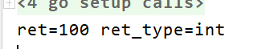


#### 3.6 ItoA数字转字符串

> 将数字转换为字符串，只有一个返回值，没有err返回

```go
package main

import (
	"fmt"
	"strconv"
)

// strconv
func main() {
	// 从字符串中解析对应的数字数据，字符串不能有非数字的字符
	s := 100
	ret := strconv.Itoa(s)
	fmt.Printf("ret=%v ret_type=%T\n", ret, ret)
}
```

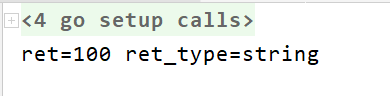

## 七、rand包

> rand模块可以用来生成随机数，是`math`包里的`rand`方法
>
> 注意：
>
> - 生成随机数时，需要有一个种子，否则每次生成的随机数都是一样的

```go
// rand源码
// Intn returns, as an int, a non-negative pseudo-random number in the half-open interval [0,n)
// from the default Source.
// It panics if n <= 0.
func Intn(n int) int { return globalRand.Intn(n) }

// Intn用来生成一个整数的随机数，从代码注释来看是属于：左包含右不包含
```

### 1、生成随机整数

```go
package main

import (
	"fmt"
	"math/rand"
	"time"
)

func getRandNum() int {
	// 种子为了每次生成的随机数不一样，否则会出现每次运行得到的随机数都是一样的
	rand.Seed(time.Now().UnixNano())
	randNum := rand.Intn(19)
	return randNum
}

func getRandEleBySlice(a []int) int {
	if len(a) == 0 {
		panic("input slice is empty")
	}
	
	// 获取随机数
	// 种子为了每次生成的随机数不一样，否则会出现每次运行得到的随机数都是一样的
	rand.Seed(time.Now().UnixNano())
	randEle := rand.Intn(len(a))
	return a[randEle]
}

func main() {
	randNum := getRandNum()
	fmt.Printf("randNum: %v\n", randNum)
	
	a := []int{1,2,3,4}
	randEle := getRandEleBySlice(a)
	fmt.Printf("a=%v\n", randEle)
}
```

### 2、猜数字案例

```go
package main

import (
	"fmt"
	"math/rand"
	"os"
	"time"
)

func getRandNum() int {
	// 种子为了每次生成的随机数不一样，否则会出现每次运行得到的随机数都是一样的
	rand.Seed(time.Now().UnixNano())
	randNum := rand.Intn(10)
	return randNum
}

func guessNumGame() {
	// 生成一个随机数
	guessNum := getRandNum()
	ops := 3
	fmt.Printf("请猜一个0-10的数字，只有%v次机会~\n", ops)
	for i := 1; i <= ops; i++ {
		fmt.Printf(">>>第%d次猜数字<<<\n", i)
	
		var inputNum int
		fmt.Print("请猜一个数字:")
		fmt.Scan(&inputNum)
		
		if inputNum > 10 {
			fmt.Println("输入的数字不在0-10之间")
		} else if inputNum > guessNum {
			fmt.Println("猜大了")
		} else if inputNum < guessNum {
			fmt.Println("猜小了")
		} else {
			fmt.Println("猜对了，随机数是:", guessNum)
			os.Exit(1)
		}
		if i >= ops {
			fmt.Printf("%v次机会已经用完~\n", ops)
			os.Exit(1)
		}
	}
}

func main() {
	// 猜数字
	guessNumGame()
}
```

## 八、go doc

> https://www.kancloud.cn/cattong/go_command_tutorial/261351
>
> - 常用来查看当前go文件的文档
>
>
> - godoc可以快速查看对应模块的文档
