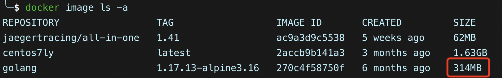
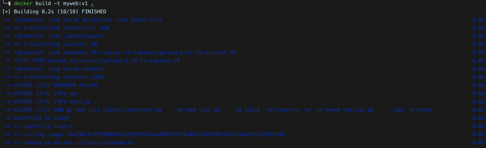
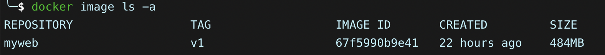
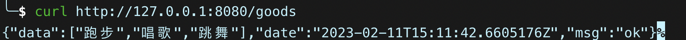
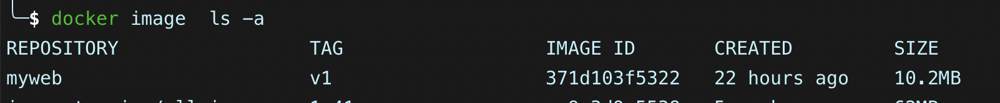

## 一、构建Go应用docker镜像

### 1、go官方镜像介绍

> go官方提供了官方镜像方便我们去构建go镜像，地址：[https://hub.docker.com/_/golang](https://hub.docker.com/_/golang)
>
> 主要有三种镜像版本可供我们选择
>
> - `golang:<version>`:当不确定你的需求是什么，你可能想使用这个镜像
> - `golang:<version>-alpine`：精简版的go镜像，可以构建出更小体积的go应用镜像
> - `golang:<version>-windowsservercore`：服务于windows平台的构建镜像

### 2、构建镜像选择

> 我们可以选择不同go版本的镜像作为基础镜像进而构建出属于我们自己的go应用镜像
>
> 下文全部采用`golang:1.17.13-alpine3.16`作为基础镜像

```bash
# 拉取镜像
docker pull golang:1.17.13-alpine3.16
```

> 从下图可以看出`golang:1.17.13-alpine3.16`镜像大小为314M



### 3、初次构建web应用镜像

> 下面是自行编写的docker镜像，采用了`golang:1.17.13-alpine3.16`作为了基础镜像，来构建web应用

> 下面是`main.go`的代码，提供了一个`/goods/`接口输出响应

```go
package main

import (
	"context"
	"github.com/gin-gonic/gin"
	"log"
	"net/http"
	"os"
	"os/signal"
	"time"
)

func main() {
	router := gin.Default()
	router.GET("/goods", func(c *gin.Context) {
		c.JSON(http.StatusOK, gin.H{
			"msg":  "ok",
			"data": []string{"跑步", "唱歌", "跳舞"},
			"date": time.Now(),
		})
	})

	srv := &http.Server{
		Addr:    ":8080",
		Handler: router,
	}

	go func() {
		// 服务连接
		if err := srv.ListenAndServe(); err != nil && err != http.ErrServerClosed {
			log.Fatalf("listen: %s\n", err)
		}
	}()

	// 等待中断信号以优雅地关闭服务器（设置 5 秒的超时时间）
	quit := make(chan os.Signal)
	signal.Notify(quit, os.Interrupt)
	<-quit
	log.Println("Shutdown Server ...")

	ctx, cancel := context.WithTimeout(context.Background(), 5*time.Second)
	defer cancel()
	if err := srv.Shutdown(ctx); err != nil {
		log.Fatal("Server Shutdown:", err)
	}
	log.Println("Server exiting")
}
```

> 下面是构建web应用的dockerfile内容，对于其中的几个关键点进行下解释
>
> - ENV GOPROXY https://goproxy.cn,direct
>     - 设置go国内的代理，方便拉取依赖，否则同步下载项目依赖很慢
> - go mod
>     - 开启`go mod模式`来管理项目依赖
>
> - upx
>     - upx是一种先进的可执行文件压缩工具，对于可执行程序可以有效减少体积，这里我们将构建出来go应用的体积再次压缩减少体积，这里不对upx进行过多介绍，详细可见：[upx官网](https://github.com/upx/upx)
> - -ldflags="-s -w"
>     - go build时忽略符号表和调试信息，进而减少go应用体积
>     - -s 忽略符号表和调试信息
>     - -w 忽略DWARFv3调试信息，将无法使用gdb进行调试
> - CMD ["./myweb"]
>     - 表示基于此镜像启动的容器会自动执行go build的`myweb`可执行程序，也就是将我们的web应用启动起来了

```dockerfile
FROM golang:1.17.13-alpine3.16

WORKDIR /build

ENV GOPROXY https://goproxy.cn,direct
COPY upx .
COPY main.go .

RUN go mod init github.com/myweb && \
    go mod tidy && \
    go build -ldflags="-s -w" -o myweb main.go && \
    ./upx -9 myweb

CMD ["./myweb"]
```

```bash
# 开始构建镜像
docker build -t myweb:v1 .
```





> 可以看到构建出来的镜像比较大，达到了484MB，基于构建出来的myweb镜像启动一个容器来使用

```bash
docker run -itd --name myweb -p 8080:8080 myweb:v1
```



> 可以看到服务正常启动了

### 4、瘦身构建web应用镜像

> 从第3步构建出web应用来看，构建出来myweb的镜像还是比较大的，那么在后续传输或构建的时候比较占用资源，那么如何优化镜像的大小呢？
>
> - 使用docker的多阶段构建：
>     - 在`golang:1.17.13-alpine3.16`这个基础镜像中只做构建web应用但是不执行`CMD ["./myweb"]`
>     - 将构建出来的`myweb`应用复制到`alpine`镜像中来构建最终myweb的镜像

> 为什么上面的办法可以？
>
> - 这里需要用到docker的多阶段构建知识
>     - Docker 17.05版本以后，官方就提供了一个新的特性：`Multi-stage builds`（多阶段构建）
>     - 使用多阶段构建，可以在一个 `Dockerfile` 中使用多个 FROM 语句。每个 FROM 指令都可以使用不同的基础镜像，并表示开始一个新的构建阶段。最终构建出来的镜像以最后一次的FROM镜像为准
> - Alpine镜像
>     - Alpine Linux是一个超轻量级的发行版，大小大约5M左右，特别适合作为构建体积小应用的基础镜像

```dockerfile
# 引用golang:1.17.13-alpine3.16构建出myweb的可执行程序
FROM golang:1.17.13-alpine3.16 AS builder

WORKDIR /build

ENV GOPROXY https://goproxy.cn,direct
COPY upx .
COPY main.go .

RUN go mod init github.com/myweb && \
    go mod tidy && \
    go build -ldflags="-s -w" -o myweb main.go && \
    ./upx -9 myweb

# 将上一部构建出来的myweb放到alpine中执行
FROM alpine:latest

WORKDIR /root/
RUN  apk add tzdata && \
     cp /usr/share/zoneinfo/Asia/Shanghai /etc/localtime && \
     echo "Asia/Shanghai" > /etc/timezone && \
     apk del tzdata

COPY --from=builder /build/myweb .

CMD ["./myweb"]
```

> 继续执行构建镜像命令

```bash
# 开始构建镜像，构建出
docker build -t myweb:v1 .
```

> 查看构建出来的镜像大小，从第三步的`484MB`直接减少到了`10.2MB`，体积减少了将近`98%`，这个瘦身的量是非常可观的



> 基于构建出来的不到11M的镜像启动容器，然后访问`/goods/`接口返回的响应正常


> 至此到这里就达成了go应用构建的镜像的瘦身

