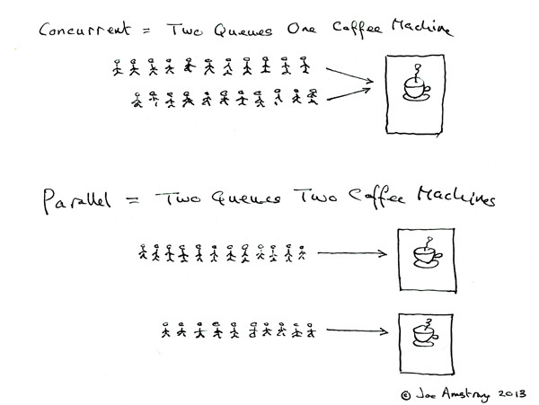

> https://geektutu.com/post/geeorm-day1.html

## 一、并发编程

> `go`天生支持并发，所以并发编程很重要，需要好好理解

### 1、并发和并行

> 相关参考资料：
>
> [https://laike9m.com/blog/huan-zai-yi-huo-bing-fa-he-bing-xing,61/](https://laike9m.com/blog/huan-zai-yi-huo-bing-fa-he-bing-xing,61/)
>
> [https://zhuanlan.zhihu.com/p/145587728](https://zhuanlan.zhihu.com/p/145587728)

> - 并发(Concurrency)
>     - 并发是同时发生
>         - 并行指物理上同时执行
>         - 并发的字面意思指的是线程同时开始执行这个事件，后续的执行是串行，还是并行，不确定，依赖于底层的硬件条件和操作系统的调度
>     - 并发的“发”
>         - 这里的发是指，如果有多个线程，都会同一时间先启动，但是线程里内容先不执行，会根据操作系统调度去交替执行
> - 并行(Parallelism)
>     - 并行就是同时执行
>         - 并行是指线程同时执行这个过程
>         - 并发指能够让多个任务在逻辑上交织执行的程序设计
> - 注意：
>     - 并发和并行都必须是多线程的
>     - 如果这些线程可以被同时执行(执行线程的步骤)，这叫并行
>     - 如果这些线程可以同时启动，但没有同时执行(执行线程的步骤)，这叫并发



> 上图是Erlang之父画的并发、并行的简单理解图
>
> - 并发
>     - 两个队列**`交替`**使用一个咖啡机
> - 并行
>     - 两个队列**`同时`**使用两个咖啡机
> - 注意
>     - 一个队列对应一个任务(线程)，队列的每个人对应任务的步骤
>     - 并发要处理的任务必须是可分步骤、任务数量大于等于2的
>     - 并行要处理的任务必须是多个处理器(也就是图中的多个咖啡机)

### 2、进程、线程、协程

> 进程（process）：程序在操作系统中的一次执行过程，系统进行资源分配和调度的一个独立单位。
>
> 线程（thread）：操作系统基于进程开启的轻量级进程，是操作系统调度执行的最小单位。
>
> 协程（coroutine）：非操作系统提供而是由用户自行创建和控制的用户态‘线程’，比线程更轻量级。

## 二、goroutine

> Go语言中的并发程序主要是通过基于CSP（communicating sequential processes）的goroutine和channel来实现，当然也支持使用传统的多线程共享内存的并发方式。

### 1、goroutine介绍

> Goroutine是Go语言支持并发的核心
>
> - 在go语言中可以**`同时`**创建N个goroutine，非常的简单方便
> - Goroutine介绍
>     - 一个goroutine会以很小的生命周期开始，一般只有2KB
>     - 和操作系统调度线程不同，操作系统是由系统内核调度的，而goroutine是由go在运行时(runtime)调度的
>     - go在运行时，会进行操作系统资源分配，会把m个goroutine合理地分配给n个操作系统线程，实现m:n的调度机制
>     - 开发人员不需要为go在代码层面维护一个线程池
> - Goroutine的特点
>     - Goroutine 是Go程序中最基本的并发执行单元
>     - 每一个程序都至少包含一个goroutine，也就是main函数的（main goroutine），当go程序创建时，它会默认创建
>     - go语言不需要自己单独写进程、线程、协程，只需要利用goroutine就可以实现并发
>     - 当需要多个任务并发执行的时候，把任务包装成一个函数，然后开启goroutine去执行，就实现了并发

### 2、Go关键字开启gouroutine

> Go语言中使用goroutine非常简单，只需要在函数或方法调用前加上`go`关键字就可以创建一个goroutine
>
> 从而让该函数或方法（结构体里的定义的函数就叫方法）在新创建的goroutine中执行，而不是在`main goroutine`中执行

```go
# go 关键字创建goroutine
package main

import (
	"fmt"
	"time"
)

func addData(x int) {
	fmt.Printf("x = %v\n", x)
}

// main程序启动以后，会创建一个主goroutine去执行
func main(){
	x := 33
	// go关键字单独开启一个goroutine去执行addData函数
	go addData(x)
	fmt.Printf("this is main func")
}
```

> 执行以后会发现，并没有将addData函数里的Printf内容输出
>
> 为什么没有呢？
>
> - go addData(x)表示开启了一个goroutine，但是此时只是刚开启，就好比是刚刚把通道打开了，但是里面的内容还没进去执行
> - 此时代码继续往下走，执行`fmt.Printf("this is main func")`表示main函数结束了，由main函数启动的goroutine就结束了，此时整个函数就执行完毕了，所以就来不及执行`addData`里的printf内容
>
> 可以用`time.Sleep(time.Second)`这样等待`go addData()`启动并执行完毕，再执行main函数里`printf`语句，这样就可以看到`addData`函数里的输出了

```go
package main

import (
	"fmt"
	"time"
)

func addData(x int) {
	fmt.Printf("x = %v\n", x)
}

func main(){
	x := 33
	// go关键字单独开启一个goroutine去执行addData函数
	go addData(x)
  
  // 使用sleep强制等待新开的goroutine执行完毕，再执行下面的代码
	time.Sleep(time.Second)
	fmt.Printf("this is main func")
}
```


### 3、for启动goroutine(闭包)

> 上面的都是开启一个goroutine去执行代码，但是我们可以使用for循环开启很多个goroutine

```go
package main

import (
	"fmt"
	"time"
)

func main(){
	for i := 0; i<10; i++{
		// go关键字单独开启一个goroutine去执行匿名函数
		go func() {
			fmt.Println(i)
		}()
	}
	time.Sleep(time.Second)
	fmt.Printf("this is main func")
}
```


> 从执行结果来看，并不是我们预期的想要的输出1到10，而是输出了`8 10`这些数字
>
> 为什么会这样呢？
>
> - 从for循环里的`go`关键字后面的匿名函数来看，里面打印了for循环里的`i`变量，对于一个函数内部的变量从函数外部拿，这就是`闭包`
> - 由于for循环很快，所以开启10个goroutine的时候，for循环已经执行完了，那么最后传递给匿名函数里的`i`可能是for循环的最后一个10，或者是中间的某一个，所以就出现了上图的结果
>     - 这里也反映出了启动goroutine是需要一定时间的，因为从for循环来看，先启动了10个goroutine，才开始执行goroutine里面匿名函数里的打印`i`功能，而且输出到终端也需要时间，那么就表示了goroutine是都先启动，再执行里面任务，此时的时间差for循环已经执行结束了，最后的i是10，所以就会出现了上面的结果
>     - 如果goroutine能里面启动，立马执行，就不会有这样的问题
>     - 并不是启动一个就输出展示一个

### 4、for启动goroutine(传参)

> 从3.2.1里可以看出，`for`循环启动多个goroutine时，采用闭包传参，会出现多个`goroutine`接收到的参数值都是一样，这样就不符合我们的需求，所以需要给传参
>
> 从下面代码可以看出，走传参形式给goroutine，那么循环一个就给一个值到goroutine中，这样每次循环的值都会被传到启动的goroutine中，这样就不会有问题

```go
package main

import (
	"fmt"
	"time"
)

func main() {
	for i := 0; i < 10; i++ {
		go func(i int) {
			fmt.Printf("i=%v\n", i)
		}(i)
	}
	fmt.Println("main run done!")
	time.Sleep((time.Second) * 2)
}
```


> 但是仔细观察上面的代码，使用了`time.Sleep`来等待for循环启动的goroutine执行完，十分的不可控，也不优雅

### 5、sync.WaitGroup

> 使用`sync.WaitGroup`来实现goroutine的同步：
>
> - sync.WaitGroup是用来创建等待组
>
> - 从源码可以看到WaitGroup不能被拷贝，因为里面是计数器，如果拷贝了，那计数器的值就不一致了，因为WaitGroup是结构体，结构体是值类型，值类型不像指针类型，指针类型可以保持值一致

```go
// A WaitGroup waits for a collection of goroutines to finish.
// The main goroutine calls Add to set the number of
// goroutines to wait for. Then each of the goroutines
// runs and calls Done when finished. At the same time,
// Wait can be used to block until all goroutines have finished.
//
// A WaitGroup must not be copied after first use.
type WaitGroup struct {
	noCopy noCopy

	// 64-bit value: high 32 bits are counter, low 32 bits are waiter count.
	// 64-bit atomic operations require 64-bit alignment, but 32-bit
	// compilers do not ensure it. So we allocate 12 bytes and then use
	// the aligned 8 bytes in them as state, and the other 4 as storage
	// for the sema.
	state1 [3]uint32
}
```

> 涉及到的sync.WaitGroup三个方法，Add()、Wait()、Done()

> - wg.Add()
>     - 要启动多少个goroutine，就添加多少个计数器，可以一次性加好，也可以在循环里每次挨个加1

```go
// Add adds delta, which may be negative, to the WaitGroup counter.
// If the counter becomes zero, all goroutines blocked on Wait are released.
// If the counter goes negative, Add panics.
//
// Note that calls with a positive delta that occur when the counter is zero
// must happen before a Wait. Calls with a negative delta, or calls with a
// positive delta that start when the counter is greater than zero, may happen
// at any time.
// Typically this means the calls to Add should execute before the statement
// creating the goroutine or other event to be waited for.
// If a WaitGroup is reused to wait for several independent sets of events,
// new Add calls must happen after all previous Wait calls have returned.
// See the WaitGroup example.
func (wg *WaitGroup) Add(delta int) {
	statep, semap := wg.state()
	if race.Enabled {
		_ = *statep // trigger nil deref early
		if delta < 0 {
			// Synchronize decrements with Wait.
			race.ReleaseMerge(unsafe.Pointer(wg))
		}
		race.Disable()
		defer race.Enable()
	}
	state := atomic.AddUint64(statep, uint64(delta)<<32)
	v := int32(state >> 32)
	w := uint32(state)
	if race.Enabled && delta > 0 && v == int32(delta) {
		// The first increment must be synchronized with Wait.
		// Need to model this as a read, because there can be
		// several concurrent wg.counter transitions from 0.
		race.Read(unsafe.Pointer(semap))
	}
	if v < 0 {
		panic("sync: negative WaitGroup counter")
	}
	if w != 0 && delta > 0 && v == int32(delta) {
		panic("sync: WaitGroup misuse: Add called concurrently with Wait")
	}
	if v > 0 || w == 0 {
		return
	}
	// This goroutine has set counter to 0 when waiters > 0.
	// Now there can't be concurrent mutations of state:
	// - Adds must not happen concurrently with Wait,
	// - Wait does not increment waiters if it sees counter == 0.
	// Still do a cheap sanity check to detect WaitGroup misuse.
	if *statep != state {
		panic("sync: WaitGroup misuse: Add called concurrently with Wait")
	}
	// Reset waiters count to 0.
	*statep = 0
	for ; w != 0; w-- {
		runtime_Semrelease(semap, false, 0)
	}
}
```

> - wg.Wait()
>     - 等待计数器减为0，否则会一直等待

```go
// Wait blocks until the WaitGroup counter is zero.
func (wg *WaitGroup) Wait() {
	statep, semap := wg.state()
	if race.Enabled {
		_ = *statep // trigger nil deref early
		race.Disable()
	}
	for {
		state := atomic.LoadUint64(statep)
		v := int32(state >> 32)
		w := uint32(state)
		if v == 0 {
			// Counter is 0, no need to wait.
			if race.Enabled {
				race.Enable()
				race.Acquire(unsafe.Pointer(wg))
			}
			return
		}
		// Increment waiters count.
		if atomic.CompareAndSwapUint64(statep, state, state+1) {
			if race.Enabled && w == 0 {
				// Wait must be synchronized with the first Add.
				// Need to model this is as a write to race with the read in Add.
				// As a consequence, can do the write only for the first waiter,
				// otherwise concurrent Waits will race with each other.
				race.Write(unsafe.Pointer(semap))
			}
			runtime_Semacquire(semap)
			if *statep != 0 {
				panic("sync: WaitGroup is reused before previous Wait has returned")
			}
			if race.Enabled {
				race.Enable()
				race.Acquire(unsafe.Pointer(wg))
			}
			return
		}
	}
}

```

> - wg.Done()
>     - 完成一个goroutine，等待组的计数器减一

```go
// wg.Done 
// Done decrements the WaitGroup counter by one.
func (wg *WaitGroup) Done() {
	wg.Add(-1)
}
```

> 添加了sync后，启动多个goroutine

```go
package main

import (
	"fmt"
	"math/rand"
	"sync"
	"time"
)

var wg sync.WaitGroup

func f(i int) {
	// f函数直接结束前，给等待组的计数器-1
	defer wg.Done()
	// 随机等待n秒
	time.Sleep(time.Second * time.Duration(rand.Intn(1)))
	fmt.Println(i)
}

func main() {
	for i := 0; i < 10; i++ {
		// 开启goroutine前，先给等待组的计数器+1
		wg.Add(1)
		go f(i)
	}

	// 等待wg的计数器值减为0
	wg.Wait()
	fmt.Println("main run done!")
}
```


> 会发现每次打印的数字的顺序都不一致
>
> 这是因为10个`goroutine`是并发执行的，而`goroutine`的调度是随机的。

### 6、goroutine结束时机

> goroutine什么时候结束？
>
> - 当goroutine对应的函数结束了，那么启动的goroutine就结束了
> - 在main函数中，当main函数结束了，那么由main函数里启动的goroutine也会结束

### 7、goroutine调度(GMP模型)

> 这块是理论知识，需要多多理解
>
> 参考资料：[https://www.cnblogs.com/sunsky303/p/9705727.html](https://www.cnblogs.com/sunsky303/p/9705727.html)

> `GPM`是Go语言运行时（runtime）层面的实现，是go语言自己实现的一套调度系统。区别于操作系统调度OS线程。
>
> - `G`很好理解，就是个goroutine的，里面除了存放本goroutine信息外 还有与所在P的绑定等信息。
> - `P`管理着一组goroutine队列，P里面会存储当前goroutine运行的上下文环境（函数指针，堆栈地址及地址边界），P会对自己管理的goroutine队列做一些调度（比如把占用CPU时间较长的goroutine暂停、运行后续的goroutine等等）当自己的队列消费完了就去全局队列里取，如果全局队列里也消费完了会去其他P的队列里抢任务。
> - `M（machine）`是Go运行时（runtime）对操作系统内核线程的虚拟， M与内核线程一般是一一映射的关系， 一个groutine最终是要放到M上执行的；
>
> P与M一般也是一一对应的。他们关系是： P管理着一组G挂载在M上运行。当一个G长久阻塞在一个M上时，runtime会新建一个M，阻塞G所在的P会把其他的G 挂载在新建的M上。当旧的G阻塞完成或者认为其已经死掉时 回收旧的M。
>
> P的个数是通过`runtime.GOMAXPROCS`设定（最大256），Go1.5版本之后默认为物理线程数。 在并发量大的时候会增加一些P和M，但不会太多，切换太频繁的话得不偿失。
>
> 单从线程调度讲，Go语言相比起其他语言的优势在于OS线程是由OS内核来调度的，`goroutine`则是由Go运行时（runtime）自己的调度器调度的，这个调度器使用一个称为m:n调度的技术（复用/调度m个goroutine到n个OS线程）。 其一大特点是goroutine的调度是在用户态下完成的， 不涉及内核态与用户态之间的频繁切换，包括内存的分配与释放，都是在用户态维护着一块大的内存池， 不直接调用系统的malloc函数（除非内存池需要改变），成本比调度OS线程低很多。 另一方面充分利用了多核的硬件资源，近似的把若干goroutine均分在物理线程上， 再加上本身goroutine的超轻量，以上种种保证了go调度方面的性能。

### 8、GOMAXPROCS

> 1. Go运行时的调度器使用`GOMAXPROCS`参数来确定需要使用多少个OS线程来同时执行Go代码。
>     - 默认值是机器上的CPU核心数
>         - cpu核心数指的是CPU内核数量,表示一个CPU由多少个核心组成
>         - 例如在一个8核心的机器上，调度器会把Go代码同时调度到8个OS线程上（GOMAXPROCS是m:n调度中的n）
> 2. Go语言中可以通过`runtime.GOMAXPROCS()`函数设置当前程序并发时占用的CPU逻辑核心数。
>     - Go1.5版本之前，默认使用的是单核心执行
>     - Go1.5版本之后，默认使用全部的CPU逻辑核心数
>
> https://blog.csdn.net/zhengyshan/article/details/80641770?spm=1001.2101.3001.6650.1&utm_medium=distribute.pc_relevant.none-task-blog-2%7Edefault%7ECTRLIST%7ERate-1.pc_relevant_paycolumn_v3&depth_1-utm_source=distribute.pc_relevant.none-task-blog-2%7Edefault%7ECTRLIST%7ERate-1.pc_relevant_paycolumn_v3&utm_relevant_index=2

```go
// 两个任务只有一个逻辑核心，此时是做完一个任务再做另一个任务
package main

import (
	"fmt"
	"runtime"
	"time"
)

func a() {
	for i := 1; i < 10; i++ {
		fmt.Println("A:", i)
	}
}

func b() {
	for i := 1; i < 10; i++ {
		fmt.Println("B:", i)
	}
}

func main() {
	runtime.GOMAXPROCS(1)
	go a()
	go b()
	time.Sleep(time.Second)
}
```

```go
// 
package main

import (
	"fmt"
	"runtime"
	"time"
)

func a() {
	for i := 1; i < 10; i++ {
		fmt.Println("A:", i)
	}
}

func b() {
	for i := 1; i < 10; i++ {
		fmt.Println("B:", i)
	}
}

func main() {
	runtime.GOMAXPROCS(2)
	go a()
	go b()
	time.Sleep(time.Second)
}
```

## 三、channel

### 1、channel介绍

> 为什么需要设计channel？
>
> - 单纯地将函数并发执行是没有意义的，函数与函数间需要交换数据才能体现并发执行函数的意义。
> - 虽然可以使用共享内存进行数据交换，但是共享内存在不同的`goroutine`中容易发生竞态问题。
> - 为了保证数据交换的正确性，必须使用互斥量对内存进行加锁，这种做法势必造成性能问题。
>
> go语言的channel：
>
> - Go语言的并发模型是`CSP（Communicating Sequential Processes）`，提倡`通过通信共享内存`而不是`通过共享内存而实现通信`
> - 推荐使用通过通信共享内存：
>     - 通过通信共享内存，把数据发送给其他人需要使用的人，比如一个管道，这样就不会有问题
> - 通过共享内存而实现通信
>     - 使用共享内存来实现数据交换，这个时候就会出现有人读，有人写，就出现了数据竞态问题，这个时候数据交换正常，就要考虑给共享内存里的数据进行加锁，但是这样会有性能损耗，而且会把并行变为串行
> - 如果说`goroutine`是Go程序并发的执行体，`channel`就是它们之间的连接。
> - `channel`是可以让一个`goroutine`发送特定值到另一个`goroutine`的通信机制，这样就实现了通过通信共享内存变量
>
> - Go 语言中的通道（channel）是一种特殊的类型。
>     - 通道像一个传送带或者队列，总是遵循先入先出（First In First Out）的规则，保证收发数据的顺序。
>     - 每一个通道都是一个具体类型的导管，也就是声明channel的时候需要为其指定元素类型，这一点和切片很像

### 2、channel声明

```go
var 变量 chan 元素类型

// 下面是例子
var ch1 chan int // 声明一个传递整型的通道
var ch1 chan bool // 声明一个传递布尔值的通道
var ch1 chan []int // 声明一个传递int切片的通道

// 可以把channel理解为一个管道
```

### 3、channel定义使用

> `channel`是引用类型，需要初始化才可以使用，也就是开辟空间
>
> 从下面可以看出：
>
> - channel不初始化，他的值就是nil(表示没有开辟内存空间)
> - channel的类型是：chan int

```go
package main

import (
	"fmt"
)

func main() {
	var c1 chan int
	
	// 定义的c1:<nil>
	fmt.Printf("定义的c1:%v\n", c1)
	
	// 定义的c1类型:chan int
	fmt.Printf("定义的c1类型:%T\n", c1)

}
```

### 4、channel初始化

> channel使用make进行初始化，可以看到初始化以后，c1这个管道就有内存地址
>
> 所有channel必须初始化才可以使用

```go
package main

import (
	"fmt"
)

func main() {
	var c1 chan int
	
	// 定义的c1:<nil>
	fmt.Printf("定义的c1:%v\n", c1)
	
	// 定义的c1类型:chan int
	fmt.Printf("定义的c1类型:%T\n", c1)
	
	c1 = make(chan int)
	
	// 初始化的c1:0xc00008c060
	fmt.Printf("初始化的c1:%v\n", c1)
	
	// 初始化的c1类型:chan int
	fmt.Printf("初始化的c1类型:%T\n", c1)
}
```

### 5、channel发送值

```go
// 语法
var c1 chan int

// 发送一个值给c1这个管道
c1 <- 1
```

### 6、channel接收值(取值)

```go
// 语法
var c1 chan int

// 发送一个值给c1这个管道
c1 <- 1

// 从管道c1里获取值，并用ret变量接收，如果不想接收，可使用匿名变量`_`接收
ret := <- c1
```

### 7、channel初始化指定缓冲区

> channel初始化的时候可以不指定缓冲区大小，也可以指定
>
> 区别：
>
> - 无缓冲区，必须有人收，才可以发
> - 有缓冲区，表示可以预存多少个值，当缓冲区存满了，就存不进去了，如果需要存新的值，就需要先从管道拿值，才可以存进行新值

#### 7.1 无缓冲死锁

> 无缓冲区可以理解为是一个同步的过程，比如打电话给某人，发起打电话，就是给管道发送值，但是没有缓冲区，就表示没有人接，就会一值卡在那里等待，除非有人接了，下面的步骤才可以正常进行
>
> 也表示代码在此处阻塞了

```go
package main

import (
	"fmt"
)

func main() {
	var c1 chan int
	
	c1 = make(chan int)
	
	c1 <- 2  // 这里就会卡主，夯住了
	fmt.Printf("存了值的c1:%v\n", c1)
	ret := <- c1
	fmt.Printf("取了值的c1:%v\n", c1)
	fmt.Printf("取出ret:%v\n", ret)
	
}
```


> 从上面的报错可以看出来：
>
> - 所有的goroutine都休眠了，死锁了

#### 7.2 无缓冲区死锁解决

> 无缓冲区没人接受管道的值，就会出现死锁，死锁以后，如何解决？
>
> - 可以在后台启动一个goroutine，来接收给channel发送的值
>     - 当main函数里的goroutine启动以后，就一直在等待管道里发一个值进来，只要管道发送一个值进行以后，就立马接收

```go
package main

import (
	"fmt"
)

func main() {
	var c1 chan int
	
	c1 = make(chan int)
	
	// 启动一个匿名函数接收管道发送的值，这个goroutine是后台启动的，接收管道的值
	go func(){
		ret := <- c1
		fmt.Printf("取出ret:%v\n", ret)
	}()
	
	c1 <- 2
	fmt.Printf("存了值的c1:%v\n", c1)
}
```


#### 7.3 有缓冲区的通道

> 通道里放的值应该小一点，如果存string等大存量的值，可以放指针

```go
package main

import (
	"fmt"
)

func main() {
	var c1 chan int
	c1 = make(chan int, 2)
	c1 <- 1
	c1 <- 2
	fmt.Printf("c1:%vs\n", c1)
	
	// 取值
	ret := <- c1
	fmt.Printf("ret:%v\n", ret)
}
```


#### 7.4 有缓冲区发送值超过缓冲区

> 当初始化管道时，指定了缓冲区大小，然后给管道里存放值，当超过设置的缓冲区大小时，就存不进去了，就会报错
>
> 因为存满以后，管道就满了，如果没人从管道里取值，就会出现存不进去，代码就卡主的情况

```go
package main

import (
	"fmt"
)

func main() {
	var c1 chan int
	c1 = make(chan int, 1)
  
  // 发送第一个值，管道缓冲区占满了
	c1 <- 1
  
  // 发送第二值时，缓冲区满了，发送值进不去了，就会死锁
	c1 <- 2
	fmt.Printf("c1:%vs\n", c1)
	
	// 取值
	ret := <- c1
	fmt.Printf("ret:%v\n", ret)
}
```


### 8、channel关闭

```go
// channel关闭，使用内置的close函数关闭通道
var c1 chan int

// 关闭通道
close(c1)
```

```go
package main

import (
	"fmt"
)

func main() {
	var c1 chan int
	
	c1 = make(chan int, 2)
	
	// 塞第一个值
	c1 <- 1
	
	// 塞第二个值
	c1 <- 2
	
	// 关闭通道
	close(c1)
	
	// 取第一个值
	<- c1
	
	// 取第二个值
	<- c1
	
	// 再取值
	ret, ok := <- c1
	
	// ret:0
	fmt.Printf("ret:%v\n", ret)
	
	// ok:false
	fmt.Printf("ok:%v\n", ok)
}
```

#### 8.1 channel关闭注意事项

> - 从通道取值时，可以拿到值和一个布尔值，如果布尔值为true表示值存在，如果布尔值为false，表示值不存在
> - 取值时通道关闭：
>     - 当通道缓冲区没有取完时，可以正常取值
>     - 当通道的缓冲区取完时，再从通道获取值，得到的值是通道定义时类型的零值，且返回的布尔值是false，表示值不存在
> - 取值时通道不关闭
>     - 当通道的缓冲区取完时，再从通道获取值，此时会报错，提示死锁
>     - 可以理解为通道内的值都被取完了，此时还想获取值，就拿不到，代码就阻塞了


### 9、channel练习题

> // 练习题
>
> 步骤1：启动一个goroutine生成100个数发给c1
>
> 步骤2：启动一个goroutine，从c1中取值，计算其平方放到c2中
>
> 步骤3：在main函数中取值，打印出来

```go
package main

import (
	"fmt"
	"sync"
)

// 定义等待组
var wg sync.WaitGroup

// 步骤1：生成100个数发给c1
func getChData(c1 chan int){
	defer wg.Done()
	for i := 1; i <= 100; i++{
		// 给c1发送值
		c1 <- i
	}
	// 需要关闭c1通道
	close(c1)
}

// 步骤2：从c1中取值，计算其平方放到c2中
func recvChData(c1, c2 chan int){
	defer wg.Done()
	for {
		v, ok := <- c1
		if !ok {
			break
		}
		c2 <- v * v
	}
	
	// 需要关闭c2通道
	close(c2)
}

func main() {
	// 定义和初始化c1
	var c1 chan int
	c1 = make(chan int, 100)
	
	// 定义和初始化c2
	var c2 chan int
	c2 = make(chan int, 100)
	
	// 给第一个goroutine设置等待组计数器+1
	wg.Add(1)
	go getChData(c1)
	
	// 给第二个goroutine设置等待组计数器+1
	wg.Add(1)
	go recvChData(c1, c2)
	
	// 步骤3：在main函数中取值，打印出来
	for ret := range c2{
		fmt.Printf("c2中的ret: %v\n", ret)
	}
	
	// 等待所有计数器减为0
	wg.Wait()
}
```

### 10、单向通道

> 当一个通道只允许发送值，或者只允许接收值时，就可以使用单向通道
>
> 比如通道作为函数的传参，只允许做一件事
>
> 单向通道快速理解为：”前接后发“
>
> 符号`<-`在chan前，表示只能接收值，也就是只能从通道里取值
>
> 符号`<-`在chan后，表示只能发送值，也就是只能给通道发送值
>
> 注意：
>
> - 单向通道不是在通道初始化(make函数)的时候定义
> - 而是在通道定义(使用var关键字)的时候使用

#### 10.1 只允许通道发送值

```go
// 只允许通道发送值，表示不能接收值，只能发送
func f1(c1 chan<- int) {}
```

```go
package main

import (
	"fmt"
)


func main() {
	// 定义和初始化c1，只允许发送值给c1
	var c1 chan<- int
	c1 = make(chan int, 100)
	
	// 给c1发送值
	c1 <- 1
	
  // 从c1取值，就会报错，提示从一个只读通道接收值
	ret := <- c1
	fmt.Printf("ret:%v\n", ret)
}
```


#### 10.2 只允许通道接收值

```go
// 只允许通道接收值，表示只能接收，不能发送值
func f1(c2 <-chan int) {}
```

```go
package main

import (
	"fmt"
)


func main() {
	// 定义和初始化c1，只允许通道接收值c1
	var c1 <-chan int
	c1 = make(chan int, 100)
	
	// 给c1发送值，但是c1是一个只接收的通道，所以到这里会报错
	c1 <- 1
	
	ret := <- c1
	fmt.Printf("ret:%v\n", ret)
}
```


### 11、channel使用报错汇总

> https://www.jianshu.com/p/b886c62e7eb8?utm_campaign=maleskine&utm_content=note&utm_medium=seo_notes&utm_source=recommendation
>
> https://www.jianshu.com/p/cfcc33df4fdb

#### 11.1 channel存值非指定类型(报错类型)

> 当给channel存的值不是定义channel时的类型，就会报错

```go
package main

import (
	"fmt"
)

func main() {
	var c1 chan int
	c1 = make(chan int, 1)
  
  // channel本来是int类型，但是发送了一个string，就会报错
	c1 <- "sam"
	fmt.Printf("c1:%vs\n", c1)
	
	// 取值
	ret := <- c1
	fmt.Printf("ret:%v\n", ret)
}
```


#### 11.2 channel关闭后不能再关闭

```go
channel关闭后不能再关闭，会引发panic
```

```go
package main

func main() {
	// 定义和初始化c1，只允许通道接收值c1
	var c1 chan int
	c1 = make(chan int, 100)
	
	// 给c1发送值
	c1 <- 1
	
	// 第一次关闭
	close(c1)
	
	// c1关闭后再关闭c1，会报错
	close(c1)
}
```


### 12、channel异常汇总

> 下表是channel的异常汇总

| channel    | nil   | 非空                                                       | 为空                                                         | 满载                                                       | 没满                                                       |
| ---------- | ----- | ---------------------------------------------------------- | ------------------------------------------------------------ | ---------------------------------------------------------- | ---------------------------------------------------------- |
| 接收值动作 | 阻塞  | 接收值正常                                                 | 阻塞                                                         | 接收值正常                                                 | 接收值正常                                                 |
| 发送值动作 | 阻塞  | 发送值正常                                                 | 发送值正常                                                   | 阻塞                                                       | 发送值正常                                                 |
| 关闭通道   | panic | 关闭成功以后，读完缓冲区的数据，再读取值就是通道类型的零值 | 关闭成功以后，此时缓冲区的数据为空，再读取值就是通道类型的零值 | 关闭成功以后，读完缓冲区的数据，再读取值就是通道类型的零值 | 关闭成功以后，读完缓冲区的数据，再读取值就是通道类型的零值 |

### 13、工作池理解channel

> 工作池用来巩固通道的理解

```go
package main

import (
	"fmt"
	"time"
)

func worker(id int, jobs <-chan int, result chan<- int) {
	for j := range jobs{
		fmt.Printf("workerId: %d, start job jobVal:%d\n", id, j)
		time.Sleep(time.Second)
		fmt.Printf("workerId: %d, end job jobval:%d\n", id, j)
		result <- j * 2
	}
}

func main() {
	jobs := make(chan int, 100)
	results := make(chan int, 100)
	
	// 启动3个goroutine执行任务
	for w := 1; w <= 3; w++{
		go worker(w, jobs, results)
	}
	
	// 启动5个任务，表示给jobs通道里塞了5个值
	for j := 1; j <= 5; j++{
		jobs <- j
	}
	
	// 关闭jobs通道
	close(jobs)
	
	// 输出结果
	for a := 1; a <= 5; a++{
		<- results
		// fmt.Printf("res=%v\n", res)
	}
}
```

### 14、select使用

> `select`可以同时响应多个通道的操作，select的使用类似由于switch语句：
>
> - select语句会有一些case分支和default分支
>
>
> - 每个case会对应一个通道的操作过程，比如接收或发送
>
>
> - select会一直等待，当case语句执行完毕，就会执行case语句里的代码
> - select语句能提高代码可读性，如果多个case同时满足，select会随机选择一个，对于没有case的select{}会一直等待中
> - select可以在外面套个循环，表示循环取值

```go
// select语法
select {
	case <-ch1:
		...
	case data := <-ch2:
		...
	default:
		...
}
```

```go
package main

import (
	"fmt"
)

func main() {
	ch1 := make(chan int, 1)
	for i := 0; i < 10; i++{
		select {
		case x := <- ch1:
			fmt.Printf("x=%v\n", x)
		case ch1 <- i:
		default:
			fmt.Printf("default operate")
		}
	}
}
```


## 四、Context

> 

