> LeetCode算法刷题
>
> 画图工具：https://boardmix.cn/

## 一、基础知识

### 1、进位与取模

#### 1.1 进位

> **`sum / 10`**:
>
> - 用于计算进位值。
> - 如果 `sum` 大于等于 10，`sum / 10` 的结果是 1 或更大，表示需要进位。
> - 如果 `sum` 小于 10，`sum / 10` 的结果是 0，表示没有进位。

#### 1.2 取模

> **`sum % 10`**：
>
> - 用于计算当前位的值。
> - 如果 `sum` 大于等于 10，`sum % 10` 的结果是 `sum` 除以 10 的余数，表示当前位的值。
> - 如果 `sum` 小于 10，`sum % 10` 的结果是 `sum` 本身，表示当前位的值。

### 2、短除法

> 详细见下图


### 3、因数和倍数

#### 1.1 因数(约数)

> 在整数除法中，如果商是整数且没有余数（或者说余数为0）
>
> 那么除数就是被除数的`因数`(也叫`约数`)

```bash
12 ÷ 2 = 6

2是12的因数
```

##### 1.1.1 最小最大因数

> 一个数的因数的个数是有限的
>
> 最小因数都是1
>
> 最大因数是它本身

#### 1.2 倍数

> 在整数除法中，如果商是整数且没有余数（或者说余数为0）
>
> 被除数是除数的`倍数`比如12是2的6，那么12就是2的倍数

```bash
12 ÷ 2 = 6

12是2的倍数
```

##### 1.1.1 最小与最大倍数

> 一个数的倍数的个数是无限的
>
> 最小倍数是它本身
>
> 最大倍数数是没有的

### 4、公因数

#### 1.1 公因数

> 6的因数有1,2,3,5
>
> 9的因数有1,3,9
>
> 6和9的因数都有1和3，那么1和3就是公共公因数，也叫做`公因数`

#### 1.2 最大公因数

> 6的因数有1,2,3,5
>
> 9的因数有1,3,9
>
> 6和9的因数都有1和3，那么1和3就是公共公因数，也叫做`公因数`
>
> 其中3是最大的公因数，叫做他们的`最大公因数`

> 应用场景：比如两根铁丝一根长18dm，一根长30dm，要把两根铁丝截成相等的小段且不能有剩余，南无每小段最长可以是多少分米，就需要找到18和30的最大公因数

### 5、公倍数

#### 1.1 公倍数

> 4的倍数：4, 8, 12, 20, 24, 28, 32, 36
>
> 6的倍数：6, 12, 18,  24, 30, 36
>
> 12, 24, 36 都是4和6公有的倍数，叫做它们的`公倍数`

#### 1.2 最小公倍数

> 4的倍数：4, 8, 12, 20, 24, 28, 32, 36
>
> 6的倍数：6, 12, 18,  24, 30, 36
>
> 12, 24, 36 都是4和6公有的倍数，12就是它们的`最小公倍数`

> 如果两个数的最大公因数是1，那这两个输的积就是他们的`最小公倍数`

### 6、质数和合数

#### 1.1 质数

> 一个数，如果只有1和本身两个`因数(约数)`，这样的数叫`质数(也叫素数)`
>
> 如：2,3,5,7,11,13,17,19

#### 1.2 合数

> 一个数，如果除了1和本身还有别的`因数(约数)`，这样的数叫`合数`
>
> 如：4,6,8,9,10,12,14,15,16,18,20

#### 1.3 注意

> 1既不是质数也不是合数，因为1只有它本身一个因数

#### 1.4 互质数

> 公因数只有1的两个数，叫做`互质数`
>
> 比如：5和7是互质数，可以说5和7互质

## 二、数据结构

### 1、单链表

#### 1.1 单链表定义

> 链表是一个不连续存储的数据结构
>
> 一个链表节点由：数据域+指针域组成

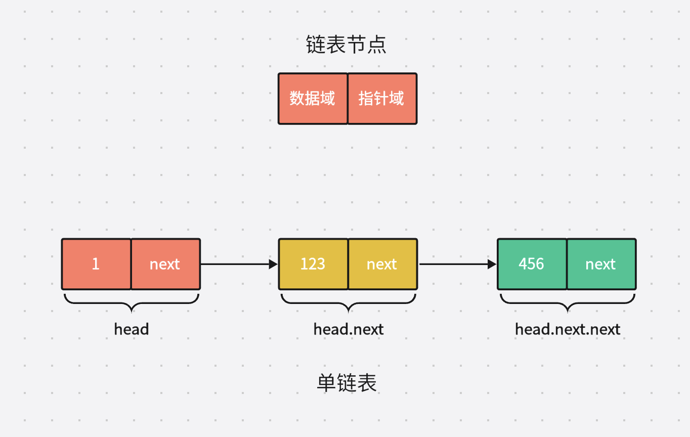

#### 1.2 单链表代码

> 使用go代码实现单链表

```go
package main

// ListNode 定义链表节点
type ListNode struct {
	// Val 链表的数据域
	Val int
	// Next 链表的指针域
	Next *ListNode
}

func main() {
	head := &ListNode{Val: 1}
	head.Next = &ListNode{Val: 123}
	head.Next.Next = &ListNode{Val: 456}
}
```

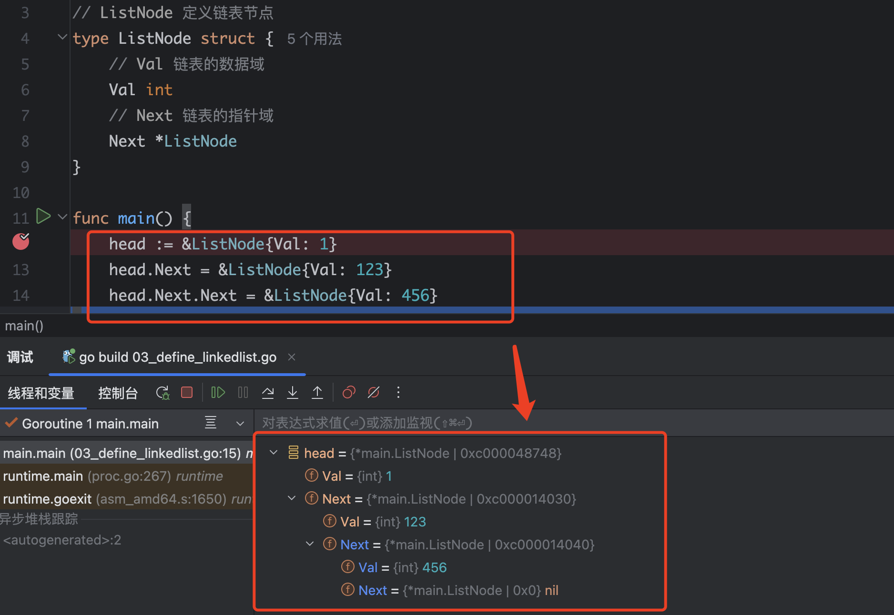

> 从代码提示来看：
>
> - head是头节点，Next指针域一直指向下一个节点，然后一直循环

##### 1.1.1 指针变量移动

> 指针变量的移动，就是需要将Next指针域一直指向下一个链表节点

```go
package main

import "fmt"

// ListNode 定义链表节点
type ListNode struct {
	// Val 链表的数据域
	Val int
	// Next 链表的指针域
	Next *ListNode
}

func main() {
	head := &ListNode{Val: 1}
	head.Next = &ListNode{Val: 123}
	head.Next.Next = &ListNode{Val: 456}

	temp := head     // 指针变量赋值
	temp = temp.Next // 移动temp指针到下一个节点
	fmt.Printf("current node val: %v\n", temp.Val)
}
```

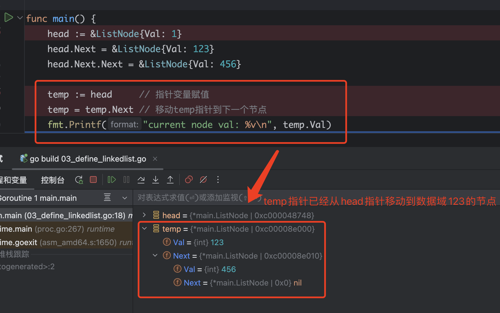

##### 1.1.2 节点插入函数

> 节点插入使用到了指针变量移动

```go
package main

// ListNode 定义链表节点
type ListNode struct {
	// Val 链表的数据域
	Val int
	// Next 链表的指针域
	Next *ListNode
}

func (ln *ListNode) Insert(val int) {
	if ln == nil {
		return
	}

	// 将当前头结点赋值给current临时变量
	current := ln

	// 因为此时current处于链表的head头结点，所以需要循环找到链表的末尾节点
	for current.Next != nil {
		// 表示下一个节点不为nil
		current = current.Next // 移动current到下一个节点
	}
	// 当上面循环完成后，current就指向了链表的末尾节点，此时再把末尾节点指针域连接到新节点
	// 创建新的节点
	newListNode := &ListNode{Val: val}
	current.Next = newListNode
}

func main() {
	head := &ListNode{Val: 10}
	// 插入新节点
	head.Insert(20)
	head.Insert(30)
	head.Insert(40)
	head.Insert(50)
}
```

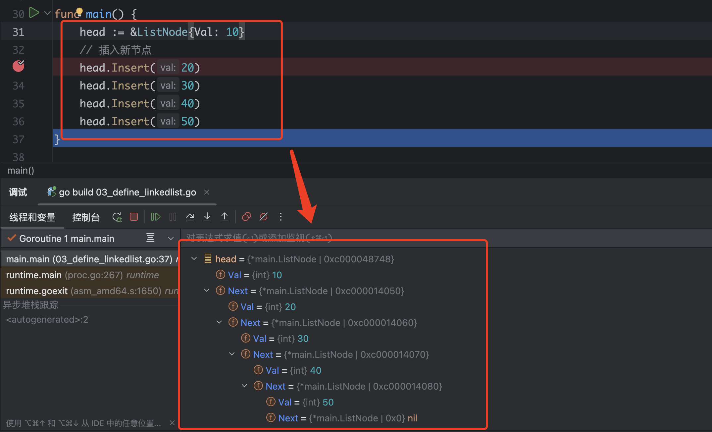

##### 1.1.3 打印链表函数

```go
func (ln *ListNode) PrintListNode() {
	if ln == nil {
		return
	}
	current := ln
	for current != nil {
		fmt.Print(current.Val, " -> ")
		// 移动指针域到下一个节点
		current = current.Next
	}
	fmt.Println("nil")
}
```

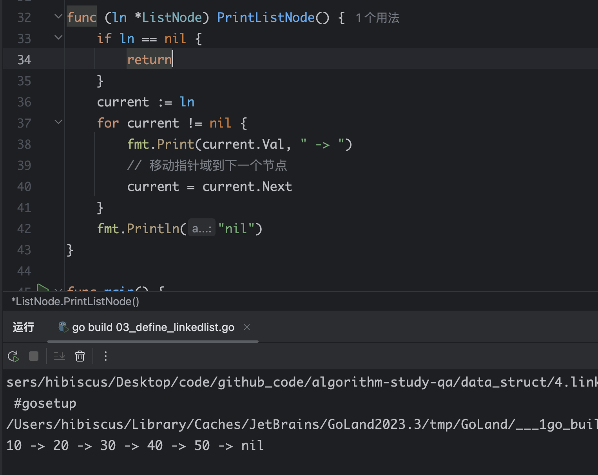

#### 1.3 循环链表

> 循环链表是指尾节点再次指向头结点

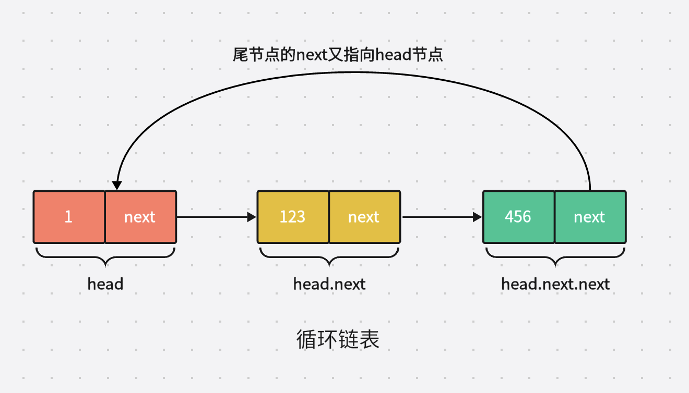

```go
// ListNode 定义链表节点
type ListNode struct {
	// Val 链表的数据域
	Val int
	// Next 链表的指针域
	Next *ListNode
}

func main() {
	// 1. 定义由一个节点组成的循环链表
	head := &ListNode{Val: 10}
	head.Next = head

	// 2. 添加新节点到循环链表
	newNode := &ListNode{Val: 20}
	head.Next = newNode // 让头结点指向新节点
	newNode.Next = head // 让新节点的下一个指针域指向头结点形成循环链表
}
```

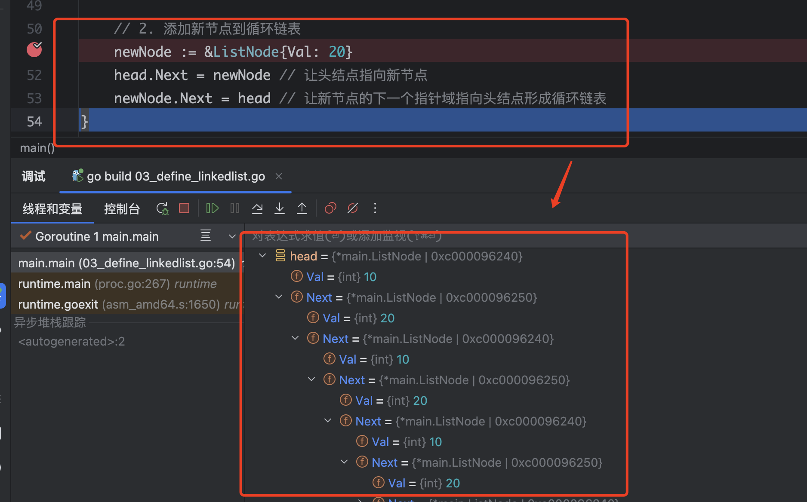

> 从代码调试可以看出，head的Next是20这个节点，20这个节点的Next变为head，这样一直循环形成了循环链表
>
> 断点的“Ⅴ”可以一直展开，但是是因为循环链表，所以一直就是head节点和20这个节点循环展示

##### 1.1.1 循环链表添加节点

```go
package main

// CircularListNode 定义链表节点
type CircularListNode struct {
	// Val 链表的数据域
	Val int
	// Next 链表的指针域
	Next *CircularListNode
}

// Append 给循环链表添加节点
func (cl *CircularListNode) Append(val int) {
	if cl == nil {
		return
	}

	// 将当前头结点赋值给current临时变量
	current := cl

	// 因为此时current处于链表的head头结点，所以需要循环找到链表的末尾节点
	// 当current.Next不等于cl头结点的时候，表示还没有走到循环链表的尾节点
	for current.Next != cl {
		current = current.Next // 移动current到下一个节点
	}
	// 当上面循环完成后，current就指向了链表的末尾节点，此时再把末尾节点指针域连接到新节点
	// 创建新的节点
	newListNode := &CircularListNode{Val: val}
	current.Next = newListNode
	newListNode.Next = cl
}

func main() {
	// 1. 定义由一个节点组成的循环链表
	head := &CircularListNode{Val: 10}
	head.Next = head
	// 2.添加新节点到循环链表
	head.Append(11)
	head.Append(12)
	head.Append(13)
}
```

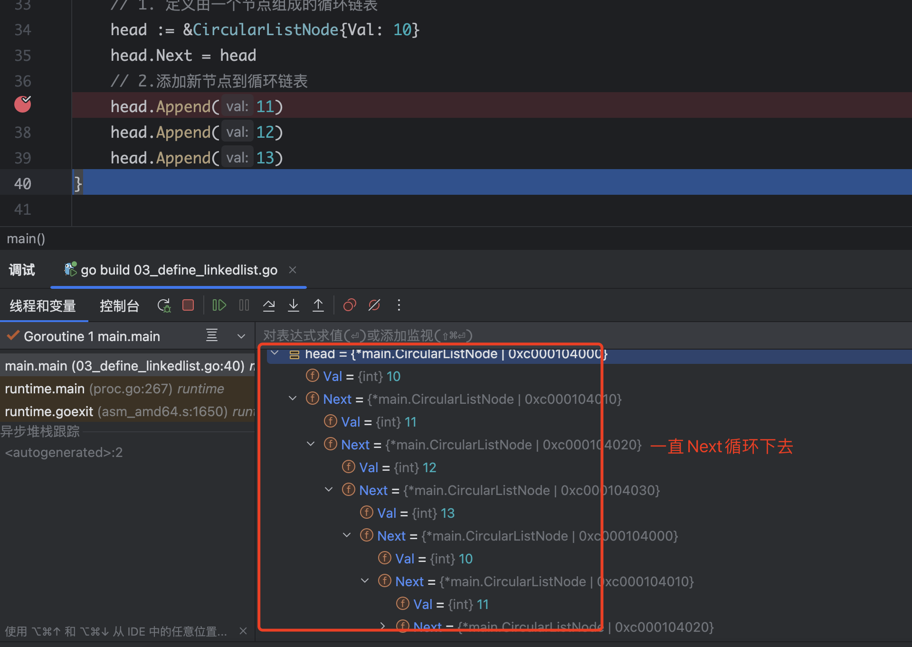

##### 1.1.2 打印循环链表函数

```go
func (cl *CircularListNode) PrintCircularListNode() {
	if cl == nil {
		return
	}
	current := cl.Next
	if current == cl {
		// 表示只有一个节点
		fmt.Println(current.Val)
		return
	}
	// 输出头结点
	fmt.Print(cl.Val, " -> ")
	// 遍历打印下一个节点
	// 因为current节点不等于cl头结点，可以一直打印节点，
	// 一旦current.next是cl头结点了，那么current就表示走到了尾节点，此时for循环条件也不成立就退出循环
	for current != cl {
		fmt.Print(current.Val, " -> ")
		current = current.Next
	}
	fmt.Print("nil")
}
```

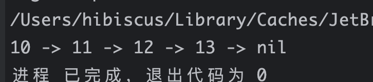

##### 1.1.3 删除循环链表最后一个节点

> 核心思想：
>
> - 找到循环链表的倒数第二个节点，将倒数第二个节点指向头结点

```go
package main

import "fmt"

// CircularListNode 定义链表节点
type CircularListNode struct {
	// Val 链表的数据域
	Val int
	// Next 链表的指针域
	Next *CircularListNode
}

// Append 给循环链表添加节点
// cl 本身必须是一个循环链表
func (cl *CircularListNode) Append(val int) {
	if cl == nil {
		return
	}

	// 将当前头结点赋值给current临时变量
	current := cl

	// 因为此时current处于链表的head头结点，所以需要循环找到链表的末尾节点
	// 当current.Next不等于cl头结点的时候，表示还没有走到循环链表的尾节点
	for current.Next != cl {
		current = current.Next // 移动current到下一个节点
	}
	// 当上面循环完成后，current就指向了链表的末尾节点，此时再把末尾节点指针域连接到新节点
	// 创建新的节点
	newListNode := &CircularListNode{Val: val}
	current.Next = newListNode
	newListNode.Next = cl
}

func (cl *CircularListNode) PrintCircularListNode() {
	if cl == nil {
		return
	}
	current := cl.Next
	if current == cl {
		// 表示只有一个节点
		fmt.Println(current.Val)
		return
	}
	// 输出头结点
	fmt.Print(cl.Val, " -> ")
	// 遍历打印下一个节点
	// 因为current节点不等于cl头结点，可以一直打印节点，
	// 一旦current.next是cl头结点了，那么current就表示走到了尾节点，此时for循环条件也不成立就退出循环
	for current != cl {
		fmt.Print(current.Val, " -> ")
		current = current.Next
	}
	fmt.Print("nil")
	fmt.Println()
}

// DeleteTailNode 删除循环链表的末尾节点
func (cl *CircularListNode) DeleteTailNode() {
	if cl == nil || cl == cl.Next {
		return
	}

	// 1. 定义临时节点
	current := cl
	// 移动指针变量，表示指针的下一个节点的下一个节点不是头结点，就表示没有找到倒数第二个节点
	// 需要继续循环
	for current.Next.Next != cl {
		current = current.Next
	}

	// 找到了链表的倒数第2个节点后，将这个节点的下一个节点指向头结点，就删除最后一个节点
	current.Next = cl
}

func main() {
	// 1. 定义由一个节点组成的循环链表
	head := &CircularListNode{Val: 10}
	head.Next = head
	// 2.添加新节点到循环链表
	head.Append(11)
	head.Append(12)
	head.Append(13)

	head.PrintCircularListNode()

	head.DeleteTailNode()
	head.PrintCircularListNode()

	head.DeleteTailNode()
	head.PrintCircularListNode()
}
```

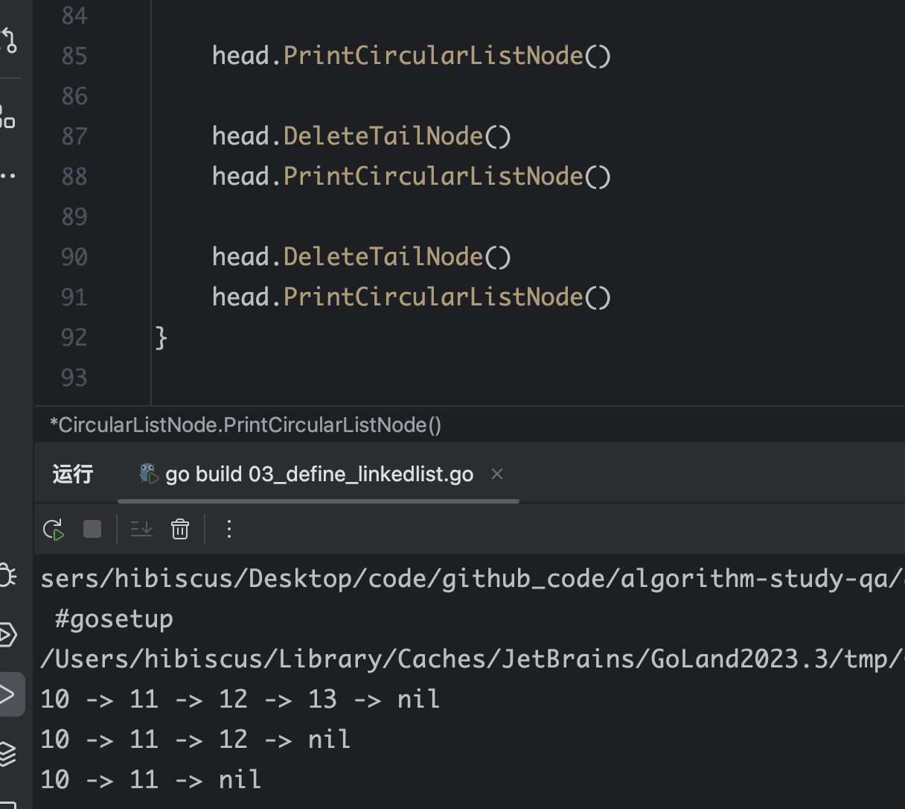

### 2、双向链表

#### 1.1 双向链表定义

> - 双向链表是一种数据结构，每个节点包含数据元素以及指向前一个和后一个节点的指针
> - 任何需要频繁进行插入、删除操作，并且需要保持元素顺序的数据结构，都可能是双向链表的引用场景

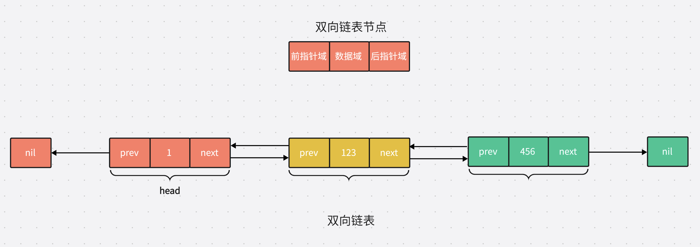

#### 1.2 双向链表代码实现

> 核心点：
>
> - 将head的Next 后向指针域指向新节点
> - 将newNode的Prev 前向指针域指向head的前一个节点

```go
package main

// DoubleLinkedListNode 双向链表节点
type DoubleLinkedList struct {
	Val  int
	Prev *DoubleLinkedList
	Next *DoubleLinkedList
}

func main() {
	head := &DoubleLinkedList{Val: 1}
	// 创建新双向链表节点
	newNode := &DoubleLinkedList{Val: 123}

	// 将head的Next 后向指针域指向新节点
	head.Next = newNode

	// 将newNode的Prev 前向指针域指向head的前一个节点
	newNode.Prev = head
}
```

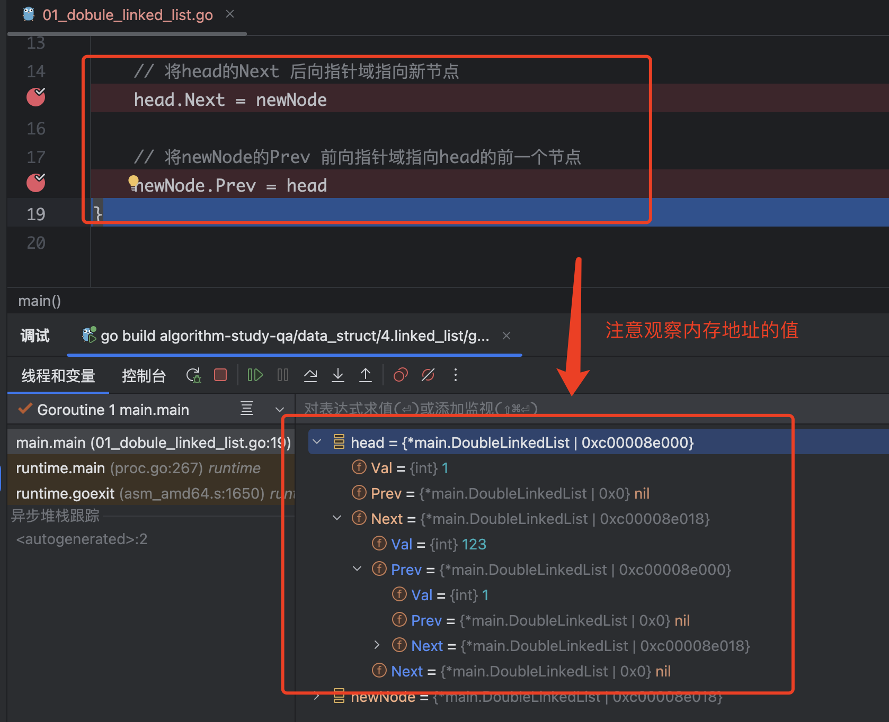

##### 1.1.1 添加新节点

> 核心：
>
> - 找到双向链表的最后一个节点
> - 让最后一个节点的Next后向指针域指向新节点
> - 让新节点的Prev前向指针域指向最后一个节点

```go
type DoubleLinkedList struct {
	Val  int
	Prev *DoubleLinkedList
	Next *DoubleLinkedList
}

func main() {
	head := &DoubleLinkedList{Val: 1}
	// 创建新双向链表节点
	newNode := &DoubleLinkedList{Val: 123}

	// 将head的Next 后向指针域指向新节点
	head.Next = newNode

	// 将newNode的Prev 前向指针域指向head的前一个节点
	newNode.Prev = head
}
```

#### 1.3 遍历双向链表

##### 1.1.2 前向遍历

> 前向遍历的逻辑：
>
> - 从头节点开始，依次向后遍历到尾节点
> - 需要先从头节点开始向后遍历。

```go
// TraverseForward 前向遍历
// 头到尾遍历
func (dl *DoubleLinkedList) TraverseForward() {
	if dl == nil {
		return
	}
	current := dl

	// current.Next != nil 表示下一个双向链表节点存在
	for current != nil {
		fmt.Print(current.Val, " -> ")

		// 将当前指针移动到下一个双向链表节点
		current = current.Next
	}

	fmt.Print("nil")
	fmt.Println()
}
```

##### 1.1.2 后向遍历

> 后向遍历的逻辑：
>
> - 从尾节点开始，依次向前遍历到头节点。
> - 需要先找到尾节点，然后从尾节点开始向前遍历。

```go
// TraverseBackward 后向遍历
// 从尾到头遍历
func (dl *DoubleLinkedList) TraverseBackward() {
	if dl == nil {
		return
	}
	// 找到尾节点
	current := dl

	// 注意这里必须注意，不能用 current != nil 来判断是不是尾节点，应该用current.Next
	// 如果用了current ！= nil，此时即使走到了最后一个节点，那么current还是会被指向尾节点的下一个节点也就是nil
	for current.Next != nil {
		// 当节点不为空，一直往后移动直到找到尾节点
		current = current.Next
	}

	// current 此时处于尾节点，然后后向遍历打印
	for current != nil {
		fmt.Print(current.Val, " -> ")

		// 将当前指针移动到上一个双向链表节点
		current = current.Prev
	}

	fmt.Print("nil")
	fmt.Println()
}
```

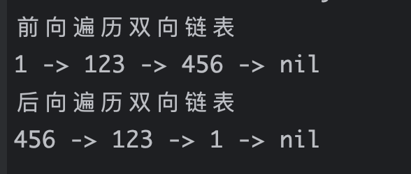

#### 1.4 删除节点

> 基于三个节点的双向链表，删除中间的节点，核心逻辑：
>
> - 让head.Next指向head.Next.Next
> - 此时head.Next就已经等于最后一个节点了，那么此时head.Next.Prev就是最后一个节点的前向指针域指向head节点即可

```go
package main

import "fmt"

type DoubleLinkedList struct {
	Val  int
	Prev *DoubleLinkedList
	Next *DoubleLinkedList
}

// TraverseForward 前向遍历
// 头到尾遍历
func (dl *DoubleLinkedList) TraverseForward() {
	if dl == nil {
		return
	}
	current := dl

	// current.Next != nil 表示下一个双向链表节点存在
	for current != nil {
		fmt.Print(current.Val, " -> ")

		// 将当前指针移动到下一个双向链表节点
		current = current.Next
	}

	fmt.Print("nil")
	fmt.Println()
}

func main() {
	head := &DoubleLinkedList{Val: 1}
	// 创建新双向链表节点
	newNode := &DoubleLinkedList{Val: 123}

	// 将head的Next 后向指针域指向新节点
	head.Next = newNode

	// 将newNode的Prev 前向指针域指向head的前一个节点
	newNode.Prev = head

	// 添加新节点
	newNode2 := &DoubleLinkedList{Val: 456}
	// 让最后一个节点的Next后向指针域指向新节点
	// head.Next是最后一个节点
	// head.Next.Next是最后一个节点的Next指向的节点
	head.Next.Next = newNode2
	// 让新节点的Prev前向指针域指向最后一个节点
	newNode2.Prev = head.Next

	// 前向遍历双向链表
	fmt.Println("未删除newNode，前向遍历双向链表")
	head.TraverseForward()

	// 3、删除节点 newNode := &DoubleLinkedList{Val: 123}
	// 表示head下一个节点指向head的Next.Next几点
	head.Next = head.Next.Next
	// 此时head.Next就是newNode2这个节点了，那么head.Next.Prev => newNode2.Prev
	// newNode2.Prev = head 表示将newNode2这个节点的前向指针域指向head节点
	// 这样就把加在中间的newNode节点给删除了
	head.Next.Prev = head

	fmt.Println("删除newNode，前向遍历双向链表")
	head.TraverseForward()
}
```

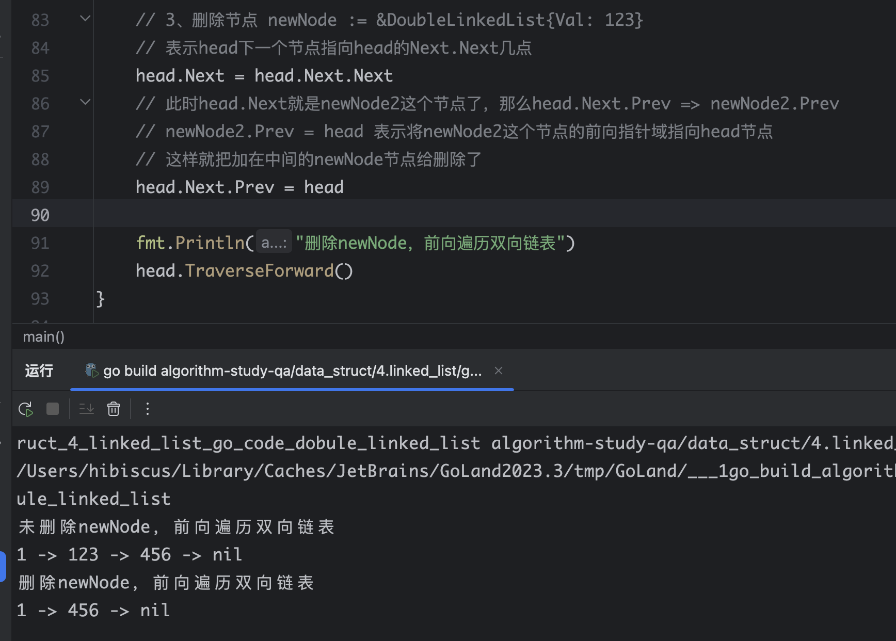

#### 1.5 封装节点插入函数

##### 1.1.1 头插法

> 将节点插入到双向链表的头部

```go
package main

// DoubleLinkedListNode 双向链表节点
type DoubleLinkedListNode struct {
	Val  int
	Prev *DoubleLinkedListNode
	Next *DoubleLinkedListNode
}

// DoubleLinkedList 双向链表
type DoubleLinkedList struct {
	// Head 头节点
	Head *DoubleLinkedListNode
	// Tail 尾节点
	Tail *DoubleLinkedListNode
}

func NewDoubleLinkedList() *DoubleLinkedList {
	return &DoubleLinkedList{}
}

// InsertAtStart 实现头部插入节点
func (dl *DoubleLinkedList) InsertAtStart(val int) {
	// 创建一个新双向链表节点
	newNode := &DoubleLinkedListNode{Val: val}

	// 双向链表为空，则直接将新创建的节点赋值返回
	if dl.Head == nil || dl.Tail == nil {
		dl.Head = newNode
		dl.Tail = newNode
		return
	}

	// 双向链表不为空
	// 将新节点的Next后向指针域指向 头节点的Head节点
	newNode.Next = dl.Head

	// 将双向链表的 头节点的Prev前向指针域指向新的节点
	dl.Head.Prev = newNode

	// 将双向链表的头结点移动到新节点，实现头插法
	dl.Head = newNode
}

func main() {
	root := NewDoubleLinkedList()
	root.InsertAtStart(1)
	root.InsertAtStart(2)
	root.InsertAtStart(3)
	root.InsertAtStart(4)
	root.InsertAtStart(5)
}
```

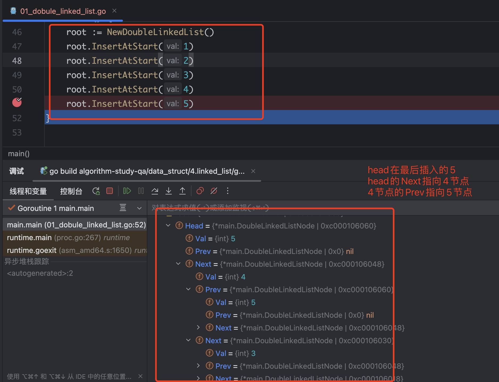

##### 1.1.2 尾插法

> 将节点插入到双向链表的尾部
>
> Head 头节点
> Tail 尾节点 
>
> 表示直接指明了头结点、尾节点是什么，不需要遍历再去查找尾节点了

```go
package main

// DoubleLinkedListNode 双向链表节点
type DoubleLinkedListNode struct {
	Val  int
	Prev *DoubleLinkedListNode
	Next *DoubleLinkedListNode
}

// DoubleLinkedList 双向链表
type DoubleLinkedList struct {
	// Head 头节点
	Head *DoubleLinkedListNode
	// Tail 尾节点
	Tail *DoubleLinkedListNode
}

func NewDoubleLinkedList() *DoubleLinkedList {
	return &DoubleLinkedList{}
}

// InsertAtEnd 实现尾部插入节点
func (dl *DoubleLinkedList) InsertAtEnd(val int) {
	// 创建一个新双向链表节点
	newNode := &DoubleLinkedListNode{Val: val}

	// 双向链表为空，则直接将新创建的节点赋值返回
	if dl.Head == nil || dl.Tail == nil {
		dl.Head = newNode
		dl.Tail = newNode
		return
	}

	// 双向链表不为空
	// 双向链表的尾节点的Next后向指针域指向新节点
	dl.Tail.Next = newNode

	// 让新节点的前向指针域指向尾部节点
	newNode.Prev = dl.Tail

	// 修改双向链表的尾节点指到尾部新加的新节点
	dl.Tail = newNode
}

func main() {
	root := NewDoubleLinkedList()

	root.InsertAtEnd(10)
	root.InsertAtEnd(20)
	root.InsertAtEnd(30)
	root.InsertAtEnd(40)
}
```

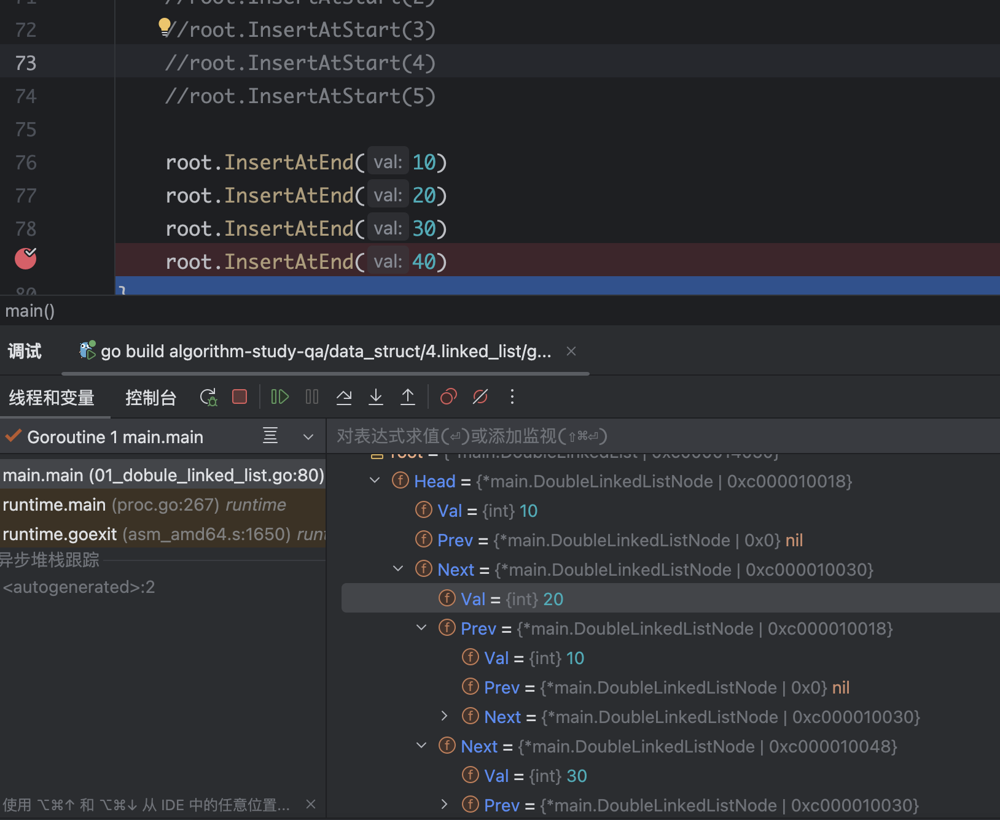

##### 1.1.3 删除双向链表任意节点

> 可删除双向链表中任意的节点

```go
package main

import "fmt"

// DoubleLinkedListNode 双向链表节点
type DoubleLinkedListNode struct {
	Val  int
	Prev *DoubleLinkedListNode
	Next *DoubleLinkedListNode
}

// DoubleLinkedList 双向链表
type DoubleLinkedList struct {
	// Head 头节点
	Head *DoubleLinkedListNode
	// Tail 尾节点
	Tail *DoubleLinkedListNode
}

func NewDoubleLinkedList() *DoubleLinkedList {
	return &DoubleLinkedList{}
}

// InsertAtStart 实现头部插入节点
func (dl *DoubleLinkedList) InsertAtStart(val int) {
	// 创建一个新双向链表节点
	newNode := &DoubleLinkedListNode{Val: val}

	// 双向链表为空，则直接将新创建的节点赋值返回
	if dl.Head == nil || dl.Tail == nil {
		dl.Head = newNode
		dl.Tail = newNode
		return
	}

	// 双向链表不为空
	// 将新节点的Next后向指针域指向 头节点的Head节点
	newNode.Next = dl.Head

	// 将双向链表的 头节点的Prev前向指针域指向新的节点
	dl.Head.Prev = newNode

	// 将双向链表的头结点移动到新节点，实现头插法
	dl.Head = newNode
}

// InsertAtEnd 实现尾部插入节点
func (dl *DoubleLinkedList) InsertAtEnd(val int) {
	// 创建一个新双向链表节点
	newNode := &DoubleLinkedListNode{Val: val}

	// 双向链表为空，则直接将新创建的节点赋值返回
	if dl.Head == nil || dl.Tail == nil {
		dl.Head = newNode
		dl.Tail = newNode
		return
	}

	// 双向链表不为空
	// 双向链表的尾节点的Next后向指针域指向新节点
	dl.Tail.Next = newNode

	// 让新节点的前向指针域指向尾部节点
	newNode.Prev = dl.Tail

	// 修改双向链表的尾节点指到尾部新加的新节点
	dl.Tail = newNode
}

func (dl *DoubleLinkedList) Delete(val int) {
	// 双向链表的头结点赋值给 current
	current := dl.Head
	for current != nil {
		if current.Val == val {
			// 删除节点为：头结点
			// current.Prev == nil 说明当前节点的前向指针域确实指向空，那么current就是头结点
			// current此时所在的节点为双向链表的头结点
			if current.Prev == nil {
				// 更改双向链表的头结点的位置，将头节点(dl.Head)往后移动一个节点(current.Next)
				dl.Head = current.Next
				// 此时current仍是链表的第一个节点，不是链表的第二个节点，因为没有给current重新赋值
				// 将current头结点的Next指针域指向空，
				// 因为上面的头结点已经移动到了current头结点的下一个节点
				current.Next = nil
				// 此时注意头结点的下一个节点已经是头结点，换句话说就是第二个节点经过dl.Head = current.Next已经变为头结点了
				// current仍是链表的第一个节点，因为没有给current重新赋值
				// 接着将移动后指向的头结点的前向指针域也指向空
				dl.Head.Prev = nil
				return

			}
			// 删除节点为：尾结点
			// 当current节点的Next后向指针域为nil，说明当前操作的节点是尾节点
			// 注意此时current节点是尾节点
			if current.Next == nil {
				// 将链表的尾节点指向链表的倒数第二个节点，也就是尾节点的前一个节点
				dl.Tail = current.Prev
				// 此时current仍是链表的最后一个节点，不是链表的倒数第二个节点，因为没有给current重新赋值
				// 那么将current的前向指针域指向空，断开与链表的倒数第二个节点连接
				current.Prev = nil
				// 此时链表的Tail尾节点已经移动了到链表的倒数第二个节点
				// current仍是链表的最后一个节点，因为没有给current重新赋值
				// 那么此时就需要将Tail的Next指针域指向nil，与current断开连接
				dl.Tail.Next = nil
				return
			}
			// 删除节点为：普通节点（既不是头结点也不是尾节点）

			// 比如有这样的双向链表  2 -> 3 -> 4 -> 5
			// 当要删除3，那么此时current节点就是3
			// current.Prev.Next拆开：
			//  1. current.Prev 表示3的前一个节点也就是2，
			//  2. current.Prev.Next 表示3的前一个节点的Next后向指针域指向3这个节点的后向指针域指向的节点(=current.Next)，也就是4
			//  3. 这样就让2节点->4节点连接起来了
			current.Prev.Next = current.Next
			// 注意此时仅仅是2节点与4节点连接了，属于单向连接，4节点还没有和2节点连接，因为是双向链表，所以需要2和4互相连接
			// 此时current仍是链表的3节点，因为没有给current重新赋值
			// current.Next.Prev拆解：
			//  1. current.Next 表示3的后一个节点也就是4
			//  2. current.Next.Prev 表示3的后一个节点的Prev前向指针域指向3这个节点的前向指针域指向的节点(=current.Prev)，也就是2
			//  3. 这样就让4节点->2节点连接起来了
			current.Next.Prev = current.Prev

			// 到此就实现了删除3节点
			// 并让3节点前面的2节点、3节点后面的4节点互相连接起来，又形成了双向链表
			return

		}
		// 当上面一次current.Val != val，那就需要对current重新赋值，向后移动节点继续循环
		current = current.Next
	}

}

// TraverseForward 前向遍历
// 头到尾遍历
func (dl *DoubleLinkedList) TraverseForward() {
	if dl == nil {
		return
	}
	current := dl.Head

	// current.Next != nil 表示下一个双向链表节点存在
	for current != nil {
		fmt.Print(current.Val, " -> ")

		// 将当前指针移动到下一个双向链表节点
		current = current.Next
	}

	fmt.Print("nil")
	fmt.Println()
}

func main() {
	root := NewDoubleLinkedList()

	root.InsertAtEnd(10)
	root.InsertAtEnd(20)
	root.InsertAtEnd(30)
	root.InsertAtEnd(40)

	fmt.Print("\n打印完整双向链表节点", "\n")
	root.TraverseForward()

	// 删除节点的值
	root.Delete(40)

	fmt.Print("\n删除尾节点40后，再次打印双向链表节点", "\n")
	root.TraverseForward()

	// 删除节点的值
	root.Delete(20)

	fmt.Print("\n删除节点20后，再次打印双向链表节点", "\n")
	root.TraverseForward()

	// 删除节点的值
	root.Delete(10)

	fmt.Print("\n删除头节点10后，再次打印双向链表节点", "\n")
	root.TraverseForward()

}
```

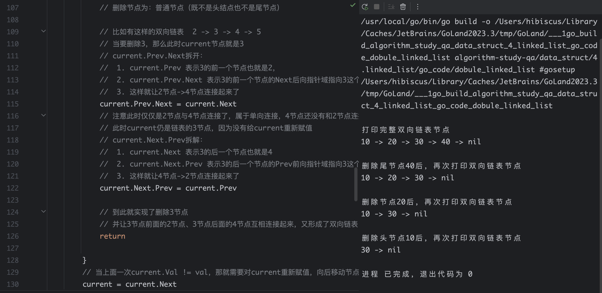

## 三、解法大纲

### 1、双指针技巧解数组/链表题目

> 在处理数组和链表时，双指针技巧经常会用到，双指针在数组中就是`索引`，在链表中就是`链表节点`
>
> 双指针主要分为两类：
>
> - 左右指针
> - 快慢指针

#### 1.1 左右指针

> 左右指针是指两个指针相向而行或者相背而行，换句话说：
>
> - 左指针是指数组的起始索引 `0`
>   - 一般会定义左指针为`left`
> - 右指针是指数组的末尾索引 `len(nums)-1`
>   - 一般右指针定义为`right`

#### 1.2 快慢指针

> 快慢指针是指两个指针同向而行，只不过是一快一慢，同向而行是指起始位置都是一样
>
> - 快指针
>   - 一般会定义为 `fast`
> - 慢指针
>   - 一般会定义 `slow`

##### 1.1.1 快慢指针适用场景-单链表

> 在单链表题目中，大部分技巧都属于快慢指针

##### 1.1.2 快慢指针适用场景-原地修改

> 在数组问题中的快慢指针技巧，就是让我们原地修改数组，不允许额外开辟新的内存空间，创建新的内存地址

> 以leetcode的26题（删除有序数组中的重复项），原地修改数组的问题
>
> - 让慢指针`slow`走在后面，快指针`fast`走在前面探路，找到一个不重复的元素就赋值给`slow`，且让`slow`前进一步
> - 这样就保证了nums[0...slow]都是没有重复的元素，当fast指针遍历完整个数组`nums`后，nums[0...slow]就是整个数组去重之后的结果

```go

# 下面是核心框架代码
slow, fast := 0, 0
for fast < len(nums) {
    if nums[fast] != nums[slow] {
        slow++
        nums[slow] = nums[fast]
    }
    fast++
}

// 最终因为是需要返回数组的长度，slow是索引，那就需要+1
return slow + 1
```


## 四、未在LeetCode收录题目

#### 1、反转数组

> 给一个数组进行翻转，不能新创建数组，只能修改原始数组

```go
package main

import "fmt"

// reverseNum 反转数组，只能从原始数组修改
func reverseNum(l []int) []int {
	left, right := 0, len(l)-1
	for left < right {
		tempVal := l[left]
		l[left] = l[right]
		l[right] = tempVal

		left, right = left+1, right-1
	}
	return l
}

func main() {
	l := []int{1, 2, 3, 4, 5}
	fmt.Printf("%v\n", reverseNum(l))
}
```


#### 2、空汽水瓶换汽水

> 某商店规定：三个空汽水瓶可以换一瓶汽水。小张手上有十个空汽水瓶，她最多可以换多少瓶汽水喝？

```go
package main

import "fmt"

func changeSoda(n int) int {
	total_soda := 0
	for n >= 3 {
		// 计算可以换几瓶
		soda := n / 3
		total_soda += soda

		// 计算剩余的空瓶子
		n = n%3 + soda

	}
    // 额外剩余2个，还可以再次换一瓶汽水
	if n == 2 {
		total_soda += 1
	}
	return total_soda

}

func main() {
	n := []int{3, 10, 1}
	for _, v := range n {
		fmt.Printf("n=%v可以换%v瓶汽水\n", n, changeSoda(v))
	}
}
```


## 五、LeetCode-数组

### 1、[两数之和](https://leetcode.cn/problems/two-sum/description/)

#### 1.1 题目

> 给定一个整数数组 `nums` 和一个整数目标值 `target`，请你在该数组中找出 **和为目标值** *`target`* 的那 **两个** 整数，并返回它们的数组下标。
>
> 你可以假设每种输入只会对应一个答案，并且你不能使用两次相同的元素。
>
> 你可以按任意顺序返回答案。
>
> **示例 1：**
>
> ```
> 输入：nums = [2,7,11,15], target = 9
> 输出：[0,1]
> 解释：因为 nums[0] + nums[1] == 9 ，返回 [0, 1] 。
> ```
>
> **示例 2：**
>
> ```
> 输入：nums = [3,2,4], target = 6
> 输出：[1,2]
> ```
>
> **示例 3：**
>
> ```
> 输入：nums = [3,3], target = 6
> 输出：[0,1]
> ```

#### 1.2 题解

> 使用map方式，原始数据组的值作为map的key，出现的索引作为map的value

```go
func twoSum(nums []int, target int) []int {
    res := make(map[int]int, 0)
    for k, v := range nums {
        another := target - v
        if _, ok := res[another]; ok {
            return []int{res[another], k}
        }else {
            res[v] = k
        }
    }
    return nil
}
```


## 六、LeetCode-字符串

### [344. 反转字符串](https://leetcode.cn/problems/reverse-string/)

#### 1.1 题目

> 编写一个函数，其作用是将输入的字符串反转过来。输入字符串以字符数组 `s` 的形式给出。
>
> 不要给另外的数组分配额外的空间，你必须**[原地](https://baike.baidu.com/item/原地算法)修改输入数组**、使用 O(1) 的额外空间解决这一问题。
>
>  
>
> **示例 1：**
>
> ```
> 输入：s = ["h","e","l","l","o"]
> 输出：["o","l","l","e","h"]
> ```
>
> **示例 2：**
>
> ```
> 输入：s = ["H","a","n","n","a","h"]
> 输出：["h","a","n","n","a","H"]
> ```

#### 1.2 题解

> 双指针，左右指针，然后修改原始数组

```go
func reverseString(s []byte)  {
    if len(s) == 0 {
        return
    }
    // 左右指针移动来处理
    left, right := 0, len(s) - 1
    for left < right {
        tempChar := s[left]
        s[left] = s[right]
        s[right] = tempChar
        // 下面是指针左右移动
        left, right = left + 1, right - 1
    }
}
```

### [20. 有效的括号](https://leetcode.cn/problems/valid-parentheses/)

#### 1.1 题目

> 给定一个只包括 `'('`，`')'`，`'{'`，`'}'`，`'['`，`']'` 的字符串 `s` ，判断字符串是否有效。
>
> 有效字符串需满足：
>
> 1. 左括号必须用相同类型的右括号闭合。
> 2. 左括号必须以正确的顺序闭合。
> 3. 每个右括号都有一个对应的相同类型的左括号。
>
>  
>
> **示例 1：**
>
> **输入：**s = "()"
>
> **输出：**true
>
> **示例 2：**
>
> **输入：**s = "()[]{}"
>
> **输出：**true
>
> **示例 3：**
>
> **输入：**s = "(]"
>
> **输出：**false
>
> **示例 4：**
>
> **输入：**s = "([])"
>
> **输出：**true
>
>  
>
> **提示：**
>
> - `1 <= s.length <= 104`
> - `s` 仅由括号 `'()[]{}'` 组成

#### 1.2 题解

```go
package main

import "fmt"

// [({})]
func matchStr(s string) bool {
	stack := make([]string, 0)
	for _, v := range s {
		vStr := string(v)
		if vStr == "(" || vStr == "{" || vStr == "[" {
			stack = append(stack, vStr)
		}
		if vStr == ")" {
			// 需要判断的字符串是 {[()]}
			// 此时stack还有值，stack的值是 [{(
			// len(stack) == 0  为false
			// vStr == stack[len(stack)-1]
			//   此时vStr == ")"
			//   stack[len(stack)-1] = stack[2] = "("
			//   vStr == stack[len(stack)-1] 为false
			//   len(stack) == 0 || vStr == stack[len(stack)-1]  => false
			if len(stack) == 0 || "(" != stack[len(stack)-1] {
				return false
			}
			// 弹出stack的最后一位元素
			// stack =  stack[:len(stack)-1] = stack[:2] = [{
			// 切片是左闭右开， 所以stack[:2]其实只能取索引是0和1两个值，相当于是把stack最后一位给pop出去
			stack = stack[:len(stack)-1]
		}
		if vStr == "]" {
			if len(stack) == 0 || "[" != stack[len(stack)-1] {
				return false
			}
			stack = stack[:len(stack)-1]
		}
		if vStr == "}" {
			// 判断的意思是
			// stack 还有值，且 最后一个不能于 "{"时，肯定括号不匹配
			if len(stack) == 0 || "{" != stack[len(stack)-1] {
				return false
			}

			stack = stack[:len(stack)-1]
		}
	}
	return len(stack) == 0
}

func main() {
	s := "(]"
	ret := matchStr(s)
	fmt.Printf("ret ==> %v\n", ret)
}
```

## 七、LeetCode-链表

### 2、[两数相加](https://leetcode.cn/problems/add-two-numbers/description/)

#### 1.1 题目

> 给你两个 **非空** 的链表，表示两个非负的整数。它们每位数字都是按照 **逆序** 的方式存储的，并且每个节点只能存储 **一位** 数字。
>
> 请你将两个数相加，并以相同形式返回一个表示和的链表。
>
> 你可以假设除了数字 0 之外，这两个数都不会以 0 开头。

> **示例 1：**


> ```
> 输入：l1 = [2,4,3], l2 = [5,6,4]
> 输出：[7,0,8]
> 解释：342 + 465 = 807.
> ```
>
> **示例 2：**
>
> ```
> 输入：l1 = [0], l2 = [0]
> 输出：[0]
> ```
>
> **示例 3：**
>
> ```
> 输入：l1 = [9,9,9,9,9,9,9], l2 = [9,9,9,9]
> 输出：[8,9,9,9,0,0,0,1]
> ```

#### 1.2 题解

> **逆序存储**：
>
> 在链表中，数字的每一位是按照从低位到高位的顺序存储的。例如，链表 `[2,4,3]` 表示的整数是 `342`，而不是 `243`

```go
// l1的链表是 1 -> 6 -> 3  对应的整数数字就是 361
l1 := &pkg.ListNode{Val: 1}
l1.Next = &pkg.ListNode{Val: 6}
l1.Next.Next = &pkg.ListNode{Val: 3}
```

```go
// pkg中的链表定义
package pkg

import "fmt"

/**
 * Definition for singly-linked list.
 * type ListNode struct {
 *     Val int
 *     Next *ListNode
 * }
 */

type ListNode struct {
	Val  int
	Next *ListNode
}

// PrintListNode 打印节点
func PrintListNode(head *ListNode) {
	if head == nil {
		return
	}
	current := head
	for current != nil {
		fmt.Print(current.Val, " -> ")
		current = current.Next
	}
	fmt.Print("nil")
}

```

> 题目解答
>
> carry必须>1，下面是不对carry判断的错误流程，让我们通过一个具体的例子来展示这种情况。假设 `l1` 和 `l2` 分别为：
>
> - `l1 = 2 -> 4 -> 9`
> - `l2 = 5 -> 6 -> 4`
>
> - 详细步骤
>
>   #### 初始状态
>
>   - `dummy` 是一个虚拟节点，`dummy.Next` 为 `nil`。
>   - `current` 指向 `dummy`。
>   - `carry` 为 `0`。
>
>   #### 第一次循环
>
>   - `sum = 0 + 2 + 5 = 7`
>   - `carry = 7 / 10 = 0`
>   - `current.Next = &pkg.ListNode{Val: 7}`
>   - `current = current.Next`
>   - `l1 = 4 -> 9`
>   - `l2 = 6 -> 4`
>
>   #### 第二次循环
>
>   - `sum = 0 + 4 + 6 = 10`
>   - `carry = 10 / 10 = 1`
>   - `current.Next = &pkg.ListNode{Val: 0}`
>   - `current = current.Next`
>   - `l1 = 9`
>   - `l2 = 4`
>
>   #### 第三次循环
>
>   - `sum = 1 + 9 + 4 = 14`
>   - `carry = 14 / 10 = 1`
>   - `current.Next = &pkg.ListNode{Val: 4}`
>   - `current = current.Next`
>   - `l1 = nil`
>   - `l2 = nil`
>
>   #### 最终结果
>
>   - 结果链表为 `7 -> 0 -> 4`
>
> - 在第三次循环结束后，`carry` 仍然为 `1`，但由于 `l1` 和 `l2` 都为 `nil`，循环条件 `l1 != nil || l2 != nil` 不再满足，循环结束。此时，`carry` 的值 `1` 被忽略，导致结果链表缺少最后一个节点 `1`。
>
> - 正确结果
>   - 正确的结果链表应该是 `7 -> 0 -> 4 -> 1`，但由于没有判断 `carry > 0`，最后一个节点 `1` 被遗漏了。

```go
package main

import (
	pkg "algorithm-study-qa/pkg/go_pkg/linked_list"
	"fmt"
)

func addTwoNumbers(l1 *pkg.ListNode, l2 *pkg.ListNode) *pkg.ListNode {
	dummy := &pkg.ListNode{Val: 0}
	current := dummy
	carry := 0
    // 在 l1 和 l2 都处理完之后，carry 仍然大于 0 的情况。在这种情况下，for 循环会继续执行，直到 carry 变为 0
	for l1 != nil || l2 != nil || carry != 0 {
		sum := carry
		if l1 != nil {
			sum += l1.Val
			l1 = l1.Next
		}
		if l2 != nil {
			sum += l2.Val
			l2 = l2.Next
		}
		carry = sum / 10
		current.Next = &pkg.ListNode{Val: sum % 10}
		current = current.Next
	}
	return dummy.Next
}

func main() {
	// 注意此时链表是逆序存储：数字的每一位是按照从低位到高位的顺序存储
	// l1的链表是 1 -> 6 -> 3  对应的整数数字就是 361
	l1 := &pkg.ListNode{Val: 1}
	l1.Next = &pkg.ListNode{Val: 6}
	l1.Next.Next = &pkg.ListNode{Val: 3}

	l2 := &pkg.ListNode{Val: 4}
	l2.Next = &pkg.ListNode{Val: 5}
	l2.Next.Next = &pkg.ListNode{Val: 6}

	res := addTwoNumbers(l1, l2)
	fmt.Print("\n打印相加之后的结果", "\n")
	pkg.PrintListNode(res)
	fmt.Println()
}

```

#### 1.3 核心解法

> - 针对l1和l2分别判断，然后将各自链表节点的值加到sum中
> - sum除10得到进位值给carry
> - sum%10得到余数创建新节点给current结果操作节点
> - current节点不断向后移动

### 21、[合并两个有序链表](https://leetcode.cn/problems/merge-two-sorted-lists/)

#### 1.1 题目

> 将两个升序链表合并为一个新的 **升序** 链表并返回。新链表是通过拼接给定的两个链表的所有节点组成的。  
>
> **示例 1：**


> ```
> 输入：l1 = [1,2,4], l2 = [1,3,4]
> 输出：[1,1,2,3,4,4]
> ```
>
> **示例 2：**
>
> ```
> 输入：l1 = [], l2 = []
> 输出：[]
> ```
>
> **示例 3：**
>
> ```
> 输入：l1 = [], l2 = [0]
> 输出：[0]
> ```
>
>  
>
> **提示：**
>
> - 两个链表的节点数目范围是 `[0, 50]`
> - `-100 <= Node.val <= 100`
> - `l1` 和 `l2` 均按 **非递减顺序** 排列

#### 1.2 题解

```go
package pkg

import "fmt"

/**
 * Definition for singly-linked list.
 * type ListNode struct {
 *     Val int
 *     Next *ListNode
 * }
 */

type ListNode struct {
	Val  int
	Next *ListNode
}

// PrintListNode 打印节点
func PrintListNode(head *ListNode) {
	if head == nil {
		return
	}
	current := head
	for current != nil {
		fmt.Print(current.Val, " -> ")
		current = current.Next
	}
	fmt.Print("nil")
}

```

> 解法代码

```go
package main

import (
	"algorithm-study-qa/leetecode_algorithm/21.merge_two_sorted_lists/go_code/pkg"
	"fmt"
)

func mergeTwoSortedLists3(list1 *pkg.ListNode, list2 *pkg.ListNode) *pkg.ListNode {
	dummy := &pkg.ListNode{Val: 0}
	current := dummy

	for list1 != nil && list2 != nil {
		if list1.Val > list2.Val {
			current.Next = list2
			list2 = list2.Next
		} else {
			current.Next = list1
			list1 = list1.Next
		}
		// 让current向后移动
		current = current.Next
	}
    
    // for循环结束以后进行判断
	if list1 != nil {
		current.Next = list1
	}
	if list2 != nil {
		current.Next = list2
	}
	return dummy.Next
}

func main() {
	list1 := &pkg.ListNode{Val: 1}
	list1.Next = &pkg.ListNode{Val: 3}
	list1.Next.Next = &pkg.ListNode{Val: 5}

	list2 := &pkg.ListNode{Val: 2}
	list2.Next = &pkg.ListNode{Val: 4}
	list2.Next.Next = &pkg.ListNode{Val: 6}

	res := mergeTwoSortedLists3(list1, list2)
	fmt.Print("\nlist1 list2合并后链表", "\n")
	pkg.PrintListNode(res)
	fmt.Println()
}
```


#### 1.3 核心解法

> 因为是合并成为一个有序链表
>
> - 链表1节点的值大于链表2节点的值，
>   - 将定义的current结果链表的Next节点指向链表2节点
>   - 将链表2节点向后移动一个节点
> - 链表1节点的值小于等于链表2节点的值
>   - 将定义的current结果链表的Next节点指向链表1节点
>   - 将链表1节点向后一个节点
> - current节点需要向后移动一个节点，因为上面2个判断给current节点的Next节点已经赋值，所以需要将current继续向后移动

```go
// 核心代码逻辑
	for list1 != nil && list2 != nil {
		if list1.Val > list2.Val {
			current.Next = list2
			// 一定要让list2移动到下一个节点
			list2 = list2.Next
		} else {
			// list1.Val <= list2.Val
			current.Next = list1
			// 一定要让list1移动到下一个节点
			list1 = list1.Next
		}

		// 让current移动到下一个节点
		current = current.Next

	}
```

### 83、[删除排序链表中的重复元素](https://leetcode.cn/problems/remove-duplicates-from-sorted-list/)

#### 1.1 题目

> 给定一个已排序的链表的头 `head` ， *删除所有重复的元素，使每个元素只出现一次* 。返回 *已排序的链表* 。
>
>  
>
> **示例 1：**
>
> 
>
> ```
> 输入：head = [1,1,2]
> 输出：[1,2]
> ```
>
> **示例 2：**
>
> 
>
> ```
> 输入：head = [1,1,2,3,3]
> 输出：[1,2,3]
> ```
>
>  
>
> **提示：**
>
> - 链表中节点数目在范围 `[0, 300]` 内
> - `-100 <= Node.val <= 100`
> - 题目数据保证链表已经按升序 **排列**

#### 1.2 题解 


#### 1.3 核心解法


### 86、[分隔链表](https://leetcode.cn/problems/partition-list/description/)

#### 1.1 题目

> 给你一个链表的头节点 `head` 和一个特定值 `x` ，请你对链表进行分隔，使得所有 **小于** `x` 的节点都出现在 **大于或等于** `x` 的节点之前。
>
> 你应当 **保留** 两个分区中每个节点的初始相对位置。
>
>  
>
> **示例 1：**


> ```
> 输入：head = [1,4,3,2,5,2], x = 3
> 输出：[1,2,2,4,3,5]
> ```
>
> **示例 2：**
>
> ```
> 输入：head = [2,1], x = 2
> 输出：[1,2]
> ```
>
>  
>
> **提示：**
>
> - 链表中节点的数目在范围 `[0, 200]` 内
> - `-100 <= Node.val <= 100`
> - `-200 <= x <= 200`

#### 1.2 题解

```go
func partition(head *ListNode, x int) *ListNode {
    // 存放小于x的链表的虚拟头结点
    dummy1 := &ListNode{Val: 0}
    // 存放大于等于x的链表的虚拟头结点
    dummy2 := &ListNode{Val: 0}
    // current1, current2负责生成结果链表
    current1 := dummy1
    current2 := dummy2
    
    // 负责遍历原始链表
    p := head
    for p != nil {
        if p.Val >= x {
            current2.Next = p
            current2 = current2.Next
        } else {
            current1.Next = p
            current1 = current1.Next
        }
        // 将p的当前节点Next给断掉，不然会出现链表结构混乱
        temNode := p.Next
        p.Next = nil
        p = temNode
    }
    // 合并两个链表
    // 此时current1已经到达了它本身的尾节点
    current1.Next = dummy2.Next
    return dummy1.Next
}
```

#### 1.3 核心解法

> 核心解法：
>
> - 双指针判断是否大于目标值

### 876. [链表的中间结点](https://leetcode.cn/problems/middle-of-the-linked-list/)

#### 1.1 题目

> 给你单链表的头结点 `head` ，请你找出并返回链表的中间结点。
>
> 如果有两个中间结点，则返回第二个中间结点。
>
>  
>
> **示例 1：**
>
> 
>
> ```
> 输入：head = [1,2,3,4,5]
> 输出：[3,4,5]
> 解释：链表只有一个中间结点，值为 3 。
> ```
>
> **示例 2：**
>
> 
>
> ```
> 输入：head = [1,2,3,4,5,6]
> 输出：[4,5,6]
> 解释：该链表有两个中间结点，值分别为 3 和 4 ，返回第二个结点。
> ```
>
>  
>
> **提示：**
>
> - 链表的结点数范围是 `[1, 100]`
> - `1 <= Node.val <= 100`

#### 1.2 题解

> 链表是：1,  2,  3,  4,  5
>
> - 第一次走：
>   - 走之前：Slow = 1, fast = 1
>   - 走之后：Slow = 2, fast = 3
> - 第二次走：
>   - 走之前：Slow = 1, fast = 1
>   - 走之后：Slow = 3, fast = 5
> - 第三次走：fast.Next = nil,for循环退出，找到了中间节点

```go
/**
 * Definition for singly-linked list.
 * type ListNode struct {
 *     Val int
 *     Next *ListNode
 * }
 */
func middleNode(head *ListNode) *ListNode {
    // 快慢指针初始化指向 head
    fast := head
    slow := head
    for fast != nil && fast.Next != nil {
        // 慢指针走一步
        slow = slow.Next
        // 快指针走两步
        fast = fast.Next.Next
    }
    // 慢指针指向中间节点
    return slow

}
```

### [206. 反转链表](https://leetcode.cn/problems/reverse-linked-list/)

#### 1.1 题目

> 给你单链表的头节点 `head` ，请你反转链表，并返回反转后的链表。
>
>  
>
> **示例 1：**
>
> 
>
> ```
> 输入：head = [1,2,3,4,5]
> 输出：[5,4,3,2,1]
> ```
>
> **示例 2：**
>
> 
>
> ```
> 输入：head = [1,2]
> 输出：[2,1]
> ```
>
> **示例 3：**
>
> ```
> 输入：head = []
> 输出：[]
> ```
>
>  
>
> **提示：**
>
> - 链表中节点的数目范围是 `[0, 5000]`
> - `-5000 <= Node.val <= 5000`
>
>  
>
> **进阶：**链表可以选用迭代或递归方式完成反转。你能否用两种方法解决这道题？

#### 1.2 题解

```go
/**
 * Definition for singly-linked list.
 * type ListNode struct {
 *     Val int
 *     Next *ListNode
 * }
 */
func reverseList(head *ListNode) *ListNode {
    if head == nil || head.Next == nil {
        // 注意，不能返回nil，必须返回head，
        // 如果只有一个节点，那返回了nil的话，那就不符合翻转结果
        return head
    }
    var prev *ListNode
    cur := head
    for cur != nil {
        tempNext := cur.Next
        // 核心是让当前节点指向prev，然后不断地把当前节点拼接到prev的最前面实现链表翻转
        cur.Next = prev
        prev = cur
        cur = tempNext
    }
    return prev
}
```

