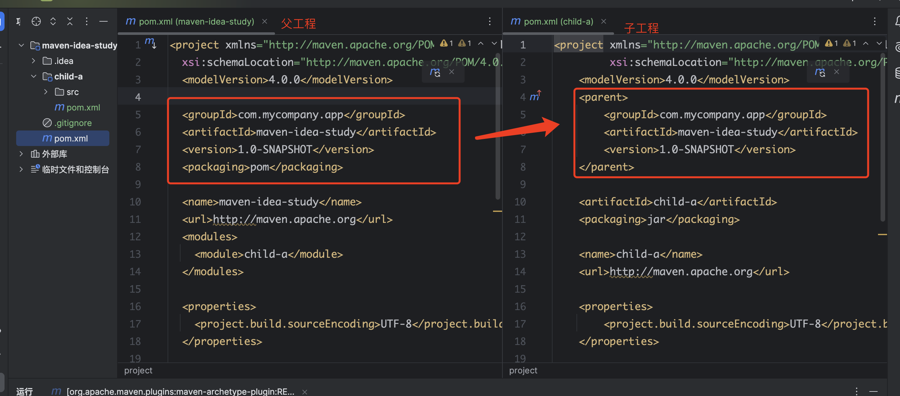

## 一、Maven安装

> https://maven.apache.org/download.cgi

### 1、Maven特点

> - Apache Maven 是一个软件项目管理和理解工具。基于项目对象模型（POM）的概念，Maven 可以从一个中心信息管理项目的构建、报告和文档。

#### 1.1 管理项目依赖

> - Maven主要是用来管理依赖，与go的module模式一样来管理项目依赖
>
> - Maven主要是在POM的xml文件中高速Maven我们需要哪些依赖，Maven会自动的将jar包以及它所以来的其他所有的jar包全部下载并导入项目中

#### 1.2 管理项目构建

> Maven解决的另一个问题是构建管理

### 2、下载配置Maven

> 下载maven后配置环境变量，然后查看maven目录，在conf/settings.xml中可以看到maven的本地仓库存储目录
>
> 默认是在 `~/${username}/.m2/reposity`目录


> 查看maven版本


### 3、IDEA配置maven

> 下图是在IDEA中，默认会有一个maven


> 但是我们一般不用这个，需要使用自己安装配置的maven，从https://maven.apache.org/download.cgi下载maven，配置环境变量，按如下选择
>
> - Maven主路径：选择下载的maven目录
> - 用户设置文件：选择下的maven目录下conf/settings.xml文件
>   - 勾上重写即可
> - 本地仓库：这个可以不用修改，因为也是在 `~/${username}/.m2/reposity`目录，和maven目录下conf/settings.xml文件中设置的一样


## 二、Maven使用

### 1、命令行创建Maven工程

> 在官网有maven的快速使用文档：
>
> https://maven.apache.org/guides/getting-started/maven-in-five-minutes.html

```bash
mvn archetype:generate -DgroupId=com.mycompany.app -DartifactId=my-app -DarchetypeArtifactId=maven-archetype-quickstart -DarchetypeVersion=1.5 -DinteractiveMode=false
```

> 命令解释：
>
> - -DgroupId=com.mycompany.app ： 项目的组织标识
> - -DartifactId=my-app ：项目的唯一标识，项目的工程名字
> - -DarchetypeArtifactId=maven-archetype-quickstart： 项目的工程结构，保持默认即可

> 下面是命令行创建，首次的时候会比较慢，需要下载依赖

```bash
$ mvn archetype:generate -DgroupId=com.mycompany.app -DartifactId=my-app -DarchetypeArtifactId=maven-archetype-quickstart -DarchetypeVersion=1.5 -DinteractiveMode=false
[INFO] Scanning for projects...
Downloading from central: https://repo.maven.apache.org/maven2/org/apache/maven/plugins/maven-clean-plugin/3.2.0/maven-clean-plugin-3.2.0.pom
Downloaded from central: https://repo.maven.apache.org/maven2/org/apache/maven/plugins/maven-clean-plugin/3.2.0/maven-clean-plugin-3.2.0.pom (5.3 kB at 5.0 kB/s)
Downloading from central: https://repo.maven.apache.org/maven2/org/apache/maven/plugins/maven-plugins/35/maven-plugins-35.pom
Downloaded from central: https://repo.maven.apache.org/maven2/org/apache/maven/plugins/maven-plugins/35/maven-plugins-35.pom (9.9 kB at 50 kB/s)
Downloading from central: https://repo.maven.apache.org/maven2/org/apache/maven/maven-parent/35/maven-parent-35.pom
Downloaded from central: https://repo.maven.apache.org/maven2/org/apache/maven/maven-parent/35/maven-parent-35.pom (45 kB at 44 kB/s)
Downloading from central: https://repo.maven.apache.org/maven2/org/apache/apache/25/apache-25.pom
Downloaded from central: https://repo.maven.apache.org/maven2/org/apache/apache/25/apache-25.pom (21 kB at 105 kB/s)
Downloading from central: https://repo.maven.apache.org/maven2/org/apache/maven/plugins/maven-clean-plugin/3.2.0/maven-clean-plugin-3.2.0.jar
Downloaded from central: https://repo.maven.apache.org/maven2/org/apache/maven/plugins/maven-clean-plugin/3.2.0/maven-clean-plugin-3.2.0.jar (36 kB at 29 kB/s)
Downloading from central: https://repo.maven.apache.org/maven2/org/apache/maven/plugins/maven-install-plugin/3.1.2/maven-install-plugin-3.1.2.pom
Downloaded from central: https://repo.maven.apache.org/maven2/org/apache/maven/plugins/maven-install-plugin/3.1.2/maven-install-plugin-3.1.2.pom (8.5 kB at 14 kB/s)
Downloading from central: https://repo.maven.apache.org/maven2/org/apache/maven/plugins/maven-install-plugin/3.1.2/maven-install-plugin-3.1.2.jar
Downloaded from central: https://repo.maven.apache.org/maven2/org/apache/maven/plugins/maven-install-plugin/3.1.2/maven-install-plugin-3.1.2.jar (32 kB at 35 kB/s)
Downloading from central: https://repo.maven.apache.org/maven2/org/apache/maven/plugins/maven-deploy-plugin/3.1.2/maven-deploy-plugin-3.1.2.pom
Downloaded from central: https://repo.maven.apache.org/maven2/org/apache/maven/plugins/maven-deploy-plugin/3.1.2/maven-deploy-plugin-3.1.2.pom (9.6 kB at 21 kB/s)
Downloading from central: https://repo.maven.apache.org/maven2/org/apache/maven/plugins/maven-deploy-plugin/3.1.2/maven-deploy-plugin-3.1.2.jar
Downloaded from central: https://repo.maven.apache.org/maven2/org/apache/maven/plugins/maven-deploy-plugin/3.1.2/maven-deploy-plugin-3.1.2.jar (40 kB at 23 kB/s)
Downloading from central: https://repo.maven.apache.org/maven2/org/apache/maven/plugins/maven-antrun-plugin/3.1.0/maven-antrun-plugin-3.1.0.pom
Downloaded from central: https://repo.maven.apache.org/maven2/org/apache/maven/plugins/maven-antrun-plugin/3.1.0/maven-antrun-plugin-3.1.0.pom (9.1 kB at 23 kB/s)
Downloading from central: https://repo.maven.apache.org/maven2/org/apache/maven/plugins/maven-plugins/34/maven-plugins-34.pom
Downloaded from central: https://repo.maven.apache.org/maven2/org/apache/maven/plugins/maven-plugins/34/maven-plugins-34.pom (11 kB at 57 kB/s)
Downloading from central: https://repo.maven.apache.org/maven2/org/apache/maven/plugins/maven-antrun-plugin/3.1.0/maven-antrun-plugin-3.1.0.jar
Downloaded from central: https://repo.maven.apache.org/maven2/org/apache/maven/plugins/maven-antrun-plugin/3.1.0/maven-antrun-plugin-3.1.0.jar (41 kB at 5.5 kB/s)
Downloading from central: https://repo.maven.apache.org/maven2/org/apache/maven/plugins/maven-assembly-plugin/3.7.1/maven-assembly-plugin-3.7.1.pom
Downloaded from central: https://repo.maven.apache.org/maven2/org/apache/maven/plugins/maven-assembly-plugin/3.7.1/maven-assembly-plugin-3.7.1.pom (15 kB at 41 kB/s)
Downloading from central: https://repo.maven.apache.org/maven2/org/apache/maven/plugins/maven-assembly-plugin/3.7.1/maven-assembly-plugin-3.7.1.jar
Downloaded from central: https://repo.maven.apache.org/maven2/org/apache/maven/plugins/maven-assembly-plugin/3.7.1/maven-assembly-plugin-3.7.1.jar (240 kB at 185 kB/s)
Downloading from central: https://repo.maven.apache.org/maven2/org/apache/maven/plugins/maven-dependency-plugin/3.7.0/maven-dependency-plugin-3.7.0.pom
Downloaded from central: https://repo.maven.apache.org/maven2/org/apache/maven/plugins/maven-dependency-plugin/3.7.0/maven-dependency-plugin-3.7.0.pom (19 kB at 16 kB/s)
Downloading from central: https://repo.maven.apache.org/maven2/org/apache/maven/plugins/maven-dependency-plugin/3.7.0/maven-dependency-plugin-3.7.0.jar
Downloaded from central: https://repo.maven.apache.org/maven2/org/apache/maven/plugins/maven-dependency-plugin/3.7.0/maven-dependency-plugin-3.7.0.jar (207 kB at 104 kB/s)
Downloading from central: https://repo.maven.apache.org/maven2/org/apache/maven/plugins/maven-release-plugin/3.0.1/maven-release-plugin-3.0.1.pom
Downloaded from central: https://repo.maven.apache.org/maven2/org/apache/maven/plugins/maven-release-plugin/3.0.1/maven-release-plugin-3.0.1.pom (9.8 kB at 66 kB/s)
Downloading from central: https://repo.maven.apache.org/maven2/org/apache/maven/release/maven-release/3.0.1/maven-release-3.0.1.pom
Downloaded from central: https://repo.maven.apache.org/maven2/org/apache/maven/release/maven-release/3.0.1/maven-release-3.0.1.pom (11 kB at 74 kB/s)
Downloading from central: https://repo.maven.apache.org/maven2/org/apache/maven/plugins/maven-release-plugin/3.0.1/maven-release-plugin-3.0.1.jar
Downloaded from central: https://repo.maven.apache.org/maven2/org/apache/maven/plugins/maven-release-plugin/3.0.1/maven-release-plugin-3.0.1.jar (61 kB at 120 kB/s)
Downloading from central: https://repo.maven.apache.org/maven2/org/apache/maven/plugins/maven-metadata.xml
Downloading from central: https://repo.maven.apache.org/maven2/org/codehaus/mojo/maven-metadata.xml
Downloaded from central: https://repo.maven.apache.org/maven2/org/apache/maven/plugins/maven-metadata.xml (14 kB at 85 kB/s)
Downloaded from central: https://repo.maven.apache.org/maven2/org/codehaus/mojo/maven-metadata.xml (21 kB at 7.9 kB/s)
Downloading from central: https://repo.maven.apache.org/maven2/org/apache/maven/plugins/maven-archetype-plugin/maven-metadata.xml
Downloaded from central: https://repo.maven.apache.org/maven2/org/apache/maven/plugins/maven-archetype-plugin/maven-metadata.xml (1.0 kB at 8.3 kB/s)
Downloading from central: https://repo.maven.apache.org/maven2/org/apache/maven/plugins/maven-archetype-plugin/3.3.0/maven-archetype-plugin-3.3.0.pom
Downloaded from central: https://repo.maven.apache.org/maven2/org/apache/maven/plugins/maven-archetype-plugin/3.3.0/maven-archetype-plugin-3.3.0.pom (10 kB at 39 kB/s)
Downloading from central: https://repo.maven.apache.org/maven2/org/apache/maven/archetype/maven-archetype/3.3.0/maven-archetype-3.3.0.pom
Downloaded from central: https://repo.maven.apache.org/maven2/org/apache/maven/archetype/maven-archetype/3.3.0/maven-archetype-3.3.0.pom (9.9 kB at 44 kB/s)
Downloading from central: https://repo.maven.apache.org/maven2/org/apache/maven/plugins/maven-archetype-plugin/3.3.0/maven-archetype-plugin-3.3.0.jar
Downloaded from central: https://repo.maven.apache.org/maven2/org/apache/maven/plugins/maven-archetype-plugin/3.3.0/maven-archetype-plugin-3.3.0.jar (98 kB at 44 kB/s)
[INFO]
[INFO] ------------------< org.apache.maven:standalone-pom >-------------------
[INFO] Building Maven Stub Project (No POM) 1
[INFO] --------------------------------[ pom ]---------------------------------
[INFO]
[INFO] >>> archetype:3.3.0:generate (default-cli) > generate-sources @ standalone-pom >>>
[INFO]
[INFO] <<< archetype:3.3.0:generate (default-cli) < generate-sources @ standalone-pom <<<
[INFO]
[INFO]
[INFO] --- archetype:3.3.0:generate (default-cli) @ standalone-pom ---
Downloading from central: https://repo.maven.apache.org/maven2/org/apache/maven/archetype/archetype-catalog/3.3.0/archetype-catalog-3.3.0.pom
Downloaded from central: https://repo.maven.apache.org/maven2/org/apache/maven/archetype/archetype-catalog/3.3.0/archetype-catalog-3.3.0.pom (1.7 kB at 14 kB/s)
Downloading from central: https://repo.maven.apache.org/maven2/org/apache/maven/archetype/archetype-models/3.3.0/archetype-models-3.3.0.pom
Downloaded from central: https://repo.maven.apache.org/maven2/org/apache/maven/archetype/archetype-models/3.3.0/archetype-models-3.3.0.pom (3.0 kB at 18 kB/s)
Downloading from central: https://repo.maven.apache.org/maven2/org/apache/maven/archetype/archetype-descriptor/3.3.0/archetype-descriptor-3.3.0.pom
Downloaded from central: https://repo.maven.apache.org/maven2/org/apache/maven/archetype/archetype-descriptor/3.3.0/archetype-descriptor-3.3.0.pom (1.8 kB at 14 kB/s)
Downloading from central: https://repo.maven.apache.org/maven2/org/apache/maven/archetype/archetype-common/3.3.0/archetype-common-3.3.0.pom
Downloaded from central: https://repo.maven.apache.org/maven2/org/apache/maven/archetype/archetype-common/3.3.0/archetype-common-3.3.0.pom (17 kB at 64 kB/s)
Downloading from central: https://repo.maven.apache.org/maven2/org/apache/groovy/groovy/4.0.23/groovy-4.0.23.pom
Downloaded from central: https://repo.maven.apache.org/maven2/org/apache/groovy/groovy/4.0.23/groovy-4.0.23.pom (24 kB at 85 kB/s)
Downloading from central: https://repo.maven.apache.org/maven2/org/apache/ivy/ivy/2.5.2/ivy-2.5.2.pom
Downloaded from central: https://repo.maven.apache.org/maven2/org/apache/ivy/ivy/2.5.2/ivy-2.5.2.pom (6.8 kB at 15 kB/s)
Downloading from central: https://repo.maven.apache.org/maven2/org/apache/maven/shared/maven-invoker/3.3.0/maven-invoker-3.3.0.pom
Downloaded from central: https://repo.maven.apache.org/maven2/org/apache/maven/shared/maven-invoker/3.3.0/maven-invoker-3.3.0.pom (4.2 kB at 11 kB/s)
Downloading from central: https://repo.maven.apache.org/maven2/org/apache/maven/shared/maven-shared-components/42/maven-shared-components-42.pom
Downloaded from central: https://repo.maven.apache.org/maven2/org/apache/maven/shared/maven-shared-components/42/maven-shared-components-42.pom (3.8 kB at 28 kB/s)
Downloading from central: https://repo.maven.apache.org/maven2/commons-io/commons-io/2.17.0/commons-io-2.17.0.pom
Downloaded from central: https://repo.maven.apache.org/maven2/commons-io/commons-io/2.17.0/commons-io-2.17.0.pom (20 kB at 78 kB/s)
Downloading from central: https://repo.maven.apache.org/maven2/org/apache/commons/commons-parent/74/commons-parent-74.pom
Downloaded from central: https://repo.maven.apache.org/maven2/org/apache/commons/commons-parent/74/commons-parent-74.pom (78 kB at 93 kB/s)
Downloading from central: https://repo.maven.apache.org/maven2/org/junit/junit-bom/5.11.0/junit-bom-5.11.0.pom
Downloaded from central: https://repo.maven.apache.org/maven2/org/junit/junit-bom/5.11.0/junit-bom-5.11.0.pom (5.6 kB at 43 kB/s)
Downloading from central: https://repo.maven.apache.org/maven2/org/codehaus/plexus/plexus-velocity/2.1.0/plexus-velocity-2.1.0.pom
Downloaded from central: https://repo.maven.apache.org/maven2/org/codehaus/plexus/plexus-velocity/2.1.0/plexus-velocity-2.1.0.pom (4.1 kB at 28 kB/s)
Downloading from central: https://repo.maven.apache.org/maven2/org/apache/velocity/velocity-engine-core/2.3/velocity-engine-core-2.3.pom
Downloaded from central: https://repo.maven.apache.org/maven2/org/apache/velocity/velocity-engine-core/2.3/velocity-engine-core-2.3.pom (10 kB at 64 kB/s)
Downloading from central: https://repo.maven.apache.org/maven2/org/apache/velocity/velocity-engine-parent/2.3/velocity-engine-parent-2.3.pom
Downloaded from central: https://repo.maven.apache.org/maven2/org/apache/velocity/velocity-engine-parent/2.3/velocity-engine-parent-2.3.pom (14 kB at 27 kB/s)
Downloading from central: https://repo.maven.apache.org/maven2/org/apache/velocity/velocity-master/4/velocity-master-4.pom
Downloaded from central: https://repo.maven.apache.org/maven2/org/apache/velocity/velocity-master/4/velocity-master-4.pom (7.8 kB at 57 kB/s)
Downloading from central: https://repo.maven.apache.org/maven2/org/apache/commons/commons-lang3/3.11/commons-lang3-3.11.pom
Downloaded from central: https://repo.maven.apache.org/maven2/org/apache/commons/commons-lang3/3.11/commons-lang3-3.11.pom (30 kB at 98 kB/s)
Downloading from central: https://repo.maven.apache.org/maven2/org/apache/commons/commons-parent/51/commons-parent-51.pom
Downloaded from central: https://repo.maven.apache.org/maven2/org/apache/commons/commons-parent/51/commons-parent-51.pom (78 kB at 131 kB/s)
Downloading from central: https://repo.maven.apache.org/maven2/org/slf4j/slf4j-api/1.7.30/slf4j-api-1.7.30.pom
Downloaded from central: https://repo.maven.apache.org/maven2/org/slf4j/slf4j-api/1.7.30/slf4j-api-1.7.30.pom (3.8 kB at 29 kB/s)
Downloading from central: https://repo.maven.apache.org/maven2/org/slf4j/slf4j-parent/1.7.30/slf4j-parent-1.7.30.pom
Downloaded from central: https://repo.maven.apache.org/maven2/org/slf4j/slf4j-parent/1.7.30/slf4j-parent-1.7.30.pom (14 kB at 30 kB/s)
Downloading from central: https://repo.maven.apache.org/maven2/com/ibm/icu/icu4j/75.1/icu4j-75.1.pom
Downloaded from central: https://repo.maven.apache.org/maven2/com/ibm/icu/icu4j/75.1/icu4j-75.1.pom (13 kB at 80 kB/s)
Downloading from central: https://repo.maven.apache.org/maven2/com/ibm/icu/icu4j-root/75.1/icu4j-root-75.1.pom
Downloaded from central: https://repo.maven.apache.org/maven2/com/ibm/icu/icu4j-root/75.1/icu4j-root-75.1.pom (27 kB at 109 kB/s)
Downloading from central: https://repo.maven.apache.org/maven2/org/codehaus/plexus/plexus-archiver/4.10.0/plexus-archiver-4.10.0.pom
Downloaded from central: https://repo.maven.apache.org/maven2/org/codehaus/plexus/plexus-archiver/4.10.0/plexus-archiver-4.10.0.pom (5.8 kB at 26 kB/s)
Downloading from central: https://repo.maven.apache.org/maven2/org/codehaus/plexus/plexus-io/3.5.0/plexus-io-3.5.0.pom
Downloaded from central: https://repo.maven.apache.org/maven2/org/codehaus/plexus/plexus-io/3.5.0/plexus-io-3.5.0.pom (4.3 kB at 33 kB/s)
Downloading from central: https://repo.maven.apache.org/maven2/org/apache/commons/commons-compress/1.26.2/commons-compress-1.26.2.pom
Downloaded from central: https://repo.maven.apache.org/maven2/org/apache/commons/commons-compress/1.26.2/commons-compress-1.26.2.pom (23 kB at 117 kB/s)
Downloading from central: https://repo.maven.apache.org/maven2/commons-codec/commons-codec/1.17.0/commons-codec-1.17.0.pom
Downloaded from central: https://repo.maven.apache.org/maven2/commons-codec/commons-codec/1.17.0/commons-codec-1.17.0.pom (18 kB at 98 kB/s)
Downloading from central: https://repo.maven.apache.org/maven2/io/airlift/aircompressor/0.27/aircompressor-0.27.pom
Downloaded from central: https://repo.maven.apache.org/maven2/io/airlift/aircompressor/0.27/aircompressor-0.27.pom (5.8 kB at 38 kB/s)
Downloading from central: https://repo.maven.apache.org/maven2/io/airlift/airbase/112/airbase-112.pom
Downloaded from central: https://repo.maven.apache.org/maven2/io/airlift/airbase/112/airbase-112.pom (69 kB at 132 kB/s)
Downloading from central: https://repo.maven.apache.org/maven2/org/junit/junit-bom/5.8.0-M1/junit-bom-5.8.0-M1.pom
Downloaded from central: https://repo.maven.apache.org/maven2/org/junit/junit-bom/5.8.0-M1/junit-bom-5.8.0-M1.pom (5.7 kB at 43 kB/s)
Downloading from central: https://repo.maven.apache.org/maven2/com/github/luben/zstd-jni/1.5.6-3/zstd-jni-1.5.6-3.pom
Downloaded from central: https://repo.maven.apache.org/maven2/com/github/luben/zstd-jni/1.5.6-3/zstd-jni-1.5.6-3.pom (2.0 kB at 16 kB/s)
Downloading from central: https://repo.maven.apache.org/maven2/org/codehaus/plexus/plexus-interactivity-api/1.3/plexus-interactivity-api-1.3.pom
Downloaded from central: https://repo.maven.apache.org/maven2/org/codehaus/plexus/plexus-interactivity-api/1.3/plexus-interactivity-api-1.3.pom (1.7 kB at 14 kB/s)
Downloading from central: https://repo.maven.apache.org/maven2/org/codehaus/plexus/plexus-interactivity/1.3/plexus-interactivity-1.3.pom
Downloaded from central: https://repo.maven.apache.org/maven2/org/codehaus/plexus/plexus-interactivity/1.3/plexus-interactivity-1.3.pom (1.9 kB at 14 kB/s)
Downloading from central: https://repo.maven.apache.org/maven2/org/apache/maven/plugin-tools/maven-plugin-annotations/3.13.1/maven-plugin-annotations-3.13.1.pom
Downloaded from central: https://repo.maven.apache.org/maven2/org/apache/maven/plugin-tools/maven-plugin-annotations/3.13.1/maven-plugin-annotations-3.13.1.pom (1.5 kB at 3.9 kB/s)
Downloading from central: https://repo.maven.apache.org/maven2/org/apache/maven/plugin-tools/maven-plugin-tools/3.13.1/maven-plugin-tools-3.13.1.pom
Downloaded from central: https://repo.maven.apache.org/maven2/org/apache/maven/plugin-tools/maven-plugin-tools/3.13.1/maven-plugin-tools-3.13.1.pom (18 kB at 101 kB/s)
Downloading from central: https://repo.maven.apache.org/maven2/org/apache/commons/commons-lang3/3.17.0/commons-lang3-3.17.0.pom
Downloaded from central: https://repo.maven.apache.org/maven2/org/apache/commons/commons-lang3/3.17.0/commons-lang3-3.17.0.pom (31 kB at 131 kB/s)
Downloading from central: https://repo.maven.apache.org/maven2/org/apache/commons/commons-parent/73/commons-parent-73.pom
Downloaded from central: https://repo.maven.apache.org/maven2/org/apache/commons/commons-parent/73/commons-parent-73.pom (78 kB at 98 kB/s)
Downloading from central: https://repo.maven.apache.org/maven2/org/apache/maven/shared/maven-script-interpreter/1.5/maven-script-interpreter-1.5.pom
Downloaded from central: https://repo.maven.apache.org/maven2/org/apache/maven/shared/maven-script-interpreter/1.5/maven-script-interpreter-1.5.pom (4.6 kB at 34 kB/s)
Downloading from central: https://repo.maven.apache.org/maven2/org/apache/groovy/groovy/4.0.20/groovy-4.0.20.pom
Downloaded from central: https://repo.maven.apache.org/maven2/org/apache/groovy/groovy/4.0.20/groovy-4.0.20.pom (24 kB at 109 kB/s)
Downloading from central: https://repo.maven.apache.org/maven2/org/apache/groovy/groovy-bom/4.0.20/groovy-bom-4.0.20.pom
Downloaded from central: https://repo.maven.apache.org/maven2/org/apache/groovy/groovy-bom/4.0.20/groovy-bom-4.0.20.pom (27 kB at 38 kB/s)
Downloading from central: https://repo.maven.apache.org/maven2/org/apache-extras/beanshell/bsh/2.0b6/bsh-2.0b6.pom
Downloaded from central: https://repo.maven.apache.org/maven2/org/apache-extras/beanshell/bsh/2.0b6/bsh-2.0b6.pom (5.0 kB at 34 kB/s)
Downloading from central: https://repo.maven.apache.org/maven2/org/apache/maven/archetype/archetype-catalog/3.3.0/archetype-catalog-3.3.0.jar
Downloaded from central: https://repo.maven.apache.org/maven2/org/apache/maven/archetype/archetype-catalog/3.3.0/archetype-catalog-3.3.0.jar (19 kB at 35 kB/s)
Downloading from central: https://repo.maven.apache.org/maven2/org/apache/maven/archetype/archetype-descriptor/3.3.0/archetype-descriptor-3.3.0.jar
Downloading from central: https://repo.maven.apache.org/maven2/org/apache/maven/archetype/archetype-common/3.3.0/archetype-common-3.3.0.jar
Downloading from central: https://repo.maven.apache.org/maven2/org/apache/groovy/groovy/4.0.23/groovy-4.0.23.jar
Downloading from central: https://repo.maven.apache.org/maven2/org/apache/ivy/ivy/2.5.2/ivy-2.5.2.jar
Downloading from central: https://repo.maven.apache.org/maven2/commons-io/commons-io/2.17.0/commons-io-2.17.0.jar
Downloaded from central: https://repo.maven.apache.org/maven2/org/apache/maven/archetype/archetype-descriptor/3.3.0/archetype-descriptor-3.3.0.jar (24 kB at 91 kB/s)
Downloading from central: https://repo.maven.apache.org/maven2/org/codehaus/plexus/plexus-velocity/2.1.0/plexus-velocity-2.1.0.jar
Downloaded from central: https://repo.maven.apache.org/maven2/org/codehaus/plexus/plexus-velocity/2.1.0/plexus-velocity-2.1.0.jar (5.6 kB at 14 kB/s)
Downloading from central: https://repo.maven.apache.org/maven2/com/ibm/icu/icu4j/75.1/icu4j-75.1.jar
Downloaded from central: https://repo.maven.apache.org/maven2/org/apache/maven/archetype/archetype-common/3.3.0/archetype-common-3.3.0.jar (174 kB at 122 kB/s)
Downloading from central: https://repo.maven.apache.org/maven2/org/apache/maven/maven-archiver/3.6.2/maven-archiver-3.6.2.jar
Downloaded from central: https://repo.maven.apache.org/maven2/org/apache/maven/maven-archiver/3.6.2/maven-archiver-3.6.2.jar (27 kB at 14 kB/s)
Downloading from central: https://repo.maven.apache.org/maven2/org/codehaus/plexus/plexus-interpolation/1.27/plexus-interpolation-1.27.jar
Downloaded from central: https://repo.maven.apache.org/maven2/org/codehaus/plexus/plexus-interpolation/1.27/plexus-interpolation-1.27.jar (86 kB at 34 kB/s)
Downloading from central: https://repo.maven.apache.org/maven2/org/codehaus/plexus/plexus-archiver/4.10.0/plexus-archiver-4.10.0.jar
Downloaded from central: https://repo.maven.apache.org/maven2/org/codehaus/plexus/plexus-archiver/4.10.0/plexus-archiver-4.10.0.jar (225 kB at 50 kB/s)
Downloading from central: https://repo.maven.apache.org/maven2/org/codehaus/plexus/plexus-io/3.5.0/plexus-io-3.5.0.jar
Downloaded from central: https://repo.maven.apache.org/maven2/commons-io/commons-io/2.17.0/commons-io-2.17.0.jar (516 kB at 105 kB/s)
Downloading from central: https://repo.maven.apache.org/maven2/org/apache/commons/commons-compress/1.26.2/commons-compress-1.26.2.jar
Downloaded from central: https://repo.maven.apache.org/maven2/org/codehaus/plexus/plexus-io/3.5.0/plexus-io-3.5.0.jar (79 kB at 15 kB/s)
Downloading from central: https://repo.maven.apache.org/maven2/commons-codec/commons-codec/1.17.0/commons-codec-1.17.0.jar
Downloaded from central: https://repo.maven.apache.org/maven2/commons-codec/commons-codec/1.17.0/commons-codec-1.17.0.jar (373 kB at 37 kB/s)
Downloading from central: https://repo.maven.apache.org/maven2/io/airlift/aircompressor/0.27/aircompressor-0.27.jar
Downloaded from central: https://repo.maven.apache.org/maven2/org/apache/commons/commons-compress/1.26.2/commons-compress-1.26.2.jar (1.1 MB at 102 kB/s)
Downloading from central: https://repo.maven.apache.org/maven2/com/github/luben/zstd-jni/1.5.6-3/zstd-jni-1.5.6-3.jar
Downloaded from central: https://repo.maven.apache.org/maven2/io/airlift/aircompressor/0.27/aircompressor-0.27.jar (255 kB at 21 kB/s)
Downloading from central: https://repo.maven.apache.org/maven2/org/codehaus/plexus/plexus-interactivity-api/1.3/plexus-interactivity-api-1.3.jar
Downloaded from central: https://repo.maven.apache.org/maven2/org/codehaus/plexus/plexus-interactivity-api/1.3/plexus-interactivity-api-1.3.jar (10 kB at 837 B/s)
Downloading from central: https://repo.maven.apache.org/maven2/org/apache/maven/plugin-tools/maven-plugin-annotations/3.13.1/maven-plugin-annotations-3.13.1.jar
Downloaded from central: https://repo.maven.apache.org/maven2/org/apache/ivy/ivy/2.5.2/ivy-2.5.2.jar (1.4 MB at 112 kB/s)
Downloading from central: https://repo.maven.apache.org/maven2/org/apache/maven/shared/maven-invoker/3.3.0/maven-invoker-3.3.0.jar
Downloaded from central: https://repo.maven.apache.org/maven2/org/apache/maven/plugin-tools/maven-plugin-annotations/3.13.1/maven-plugin-annotations-3.13.1.jar (14 kB at 1.1 kB/s)
Downloading from central: https://repo.maven.apache.org/maven2/org/apache/commons/commons-lang3/3.17.0/commons-lang3-3.17.0.jar
Downloaded from central: https://repo.maven.apache.org/maven2/org/apache/maven/shared/maven-invoker/3.3.0/maven-invoker-3.3.0.jar (34 kB at 2.7 kB/s)
Downloading from central: https://repo.maven.apache.org/maven2/org/apache/velocity/velocity-engine-core/2.3/velocity-engine-core-2.3.jar
Downloaded from central: https://repo.maven.apache.org/maven2/org/apache/commons/commons-lang3/3.17.0/commons-lang3-3.17.0.jar (674 kB at 41 kB/s)
Downloading from central: https://repo.maven.apache.org/maven2/org/apache/maven/shared/maven-script-interpreter/1.5/maven-script-interpreter-1.5.jar
Downloaded from central: https://repo.maven.apache.org/maven2/org/apache/maven/shared/maven-script-interpreter/1.5/maven-script-interpreter-1.5.jar (25 kB at 1.5 kB/s)
Downloading from central: https://repo.maven.apache.org/maven2/org/apache-extras/beanshell/bsh/2.0b6/bsh-2.0b6.jar
Downloaded from central: https://repo.maven.apache.org/maven2/org/apache/velocity/velocity-engine-core/2.3/velocity-engine-core-2.3.jar (531 kB at 29 kB/s)
Downloaded from central: https://repo.maven.apache.org/maven2/org/apache-extras/beanshell/bsh/2.0b6/bsh-2.0b6.jar (389 kB at 20 kB/s)
Downloaded from central: https://repo.maven.apache.org/maven2/org/apache/groovy/groovy/4.0.23/groovy-4.0.23.jar (7.6 MB at 134 kB/s)
Downloaded from central: https://repo.maven.apache.org/maven2/com/github/luben/zstd-jni/1.5.6-3/zstd-jni-1.5.6-3.jar (6.7 MB at 97 kB/s)
Downloaded from central: https://repo.maven.apache.org/maven2/com/ibm/icu/icu4j/75.1/icu4j-75.1.jar (14 MB at 149 kB/s)
[INFO] Generating project in Batch mode
Downloading from central: https://repo.maven.apache.org/maven2/archetype-catalog.xml
Downloaded from central: https://repo.maven.apache.org/maven2/archetype-catalog.xml (16 MB at 161 kB/s)
Downloading from central: https://repo.maven.apache.org/maven2/org/apache/maven/archetypes/maven-archetype-quickstart/1.5/maven-archetype-quickstart-1.5.jar
Downloaded from central: https://repo.maven.apache.org/maven2/org/apache/maven/archetypes/maven-archetype-quickstart/1.5/maven-archetype-quickstart-1.5.jar (11 kB at 59 kB/s)
[INFO] ----------------------------------------------------------------------------
[INFO] Using following parameters for creating project from Archetype: maven-archetype-quickstart:1.5
[INFO] ----------------------------------------------------------------------------
[INFO] Parameter: groupId, Value: com.mycompany.app
[INFO] Parameter: artifactId, Value: my-app
[INFO] Parameter: version, Value: 1.0-SNAPSHOT
[INFO] Parameter: package, Value: com.mycompany.app
[INFO] Parameter: packageInPathFormat, Value: com/mycompany/app
[INFO] Parameter: junitVersion, Value: 5.11.0
[INFO] Parameter: package, Value: com.mycompany.app
[INFO] Parameter: groupId, Value: com.mycompany.app
[INFO] Parameter: artifactId, Value: my-app
[INFO] Parameter: javaCompilerVersion, Value: 17
[INFO] Parameter: version, Value: 1.0-SNAPSHOT
[WARNING] Don't override file /Users/hibiscus/Desktop/code/java_code/mvn_study/my-app/src/main/java/com/mycompany/app
[WARNING] Don't override file /Users/hibiscus/Desktop/code/java_code/mvn_study/my-app/src/test/java/com/mycompany/app
[WARNING] CP Don't override file /Users/hibiscus/Desktop/code/java_code/mvn_study/my-app/.mvn
[INFO] Project created from Archetype in dir: /Users/hibiscus/Desktop/code/java_code/mvn_study/my-app
[INFO] ------------------------------------------------------------------------
[INFO] BUILD SUCCESS
[INFO] ------------------------------------------------------------------------
[INFO] Total time:  03:55 min
[INFO] Finished at: 2024-10-07T21:38:12+08:00
[INFO] ------------------------------------------------------------------------
```

> 创建后查看常见的项目，可以看到：
>
> - pom.xml文件
> - src目录
>   - main目录
>   - test目录


### 2、vscode打开maven项目

> 使用vscode查看上面maven创建的命令
>
> 可以看到有
>
> - App.java：示例代码
> - AppTest.java：示例测试代码
>
> - pom.xml：是maven核心的配置文件


> 查看pom.xml配置文件


#### 1.1 mvn compile命令

> `mvn compile`命令用来编译maven项目，
>
> - 生成target目录，
> - 在target目录中会生成java的`*.class`文件

```bash
mvn compile
```


#### 1.2 mvn package命令

> `mvn package`命令是把maven打包成`jar`包，可以直接来运行项目

```bash
╰─$ mvn package
[INFO] Scanning for projects...
[INFO] 
[INFO] ----------------------< com.mycompany.app:my-app >----------------------
[INFO] Building my-app 1.0-SNAPSHOT
[INFO]   from pom.xml
[INFO] --------------------------------[ jar ]---------------------------------
Downloading from central: https://repo.maven.apache.org/maven2/org/apache/maven/plugins/maven-surefire-plugin/3.3.0/maven-surefire-plugin-3.3.0.pom
Downloaded from central: https://repo.maven.apache.org/maven2/org/apache/maven/plugins/maven-surefire-plugin/3.3.0/maven-surefire-plugin-3.3.0.pom (5.7 kB at 3.8 kB/s)
Downloading from central: https://repo.maven.apache.org/maven2/org/apache/maven/surefire/surefire/3.3.0/surefire-3.3.0.pom
Downloaded from central: https://repo.maven.apache.org/maven2/org/apache/maven/surefire/surefire/3.3.0/surefire-3.3.0.pom (21 kB at 107 kB/s)
Downloading from central: https://repo.maven.apache.org/maven2/org/apache/maven/plugins/maven-surefire-plugin/3.3.0/maven-surefire-plugin-3.3.0.jar
Downloaded from central: https://repo.maven.apache.org/maven2/org/apache/maven/plugins/maven-surefire-plugin/3.3.0/maven-surefire-plugin-3.3.0.jar (45 kB at 193 kB/s)
Downloading from central: https://repo.maven.apache.org/maven2/org/junit/jupiter/junit-jupiter-api/5.11.0/junit-jupiter-api-5.11.0.jar
Downloaded from central: https://repo.maven.apache.org/maven2/org/junit/jupiter/junit-jupiter-api/5.11.0/junit-jupiter-api-5.11.0.jar (216 kB at 336 kB/s)
Downloading from central: https://repo.maven.apache.org/maven2/org/junit/platform/junit-platform-commons/1.11.0/junit-platform-commons-1.11.0.jar
Downloading from central: https://repo.maven.apache.org/maven2/org/junit/jupiter/junit-jupiter-params/5.11.0/junit-jupiter-params-5.11.0.jar
Downloaded from central: https://repo.maven.apache.org/maven2/org/junit/platform/junit-platform-commons/1.11.0/junit-platform-commons-1.11.0.jar (141 kB at 334 kB/s)
Downloaded from central: https://repo.maven.apache.org/maven2/org/junit/jupiter/junit-jupiter-params/5.11.0/junit-jupiter-params-5.11.0.jar (591 kB at 402 kB/s)
[INFO] 
[INFO] --- resources:3.3.1:resources (default-resources) @ my-app ---
[INFO] skip non existing resourceDirectory /Users/hibiscus/Desktop/code/java_code/mvn_study/my-app/src/main/resources
[INFO] 
[INFO] --- compiler:3.13.0:compile (default-compile) @ my-app ---
[INFO] Nothing to compile - all classes are up to date.
[INFO] 
[INFO] --- resources:3.3.1:testResources (default-testResources) @ my-app ---
[INFO] skip non existing resourceDirectory /Users/hibiscus/Desktop/code/java_code/mvn_study/my-app/src/test/resources
[INFO] 
[INFO] --- compiler:3.13.0:testCompile (default-testCompile) @ my-app ---
[INFO] Recompiling the module because of changed source code.
[INFO] Compiling 1 source file with javac [debug release 17] to target/test-classes
[INFO] 
[INFO] --- surefire:3.3.0:test (default-test) @ my-app ---
Downloading from central: https://repo.maven.apache.org/maven2/org/apache/maven/surefire/surefire-api/3.3.0/surefire-api-3.3.0.pom
Downloaded from central: https://repo.maven.apache.org/maven2/org/apache/maven/surefire/surefire-api/3.3.0/surefire-api-3.3.0.pom (3.5 kB at 25 kB/s)
Downloading from central: https://repo.maven.apache.org/maven2/org/apache/maven/surefire/surefire-logger-api/3.3.0/surefire-logger-api-3.3.0.pom
Downloaded from central: https://repo.maven.apache.org/maven2/org/apache/maven/surefire/surefire-logger-api/3.3.0/surefire-logger-api-3.3.0.pom (3.3 kB at 25 kB/s)
Downloading from central: https://repo.maven.apache.org/maven2/org/apache/maven/surefire/surefire-shared-utils/3.3.0/surefire-shared-utils-3.3.0.pom
Downloaded from central: https://repo.maven.apache.org/maven2/org/apache/maven/surefire/surefire-shared-utils/3.3.0/surefire-shared-utils-3.3.0.pom (4.1 kB at 31 kB/s)
Downloading from central: https://repo.maven.apache.org/maven2/org/apache/maven/surefire/surefire-extensions-api/3.3.0/surefire-extensions-api-3.3.0.pom
Downloaded from central: https://repo.maven.apache.org/maven2/org/apache/maven/surefire/surefire-extensions-api/3.3.0/surefire-extensions-api-3.3.0.pom (3.5 kB at 21 kB/s)
Downloading from central: https://repo.maven.apache.org/maven2/org/apache/maven/surefire/maven-surefire-common/3.3.0/maven-surefire-common-3.3.0.pom
Downloaded from central: https://repo.maven.apache.org/maven2/org/apache/maven/surefire/maven-surefire-common/3.3.0/maven-surefire-common-3.3.0.pom (7.8 kB at 60 kB/s)
Downloading from central: https://repo.maven.apache.org/maven2/org/apache/maven/surefire/surefire-booter/3.3.0/surefire-booter-3.3.0.pom
Downloaded from central: https://repo.maven.apache.org/maven2/org/apache/maven/surefire/surefire-booter/3.3.0/surefire-booter-3.3.0.pom (4.8 kB at 35 kB/s)
Downloading from central: https://repo.maven.apache.org/maven2/org/apache/maven/surefire/surefire-extensions-spi/3.3.0/surefire-extensions-spi-3.3.0.pom
Downloaded from central: https://repo.maven.apache.org/maven2/org/apache/maven/surefire/surefire-extensions-spi/3.3.0/surefire-extensions-spi-3.3.0.pom (1.8 kB at 14 kB/s)
Downloading from central: https://repo.maven.apache.org/maven2/org/apache/maven/resolver/maven-resolver-util/1.4.1/maven-resolver-util-1.4.1.pom
Downloaded from central: https://repo.maven.apache.org/maven2/org/apache/maven/resolver/maven-resolver-util/1.4.1/maven-resolver-util-1.4.1.pom (2.8 kB at 21 kB/s)
Downloading from central: https://repo.maven.apache.org/maven2/org/apache/maven/resolver/maven-resolver/1.4.1/maven-resolver-1.4.1.pom
Downloaded from central: https://repo.maven.apache.org/maven2/org/apache/maven/resolver/maven-resolver/1.4.1/maven-resolver-1.4.1.pom (18 kB at 127 kB/s)
Downloading from central: https://repo.maven.apache.org/maven2/org/apache/maven/maven-parent/33/maven-parent-33.pom
Downloaded from central: https://repo.maven.apache.org/maven2/org/apache/maven/maven-parent/33/maven-parent-33.pom (44 kB at 134 kB/s)
Downloading from central: https://repo.maven.apache.org/maven2/org/apache/maven/resolver/maven-resolver-api/1.4.1/maven-resolver-api-1.4.1.pom
Downloaded from central: https://repo.maven.apache.org/maven2/org/apache/maven/resolver/maven-resolver-api/1.4.1/maven-resolver-api-1.4.1.pom (2.6 kB at 20 kB/s)
Downloading from central: https://repo.maven.apache.org/maven2/org/apache/maven/shared/maven-common-artifact-filters/3.4.0/maven-common-artifact-filters-3.4.0.pom
Downloaded from central: https://repo.maven.apache.org/maven2/org/apache/maven/shared/maven-common-artifact-filters/3.4.0/maven-common-artifact-filters-3.4.0.pom (5.4 kB at 42 kB/s)
Downloading from central: https://repo.maven.apache.org/maven2/org/apache/maven/surefire/surefire-api/3.3.0/surefire-api-3.3.0.jar
Downloaded from central: https://repo.maven.apache.org/maven2/org/apache/maven/surefire/surefire-api/3.3.0/surefire-api-3.3.0.jar (171 kB at 319 kB/s)
Downloading from central: https://repo.maven.apache.org/maven2/org/apache/maven/surefire/surefire-logger-api/3.3.0/surefire-logger-api-3.3.0.jar
Downloading from central: https://repo.maven.apache.org/maven2/org/apache/maven/surefire/surefire-shared-utils/3.3.0/surefire-shared-utils-3.3.0.jar
Downloading from central: https://repo.maven.apache.org/maven2/org/apache/maven/surefire/surefire-extensions-api/3.3.0/surefire-extensions-api-3.3.0.jar
Downloading from central: https://repo.maven.apache.org/maven2/org/apache/maven/surefire/maven-surefire-common/3.3.0/maven-surefire-common-3.3.0.jar
Downloading from central: https://repo.maven.apache.org/maven2/org/apache/maven/surefire/surefire-booter/3.3.0/surefire-booter-3.3.0.jar
Downloaded from central: https://repo.maven.apache.org/maven2/org/apache/maven/surefire/surefire-logger-api/3.3.0/surefire-logger-api-3.3.0.jar (14 kB at 74 kB/s)
Downloading from central: https://repo.maven.apache.org/maven2/org/apache/maven/surefire/surefire-extensions-spi/3.3.0/surefire-extensions-spi-3.3.0.jar
Downloaded from central: https://repo.maven.apache.org/maven2/org/apache/maven/surefire/surefire-extensions-spi/3.3.0/surefire-extensions-spi-3.3.0.jar (8.2 kB at 22 kB/s)
Downloading from central: https://repo.maven.apache.org/maven2/org/apache/maven/resolver/maven-resolver-util/1.4.1/maven-resolver-util-1.4.1.jar
Downloaded from central: https://repo.maven.apache.org/maven2/org/apache/maven/surefire/surefire-extensions-api/3.3.0/surefire-extensions-api-3.3.0.jar (26 kB at 25 kB/s)
Downloading from central: https://repo.maven.apache.org/maven2/org/apache/maven/resolver/maven-resolver-api/1.4.1/maven-resolver-api-1.4.1.jar
Downloaded from central: https://repo.maven.apache.org/maven2/org/apache/maven/resolver/maven-resolver-util/1.4.1/maven-resolver-util-1.4.1.jar (168 kB at 118 kB/s)
Downloading from central: https://repo.maven.apache.org/maven2/org/apache/maven/shared/maven-common-artifact-filters/3.4.0/maven-common-artifact-filters-3.4.0.jar
Downloaded from central: https://repo.maven.apache.org/maven2/org/apache/maven/surefire/surefire-booter/3.3.0/surefire-booter-3.3.0.jar (118 kB at 80 kB/s)
Downloaded from central: https://repo.maven.apache.org/maven2/org/apache/maven/shared/maven-common-artifact-filters/3.4.0/maven-common-artifact-filters-3.4.0.jar (58 kB at 35 kB/s)
Downloaded from central: https://repo.maven.apache.org/maven2/org/apache/maven/resolver/maven-resolver-api/1.4.1/maven-resolver-api-1.4.1.jar (149 kB at 74 kB/s)
Downloaded from central: https://repo.maven.apache.org/maven2/org/apache/maven/surefire/maven-surefire-common/3.3.0/maven-surefire-common-3.3.0.jar (308 kB at 149 kB/s)
Downloaded from central: https://repo.maven.apache.org/maven2/org/apache/maven/surefire/surefire-shared-utils/3.3.0/surefire-shared-utils-3.3.0.jar (2.8 MB at 852 kB/s)
[INFO] Using auto detected provider org.apache.maven.surefire.junitplatform.JUnitPlatformProvider
Downloading from central: https://repo.maven.apache.org/maven2/org/apache/maven/surefire/surefire-junit-platform/3.3.0/surefire-junit-platform-3.3.0.pom
Downloaded from central: https://repo.maven.apache.org/maven2/org/apache/maven/surefire/surefire-junit-platform/3.3.0/surefire-junit-platform-3.3.0.pom (5.7 kB at 30 kB/s)
Downloading from central: https://repo.maven.apache.org/maven2/org/apache/maven/surefire/surefire-providers/3.3.0/surefire-providers-3.3.0.pom
Downloaded from central: https://repo.maven.apache.org/maven2/org/apache/maven/surefire/surefire-providers/3.3.0/surefire-providers-3.3.0.pom (2.6 kB at 21 kB/s)
Downloading from central: https://repo.maven.apache.org/maven2/org/apache/maven/surefire/common-java5/3.3.0/common-java5-3.3.0.pom
Downloaded from central: https://repo.maven.apache.org/maven2/org/apache/maven/surefire/common-java5/3.3.0/common-java5-3.3.0.pom (2.8 kB at 21 kB/s)
Downloading from central: https://repo.maven.apache.org/maven2/org/junit/platform/junit-platform-engine/1.9.3/junit-platform-engine-1.9.3.pom
Downloaded from central: https://repo.maven.apache.org/maven2/org/junit/platform/junit-platform-engine/1.9.3/junit-platform-engine-1.9.3.pom (3.2 kB at 24 kB/s)
Downloading from central: https://repo.maven.apache.org/maven2/org/opentest4j/opentest4j/1.2.0/opentest4j-1.2.0.pom
Downloaded from central: https://repo.maven.apache.org/maven2/org/opentest4j/opentest4j/1.2.0/opentest4j-1.2.0.pom (1.7 kB at 12 kB/s)
Downloading from central: https://repo.maven.apache.org/maven2/org/junit/platform/junit-platform-commons/1.9.3/junit-platform-commons-1.9.3.pom
Downloaded from central: https://repo.maven.apache.org/maven2/org/junit/platform/junit-platform-commons/1.9.3/junit-platform-commons-1.9.3.pom (2.8 kB at 19 kB/s)
Downloading from central: https://repo.maven.apache.org/maven2/org/junit/platform/junit-platform-launcher/1.9.3/junit-platform-launcher-1.9.3.pom
Downloaded from central: https://repo.maven.apache.org/maven2/org/junit/platform/junit-platform-launcher/1.9.3/junit-platform-launcher-1.9.3.pom (3.0 kB at 23 kB/s)
Downloading from central: https://repo.maven.apache.org/maven2/org/apache/maven/surefire/surefire-junit-platform/3.3.0/surefire-junit-platform-3.3.0.jar
Downloaded from central: https://repo.maven.apache.org/maven2/org/apache/maven/surefire/surefire-junit-platform/3.3.0/surefire-junit-platform-3.3.0.jar (27 kB at 143 kB/s)
Downloading from central: https://repo.maven.apache.org/maven2/org/apache/maven/surefire/common-java5/3.3.0/common-java5-3.3.0.jar
Downloading from central: https://repo.maven.apache.org/maven2/org/junit/platform/junit-platform-engine/1.9.3/junit-platform-engine-1.9.3.jar
Downloading from central: https://repo.maven.apache.org/maven2/org/opentest4j/opentest4j/1.2.0/opentest4j-1.2.0.jar
Downloading from central: https://repo.maven.apache.org/maven2/org/junit/platform/junit-platform-commons/1.9.3/junit-platform-commons-1.9.3.jar
Downloading from central: https://repo.maven.apache.org/maven2/org/junit/platform/junit-platform-launcher/1.9.3/junit-platform-launcher-1.9.3.jar
Downloaded from central: https://repo.maven.apache.org/maven2/org/apache/maven/surefire/common-java5/3.3.0/common-java5-3.3.0.jar (18 kB at 132 kB/s)
Downloaded from central: https://repo.maven.apache.org/maven2/org/opentest4j/opentest4j/1.2.0/opentest4j-1.2.0.jar (7.7 kB at 52 kB/s)
Downloaded from central: https://repo.maven.apache.org/maven2/org/junit/platform/junit-platform-commons/1.9.3/junit-platform-commons-1.9.3.jar (103 kB at 299 kB/s)
Downloaded from central: https://repo.maven.apache.org/maven2/org/junit/platform/junit-platform-engine/1.9.3/junit-platform-engine-1.9.3.jar (189 kB at 412 kB/s)
Downloaded from central: https://repo.maven.apache.org/maven2/org/junit/platform/junit-platform-launcher/1.9.3/junit-platform-launcher-1.9.3.jar (169 kB at 365 kB/s)
Downloading from central: https://repo.maven.apache.org/maven2/org/junit/jupiter/junit-jupiter-engine/5.11.0/junit-jupiter-engine-5.11.0.pom
Downloaded from central: https://repo.maven.apache.org/maven2/org/junit/jupiter/junit-jupiter-engine/5.11.0/junit-jupiter-engine-5.11.0.pom (3.2 kB at 23 kB/s)
Downloading from central: https://repo.maven.apache.org/maven2/org/junit/platform/junit-platform-engine/1.11.0/junit-platform-engine-1.11.0.pom
Downloaded from central: https://repo.maven.apache.org/maven2/org/junit/platform/junit-platform-engine/1.11.0/junit-platform-engine-1.11.0.pom (3.2 kB at 25 kB/s)
Downloading from central: https://repo.maven.apache.org/maven2/org/junit/jupiter/junit-jupiter-engine/5.11.0/junit-jupiter-engine-5.11.0.jar
Downloaded from central: https://repo.maven.apache.org/maven2/org/junit/jupiter/junit-jupiter-engine/5.11.0/junit-jupiter-engine-5.11.0.jar (260 kB at 373 kB/s)
Downloading from central: https://repo.maven.apache.org/maven2/org/junit/platform/junit-platform-engine/1.11.0/junit-platform-engine-1.11.0.jar
Downloaded from central: https://repo.maven.apache.org/maven2/org/junit/platform/junit-platform-engine/1.11.0/junit-platform-engine-1.11.0.jar (238 kB at 603 kB/s)
Downloading from central: https://repo.maven.apache.org/maven2/org/junit/platform/junit-platform-launcher/1.11.0/junit-platform-launcher-1.11.0.pom
Downloaded from central: https://repo.maven.apache.org/maven2/org/junit/platform/junit-platform-launcher/1.11.0/junit-platform-launcher-1.11.0.pom (3.0 kB at 16 kB/s)
Downloading from central: https://repo.maven.apache.org/maven2/org/junit/platform/junit-platform-launcher/1.11.0/junit-platform-launcher-1.11.0.jar
Downloaded from central: https://repo.maven.apache.org/maven2/org/junit/platform/junit-platform-launcher/1.11.0/junit-platform-launcher-1.11.0.jar (189 kB at 558 kB/s)
[INFO] 
[INFO] -------------------------------------------------------
[INFO]  T E S T S
[INFO] -------------------------------------------------------
[INFO] Running com.mycompany.app.AppTest
[INFO] Tests run: 1, Failures: 0, Errors: 0, Skipped: 0, Time elapsed: 0.054 s -- in com.mycompany.app.AppTest
[INFO] 
```


##### 1.1.1 运行jar包

```bash
java -cp target/my-app-1.0-SNAPSHOT.jar com.mycompany.app.App
```

> com.mycompany.app.App是项目的主入口类名


> 可以看到项目输出了`Hello World!`
>
> 表示项目已经成功编译和运行

### 3、IDEA创建Maven工程


> 可以看到和命令行创建的目录一样，接下来注意修改maven的配置路径


#### 1.1 IDEA中maven配置

> 会看到有三个部分
>
> - 生命周期
>   - 管理maven项目的生命周期
>   - 生命周期也都是使用下面一个或多个插件来实现的
> - 插件
>   - 插件是用来实现生命周期的
> - 依赖项
>   - 项目所需要的依赖项


### 4、Maven生命周期

> Maven的生命周期主要有三种
>
> - clean
>   - 用来删除编译的二进制文件、打包的jar包
>   - 和`mav clean`命令一样
> - default，包括：
>   - validate
>     - 验证配置项是否正确
>   - compile
>     - 编译maven项目为字节码文件，
>     - 与命令行的`mvn compile`一样
>   - test
>     - 执行maven的test目录下的所有测试代码
>     - 会先编译再执行test
>   - package
>     - 打包maven为jar包
>     - 与命令行的`mvn package`一样
>     - 执行package时会按顺序执行`compile`、`test`、`package`
>   - verify（不常用）
>     - 验证是否符合代码质量规则
>   - install
>     - 把项目打包的jar包复制到maven的conf/settings.xml中配置的本地的仓库目录下
> - site
>   - 把项目打包的jar包上传到公司内部的私服仓库

#### 1.1 解决IDEA不显示target

> 按下图勾选即可


#### 1.2 IDEA中Maven打包

> 可以看到和命令行打包生成的内容一样


### 5、Maven坐标与存储目录

#### 1.1 Maven坐标

> maven坐标是一个项目的唯一标识，由三个部分组成
>
> - groupId
>   - 公司或组织的唯一标识
> - artifactId
>   - 项目的唯一标识
> - version
>   - 项目的版本号，用来区分不同版本
>   - 快照版：snapshot是项目还没有正式发布的时候临时使用
>   - 正式版：是一个稳定发行版本，是到生产环境使用


#### 1.2 仓库存储目录

> 当知道了jar包的坐标，就可以在本地仓库中找到这个jar包


#### 1.3 查找jar坐标网站

> 这个网站就可以看到想要的包的坐标
>
> https://mvnrepository.com/


> 将上面框中的坐标复制到`pom.xml`文件中


> 在idea中重载项目即可


> 查看本地仓库的下载的jar包


### 6、依赖管理

#### 1.1 scope概念

> 在Maven的坐标中还有一个scope概念，是用来指定依赖范围，主要有
>
> - compile：是指这个依赖是编译和运行时都需要的，默认可以不写
> - provided：是指定这个依赖是编译时需要，但运行时不需要
> - runtime：是指定这个依赖在运行时需要，但编译时不需要
> - test：是指这个依赖只在测试的时候需要，不会被打包到最终的jar包
>   - 仅只能在测试代码中导入依赖和使用，在其他非测试代码中无法导入
>   - 还可以减少jar包体积
> - system：是指依赖在本地系统中使用，必须要提供一个`systemPath`标签，用来指定这个依赖的本地地址，不需要从仓库中查找
>   - 仅了解，不推荐使用


#### 1.2 添加直接依赖

> 在https://mvnrepository.com/找到依赖坐标，添加到`pom.xml`文件中，然后刷新重新下载依赖即可

#### 1.3 添加间接依赖

> 我们只需要在`pom.xml`中添加直接依赖，maven会管理并下载对应的间接依赖，不需要我们显式的写在`pom.xml`中
>
> 需要注意只有依赖范围是`compile`才会被传递

#### 1.4 依赖冲突

> 当同样的依赖出现在项目中时，maven会有如下规则:
>
> - 路径最短的那个依赖会被使用
> - 先声明先优先，在`pom.xml`哪个依赖坐标写在最前面就先被使用

### 7、父子工程

> 一个项目会有多个应用，maven会通过父子工程管理依赖
>
> 在maven项目中，`<packaging></packaging>`标签用来标识打包成什么类型：
>
> - war：是一个web项目
> - jar：是一个jar包，也是默认的打包方式
> - pom：是表示用来管理其他子工程，不会打包成任何的`jar`或`war`包

#### 1.1 父工程

> - 在idea中创建maven工程，然后修改`pom.xml`文件
>   - 修改为`<packaging>jar</packaging>`为``<packaging>pom</packaging>``

```xml
  <groupId>com.mycompany.app</groupId>
  <artifactId>maven-idea-study</artifactId>
  <version>1.0-SNAPSHOT</version>
  <packaging>pom</packaging>
```


#### 1.2 子工程

> 将父工程的src目录删除掉，因为是父子工程，所以不需要父工程的src目录

> 在父工程右键选择创建`模块`，选择创建`maven`项目


##### 1.1.1 查看父子工程pom文件

> 可以看到子工程的`pom.xml`多了一个`parent`节点，指定了父工程的坐标



> - 在父工程中多了一个`modules`节点，制定了对应的子模块，这叫聚合，
>
> - 可以管理多个模块，也就是执行父工程的任何一个生命周期命令，都会自动的对其`modules`节点下所有的子模块都会执行对应的生命周期命令
>   - 比如`compile`、`clean`、`package`等maven命令


#### 1.3 依赖冲突

> 多个子工程的依赖冲突：
>
> 项目中有两个不同的依赖，但是又依赖了同一个jar包的不同版本的时候，就出现一来冲突
>
> 比如
>
> - 模块A依赖模块B和C
> - 模块B和C又都依赖同一个jar包，但依赖的jar包版本号还不一样

##### 1.1.1 子模块a添加其他子模块依赖

> 在子模块a的`pom.xml`中添加其他子模块依赖


> 依赖的子模块的坐标其他节点配置信息idea会自动匹配出来


> 可以看到子模块a已经依赖了模块b和模块c


##### 1.1.2 模块b与模块c添加不同版本依赖

> 在子模块b和c添加jdbc的不同版本依赖，构造依赖冲突


> 子模块a重新拉取依赖，可以看到子模块b和c使用了jdbc的不同版本，但是提示有冲突


##### 1.1.3 解决冲突方式1

> 在子模块a中的`dependency`节点下找到依赖的子模块b，然后添加排除的节点`<exclusions>`
>
> 不需要添加`version`节点，会把所有版本的都排除掉


> 可以看到child-c的还是置灰色，重启一下IDEA的项目即可


##### 1.1.4 解决冲突方式2

> 在子模块b中添加<options>节点也可以排除冲突的模块，不传递给上层依赖的模块


#### 1.4 依赖继承

##### 1.1.1 [不推荐]父工程强制传递依赖

> 将所有子模块都需要的依赖在父工程的`pom.xml`中定义，就可以都传递到子模块中，并且子模块的`pom.xml`还可以不用显式的写依赖坐标，那这就是依赖继承
>
> 注意在父工程中定义的依赖都会无条件的被传递到子工程中，但是这样的弊端是无论子模块是否都需要这个依赖，都会被强制继承


##### 1.1.2 父工程可选传递依赖

> 为了避免父工程强制传递依赖给所有的子模块，maven提供了`<dependencyManagement>`节点来进行依赖管理，然后再里面再添加一个`<dependencies>`标签，这样子模块就不会自动强制继承父工程依赖了，子模块可以手动选择需要集成的依赖


> 在子模块中手动添加需要的依赖，不需要写`<version>`节点，不用写版本号，已经由父工程中依赖指定了版本号


### 8、properties标签

> 用来定义公共属性，可以多处使用


## 三、私服仓库

### 1、Nexus私服仓库

> https://help.sonatype.com/en/orientdb-downloads.html

#### 1.1 Nexus安装

> docker安装：https://hub.docker.com/r/sonatype/nexus3
>
> 源文件安装：https://help.sonatype.com/en/orientdb-downloads.html
