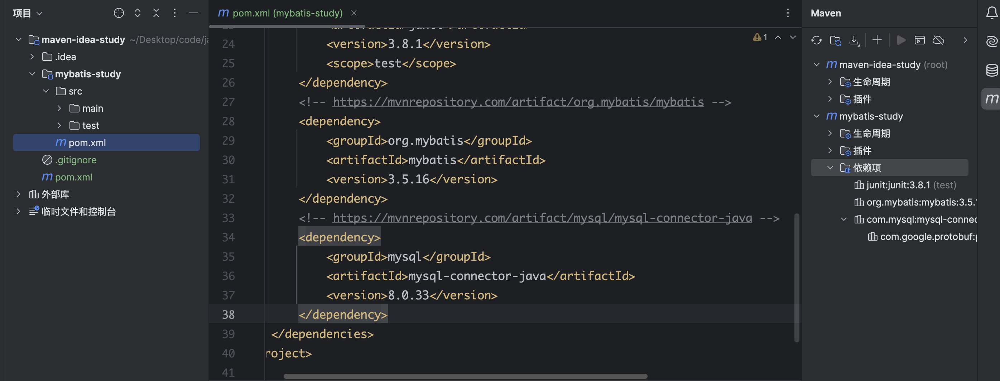
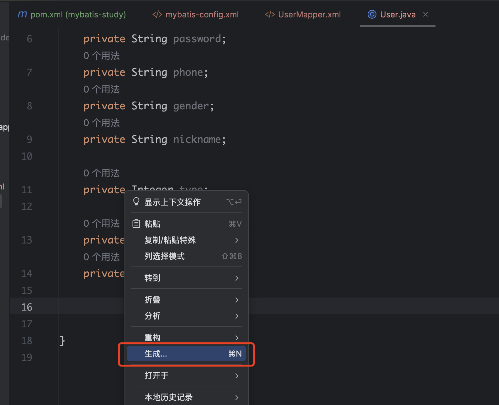
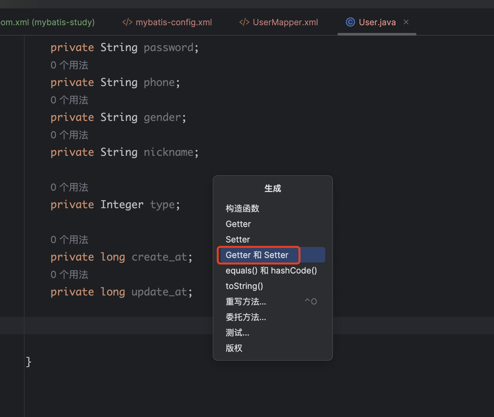

## 一、Mybatis介绍

> Mybatis是一款优秀的持久层框架，支持定制化SQL、存储过程与高级映射
>
> Mybatis避免了所有的JDBC代码和手动设置参数以及获取结果集合，
>
> Mybatis可使用简单的XML或注解来配置和映射原生信息，并将接口和Java的POJO(Plan Ordinary Java Object)将普通的Java对象映射成数据库中的记录
>
> 说到底就是其他语言中的ORM
>
> 官网：https://mybatis.org/mybatis-3/zh_CN/index.html
>
> 本文使用的是：3.5.16版本

### 1、Maven安装mybatis

> 在maven工程中，是用`pom.xml`管理依赖，那么就可以用来管理mybatis
>
> 查找mybatis的maven坐标：https://mvnrepository.com/artifact/org.mybatis/mybatis


### 2、Maven安装Mysql驱动

> 在maven工程中，是用`pom.xml`管理依赖，需要连接mysql，那就需要mysql驱动
>
> 查找mysql驱动的maven坐标：https://mvnrepository.com/artifact/mysql/mysql-connector-java/8.0.33



## 二、Maven使用

1、

### 2、生成数据实体类

> 在实体类右键选择`生成`



> 选择`Getter和Setter`



> 选中所有点击`创建`


> 查看生成的实体类

```java
package com.mycompany.app;

public class User {
    private Integer id;
    private String user_name;
    private String password;
    private String phone;
    private String gender;
    private String nickname;

    private Integer type;

    private long create_at;
    private long update_at;

    public Integer getId() {
        return id;
    }

    public void setId(Integer id) {
        this.id = id;
    }

    public String getUser_name() {
        return user_name;
    }

    public void setUser_name(String user_name) {
        this.user_name = user_name;
    }

    public String getPassword() {
        return password;
    }

    public void setPassword(String password) {
        this.password = password;
    }

    public String getPhone() {
        return phone;
    }

    public void setPhone(String phone) {
        this.phone = phone;
    }

    public String getGender() {
        return gender;
    }

    public void setGender(String gender) {
        this.gender = gender;
    }

    public String getNickname() {
        return nickname;
    }

    public void setNickname(String nickname) {
        this.nickname = nickname;
    }

    public Integer getType() {
        return type;
    }

    public void setType(Integer type) {
        this.type = type;
    }

    public long getCreate_at() {
        return create_at;
    }

    public void setCreate_at(long create_at) {
        this.create_at = create_at;
    }

    public long getUpdate_at() {
        return update_at;
    }

    public void setUpdate_at(long update_at) {
        this.update_at = update_at;
    }
}
```

