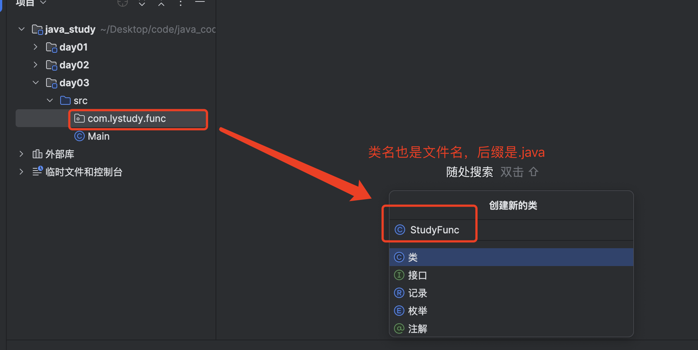

## 一、数据类型

### 1、第一行代码

> java的文件名和代码的类名必须一致

```java
public class HelloWorld{
    public static void main(String[] args){
        System.out.println("Hello World");
    }
}
```

> 保存上面代码为 HelloWorld.java

```bash
# 先编译，编译会产生HelloWorld.class
javac HelloWorld.java

# 再执行
java HelloWorld.class
```

> Java的执行原理就是最终翻译成计算机底层可以识别的机器语言

### 2、JDK组成

> - JDK组成
>   - JVM（Java Virtual Machine）：Java虚拟机，真正运行Java程序的地方
>   - 核心类库：Java自己写好的程序，给程序自己的程序调用的
>   - JRE（Java Runtime Environment）：Java的运行环境
>   - JDK（Java Development Kit）：Java开发工具包（包括上面所有）


### 3、IDEA创建Java项目

> 由如下顺序组成
>
> - project（项目、工程）
> - module（模块）
> - package（包）
> - class（类）

> 所以在idea中应该是这样的

#### 1.1 创建空项目


#### 1.2 项目下创建模块


#### 1.3 模块下创建包


#### 1.4 包下创建类





### 4、数据类型

#### 1.1 基础数据类型

> - 整型
>   - byte
>   - short
>   - int（默认）
>   - long
> - 浮点型（小数）
>   - float
>   - double（默认）
> - 字符型
>   - char
> - 布尔型
>   - boolean


#### 1.2 自动类型转换

> 类型范围小的变量，可以直接赋值给类型范围大的变量
>
> 比如：byte类型可以自动转为int类型

```java
public class MyName {
    public void typeStudy() {
        byte n1 = 30;
        // 可以吧byte类型直接赋值到int类型
        int b = n1;
        System.out.println(n1);
        System.out.println(b);
    }
}
```


#### 1.3 表达式自动类型转换

> 表达式类型转换是指：不同类型的变量或数据一起运算，最终的数据类型
>
> 表达式中，小范围类型的变量，会自动转换为表达式中较大范围的类型再参与运算
>
> 注意：
>
> - 表达式的最终结果类型由表达式中的最高类型决定
> - 在表达式中，byte、short、char是直接转为int类型参与运算的


```java
package com.basic.type;

public class MyName {
    public void typeStudy() {
        byte n1 = 30;
        int b = n1;
        long c = 40;
        // 表达式以最高类型决定
        long res = n1 + b + c;
        System.out.println(res);

        double res1 = n1 + b + c + 1.0;
        System.out.println(res1);

        // 注意，byte、short、char是直接转为int运算的
        byte f1 = 10;
        short f2 = 90;
        int f3 = f1 + f2;
        System.out.println(f3);
    }
}
```

#### 1.4 强制类型转换

> 类型大的数据或变量直接赋值给类型范围小的变量会报错
>
> 强制类型转换：
>
> - 强行将类型范围大的变量、数据赋值给类型范围小的变量

```java
// 格式
数据类型 变量2 = (数据类型)变量1
```

```java
package com.basic.type;

public class MyName {
    public void forceChangeType() {
        int a = 12;
        byte b = (byte) a;
        System.out.println(a);
        System.out.println(b);
    }
}
```

#### 1.5 字符串类型

> 字符串在JAVA中是引用类型

```java
String name = "sam";
```

### 4、变量定义

> 格式：数据类型 变量名 = 数据;

```java
// 数据类型 变量名 = 数据;
int age = 19;
```

### 5、运算符

#### 1.1 加减乘除

```java
package com.basic.type;

public class MyName {
    public void calcStudy() {
        int a = 10;
        int b = 2;
        System.out.println(a + b); // 12
        System.out.println(a - b); // 8
        System.out.println(a * b); // 20
        System.out.println(a / b); // 5
    }
}

```

#### 1.2 +连接符

> `+`符号与字符串运算的时候作为连接符，结果是字符串

```java
package com.basic.type;

public class MyName {
    public void combineString() {
        int age = 30;
        String b = "年龄:" + age;
        System.out.printf(b);
    }
}
```

#### 1.3 自增自减

> 自增：++ 放在变量前面或后面，对变量自身值加1
>
> 自增：-- 放在变量前面或后面，对变量自身值减1

```java
package com.basic.type;

public class MyName {
    public void incrNum() {
        int a = 20;
        a++;
        System.out.println(a);

        int b = 30;
        ++b;
        System.out.println(b);

        int c = 40;
        c--;
        System.out.println(c);

        int d = 40;
        --d;
        System.out.println(d);
    }
}
```


#### 1.4 关系运算符

> 和go语言关系运算符一样


#### 1.5 逻辑运算符

> 逻辑运算符和go一样
>
> &&  逻辑与
>
> ||  逻辑或
>
> !   逻辑非


```java
package com.basic.type;

public class MyName {
    public void logicStudy() {
        int i = 10;
        int j = 30;
        System.out.println(i == 10 && j == 30); // true
    }
}

```

#### 1.6 三元运算符

> 格式：条件表达式?值1:值2

```java
package com.basic.type;

public class MyName {
    public void easyCalc() {
        int age = 30;
        String res = age == 30 ? "age == 30" : "age < 30";
        System.out.println(res); // age == 30
    }
}
```


## 二、流程控制

### 1、if-else

> if - else if - else流程控制和go一模一样

```java
package com.basic.type;

public class MyName {
    public void branchCheck() {
        int a = 30;
        if (a == 30) {
            System.out.println("a==30");
        } else if (a < 30) {
            System.out.println("a<30");
        } else {
            System.out.println("a>30");
        }
    }
}
```

### 2、switch

> 与go类似

```java
package com.basic.type;

public class MyName {
    public void switchStudy(int a) {
        switch (a) {
            case 30:
                System.out.println("a=30");
            case 40:
                System.out.println("a=30");
            default:
                System.out.println("a:" + a);
        }
    }
}

```

### 3、for循环

> 支持break、continue

##### 1.1.1 普通for循环

```java
package com.basic.type;

public class MyName {
    public void forLoop() {
        for (int i = 0; i > 5; i++) {
            System.out.println(i);
        }
    }
}
```

##### 1.1.2 增强for循环

> Java 5 引入了增强的 `for` 循环（也称为“for-each”循环），它提供了一种更简洁的方式来遍历数组和集合

```java
for (元素类型 变量名 : 数组或集合) {
    // 循环体
}
```


### 4、while循环

> 支持break、continue

```java
package com.basic.type;

public class MyName {
    public void whileLoop() {
        int i = 5;
        while (i > 0) {
            System.out.println(i);
            i--;
        }
    }
}

```


## 三、数组

### 1、静态初始化数组

> 定义数组的时候给数组赋值


```java
package com.basic.type;

import java.util.Arrays;

public class ArrayStudy {
    public void arrayStatic() {
        // 完整格式
        int[] nums1 = new int[]{1, 2, 3, 4};
        // 简化格式
        int[] nums2 = {1, 2, 3, 4};

        // [1, 2, 3, 4]
        System.out.println(Arrays.toString(nums1));

        // [1, 2, 3, 4]
        System.out.println(Arrays.toString(nums2));
    }
}
```

### 2、动态初始化数组

> 定义数组时先不存入具体的元素值，只确定数组存储的数据类型和数组的长度
>
> 和go语言初始化数组一样

```java
// 格式
int[] arr = new int[3];
```


### 3、数组长度

```java
package com.basic.type;

public class ArrayStudy {
    public void arrayStatic() {
        // 简化格式
        int[] nums = {1, 2, 3, 4};

        // nums1.length
        // 下面长度: 4
        System.out.println(nums.length);
    }
}
```

### 4、数组遍历

> 数组使用for循环遍历

```java
package com.basic.type;

public class ArrayStudy {
    public void loopArray() {
        int[] nums = {1, 2, 3, 4, 5};
        for (int i = 0; i < nums.length; i++) {
            System.out.println("i=" + i);
        }
    }
}
```


## 四、方法

### 1、方法

> 方法封装了代码，方便重复调用，也就是函数

```java
// 格式
修饰符 返回值类型 方法名(形参列表) {
    方法的代码块;
    return 返回值;
}
```

> 下面是方法的一个例子

```java
package com.lystudy.func;

public class StudyFunc {
    public void Func1() {
        System.out.println("this is func1");
    }
}
```

### 2、方法传参

> 方法传参支持：
>
> - 基本数据类型
>   - int、double、short等
> - 引用类型
>   - String、array、接口

> 方法传参机制都是值传递
>
> - 基础数据类型参数是值传递，在方法传递进去的是`实参的副本`，在方法内部修改不会影响方法外形参的值
> - 引用类型参数也是值传递，在方法传递进去的是引用类型实参的`内存地址副本`，在方法内部修改会影响方法外引用类型实参的值

```java
package com.lystudy.func;

public class StudyFunc {
    public void Func1(String name, int age) {
        System.out.println("name=" + name);
        System.out.println("age=" + age);
    }
}
```

### 3、方法重载

> 方法重载是一个类中，出现多个方法的名称相同，但是他们的形参列表是不同的，那这些方法就是方法重载了
>
> 其实方法重载的原因就是java在方法里
>
> - 不支持默认值参数设置
> - 不支持可变长参数
>
> 所以才需要相同方法名，但是参数不同来支持，这就是方法重载

```java
package com.lystudy.func;

public class StudyFunc {
    public void Func1(String name, int age) {
        System.out.println("name=" + name);
        System.out.println("age=" + age);
    }

    public void reloadFunc1() {
        System.out.println("reload func1");
    }

    public void reloadFunc1(int name) {
        System.out.println("reload func1 name:" + name);
    }

    public void reloadFunc1(int name, int age) {
        System.out.println("reload func1 name:" + name);
        System.out.println("reload func1 age:" + age);
    }
}
```

> reloadFunc1方法出现了三次，但是每个的形参个数和类型都不一样，那reloadFunc1就实现了方法重载

## 五、面向对象

### 1、类的定义

> 类：一组属性或方法的集合，抽象了所有内容，实现了对象的模板
>
> 对象：从类实例化出来的一个对象
>
> 类中即可有变量、也可以有方法

```java
package com.lystudy.func;

public class StudyFunc {
    // public 修饰符表示这个是类的公共变量
    public String name;

    // 没有public修饰符表示这个是类的私有变量
    int age;

    public void showUserInfo() {
        System.out.println("这是showUserInfo类方法");
    }
}
```

#### 1.2 成员变量与局部变量

| 区别         | 成员变量                   | 局部变量                                   |
| ------------ | -------------------------- | ------------------------------------------ |
| 类中位置不同 | 类中，方法外               | 方法中                                     |
| 初始化值不同 | 有默认值，不需要初始化赋值 | 没有默认值，使用之前必须赋值               |
| 内存位置不同 | 堆内存                     | 栈内存                                     |
| 作用域不同   | 整个对象                   | 在所归属的大括号中                         |
| 生命周期不同 | 与对象公存亡               | 随之方法的调用而生，随着方法的运行结束而亡 |

### 2、实例化对象

#### 1.1 new关键字

> 类的实例化是用`new`关键字

```java
package com.lystudy.func;

public class StudyFunc {
    // public 修饰符表示这个是类的公共变量
    public String name;

    // 没有public修饰符表示这个是类的私有变量
    int age;

    public void showUserInfo() {
        System.out.println("这是showUserInfo类方法");
    }
}
```

> 实例化对象

```java
import com.lystudy.func.StudyFunc;

public class Main {
    public static void main(String[] args) {
        StudyFunc sf = new StudyFunc();
        System.out.println(sf);
    }
}
```

> 直接打印对象变量会得到内存地址


#### 1.2 public修饰符理解

> - public修饰符在类中可以将变量、方法变为公共变量、方法，那么实例化对象后，实例化对象就可以直接调用public修饰的变量或方法
>
> - public修饰符就和go语言的结构体中，结构体字段首字母大写、结构体方法名首字母大写，变为公共变量和公共方法，让外部文件可以实例化后调用，
>
> - 没有public修饰符的变量、方法，就默认都是私有变量、方法
>   - 实例化对象不可以调用
>   - 变量、方法只能在类内部类自我调用

### 3、this关键字

> - this是一个变量，在方法中可以拿到当前对象，比较好理解
>
>   - 类似于python语言的类中的self
>
>   - 类似于go语言的结构体方法的接收者
>
> - this可以用点`.`的方式调用类中的变量、方法
>
> - 哪个对象调用方法，this就指向哪个对象，也就是拿到哪个对象
> - this主要来解决：
>   - 解决对象的成员变量与方法内部变量的名称一样时，导致访问冲突问题

> 类定义

```java
package com.lystudy.func;

public class StudyFunc {
    // public 修饰符表示这个是类的公共变量
    public String name;

    // 没有public修饰符表示这个是类的私有变量
    int age;

    public void showUserInfo() {
        System.out.println("这是showUserInfo类方法");
    }

    public void showAge() {
        this.showUserInfo();
        int incrAge = this.age + 1;
        System.out.println("incrAge=" + incrAge);
    }
}

```

> 类实例化

```java
import com.lystudy.func.StudyFunc;

public class Main {
    public static void main(String[] args) {
        StudyFunc sf = new StudyFunc();

        // com.lystudy.func.StudyFunc@7a81197d
        System.out.println(sf);

        // incrAge=1
        sf.showAge();
    }
}
```


### 4、构造器

#### 1.1 构造器定义

> - 构造器就是构造函数，定义了类的初始状态
>   - 类比python的类中的`__init__`方法，也是接收参数，但是没有返回值，即没有return语句
> - 构造器定义
>   - 在类中定义一个方法名，方法名和类名一样就是构造器
> - 构造器是`可重载`，本质还是方法
> - 构造器可分为：
>   - 无参数构造器，构造器方法不传参
>   - 有参数，构造器方法支持传参
>
> 这块理解和python的面向对象的`__init__`方法一模一样

```java
package com.lystudy.func;

public class StudyFunc {
    // public 修饰符表示这个是类的公共变量
    public String name;

    // 没有public修饰符表示这个是类的私有变量
    int age;

    // 无参数构造器
    public StudyFunc() {
        this.age = 30;
    }

    // 有参数构造器
    public StudyFunc(int age) {
        this.age = age;
    }

    public void showUserInfo() {
        System.out.println("这是showUserInfo类方法");
    }

    public void showAge() {
        this.showUserInfo();
        int incrAge = this.age + 1;
        System.out.println("incrAge=" + incrAge);
    }
}
```

> 实例化对象

```java
import com.lystudy.func.StudyFunc;

public class Main {
    public static void main(String[] args) {
        StudyFunc sf1 = new StudyFunc();
        System.out.println(sf1);

        StudyFunc sf2 = new StudyFunc(13);
        System.out.println(sf2);
        sf2.showAge();

    }
}
```


#### 1.2 注意事项

##### 1.1.1 必须带public修饰符

> 构造器必须带public修饰符，变为公共方法可以给外部文件暴露，这样在其他文件才可以使用`new`调用


#### 1.1.2 未定义构造器方法实例化对象

> 当类中未定义构造器方法，那么使用`new`实例化对象时，java类会自己生成并调用一个无参数构造器进行实例化对象

### 5、封装

> 封装就是类设计对象处理某一个事物的数据时，应该要把处理的数据以及处理数据的方法涉及到一个对象中去

#### 1.1 设计规范

> - 合理隐藏
>   - 根据真正的业务逻辑实现
> - 合理暴露
>   - 需要合理暴露属性和方法

#### 1.2 公开和隐藏

> 公开成员：可以用public(公开)进行修饰
>
> 隐藏成员：使用private(私有，隐藏)进行修饰

### 6、实体JavaBean

> 实体类是一种特殊形式的类，要求
>
> - 某个类中的成员变量都是私有，并且要对外提供相应的getXxx，setXxx方法
> - 类中必须要有一个公共的无参的构造器
>
> 可以理解为数据仓库

#### 1.1 使用场景

> - 实体类只负责数据存取
>- 而对数据的处理交给其他类来完成，已实现数据和数据业务处理相分离

#### 1.2 IDEA快速实现实体类

> 定义实体类

```java
package com.lystudy.func;

public class JavaBeanStudy {
    private String name;
    private int age;
}
```

> 在定义的实体类中，IDEA右键选择`生成`


> 选择`Getter和Setter`


> 选中所有点击`创建`


> 查看创建的实体类


```java
package com.lystudy.func;

public class JavaBeanStudy {
    private String name;
    private int age;

    public String getName() {
        return name;
    }

    public void setName(String name) {
        this.name = name;
    }

    public int getAge() {
        return age;
    }

    public void setAge(int age) {
        this.age = age;
    }
}
```

#### 1.3 实体类语法示例

```java
package com.lystudy.func;

public class JavaBeanStudy {
    // 实体类的书写要求，特点、应用场景
    // 1.必须要有私有成员变量，并未每个成员变量提供get set方法
    private String name;
    private double score;

    // 2.必须为类提供一个公开的无参数构造器
    public JavaBeanStudy() {
    }

    // 3.可以生成一个带参数的构造器，比较方便他人操作
    public JavaBeanStudy(String name, double score) {
        this.name = name;
        this.score = score;
    }

    public String getName() {
        return name;
    }

    public void setName(String name) {
        this.name = name;
    }

    public double getScore() {
        return score;
    }

    public void setScore(double score) {
        this.score = score;
    }
}
```

> 操作实体类，这样就把数据定义和操作数据分开了

```java
package com.lystudy.func;

// 操作数据类
// 将数据和数据操作分离开
public class StudentOperator {
    // JavaBean实体，默认都是private
    private Student student;

    public StudentOperator(Student student) {
        this.student = student;
    }

    public void showStudent() {
        if (student.getScore() >= 60) {
            System.out.println("大于60分，已经合格");
        } else {
            System.out.println("小于60分，学生成绩不合格");
        }
    }
}
```

#### 1.4 电影类实操

```java
package com.lystudy.func;

// javaBean 类
// 只用来保存数据
public class Movie {
    // 电影ID
    private int id;

    // 电影名
    private String name;

    // 电影价格
    private double price;

    // 电影分数
    private double score;

    // 电影导演
    private String director;

    // 电影演员
    private String actor;

    // 电影信息
    private String info;

    public Movie() {
    }

    public Movie(int id, String name, double price, double score, String director, String actor, String info) {
        this.id = id;
        this.name = name;
        this.price = price;
        this.score = score;
        this.director = director;
        this.actor = actor;
        this.info = info;
    }

    public int getId() {
        return id;
    }

    public void setId(int id) {
        this.id = id;
    }

    public String getName() {
        return name;
    }

    public void setName(String name) {
        this.name = name;
    }

    public double getPrice() {
        return price;
    }

    public void setPrice(double price) {
        this.price = price;
    }

    public double getScore() {
        return score;
    }

    public void setScore(double score) {
        this.score = score;
    }

    public String getDirector() {
        return director;
    }

    public void setDirector(String director) {
        this.director = director;
    }

    public String getActor() {
        return actor;
    }

    public void setActor(String actor) {
        this.actor = actor;
    }

    public String getInfo() {
        return info;
    }

    public void setInfo(String info) {
        this.info = info;
    }
}
```

```java
package com.lystudy.func;

public class MovieOperator {
    // 电影的数组
    private Movie[] movies;

    public MovieOperator(Movie[] movies) {
        this.movies = movies;
    }

    // 展示所有Movie电影信息
    public void printAllMovies() {
        System.out.println("---系统全部电影信息---");
        for (int i = 0; i < movies.length; i++) {
            Movie m = movies[i];
            System.out.println("编号：" + m.getId());
            System.out.println("名称：" + m.getName());
            System.out.println("价格：" + m.getPrice());
            System.out.println("---------------");
        }
    }

    // 根据ID查询电影信息
    public void queryMovieInfoById(int id) {
        for (int i = 0; i < movies.length; i++) {
            Movie m = movies[i];
            if (m.getId() == id) {
                System.out.println("---id=" + id + "，该电影信息如下---");
                System.out.println("编号：" + m.getId());
                System.out.println("名称：" + m.getName());
                System.out.println("价格：" + m.getPrice());
                System.out.println("导演：" + m.getActor());
                return;
            }
        }
        System.out.println("---id=" + id + "，电影未找到---");
    }
}
```

### 7、static修饰符

> - static修饰符是静态，可以修饰成员变量、成员方法
>   - 和python中面向对象的classmethod装饰器修饰方法为类方法

#### 1.1 static修饰成员变量

##### 1.1.1 使用语法

> - 当成员变量有static修饰，属于类属性，不属于实例对象属性，在计算机中只有一份，会被类的全部对象共享
> - 当成员变量没有static修饰，属于实例对象属性，这个很好理解
> - 使用场景：
>   - 在开发中，如果某个数据只需要一份，且希望能被共享（访问、修改），则该数据可以定义为类变量来记住

```java
package com.zhipuai.app;

public class TalkWithGLM {
    // 类变量
    static String apiKey;
    
    // 实例变量（对象的变量）
    String apiUrl;
}
```

> 调用类变量

```java
package com.zhipuai.app;

public class Main {
    public static void main(String[] args) {
        // 类变量
        TalkWithGLM.apiKey = "sdfhsjdf";

        // 对象变量，只能用实例对象访问变量
        TalkWithGLM t1 = new TalkWithGLM();
        t1.apiUrl = "asdasda";
        System.out.println(t1.apiUrl);
    }
}
```


##### 1.1.2 使用案例

> 定义类

```java
package com.zhipuai.app;

public class TalkWithGLM {
    // 类变量
    public static int number;
    // 实例变量（对象的变量）
    String apiUrl;

    public TalkWithGLM() {
        // 在同一个类中，访问自己类的类变量，可以省略类名不写
        number++;
    }
}
```

> 计算实例化对象个数

```java
package com.zhipuai.app;

public class Main {
    public static void main(String[] args) {
        // 类变量
        TalkWithGLM t1 = new TalkWithGLM();
        TalkWithGLM t2 = new TalkWithGLM();
        TalkWithGLM t3 = new TalkWithGLM();
        TalkWithGLM t4 = new TalkWithGLM();

        System.out.println(TalkWithGLM.number); // 4
    }
}
```


#### 1.2 static修饰成员方法

##### 1.1.1 使用语法

> - static也可以修饰成员方法
>   - 当使用static修饰的成员方法、属于类
> - 实例方法是没有static修饰的成员方法，属于对象

```java
package com.zhipuai.app;

public class TalkWithGLM {
    // 类变量
    public static int number;
    // 实例变量（对象的变量）
    String apiUrl;

    public TalkWithGLM() {
        // 在同一个类中，访问自己类的类变量，可以省略类名不写
        number++;
    }

    public static void ShowInfo() {
        System.out.println("this is talk with glm");
    }
}

```

```java
package com.zhipuai.app;

public class Main {
    public static void main(String[] args) {
        // 类变量
        TalkWithGLM.ShowInfo();

        // 实例对象
        // t1就没有类方法
        TalkWithGLM t1 = new TalkWithGLM();
        
    }
}
```


##### 1.1.2 搞懂main方法

> 在Test类中，`main`方法就是被static修饰的

```java
package com.zhipuai.app;

public class Main {
    public static void main(String[] args) {
    }
}
```

> - 那么Main类的main方法就是`类方法`
>
> - String[] args是命令行参数，类似Shell的`$1...$n`参数的作用，很少用

> 真正执行时，就会以下面的方式执行

```java
// 伪代码
Main.main()
```

##### 1.1.3 类方法使用场景

> 类方法的常见应用场景：
>
> - 做工具类
>   - 工具类中的方法都是类方法，每个方法都是用来完成一个功能，工具类是给开发人员共同使用的
> - 优势
>   - 用类方法类设计工具类，提高了代码复用，调用方便，提高了开发效率

#### 1.3 static注意事项

##### 1.1.1 类方法访问成员

> 类方法中可以访问类成员，但是不可以访问实例成员

```java
package com.zhipuai.app;

public class TalkWithGLM {
    // 类变量
    public static int number;

    // 实例变量（对象的变量）
    String apiUrl;

    public TalkWithGLM() {
        // 在同一个类中，访问自己类的类变量，可以省略类名不写
        number++;
    }

    // 1.类方法中可以直接访问类的成员，但不可直接访问实例成员
    public static void printHello() {
        // 类方法中可以直接访问类的成员
        number = 3;
        ShowInfo();

        // 不可直接访问实例成员，会报错
        // System.out.println(apiUrl);
    }

    public static void ShowInfo() {
        System.out.println("this is talk with glm");
    }

    public void printObj() {
        System.out.println("这是printObj");
    }
}
```

##### 1.1.2 实例方法访问成员

```java
package com.zhipuai.app;

public class TalkWithGLM {
    // 类变量
    public static int number;

    // 实例变量（对象的变量）
    String apiUrl;

    public TalkWithGLM() {
        // 在同一个类中，访问自己类的类变量，可以省略类名不写
        number++;
    }

    // 1.类方法中可以直接访问类的成员，但不可直接访问实例成员
    public static void printHello() {
        // 类方法中可以直接访问类的成员
        number = 3;
        ShowInfo();

        // 不可直接访问实例成员，会报错
        // System.out.println(apiUrl);
    }

    public static void ShowInfo() {
        System.out.println("this is talk with glm");
    }

    // 2.实例方法既可以访问类成员，也可访问实例成员
    public void printObj() {
        // 实例方法既可以访问类成员
        number = 3;
        // 也可访问实例成员
        apiUrl = "https://";
        // 也可以访问类方法
        ShowInfo();
        System.out.println("这是printObj");
    }
}
```

##### 1.1.3 static中的this关键字

> - 实例方法可以出现`this`关键字
> - 类方法不可以出现`this`关键字

```java
package com.zhipuai.app;

public class TalkWithGLM {
    // 类变量
    public static int number;

    // 实例变量（对象的变量）
    String apiUrl;

    public TalkWithGLM() {
        // 在同一个类中，访问自己类的类变量，可以省略类名不写
        number++;
    }

    // 1.类方法中可以直接访问类的成员，但不可直接访问实例成员
    public static void printHello() {
        // 类方法中可以直接访问类的成员
        number = 3;
        ShowInfo();

        // 不可直接访问实例成员，会报错
        // System.out.println(apiUrl);
        
        // 类方法不能出现this
//        System.out.println(this.);
    }

    public static void ShowInfo() {
        System.out.println("this is talk with glm");
    }

    // 2.实例方法既可以访问类成员，也可访问实例成员
    public void printObj() {
        // 实例方法既可以访问类成员
        number = 3;
        // 也可访问实例成员
        this.apiUrl = "https://";
        // 也可以访问类方法
        ShowInfo();
        System.out.println("这是printObj");
    }
}
```


### 8、代码块(了解)

> 代码块是类的5大成分之一（成员变量、构造器、方法、代码块、内部类）
>
> 代码块分为两种：
>
> - 静态代码块
> - 实例代码块

#### 1.1 静态代码块

> 静态代码块：
>
> - 格式: `static{}`
> - 特点：类加载时自动执行由于类只会加载一次，所以静态代码块也只会执行一次
> - 作用：完成类的初始化，例如：对类变量的初始化赋值


#### 1.2 实例代码块

> 实例代码块：
>
> - 格式:{}
> - 特点：每次创建对象时，执行实例化代码块，并在构造器前执行
> - 作用：和构造器一样，都是用来完成对象的初始化，例如对实例变量进行初始化赋值

```java
package com.zhipuai.app;

public class Student {
    static int number = 10;
    int age;

    // 静态代码块
    static {
        System.out.println("这是Student的静态代码块");
    }

    // 实例代码块
    {
        System.out.println("这是Student的实例代码块");
        age = 18;
    }

    public Student() {
        System.out.println("这是Student的无参数构造器");
    }

    public Student(String name) {
        System.out.println("这是Student的有参数构造器");
    }

}
```


### 9、继承

> Java中有关键字`extends`，用这个关键字，可以让一个类和另一个类建立父子关系
>
> 特点：
>
> - 子类能继承父类的非私有成员（成员变量、成员方法）
> - 子类的对象是有子类、父类共同完成
>
> 优点：
>
> - 减少重复代码的编写

#### 1.1 继承语法

> 下面是父类

```java
package com.extendsdemo.app;

public class ParentsObj {
    // 公共成员
    public int a;

    public void showInfo() {
        System.out.println("这是ParentsObj.showInfo方法");
    }

    // 私有成员
    private String name;

    private void showName() {
        System.out.println("这是ParentsObj.showName方法");
    }
}
```

> 下面是子类

```java
package com.extendsdemo.app;

public class Children01 extends ParentsObj {
    // 子类可以继承父类的非私有成员
    public void useParent() {
        System.out.println(this.a);
        this.showInfo();

        this.name;
        showName():
    }
}
```

> 下面是可以看到，在子类中访问父类的私有成员时，会提示报错，因为私有变量是`private`访问权限，子类无法访问父类的私有成员


#### 1.2 子类实例化

> 继承关系的类
>
> - java会用类和其父类，张多张设计图来一起创建类的对象
> - 对象能访问什么成员，是由子父类这多张设计图共同决定的，这多张设计图对外暴露了什么成员，对象就可以访问什么成员
> - 实例化出来的子类只能访问父类的公共成员，无法访问私有成员

> 子类实例化对象可以访问父类的公共成员


> 子类实例化对象无法访问实例的私有成员


#### 1.3 继承案例

> 可以看到`Teacher`、`Student`都继承`People`类


> 查看执行结果


#### 1.4 权限修饰符

> 权限修饰符就是用来限制类中的成员（成员变量、成员方法、构造器、代码块等）能被访问的反问
>
> 权限修饰符分类与作用：
>
> - `✅`表示可以访问
>
> - 任意包下的子类访问，子类是指必须有`extends`继承形成的子类，如果子类不是继承形成的类，那么子类无法访问父类的`protected`方法

| 修饰符                 | 在本类中访问 | 在同一个包下的其他类中访问 | 任意包下的子类访问 | 任意包下的任意类访问 |
| ---------------------- | ------------ | -------------------------- | ------------------ | -------------------- |
| private                | ✅            |                            |                    |                      |
| 缺省（不带任何修饰符） | ✅            | ✅                          |                    |                      |
| protected              | ✅            | ✅                          | ✅                  |                      |
| Public                 | ✅            | ✅                          | ✅                  | ✅                    |

#### 1.5 只能单继承

##### 1.1.1 单继承

> Java是单继承，一个类只能继承一个直接父类
>
> Java类不支持多继承，但是支持多层继承


##### 1.1.2 Object类

> Java中`object类`是java所有类的祖宗类，我们所写的任何类，都是`object类`的子类或子孙类

#### 1.6 方法重写

##### 1.1.1 方法重写示例

> 当子类觉得父类中某个方法不好用无法满足子类需求时，子类可以重写一个`方法名称`、`参数列表`一样的方法来覆盖父类的这个方法，这就是方法重写
>
> 在其他语言中也有这个，比如python的继承中就有这个方法重写

> A父类

```java
package com.extendsdemo.app;

public class A {
    public String showInfo(String name) {
        return "A:" + name;
    }
}
```

> B子类

```java
package com.extendsdemo.app;

public class B extends A {
    public String showInfo(String name) {
        return "B:" + name;
    }
}
```

> 实例化子类

```java
package com.extendsdemo.app;

public class Main {
    public static void main(String[] args) {
        B b1 = new B();
        String ret = b1.showInfo("sam");
        System.out.println(ret);
    }
}
```


##### 1.1.2 方法重写注意事项

> - 重写小技巧：
>   - 使用Override注解，他可以指定java编译器，帮我们检查方法重写的格式是否正确，代码可读性会更好
> - 子类重写父类方法时
>   - 访问权限必须大于或等于父类该方法的权限（public > protected > 缺省）
> - 重写方法的返回值类型，必须与被重写方法的返回值类型一样或者范围更小
> - 私有方法、静态方法不能被重写，否则会报错

##### 1.1.3 Override注解

> 使用`Override注解`，他可以指定java编译器，帮我们检查方法重写的格式是否正确，代码可读性会更好
>
> 可以看到子类重写父类方法不一样时，`Override注解`自动帮我们检查重写方法的格式


##### 1.1.4 私有方法不能重写


##### 1.1.5 静态方法不能被重写


##### 1.1.6 子类访问其他成员

> - 在子类中访问其他成员（成员变量、成员方法），依照`就近原则`
>   - 在子类局部范围找
>   - 然后在子类成员范围找
>   - 然后父类成员范围找，如果父类范围没有则报错

> 访问变量，都是遵循就近原则


##### 1.1.7 子类执着使用父类重名成员

> 当子父类中，出现了重名的成员（成员变量、成员方法），会优先使用子类的，但此时在子类中一定要使用父类的怎么做？

```java
// 可以使用spuer关键，指定访问父类的成员
super.父类成员变量
super.父类成员方法
```


##### 1.1.8 子类构造器特点

> 子类的全部构造器都会先调用父类的构造器，再执行自己的构造器

> 下面是A类

```java
package com.extendsdemo.app;

public class A {
    public A() {
        System.out.println("这是A的无参构造器");
    }
}
```

> 下面是B子类

```java
package com.extendsdemo.app;

public class B extends A {
    public B() {
        // super写不写都有
        // 会自动调用父类的无参构造器
        // super();
        System.out.println("这是B的无参构造器");
    }

    public B(String name) {
        // super写不写都有
        // 会自动调用父类的无参构造器
        // super();
        System.out.println("这是B的有参构造器");
    }
}

```


> 子类构造器如何实现调用父类构造器
>
> - 默认情况下，子类全部构造器的第一行代码都是`super()`，写不写都有，会调用父类的无参构造器
> - 当父类没有无参构造器时，我们必须在子类构造器的第一行手写`super(...)`，指定调用父类的有参构造器


> 手动提供父类的有参构造器，使用`super(...)`


##### 1.1.9 子类构造器使用案例

> 父类，只有`有参构造器`

```java
package com.extendsdemo.app;

public class ParentsObj {
    // 公共成员
    public String name;
    public int age;

    public ParentsObj(String name, int age) {
        this.name = name;
        this.age = age;
    }

    public void showInfo() {
        System.out.println("这是ParentsObj.showInfo方法");
    }

    private void showName() {
        System.out.println("这是ParentsObj.showName方法");
    }
}
```

> 子类使用`super(...)`实现父类的有参构造器，和python的继承流程一模一样

```java
package com.extendsdemo.app;

public class Children01 extends ParentsObj {
    public String work;

    public Children01(String name, int age, String work) {
        super(name, age);
        this.work = work;
    }
}

```

> 下面是代码图


##### 1.1.10 this调用兄弟构造器

> 在任意类的构造器中，可以通过`this(...)`调用该类的其他构造器
>
> - 一方面避免了代码重复
>
> - 另一方面实现了初始化赋默认值
>
> 注意：
>
> - this(...)调用兄弟构造器时，不能和`super`同时出现

```java
package com.extendsdemo.app;

public class StudentInfo {
    private String name;
    private int age;

    private String schoolName;

    public StudentInfo() {
    }

    public StudentInfo(String name, int age) {
        // 在任意类的构造器中，可以通过this(...)调用该类的其他构造器
        // 如下代码就是调用下面的StudentInfo(String name, int age, String schoolName)构造器
        this(name, age, "清华大学");
    }

    public StudentInfo(String name, int age, String schoolName) {
        this.name = name;
        this.age = age;
        this.schoolName = schoolName;
    }

    public String getSchoolName() {
        return schoolName;
    }

    public void setSchoolName(String schoolName) {
        this.schoolName = schoolName;
    }

    public String getName() {
        return name;
    }

    public void setName(String name) {
        this.name = name;
    }

    public int getAge() {
        return age;
    }

    public void setAge(int age) {
        this.age = age;
    }
}
```

> 从下图就可以看出来，this(...)可以调用兄弟构造器


### 10、多态

> 多态是在`继承/实现`情况下的一种现象，表现为：
>
> - 对象多态
> - 行为多态


## 六、常用API

### 1、包

> 包主要是用来分门别类的管理不同程序的，类似于文件夹，建包有利于程序的管理和维护

```java
// 语法
package com.slowNo.javabean;
public class Student{
    ...
}
```

#### 1.1 导包

> - 如果在当前程序中，要调用自己所在包下的其他程序，可以直接调用（同一个包下的类，互相可以直接调用）
>
> - 访问其他包下的程序，必须导入包才可以访问
> - 在自己的程序中调用Java提供的程序，也需要先导入包才可以使用
>   - Java.Lang包下的程序不需要我们导入，可以直接使用
> - 访问多个其他包下的程序，这些程序名又一样的情况，那么默认只能导入一个程序，另一个程序必须带包名和类型来访问

```java
// 导包语法
import com.xx.xxx
```

### 2、String

> String主要用来处理字符串
>
> String类表示字符串

#### 1.1 String常用方法

##### 1.1.1 length

> 查看字符串长度

```java
package com.zhipuai.app;

public class Main {
    public static void main(String[] args) {
        String name = "hello world";
        System.out.println(name.length()); // 11

    }
}
```

##### 1.1.2 索引处的字符

> 根据索引获取对应的元素值

```java
package com.zhipuai.app;

public class Main {
    public static void main(String[] args) {
        String name = "hello world";
        char c1 = name.charAt(1);
        System.out.println(c1); // e
    }
}
```

> 用途就是遍历字符串

```java
package com.zhipuai.app;

public class Main {
    public static void main(String[] args) {
        String name = "hello world";

        for (int i = 0; i < name.length(); i++) {
            System.out.println(name.charAt(i));
        }
    }
}
```

##### 1.1.3 字符串转为字符数组

> 把字符串转为字符数组

```java
package com.zhipuai.app;

public class Main {
    public static void main(String[] args) {
        String name = "hello world";

        // 转为char字符数组
        char[] nameArray = name.toCharArray();
        for (int i = 0; i < name.length(); i++) {
            System.out.println(nameArray[i]);
        }
    }
}
```

#####  1.1.4 判断字符串相等

> - `==`双等于号判断是否相等
> - S1.equals(s2)：也可判断是否相等

```java
package com.zhipuai.app;

public class Main {
    public static void main(String[] args) {
        String name1 = "hello world";
        String name2 = "hello world2";

        System.out.println(name1.equals(name2)); //false
    }
}
```

##### 1.1.5 忽略大小写比较字符串内容

```java
package com.zhipuai.app;

public class Main {
    public static void main(String[] args) {
        String name1 = "Hello World";
        String name2 = "hello world";

        System.out.println(name1.equals(name2)); //false
        // 忽略大小写，所以name1和name2相等
        System.out.println(name1.equalsIgnoreCase(name2)); //true
    }
}
```

##### 1.1.6 截取子串

> 显式设置起始、结束索引

```java
package com.zhipuai.app;

public class Main {
    public static void main(String[] args) {
        String name1 = "Hello World";
        // 左闭右开
        String subString = name1.substring(0, 4);
        System.out.println(subString); //Hell
    }
}
```

> 只有一个索引，表示从当前索引到字符串结尾索引

```java
package com.zhipuai.app;

public class Main {
    public static void main(String[] args) {
        String name1 = "Hello World";
        // 从当前索引到字符串结尾
        String subString = name1.substring(4);
        System.out.println(subString); // o World
    }
}
```

##### 1.1.7 替换字符串

> replace替换字符串某一部分

```java
package com.zhipuai.app;

public class Main {
    public static void main(String[] args) {
        String name1 = "hello world";
        // 字符串类型
        String ret = name1.replace("hello", "你好");
        System.out.println(ret); // 你好 world
    }
}
```

##### 1.1.8 是否包含某个关键字

```java
package com.zhipuai.app;

public class Main {
    public static void main(String[] args) {
        String name1 = "hello world";
        // 布尔类型
        Boolean ret = name1.contains("hello");
        System.out.println(ret); // 你好 world
    }
}
```

##### 1.1.9 以某个字符开头

```java
package com.zhipuai.app;

public class Main {
    public static void main(String[] args) {
        String name1 = "hello world";
        Boolean ret = name1.startsWith("he");
        System.out.println(ret); // true
    }
}
```

##### 1.1.10 切割字符串为字符串数组

```java
package com.zhipuai.app;

public class Main {
    public static void main(String[] args) {
        String name1 = "hello world";
        String[] nameArray = name1.split(" ");
        for (int i = 0; i < nameArray.length; i++) {
            // hello
            // world
            System.out.println(nameArray[i]);
        }
    }
}
```

#### 1.2 String注意事项

> - String的对象是不可变字符串对象
>   - 只要是以"..."(双引号)写出的字符串对象，会在堆内存中的字符串常量池中存储
> - 每次试图修改字符串对象实际上是产生了新的字符串对象，变量每次都是指向了新的字符串对象，但是之前字符串对象的内容确实没有改变，所以说String对象是不可变的

> - 只要以"..."(双引号)写出的字符串对象，会存储到字符串常量池，且相同内容的字符串只存储一份
>   - 也就是说相同字符串的内存地址是一摸一样的
> - 单通过new方式创建字符串对象，每new一次都会产生一个新的对象放到堆内存中

```java
package com.zhipuai.app;

public class Main {
    public static void main(String[] args) {
        String a = "abc";
        String b = "abc";
        // a和b指向同一个内存地址
        System.out.println(a == b); // true

        char[] chs = {'a', 'b', 'c'};
        String a1 = new String(chs);
        String a2 = new String(chs);
        System.out.println(a1 == a2); // false

        // a  是常量池的变量
        // a1 是new出来的变量
        // a和a1完全不相等
        System.out.println(a == a1); // false
    }
}
```

### 3、ArrayList

> ArrayList表示集合，用来存储数据，类似于python的list，go语言的切片
>
> - 集合与数组的区别
>   - 数组定义完以后，长度就固定了
>   - 集合长度大小可变

#### 1.1 创建ArrayList

> 创建一个ArrayList的集合对象

```java
package com.zhipuai.app;

import java.util.ArrayList;

public class Main {
    public static void main(String[] args) {
        // 实例化一个集合
        ArrayList users = new ArrayList();
        users.add("sam");
        users.add("james");
        users.add("tom");
        users.add("tom");
        System.out.println(users);
    }
}
```

#### 1.2 增加元素

##### 1.1.1 插入元素

> ArrayList类型的add方法添加元素
>
> 注意：
>
> - 可以添加相同的元素到ArrayList，其实就和Go语言的切片一样
> - 当ArrayList没有指定类型时，可以支持任何基础类型的元素

```java
package com.zhipuai.app;

import java.util.ArrayList;

public class Main {
    public static void main(String[] args) {
        // 实例化一个集合
        ArrayList users = new ArrayList();
        users.add("sam");
        users.add("james");
        users.add("tom");
        users.add("tom");
        users.add(111);
        users.add(true);
        users.add('k');
        System.out.println(users);
    }
}
```


##### 1.1.2 指定索引插入元素

> add函数支持按指定索引插入元素

```java
package com.zhipuai.app;

import java.util.ArrayList;

public class Main {
    public static void main(String[] args) {
        // 实例化一个集合
        ArrayList users = new ArrayList();
        users.add("sam");
        users.add("james");
        users.add("tom");
        users.add("tom");
        users.add(111);
        users.add(true);
        users.add('k');
        // [sam, james, tom, tom, 111, true, k]
        System.out.println(users);

        // [sam, alex, james, tom, tom, 111, true, k]
        users.add(1, "alex");
        System.out.println(users);
    }
}
```


#### 1.3 泛型指定集合元素类型

> JDK1.7开始，在集合中支持指定集合元素的类型，比如指定集合元素为String、int等
>
> 与go语言指定切片元素类型一样

```java
ArrayList<Type> myList = new ArrayList<type>();
```

> 实例化集合，指定集合元素都为String类型

```java
package com.zhipuai.app;

import java.util.ArrayList;

public class Main {
    public static void main(String[] args) {
        // 实例化一个集合
        // 指定所有元素都是String类型
        ArrayList<String> users = new ArrayList<String>();
        users.add("sam");
        users.add("james");
        users.add("tom");
        users.add("tom");
        users.add(111);
        System.out.println(users);
    }
}
```

#### 1.4 获取指定索引的元素

```java
package com.zhipuai.app;

import java.util.ArrayList;

public class Main {
    public static void main(String[] args) {
        // 实例化一个集合
        // 指定所有元素都是String类型
        ArrayList<String> users = new ArrayList<String>();
        users.add("sam");
        users.add("james");
        users.add("tom");
        users.add("tom");

        String userOne = users.get(1);
        System.out.println(userOne); // james
    }
}
```


#### 1.5 返回集合中的元素个数

```java
package com.zhipuai.app;

import java.util.ArrayList;

public class Main {
    public static void main(String[] args) {
        // 实例化一个集合
        // 指定所有元素都是String类型
        ArrayList<String> users = new ArrayList<String>();
        users.add("sam");
        users.add("james");
        users.add("tom");
        users.add("tom");

        System.out.println(users.size()); // 4
    }
}
```


#### 1.6 删除元素

##### 1.1.1 删除指定索引元素并返回元素

> remove方法是删除指定索引元素并返回元素

```java
package com.zhipuai.app;

import java.util.ArrayList;

public class Main {
    public static void main(String[] args) {
        // 实例化一个集合
        // 指定所有元素都是String类型
        ArrayList<String> users = new ArrayList<String>();
        users.add("sam");
        users.add("james");
        users.add("tom");
        users.add("tom");
        System.out.println(users.size()); // 4
        String user = users.remove(2);
        System.out.println(user); // tom
        System.out.println(users.size()); // 3
    }
}
```

##### 1.1.2 删除指定元素

> remove方法是删除指定元素，删除成功返回true，否则返回false

```java
package com.zhipuai.app;

import java.util.ArrayList;

public class Main {
    public static void main(String[] args) {
        // 实例化一个集合
        // 指定所有元素都是String类型
        ArrayList<String> users = new ArrayList<String>();
        users.add("sam");
        users.add("james");
        users.add("tom");
        users.add("tom");

        boolean user1 = users.remove("tom");
        boolean user2 = users.remove("tom1");
        System.out.println(user1); // true
        System.out.println(user2); // false
    }
}
```


#### 1.7 修改元素

> set修改指定索引处的元素

```java
package com.zhipuai.app;

import java.util.ArrayList;

public class Main {
    public static void main(String[] args) {
        // 实例化一个集合
        // 指定所有元素都是String类型
        ArrayList<String> users = new ArrayList<String>();
        users.add("sam");
        users.add("james");
        users.add("tom");
        users.add("tom");
        
        // set直接修改索引位置的元素
        users.set(1, "games");
        // add是直接添加一个新的元素
        users.add(1, "op");
        System.out.println(users);
    }
}
```


#### 1.8 遍历ArrayList

##### 1.1.1 for普通循环

> 使用for循环

```java
package com.zhipuai.app;

import java.util.ArrayList;

public class Main {
    public static void main(String[] args) {
        // 实例化一个集合
        // 指定所有元素都是String类型
        ArrayList<String> users = new ArrayList<String>();
        users.add("sam");
        users.add("james");
        users.add("tom");
        users.add("tom");

        for (int i = 0; i < users.size(); i++) {
            System.out.println("user = " + users.get(i));
        }
    }
}
```


##### 1.1.2 for增强语法

> 使用示例

```java
package com.zhipuai.app;

import java.util.ArrayList;

public class Main {
    public static void main(String[] args) {
        // 实例化一个集合
        // 指定所有元素都是String类型
        ArrayList<String> users = new ArrayList<String>();
        users.add("sam");
        users.add("james");
        users.add("tom");
        users.add("tom");

        for (String user : users) {
            System.out.println("user = " + user);
        }
    }
}
```


## 七、设计模式

> 设计模式：一个问题有n中解法，其中有一种解法是最优的，这个最优的解法被人总结出来了，就是设计模式
>
> 学习设计模式：
>
> - 解决什么问题？
> - 怎么写？

### 1、单例设计模式

> 确保一个类只有一个对象
>
> 写法：
>
> - 把类的构造器私有
> - 定义一个类变量记住类的一个对象
> - 定义一个类方法，返回对象

#### 1.1 懒汉模式

```java
package com.zhipuai.app;

public class SingleInstance {
    // 2. 定义一个类变量记住类的对象
    private static SingleInstance sj = new SingleInstance();

    // 3. 必须私有类的构造器
    private SingleInstance() {

    }

    // 3.定义一个类方法返回类对象
    public static SingleInstance getObj() {
        return sj;
    }
}
```

```java
package com.zhipuai.app;

public class Main {
    public static void main(String[] args) {
        SingleInstance a1 = SingleInstance.getObj();
        SingleInstance a2 = SingleInstance.getObj();
        // a1 和 a2 的内存地址一样
        // com.zhipuai.app.SingleInstance@5b2133b1
        System.out.println(a1);
        // com.zhipuai.app.SingleInstance@5b2133b1
        System.out.println(a2);
    }
}
```

> 可以看到内存地址都是一样的


