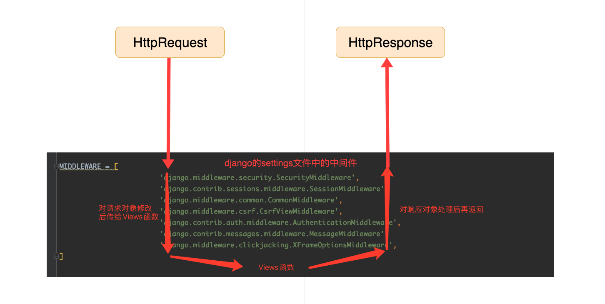
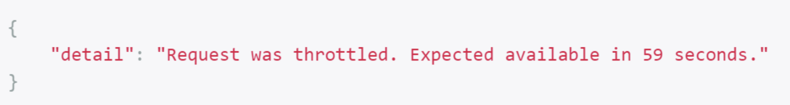
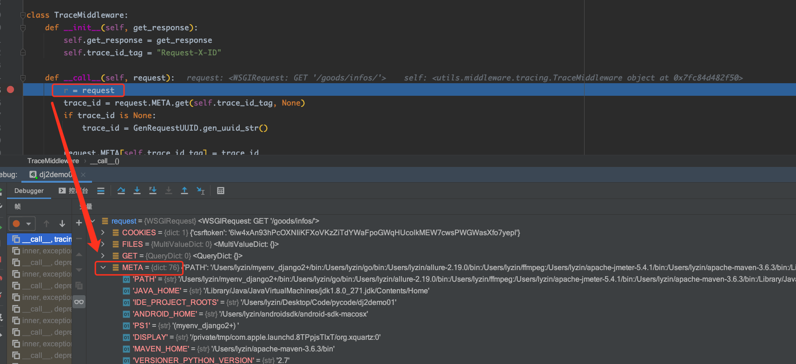
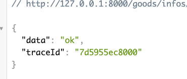

## 一、Web框架介绍

### 1、web框架的底层理解

```python
# 网络协议
HTTP协议    数据传输明文协议
HTTPS协议   数据传输密文协议
websock协议 数据传输密文协议

# HTTP四大特性
1. 基于请求、响应
2. 基于TCP/IP作用于应用层之上的协议
3. 无状态
4. 短/无链接

# HTTP数据格式
请求首行
请求头
请求行

# 响应状态码
1XX
2XX
3XX
4XX
5XX
```

#### 1.1 实现一个Http的服务端

```python
import socket

server = socket.socket()
server.bind(("127.0.0.1", 8000))

# 池子
server.listen(5)

while True:
    conn, addr = server.accept()

    # 接收客户端的请求数据,客户端可以是浏览器，请求相关的所有信息
    data = conn.recv(1024)
    print(f"recv data:{data}")
    print("data type is:",type(data))
    conn.send(b"HTTP/1.1 200 OK\r\n\r\nhello web")
    conn.close()
```

- 浏览器打开`http://127.0.0.1:8080`

> 终端内有两条请求记录，目前只关心`GET /` 这一条，`/favicon.ico`暂时不关心


```python
 print(f"recv data:{data}")
 print("data type is:",type(data))  # <class 'bytes'>
# 上面两行代码返回的data结果
 """
    b'GET / HTTP/1.1\r\n
    Host: 127.0.0.1:8001\r\n
    Connection: keep-alive\r\n
    Upgrade-Insecure-Requests: 1\r\n
    User-Agent: Mozilla/5.0 (Macintosh; Intel Mac OS X 10_15_7) AppleWebKit/537.36 (KHTML, like Gecko) Chrome/86.0.4240.111 Safari/537.36\r\n
    Accept: text/html,application/xhtml+xml,application/xml;q=0.9,image/avif,image/webp,image/apng,*/*;q=0.8,application/signed-exchange;v=b3;q=0.9\r\n
    Sec-Fetch-Site: none\r\n
    Sec-Fetch-Mode: navigate\r\n
    Sec-Fetch-User: ?1\r\n
    Sec-Fetch-Dest: document\r\n
    Accept-Encoding: gzip, deflate, br\r\n
    Accept-Language: zh-CN,zh;q=0.9\r\n
    Cookie: csrftoken=SwCZzdzHFXp8uGWHUqjfrIycQ1P4X6MMo0OG1EhPLPzfMYV1yeSaxmaOEq8GqbXe\r\n\r\n'
    """
```

### 2、wsgiref模块

> Django底层用的是`wsgiref`模块来请求和响应数据
>
> `wsgiref`模块也叫web服务网关接口
>
> 1. 请求来的时候解析`HTTP`格式的数据，封装成大字典
> 2. 响应走的时候给数据打包成符合`HTTP`格式的数据返回给浏览器

### 3、Django安装

> `Django`的版本问题
>
> - `Django1.x`和`Django2.x`的差距不大
> - 所以先学习`Django1.x`的即可，后续有需要可以往`Django2.x`过渡
> - 面试时可以说先用的1.8，慢慢过渡到了1.11版本
> - 因为Django1.11.11最好适合的Python3版本是`3.4~3.6`之间的版本，3.7以及后面的版本和Django的`1.11.11`版本有兼容问题
>   - 如果是python3.7，可以安装Django的1.11.17版本，这个版本创建app时不会报错
>   - [pip清华地址:https://mirrors.tuna.tsinghua.edu.cn/help/pypi/](https://mirrors.tuna.tsinghua.edu.cn/help/pypi/)

```bash
pip install django==1.11.17

// 查看django版本
(venv) D:\>django-admin version
1.11.17
```

## 二、Django基本操作

> 下面基本都在命令行操作

### 1、创建项目

> `blog`是项目名
>
> 使用`django-admin`可以快速创建一个`Django`项目

```bash
// 创建Django项目的命令
django-admin startproject blog
```

> 创建完以后可以看到项目目录的结构
>
> - 项目根目录有两个东西：
>   - 一个是项目管理文件: `manage.py`
>   - 另一个是目录:`blog`
>
> - `blog`目录中：
>
>   - `setting.py`：项目配置文件
>
>   - `urls.py` ：项目路由文件
>
>   - `wsgi.py` ：项目启动服务文件

### 2、创建应用

> - 一个`app`就是一个功能独立的模块
> - 一个项目可以有多个`app`：比如下面的`home`是就是应用名
>
> - 由于`django 1.11`版本和`python3.7`版本不兼容, 2.0版本以后的Django修复了这个问题，所以使用下面命令创建app就需要注意下python3和Django的版本
>

```bash
# 切换到创建的项目根目录
python manage.py startapp home
```


#### 2.1 应用的目录结构


#### 2.2 注册应用

> 创建出来的应用一定要先去配置文件中注册，在`setting.py`文件中
>
> 在`INSTALLED_APPS`中注册app。就是把home/apps.py文件中的HomeConfig类的申明路径添加进来

```python
# 注册创建的App
# Application definition

INSTALLED_APPS = [
    'django.contrib.admin',
    'django.contrib.auth',
    'django.contrib.contenttypes',
    'django.contrib.sessions',
    'django.contrib.messages',
    'django.contrib.staticfiles',
    # 'bolg.home',  // 全写
    'home' # 简写，只写应用名
]
```

### 3、项目目录结构介绍

```bash
- blog目录
		- blog目录中：
			 -- setting.py 配置文件
			 -- urls.py  路由与视图函数对应关系（路由层）
			 -- wsgi.py  wsgiref模块（不考虑）
		- manage.py  项目入口文件
		- db.sqlite3 自带数据库，很小，仅仅用来做测试
		- home目录
			 -- admin.py 后台管理
			 -- apps.py 注册使用
			 -- migrations 数据库迁移日志文件
			 -- models.py 数据库模型类，用于ORM
			 -- views.py 视图函数文件
			 -- test.py 测试文件
```

### 4、启动Django项目

```bash
python manage.py runserver
```


> 打开浏览器，输入上面的地址打开后可以看到下面页面，就表示启动`Django`成功
>
> 并且可以看到下面的英文提示：
>
> - 第一句(Your're seeing...):表示能看到这个消息，是`Django`项目的`setting.py`文件中的`DEBUG=True`
> - 第二句(you haven't...):表示还没有配置路由`URLS`


### 5、`templates`目录

> `templates`目录用来存放前段`HTML`页面的
>
> - 命令行创建`没有templates`文件目录
>
> - pycharm创建是`templates`文件目录的

### 6、Django三组件

#### 6.1 HttpResponse

> 从`HttpResponse`源码可以看：
>
> - 是一个`Http`响应，并且返回的是`字符串内容`
> - `Http响应内容`可以被读、追加或者替换
>
> 视图函数中的`request`参数是一个对象，用来获取`请求的所有数据`

```python
# HttpResponse部分源码
class HttpResponse(HttpResponseBase):
    """
    An HTTP response class with a string as content.

    This content that can be read, appended to or replaced.
    """

    streaming = False

    def __init__(self, content=b'', *args, **kwargs):
        super(HttpResponse, self).__init__(*args, **kwargs)
        # Content is a bytestring. See the `content` property methods.
        self.content = content
```

```python
# 写在urls.py文件
from home import views

urlpatterns = [
    # url(r'^admin/', admin.site.urls),
    url("^home/", views.home)
]
-------------------------------------------------------------------
# 写在应用的views.py中
from django.shortcuts import render,HttpResponse

# Create your views here.
def home(request):
    ret = HttpResponse("Hi, Django")
    print(ret) # <HttpResponse status_code=200, "text/html; charset=utf-8">
    print(ret.status_code) # 200
    print(type(ret)) # <class 'django.http.response.HttpResponse'>
    return ret
```

#### 6.2 render

> 给浏览器返回渲染的`html`文件，将`html`文件变成字节形式返回给浏览器
>
> render方法本身返回的还是`HttpResponse`对象

##### 2.1 创建`html`文件

> 1. 需要检查settings.py中有没有添加templates目录路径，没有的话，需要加上

```python
TEMPLATES = [
    {
        'BACKEND': 'django.template.backends.django.DjangoTemplates',
        'DIRS': [os.path.join(BASE_DIR, 'templates')],
        'APP_DIRS': True,
        'OPTIONS': {
            'context_processors': [
                'django.template.context_processors.debug',
                'django.template.context_processors.request',
                'django.contrib.auth.context_processors.auth',
                'django.contrib.messages.context_processors.messages',
            ],
        },
    },
]
```


> 1. 在项目根目录创建`templates`目录
> 2. 在`templates`目录创建对应的`html`文件
>     - `{{ ret }}`是django自带的模板语法，表示接收变量的值

```html
<!DOCTYPE html>
<html lang="en">
<head>
    <meta charset="UTF-8">
    <title>Title</title>
</head>
<body>
    {{ ret }}
</body>
</html>
```

##### 2.2 编写路由

```python
# 在settings.py文件中添加index_html的路由
from django.conf.urls import url
from django.contrib import admin
from day01 import views

urlpatterns = [
    url(r'^admin/', admin.site.urls),
    url(r'^index/', views.index),
    url(r'^index_html/', views.index_html),
]
```

##### 2.3 编写视图函数

```python
# 应用中使用，写在views.py中
def index_html(request):
    """
    :param request: 请求相关的所有的数据
    :return: HttpResponse对象值
    """
    ret = 'html page data'
    # 直接写templates目录下的html文件名
    return render(request, 'index.html', locals())
```

##### 2.4 请求页面

> 访问`http://127.0.0.1:8000/index_html/`即可看到下面的页面


#### 6.3 redirect

> 表示在视图函数中跳转到别的页面，也叫重定向
>
> redirect本身还是`HttpResponse`对象

```python
# 应用中使用,写在views.py中
def index_redirect(request):
    """
    :param request: 请求相关的所有的数据
    :return: HttpResponse对象值
    """
    redirect_url = '/index/'
    return redirect(redirect_url)
```

> 访问`http://127.0.0.1:8000/index_html/`就会最终跳转至`/index/`页面


### 7、静态文件配置

> `html`文件都放在`templates`文件下
>
> 将静态文件放在`static`文件夹里
>
> - 前端写好的文件都可以叫静态文件，比如`js`/`css`/`图片`/`前端框架`
>
> `django`需要自己创建`static`文件夹
>
> - 在`static`中可以放`js`/`css`/`plugins`等文件夹，做好区分


#### 7.1 静态文件绝对路径

> `谨记：`
>
> - `在浏览器输入url时，能看到对应的资源，是因为服务端开启了对应资源的接口`
> - `如果访问不到，那就是服务端没有开启对应资源的接口`

> 未开启对应资源的接口，而是只在Django目录下创建了`/static/css/home.css`目录和文件，然后直接在`html`里直接引用，就会报错，因为服务端根本没有将这个资源的入口开启，直接访问会404找不到

```html
# index文件里直接写css文件
<!DOCTYPE html>
<html lang="en">
<head>
    <meta charset="UTF-8">
    <title>home</title>
    <link rel="stylesheet" href="../static/css/home.css">
</head>
<body>
    <p>这是主页</p>
</body>
</html>
```


> 上述在浏览器打开`http://127.0.0.1:8000/home/`就会出现home.css文件404的情况


#### 7.2 服务端开启静态资源入口

> 因为上面的报错，所以需要服务端开启访问静态资源的入口，才可以使得前端可以访问到资源
>
> `STATICFILES_DIRS`表示:
>
> - 开放了静态文件路径，将`Django`目录下创建的`static`文件夹加入到了`静态资源列表`,前端页面就可以访问到了
> - 是一个列表，表示可以放多个静态资源目录
>   - 多个时，先从第一个找，找不到继续往下找，直到找到就会返回对应的资源
>
> `STATIC_URL = '/static/'`:
>
> - 表示前端访问静态资源时，需要带的一个令牌，拿着这个令牌，再去`STATICFILES_DIRS`里的文件夹中去找对应的资源文件
> - 前端写静态资源的路径时，写的`static`就是`STATIC_URL`后面的`/static/`就是令牌
> - 那么这个令牌就可以自定义了，只需要改了这里，前端页面去拿静态资源时的令牌就要变成修改的了，比如将`/static/`改为`/abc/`，那么前端页面里写静态资源路径时的第一个单词就要写成`/abc/`

```python
# 在setting.py文件下添加该行代码，表示服务端开启了访问静态资源的入口
# Static files (CSS, JavaScript, Images)
# https://docs.djangoproject.com/en/1.11/howto/static-files/

# 这个是访问的令牌
STATIC_URL = '/static/'

# 此处为新加代码
STATICFILES_DIRS = [
    os.path.join(BASE_DIR, "static"),
]
```


> 再次访问`http://127.0.0.1:8000/home/`就会出现正常样式


#### 7.3 灵活取令牌值

> ​	但是当前端页面很多时，并且我们都是用相对路径去写静态资源的路径，并且路径第一个单词是`令牌`，这个时候需要修改令牌时，就会需要修改很多文件，那么怎么灵活处理呢？就用到了`静态文件动态解析`
>


### 8、request对象方法

#### 8.1 关闭`csrf`中间件

> 在前阶段学习时，可以先注释`csrf`中间件，否则做一些`form`的`post`表单提交时会报错，后面再来探讨这个问题


#### 8.2 request对象

> 在视图函数中都会有`request`形参，需要重点来学习下这个`request`，`request`是一个对象，里面有很多可以供我们使用的方法

```python
# 还是用之前的home函数
from django.shortcuts import render,HttpResponse

# Create your views here.

def home(request):
    print(request) # <WSGIRequest: GET '/home/'>
    print(type(request)) #<class 'django.core.handlers.wsgi.WSGIRequest'>
    print(dir(request)) 
    return render(request, "index.html")
```

```python
dir(request) # 可以看到有很多的方法

# ['COOKIES', 'FILES', 'GET', 'META', 'POST', '__class__', '__delattr__', '__dict__', '__dir__', '__doc__', '__eq__', '__format__', '__ge__', '__getattribute__', '__gt__', '__hash__', '__init__', '__init_subclass__', '__iter__', '__le__', '__lt__', '__module__', '__ne__', '__new__', '__reduce__', '__reduce_ex__', '__repr__', '__setattr__', '__sizeof__', '__str__', '__subclasshook__', '__weakref__', '_encoding', '_get_post', '_get_raw_host', '_get_scheme', '_initialize_handlers', '_load_post_and_files', '_mark_post_parse_error', '_messages', '_post_parse_error', '_read_started', '_set_post', '_stream', '_upload_handlers', 'body', 'build_absolute_uri', 'close', 'content_params', 'content_type', 'encoding', 'environ', 'get_full_path', 'get_host', 'get_port', 'get_raw_uri', 'get_signed_cookie', 'is_ajax', 'is_secure', 'method', 'parse_file_upload', 'path', 'path_info', 'read', 'readline', 'readlines', 'resolver_match', 'scheme', 'session', 'upload_handlers', 'user', 'xreadlines']
```

> 通过debug断点，也可以看到request形参里的大部分常见的方法


##### 8.2.1 request.method

> 用来获取请求这个url的请求方法
>
> 如果是以`get`方法请求的这个视图函数，那么`request.method`返回值就是`大写的GET`字符串
>
> 如果是以`post`方法请求的这个视图函数，那么`request.method`返回值就是`大写的POST`字符串
>
> 举例：这样就可以用来做请求方法拆分，可以使用`if`先判断请求方法是什么：
>
> - 如果请求方法是`GET`，可以先返回一个页面
> - 如果请求方法是`POST`，返回单独的`POST`请求处理，在`POST`里就可以获取前端传入的请求数据

```python
from django.shortcuts import render,HttpResponse

# Create your views here.

def home(request):
    if request.method == "POST":
        return HttpResponse("POST data")
    return render(request, "index.html")
```

##### 8.2.2 request.POST

> 用来获取用户提交的`post`请求数据
>
> - 提交的post请求里不包含文件上传的请求
>
> - post请求参数一般都是请求体里面

```html
# 创建一个form表单
<body>
    <p>这是主页</p>
    <form action="/home/" method="post">
        用户名: <input type="text" name="uname">
        密码: <input type="text" name="pwd">
        爱好:
            <input type="checkbox" name="hobby" value="足球">足球
            <input type="checkbox" name="hobby" value="排球">排球
            <input type="checkbox" name="hobby" value="桌球">桌球
        <input type="submit">
    </form>
</body>
</html>
```


> 后端`views.py`代码，从中可以看出：
>
> - `request.POST`是一个查询字典，类型是`<class 'django.http.request.QueryDict'>`
> - `request.POST`的`get方法`只会获取最后一个值，并且类型是`str`
> - `request.POST`的`getlist方法`会获取所有值，并且类型是`list`

```python
def home(request):
    if request.method == "POST":
        # <QueryDict: {'uname': ['ko'], 'pwd': ['123'], 'hobby': ['足球', '排球']}>
        print("request.POST:", request.POST)
        # <class 'django.http.request.QueryDict'>
        print("request.POST type:", type(request.POST))

        # get方法只会获取最后一个值
        uname = request.POST.get("uname")
        # uname = > ko
        print("uname=>", uname)
        # <class 'str'>
        print("uname type:", type(uname))

        # get方法只会获取最后一个值
        hob = request.POST.get("hobby")

        # 桌球
        print("hob=>", hob) # 桌球
        
        # <class 'str'>
        print("hob type=>", type(hob)) # 桌球

        hob_list= request.POST.getlist("hobby")
        # ['排球', '桌球']
        print("hob_list=>", hob_list)

        # <class 'list'>
        print("hob_list type=>", type(hob_list))
        return HttpResponse("POST data")
    return render(request, "index.html")
```

##### 8.2.3 request.GET

> `request.GET`和`request.POST`的所有请求方法都一样
>
> `request.GET`常用于获取url后面携带的参数，比如：
>
> - url = ”http://127.0.0.1:8000/query_course/?id=2”
>
> - 同样`request.GET`也支持用`get`/`getlist`获取`url`后面带的值

```python
# 请求的url：http://127.0.0.1:8000/home/?user=ko&age=19
# ?user=ko&age=19 是拼接的参数，在url里可以看到

def home(request):
    # < QueryDict: {'user': ['ko'], 'age': ['19']} >
    print(request.GET)
    
    # <class 'django.http.request.QueryDict'>
    print(type(request.GET))
    
    # 19
    print(request.GET.get("age"))

    # <class 'str'>
    print(type(request.GET.get("age")))
    return render(request, "index.html")
```

##### 8.2.4 POST请求知识扩展

> Post提交数据的几种方式
>
> https://wenku.baidu.com/view/9432b55ba16925c52cc58bd63186bceb19e8ede5.html
>
> https://blog.csdn.net/cheress/article/details/113030081
>
> https://blog.csdn.net/liyantianmin/article/details/91492135
>
> https://www.cnblogs.com/hahaha111122222/p/14349812.html
>
> https://www.jianshu.com/p/cf4f395347e8?u_atoken=7d3ef8d0-cc89-4ded-9703-93649c89937d&u_asession=01N3sFT5YOp4JpqgmV-cOHQyK2hr1LDlibUwnqBMZrNTvsTUTzSww7QPNL-_rel4P7X0KNBwm7Lovlpxjd_P_q4JsKWYrT3W_NKPr8w6oU7K_lJj4ZGt_093nafvxQoI3-MKWrbBzYAhXhkL4v5_cjQmBkFo3NEHBv0PZUm6pbxQU&u_asig=05cOLe0D_m46_MUQXrZd9nkBYhElZhMZra74wlj19FjtSKuMSK6lpdFb18QrJYyijIcE6gfYXqcWW0QNsfCpPsPUhAyZWbQGoCiTuXNuTgtePLr4p6nycrNRerqP1UoEGj3DdOLf8P37N4a5sPqwEcE2ThydPgapMoI_hft2I3hkv9JS7q8ZD7Xtz2Ly-b0kmuyAKRFSVJkkdwVUnyHAIJzYNlG-spcJl3Bjpy344qS7O5IN2QVE9vNUz-HW7jV6z8df9JIAkyKervFWgmMgV8j-3h9VXwMyh6PgyDIVSG1W_M8W7hYpolf9WK8gAqynFvntxszIC-jZ3XnMw67JPJQ0D1VPAyD0j6vmt0vrdGriYru-vXQCXeHMnZd9iioZRVmWspDxyAEEo4kbsryBKb9Q&u_aref=5yhoGMDXSG57iRSyUfORFEMb%2Fk8%3D
>
> https://www.jianshu.com/p/89820a36d2e0

> 这个可以多看看
>
> https://www.jianshu.com/p/7987a88f3022

##### 8.2.5 编码方式知识扩展

> 字符编码：ASCII 与 UTF-8编码
>
> https://blog.csdn.net/salvare/article/details/82941165

#### 8.3 request.path相关

```python
def index(request):
    ret = {}
    if request.method == "GET":
        print(f"request.path:", request.path)
        print(f"request.path_info:", request.path_info)
        print(f"request.get_full_path():", request.get_full_path())

        ret["method"] = request.method
        return HttpResponse(json.dumps(ret))
```

> 访问路由时不带参数


> 访问路由时带参数
>
> 


##### 8.3.1 path属性(推荐)

> 获取的是不带域名、不带?号后面参数的路由部分

##### 8.3.1 path_info属性(不推荐)

> 获取的是不带域名、不带?号后面参数的路由部分

##### 8.3.1 get_full_path方法

> 注意：
>
> - 当访问路由时没有参数，get_full_path方法和path、path_info属性获取到的路由都一样
> - 当访问路由时带了参数，get_full_path方法会`将路由和?号后面的参数都一起返回`

#### 8.4 request.body相关

> 返回的是原生浏览器发过来的二进制数据

```python
res = request.body
```


### 9、Pycharm操作Django技巧

#### 9.1 快速创建Django应用


#### 9.2 修改Django端口


#### 9.3 浏览器访问页面不走缓存

> 谷歌浏览器打开F12，找到设置，勾选下面的选项即可


### 10、路由

#### 10.1 路由匹配

> Django中的路由是通过正则进行匹配的

> 当用浏览器访问url的时候，比如这样的路由”url(r'^add_course/', views.add_course)”，在浏览器地址栏输入url时，“add_course”不带最后的“/”，浏览器会发起两次请求，第二次浏览器会自动带上“/”，然后匹配到”add_course“这个url，这个是Django提供的功能，提供了重定向功能，告知浏览器加上/再试一次


> 在Django中的settings.py里控制是否自动添加/，默认是`Ture`


#### 10.2 无名分组

##### 10.2.1 无名分组使用

> Django支持在url中设置变量来接收传进来的值，本质就是通过正则表达式来匹配
>
> 分组其实就是给一段正则表达式用小括号括起来，进行匹配路由里的参数
>
> 注意：
>
> - 无名分组是将括号内的正则表达式匹配的内容当做`位置参数`传递给后面的视图函数

```python
# 无名分组
url(r'^query_my_course/(\d+)/', views.query_my_course),
```

```python
# 视图函数里需要有一个位置参数来接收正则表达式匹配到的内容
def query_my_course(request, num):
    print(f"传进来的参数:{num}")
    return HttpResponse(f"传进来的参数:{num}")
```


> 上面调用接口，服务端代码里就可以接收到正则表达式匹配到的内容


##### 10.2.2 无名分组反向解析

#### 10.3 有名分组

##### 10.3.1 有名分组使用

> 相当于给正则匹配起了个别名，
>
> - 将括号内正则表达式匹配到的内容当做`关键字参数`传递给后面的视图函数
> - 那么括号内的正则表达式匹配的内容当做`位置参数`传递给后面的视图函数，`位置参数名`必须要和正则表达式起的别名一样，否则就会报错

```python
 # 有名分组
url(r'^collect_new_course/(?P<levelId>\d+)/', views.collect_new_course),
```

```python
def collect_new_course(request, levelId):
    print(f"year={levelId}")
    return HttpResponse(f"collect_new_course传进来的参数:{levelId}")
```


> 可以看到将URL中的数字匹配了出来，并且传递给了服务端的视图函数
>
> 那如果过视图函数不用这个有名的`levelId`接收传进来的值，会报什么错？

```python
def collect_new_course(request, level_id):
    print(f"year={level_id}")
    return HttpResponse(f"collect_new_course传进来的参数:{level_id}")
```


> 翻译过来就是：collect_new_course()获得了一个意外的关键字参数“levelId”
>
> 原因是传入视图函数的`形参名level_id`和urls.py里定义的有名分组名称`levelId`不一样，应该是levelId，但是视图函数里传入的是level_id，所以视图提示报错得到了一个非预期的关键字参数`levelId`


##### 10.1.2 有名分组反向解析

#### 10.4 有名分组和无名分组注意

> - 有名分组和无名分组注意不能混合使用
> - 但是`单独`的有名分组、无名分组可以使用多个

```python
# 有名分组，urls.py文件中
url(r'^collect_new_course/(?P<levelId>\d+)/(?P<level_num>\d+)', views.collect_new_course)
```

```python
# 视图函数
def collect_new_course(request, levelId, level_num):
    print(f"level_id={levelId}")
    print(f"level_num={level_num}")
    return HttpResponse(f"collect_new_course传进来的参数:{levelId, level_num}")
```


#### 10.5 路由分发

> Django的每一个应用都可以有自己的`templates文件夹`、`urls.py`、`static文件夹`
>
> - 基于上面的特性，Django可以非常好的做到分组开发，每个人只写自己的app
> - 可以将所有写好的app汇总过来，在配置文件中注册所有的app，再利用路由分发的特点将所有的app整合起来

> 路由分发的优点：
>
> - 利用路由分发以后，总路由不再处理路由和视图函数的直接对应关系，而只是进行分发处理(url指向需要找到的app)，然后根据识别到当前url是属于哪个应用下，然后分发给对应的应用去处理

##### 10.5.1 路由分发第一步

> app用来代表不同的应用简写，没有别的含义，比如`订单应用`、`用户应用`等等
>
> 在app目录中添加一个url.py文件
>
> - 在项目的settings.py中提前注册app
>
> - app/urls.py的内容可以拷贝项目目录中的urls.py文件内容，将app的路由都写在app/urls.py文件中
>     - 需要再app/urls.py中导入app的views，然后views再指向具体的视图函数

```python
# 在app目录中添加urls.py
from django.conf.urls import url
from home import views

urlpatterns = [
    url(r'index/', views.index)
]
```


> 可以看到将home应用所有的url都放在了home/urls.py文件中

##### 10.5.2 路由分发第二步

> 在项目总路由中添加应用的路由分发，需要提前导入`include`方法
>
> 有两种写法
>
> - 方法一（不推荐）
>     - 先从应用导入urls：`from home import urls as home_url`
>     - 然后urlpatterns中添加：`url(r'^home/', include(home_url))`，include中包含了导入的路由
> - 方法二（推荐）
>     - 不用写需要导入urls
>     - 然后urlpatterns中添加：`url(r'^home/', include("home.urls")`
>         - include中是一个字符串，应用名.urls组成，这样Django会自动识别应用下的urls文件
>
> 注意：
>
> - 总路由的url中不能添加`$`符号，加了就不能往对应的app中进行分发了

```python
# 项目的urls.py文件
from django.conf.urls import url, include
from django.contrib import admin
from home import urls as home_url

urlpatterns = [
    url(r'^admin/', admin.site.urls),
    # 路由分发
    # 不推荐：只要路由前缀是home开头的，全部交给home去处理
    # url(r'^home/', include(home_url))

    # 推荐写法：
    url(r'^home/', include("home.urls"))
  ]
```


##### 10.5.3 访问路由分发的应用

> 有了路由分发以后，访问路由就需要前带上应用名，再去访问应用里具体的路由
>
> 比如：访问home应用的`user_info`路由，应该写成`http://127.0.0.1:8000/home/user_info/`


> 可以看到django的路由指向就是指向了`home/user_info/`路由中


> 路由分发后面就可以根据应用(也可以叫模块)区分路由，比如用户应用(管理用户内容的，比如注册、查询、修改、注销等)、订单应用(管理订单相关内容，比如创建订单、支付订单、查询订单、关闭订单等等)

#### 10.6 名称空间（了解）

> 当多个应用出现了相同的别名，反向解析是没法自动识别相同的别名的前缀的，用的很少

#### 10.7 伪静态（了解）

> 其实就是把一个动态网页伪装成静态网页，乐嘉增大网站的seo查询热度，增加搜索引擎的查询概率，用的很少
>
> 用法就是在具体的路由后面加`.html`，伪装成一个静态网页，比如：`http://127.0.0.1:8000/home/user_info.html`

### 11、JsonResponse对象

> Django中返回的响应对象常见的有两个
>
> - HttpResponse
>     - 返回的是字符串类型
>
> - JsonResponse
>     - 是一个HTTP响应类，传进来的数据将被序列化为JSON格式
>     - `JsonResponse`中传入的数据。默认情况下，只支持`dict`对象
>         - 由于EcmaScript 5之前的安全漏洞，只允许传递`dict`对象，参见更多信息请参见`safe`参数
>         - `safe`参数控制是否只有`dict`对象可以被序列化，默认为"True"，这样就只支持`dict`对象被序列化
>         - 如果需要支持非`dict`对象被序列化，那`safe`参数需要设置为`False`
>     - `JsonResponse`本身内部就是调用的`json`库进行序列化的，如果序列化时有中文，用postman等接口工具调用接口时，返回的响应内容中文会变乱码，那么就需要添加参数控制中文被原样输出，而不是被转换
>         - 参数`json_dumps_params`可以以字典形式接收json库里支持的其他参数
>         - 传递给json.dumps()的一个kwargs字典，把json库里的参数传进去，`ensure_ascii=False`表示不用ASCII编码方式，因为ASCII编码不支持中文，遇到中文就会乱码

```python
# 部分代码
ret = {"msg": f"不支持的请求方法:{request.method}"}
return JsonResponse(ret, json_dumps_params={"ensure_ascii": False})
```

```python
# 序列化非字典结果，需要设置safe参数
ret = {"msg": f"不支持的请求方法:{request.method}"}
return JsonResponse(ret, json_dumps_params={"ensure_ascii": False}, safe=False)
```

> 不加safe=False参数，输出非dict对象时，就会报错


### 12、文件上传操作

> 文件上传是属于form表单里的功能
>
> form表单上传文件类型的数据要求
>
> - `method`必须是`post`
> - `enctype`必须是`formdata`

```python
# 上传文件使用的是FILES方法，和GET、POST获取参数值的方法一样
file_obj = request.FILES.get("user_img")
```

```python
def upload_avatar(request):
    if request.method == "POST":
        file_obj = request.FILES.get("user_img")
        print(f"file name:{file_obj, type(file_obj)}")
        print(f"file name:{file_obj.name}")
        with open(file_obj.name, "wb") as f:
            for line in file_obj.chunks():
                f.write(line)
        return HttpResponse("上传用户头像成功")

    return HttpResponse(f"不支持的请求方法:{request.method}")
```


> request.FILES.get(“上传文件的key”)，这种获取文件对象的想法和`GET`/`POST`获取请求参数的值一样
>
> FILES方法获取到的file_obj：
>
> - file_obj的值是：`InMemoryUploadedFile: p1.jpeg (image/jpeg)`
> - file_obj的类型：`class 'django.core.files.uploadedfile.InMemoryUploadedFile'`
> - file_obj.name：可以通过获取到的文件对象`.name`属性来获取上传的文件名，然后保存到本地或其他地方

### 13、FBV和CBV

#### 13.1 FBV


#### 13.2 CBV


## 三、ORM数据库

### 1、Pycharm连接数据库

> 使用`docker`可以快速创建`mysql`等数据库，用来快速搭建想要的环境

#### 1.1 mac下连接docker的mysql

> 步骤：
>
> - 创建一个`mysql`容器，拉取`mysql:5.7`镜像，再去创建容器，此处可以查看mysql笔记中记录了如何创建容器
> - 注意
>   - 创建完的数据库默认用户是root，密码使用`-e MYSQL_ROOT_PASSWORD=123456`设置为123456
>   - 创建完以后需要登录容器内部，给root用户开启远程访问权限，否则在容器外部会出现访问数据库失败的情况

```bash
# 拉取mysql容器，选择5.7版本的tag，不写5.7则会拉取8版本，8版本对我们来说太新了
docker pull mysql:5.7

# 启动容器
docker run -dit --name mysql -p 3306:3306  -e MYSQL_ROOT_PASSWORD=123456 mysql:5.7
#  表示设置数据库用户root的密码为123456

# 登录容器，赋予root远程登录权限
docker exec -it mysql /bin/bash

# 登录mysql容器后，配置远程访问权限
>> grant all privileges on *.* to root@"%" identified by "123456";
>> flush privileges ;

# 上面配置完成退出数据库，就可以在容器外部连接mysql了
mysql -uroot -h127.0.0.1 -p123456
```

> 在上述配置好以后，就可以在`pycharm`中打开`mysql`连接界面，进行连接数据库了，下面用截图表示


> 需要先下载对应数据库的驱动，上图配置界面会提示下载，点击下载即可
>
> 主机：数据库的地址，因为是本地连接，所以是127.0.0.1
>
> 端口：3306不变
>
> 用户、密码：数据库的用户和密码
>
> 数据库：提前创建好的数据名，需要提前在数据库中创建才可以进行连接
>
> 上面连接信息填写完以后，点击`测试连接`即可快速验证数据库是否连接成功，若未成功，需要检查下配置是否正确

#### 1.2 windows下连接docker的mysql

> `windows`下也可以用`docker`的`mysql`，一般可以在`linux`虚拟机里安装docker，在启动mysql容器
>
> 所以拉取`mysql`镜像,修改`mysql`的`root`权限、在`pycharm`中配置等步骤都和上面的`mac`配置一样
>
> 唯一区别在于：
>
> - windows下的`pycharm`想连接虚拟机里的docker的`mysql`容器，需要使用`pycharm`的`ssh隧道`功能先连接上虚拟机，再去连接虚拟机里的数据库
> - 下图展示了如何配置


> 虚拟机连接上后，再配置数据库连接


> 到这里数据库连接配置完成，可以在`pycharm`进行`django`的数据库连接了

### 2、Django连接Mysql

#### 2.1 配置mysql连接

> `Django`连接数据库时，需要先创建好数据库
>
> `Django`自带了一个小型数据库`sqlite3`，这个数据库比较小，我们可以不用他，换成`mysql`
>
> `Django`如何连接`mysql`
>
> [官方地址: https://docs.djangoproject.com/en/1.11/ref/settings/#databases](https://docs.djangoproject.com/en/1.11/ref/settings/#databases)
>
> 注意一定要在`settings.py`文件中注册`APP`，否则会出现数据库迁移失败的情况

> `Django`连接mysql需要在`settings.py`中指定连接数据的名字、用户名、密码、端口
>
> `Django`连接数据库一定要先创建数据库，再去`settings.py`里去连接

```python
# settings.py文件，大概78行
# Database
# https://docs.djangoproject.com/en/1.11/ref/settings/#databases

# 这是默认的sqlite3连接，可以注释掉，连接mysql
DATABASES = {
    'default': {
        'ENGINE': 'django.db.backends.sqlite3',
        'NAME': os.path.join(BASE_DIR, 'db.sqlite3'),
    }
}

# 连接mysql
DATABASES = {
    'default': {
        'ENGINE': 'django.db.backends.mysql',
        'NAME': 'mydatabase',   
        'USER': 'mydatabaseuser',
        'PASSWORD': 'mypassword',
        'HOST': '127.0.0.1',
        'PORT': '5432',
	}
}
```


#### 2.2 配置mysql启动Django错误修复

> 在settings里配置了mysql以后，启动django就会报如下错误


> 错误信息：这个提示是没有`MySQLdb`模块，
>
> Django默认用的是`MySQLdb`模块来连接数据库，但是`MySQLdb`模块兼容性不好，而且容易出错，所以需要我们去手动指定连接mysql数据库的第三库`pymysql`

> 手动配置pymysql方法：
>
> - 先安装pymysql：`pip install pymysql`
> - 下面方法任选一个
>     - 在Django的项目目录(包含urls.py、settings.py的目录)里有一个`__init__.py`的文件，在里面添加如下代码
>         - 这样相当于做到了全局配置，每个app目录里就不用配置了
>     - 在Django每个app目录下，都有一个`__init__.py`的文件，在里面添加如下代码

```python
# 在Django的项目目录的__init__.py的文件
import pymysql
pymysql.install_as_MySQLdb()
```


> 配置完成后再次启动就可以了

#### 2.3 设置Django的时区

> 使用mysql数据时，需要考虑设置时区为国内，否则数据库中存储的时间和国内时间差8个小时
>
> 下面是解决办法：
>
> - 在Django的配置文件settings.py中，有两个配置参数是跟时间与时区有关的，分别是TIME_ZONE和USE_TZ
>     - 如果USE_TZ设置为True时，Django会使用系统默认设置的时区，即America/Chicago，此时的TIME_ZONE不管有没有设置都不起作用。
>     - 如果USE_TZ 设置为False，而TIME_ZONE设置为None，则Django还是会使用默认的America/Chicago时间。若TIME_ZONE设置为其它时区(比如国内)的话，则还要分情况
>         - 如果是Windows系统，则TIME_ZONE设置是没用的，Django会使用本机的时间。
>         - 如果为其他系统，则使用该时区的时间，入设置USE_TZ = False, TIME_ZONE = 'Asia/Shanghai', 则使用上海的UTC时间

### 3、ORM的使用

#### 3.1 ORM简介

> `ORM`：对象关系映射
>
> 主要是用来将mysql语句通过面向对象去执行
>
> 主要是在`Django`的`app`的`models.py`文件中写创建表语句，以面向对象的形式

#### 3.2 ORM编写建表语句

> 需要在对应`app`的models.py`文件中写数据库的面向对象代码
>
> models官方教程：https://docs.djangoproject.com/zh-hans/4.0/intro/tutorial02/

##### 3.2.1 AutoField字段

> 表示一个自增列，等同于int，必须将给列设置为主键（primary_key=True）

##### 3.2.2 CharField字段

> 当定义字段为CharField时，一定要指定`max_length`参数，不指定就会直接报错

```python
# 示例
name = models.CharField(max_length=32)
```

##### 3.2.3 DateTimeField字段　

> 日期时间类型（datetime），官网对于[DateTimeField](https://docs.djangoproject.com/zh-hans/4.0/ref/models/fields/#django.db.models.DateTimeField)字段解释
>
> 支持两个参数：
>
> - `auto_now_add=True`：则只是第一次创建添加，之后的更新不再改变该值，比较适合作为`创建时间`
>
> - `auto_now=True`：则每次更新都会更新这个时间，比较适合作为`更新时间`

##### 3.2.4 DateField字段

> 日期类型 date，对于参数和DateTimeField字段一样

##### 3.2.5 verbose_name参数

> 可以给每个字段都加一个verbose_name字段，这样启用django的admin平台查看数据库字段时，就是中文的

```python
# 比如
name = models.CharField(max_length=32, verbose_name="用户名")
```

##### 3.2.6 编写示例

> 下面是创建了一个User表语句代码

```python
from django.db import models

# Create your models here.

class CourseLevel(models.Model):
    id = models.AutoField(primary_key=True, name="主键ID", verbose_name="主键ID")
    level_name = models.CharField(max_length=32, verbose_name="级别名称")
    level_desc = models.CharField(max_length=64, verbose_name="级别描述")
    db_ctime = models.DateTimeField(auto_now_add=True, verbose_name="创建时间")
    db_utime = models.DateTimeField(auto_now=True, verbose_name="更新时间")
```

##### 3.2.7 表字段注释

> django的model默认不支持数据库建表语句字段添加注释的，[可参考这个教程](https://blog.csdn.net/Tomonkey/article/details/116663370?spm=1001.2101.3001.6650.1&utm_medium=distribute.pc_relevant.none-task-blog-2%7Edefault%7ECTRLIST%7Edefault-1-116663370-blog-120064590.pc_relevant_multi_platform_whitelistv2&depth_1-utm_source=distribute.pc_relevant.none-task-blog-2%7Edefault%7ECTRLIST%7Edefault-1-116663370-blog-120064590.pc_relevant_multi_platform_whitelistv2&utm_relevant_index=1)

#### 3.3 Django数据库迁移命令

##### 3.3.1 生成迁移记录

> 下面的命令，主要用来生成数据库建表语句记录，下面的命令只是生成记录，还没有真正在数据库中执行创建表

```bash
python manage.py makemigrations
```

> 执行后会在对应`app`的`migrations`文件夹下生成一个类似`0001_initial.py`的文件，主要记录了建表语句


##### 3.3.2 查看真正的建表语句

> 生成数据库迁移文件以后，有个命令可查看真正的建表语句，在项目根目录下执行

```bash
 python manage.py sqlmigrate home 0001_initial
 # sqlmigrate 用来打印真正的建表语句命令
 # home 对应是home这个app
 # 0001_initial 这个是数据库迁移文件，目录是在app/migrations里面，要查看哪次的迁移建表语句就直接写那个文件
```


##### 3.3.3 真正同步数据到数据库

> 下面命令，将操作真正同步到数据库中

```python
python manage.py migrate
```

> 在数据库中就能看到迁移过来的表，同时我们创建表命名规则是： app名 + 下划线 + models中的类名小写
>
> 这样以后有多个app时，就可以用app名区分开表了


> 查看数据库中的真正建表语句


##### 3.3.4 migrate不成功原因

> 执行migrate不成功原因，是django在app/migrations目录下生成的迁移文件名不是`initial`结尾的


#### 3.4 ORM的优化点

> 在表里面一般都有`id`字段，表示主键字段
>
> - 在models.py中部定义id字段时，那么Django的ORM会自动创建一个叫`id`的字段，并且是自增的

#### 3.5 ORM字段的增删改查

> 需要对ORM字段进行增删改查时，注意是字段，不是数据

#### 3.6 ORM表数据的增加

##### 3.6.1 增加数据

> 增加数据，相当于`mysql数据库`中的操作就是`insert into`操作

> 第一种增加数据方式

```python
models.表名类.object.create(字段名=字段值,字段名=字段值,...)
```

```python
# ORM操作数据库添加数据语法
if request.method == "POST":
    level_name = request.POST.get("level_name")
    level_desc = request.POST.get("level_desc")
res = CourseLevel.objects.create(level_name=level_name, level_desc=level_desc)
print(f"res:{res}")
```

> 上面代码表示从post请求里获取`level_name`和`level_desc`这两个参数值，然后保存到数据库中，并且返回了保存对象本身，然后就可以对返回的保存对象获取的的id以及其他信息，返回给调用者

> 第二种增加数据方式

```python
# 先实例化一个数据对象
course_level_obj = models.CourseLevel(level_name=level_name, level_desc=level_desc)
course_level_obj.save()
```

> 这种方式的保存数据是利用对象点属性方法的形式保存数据

#### 3.7 ORM表数据的删除

> 直接找到符合条件的数据对象(querySet集合)，然后全部删除，是批量删除操作

```python
def delete_course(request):
    # 先获取用户想要删除的数据对象id
    level_id = request.GET.get("id")
    # 直接找到符合条件的数据，全部删除，是一个批量删除操作
    delete_obj = CourseLevel.objects.filter(id=level_id).delete()
    print(f"delete_obj={delete_obj}")
    return JsonResponse({"msg": "删除成功"})
```

#### 3.8 ORM表数据的更改

> 表数据的修改其实就是在执行sql里的`update`操作
>
> 如何告诉后端用户想要编辑的数据：
>
> - 将编辑按钮所在的那一行数据的ID主键值给后端
> - 利用url后面带参数的方式
> - 注意：后端需要查出来用户想要编辑的数据对象，这样才能展示到前端页面让用户查看和编辑
>
> 更新数据有两种方式

##### 3.8.1 更新数据(推荐)

> 更新的时候，需要先用filter方法根据条件查出来需要更新的数据，然后再更新数据，这个操作是`批量更新`
>
> 该操作只修改需要修改的数据

```python
# 更新数据，update里放的是需要更新的字段，更新成功以后，res返回1，更新失败返回0
res = CourseLevel.objects.filter(id=level_id).update(level_name=level_name, level_desc=level_desc)
```

> 更新之前先查询数据


> 更新数据，调用更新接口
>
> 更新成功以后，update_obj会返回1，更新失败会返回0

```python
def update_course(request):
    msg = {
        "msg": "更新成功",
        "data": ""
    }
    if request.method == "POST":
        # 拿到需要编辑的数据的id
        level_id = request.POST.get("id")
        level_name = request.POST.get("level_name")
        level_desc = request.POST.get("level_desc")

        # 修改数据的方式
        # 将filter查询出来的列表中所有的对象全部更新，批量更新操作
        update_obj = CourseLevel.objects.filter(id=level_id).update(level_name=level_name, level_desc=level_desc)
        # msg["data"] = update_obj
        print(update_obj)

    return JsonResponse(msg)
```


> 上面更新执行完成后，再次查询数据，可以看到数据已经变为更新后的数据了


##### 3.8.2 更新数据(不推荐)

> 这个方法里是用save进行局部数据更新
>
> - 相当于是重新保存了一个新的数据对象
> - 尤其是字段很多的时候，更新效率会很低
>
> - 缺点
>     - 会从头到尾将数据的所哟欧字段全部再更新一次，无论该字段是否需要需要
>
> 

```python
# 先拿到需要修改的数据对象，然后通过对象.属性的方式编辑数据，最后save保存数据
def update_course(request):
    msg = {
        "msg": "更新成功",
        "data": ""
    }
    if request.method == "POST":
        # 拿到需要编辑的数据的id
        level_id = request.POST.get("id")
        level_name = request.POST.get("level_name")
        level_desc = request.POST.get("level_desc")

        # 修改数据的方式
        # 法二: filter查询出来的数据对象，挨个修改字段
        update_obj = CourseLevel.objects.filter(id=level_id).first()
        update_obj.id = level_id
        update_obj.level_name = level_name
        update_obj.level_desc = level_desc
        update_obj.save()
        print(update_obj)

    return JsonResponse(msg)
```

#### 3.9 ORM表数据的查询

> 数据的查询，对比到数据库中就是`select`操作
>
> 注意：
>
> - 如果可以查询到数据，就返回查询到的数据
> - 如果查询不到，那么结果就返回`None`

```python
models.表名类.object.filter(字段名=字段值,字段名=字段值,...)
```

> 上面的查询后面可以添加一个`first`方法，这样表示取出查询结果的第一个

##### 3.9.1 查询数据不调用first方法

> 在查询数据时不调用`first()`方法
>
> - 那么会根据filter()函数里传入的参数查询出所有符合条件的数据，有时候查询结果条数可能会大于一条，所以返回的查询结果是一个`QuerySet集合`，这个集合里的每个元素都是数据对象
> - QuerySet集合的类型是`<class 'django.db.models.query.QuerySet'>`

```python
def query_course(request):
    level_id = request.GET.get("id")
    print(f"level_id: {level_id}") # level_id: 2

    # 依据条件查询数据，不调用first功能
    query_data_all = CourseLevel.objects.filter(id=level_id)
    print(f"query_data_all: {query_data_all}")  # query_data_all: <QuerySet [<CourseLevel: CourseLevel object>]>
    print(f"query_data_all type: {type(query_data_all)}") # query_data_all type: <class 'django.db.models.query.QuerySet'>
    return HttpResponse("请求了query_course")
```


##### 3.9.2 查询数据调用first方法

> 在查询时调用`first()`方法，顾名思义，那就返回的是`QuertSet集合`的第一个数据对象，如果`QuerySet`集合为空，那么first方法会返回None
>
> - 从下面查询数据调用了`first`方法
>     - 返回结果是一个数据对象
>     - 并且类型就是这个数据类型指向的类，其实就是models.py里定义的类

```python
# first方法源码，可以很清楚的看出来，是返回了第一个对象
def first(self):
    """
    Returns the first object of a query, returns None if no match is found.
    """
    objects = list((self if self.ordered else self.order_by('pk'))[:1])
    if objects:
        return objects[0]
    return None
```

```python
def query_course(request):
    level_id = request.GET.get("id")
    print(f"level_id: {level_id}") # level_id: 2
    
    # 依据条件查询数据，调用first功能
    query_data_first = CourseLevel.objects.filter(id=level_id).first()
    print(f"query_data_first: {query_data_first}")  # query_data_first: CourseLevel object
    print(f"query_data_first type: {type(query_data_first)}")  # query_data_first type: <class 'home.models.CourseLevel'>

    return HttpResponse("请求了query_course")
```


##### 3.9.3 查询所有数据(不推荐)

> 查询所有数据用到了`filter`方法，返回了所有的数据对象集合，是一个`QuerySet`集合

```python
# 查询所有数据
query_data = CourseLevel.objects.filter()
```


##### 3.9.4 查询所有数据(推荐)

> 查询所有数据用到了`all`方法，返回了所有的数据对象集合，是一个`QuerySet`集合

```python
# 查询所有数据
query_data = CourseLevel.objects.all()
```


```python
def query_course(request):
    # 查询所有数据
    query_data = CourseLevel.objects.all()
    ret = []
    for i in query_data:
        course_level_info = {}
        course_level_info["id"] = i.id
        course_level_info["level_name"] = i.level_name
        course_level_info["level_desc"] = i.level_desc
        course_level_info["db_ctime"] = i.db_ctime
        course_level_info["db_utime"] = i.db_utime
        ret.append(course_level_info)
    return JsonResponse(ret, json_dumps_params={"ensure_ascii": False}, safe=False)
```


##### 3.9.5 查询数据注意事项

> - 查询使用request.GET.get()查询请求里的字段时，一定要注意字段名是正确的，否则查询结果是None

#### 3.10 必知必会13条

> 

#### 3.11 双下划线查询

> ####  

#### 3.12 多表操作

> 多表操作涉及到了mysql的多表知识，详细可见mysql笔记中的多表关系

#### 3.13 批量操作

> 当有成千上万条数据需要操作时，使用`for循环`等方式操作数据，效率会很低，Django提供了批量操作的方式来快速实现数据的批量操作

### 4、数据序列化

> Django自带序列化模块，可对输出的结果进行序列化后再返回
>
> [https://www.cnblogs.com/garyhtml/p/15981110.html](https://www.cnblogs.com/garyhtml/p/15981110.html)

```python
# 格式：serializers.serialize('序列化成什么格式',数据)
# 示例：

from django.core import serializers   # 导入

def ab_ser(request):
    user_queryset = models.User.objects.all()
    res = serializers.serialize('json',user_queryset)  # 序列化成json格式数据
        """会自动帮你将数据变成json格式的字符串 并且内部非常的全面"""
    return HttpResponse(res)  # 返回给前端页面
```


## 四、forms组件

### 1、forms

### 2、forms校验参数

> 可以用来校验请求参数，不需要每次单独对参数进行各种判断了
>
> https://docs.djangoproject.com/zh-hans/4.0/ref/forms/validation/


## 五、cookie和session

### 1、cookie和session

### 2、Django操作cookie

> django可以对请求主动设置cookies
>
> - django中的三个request方法对象都可以来设置cookie
>     - HttpResponse()
>     - render()
>         - 该方法本质返回的还是HttpResponse对象
>     - redirect()
>         - 该方法本质返回的还是HttpResponse对象
>
> django在请求来的时候获取cookies
>
> - 可以获取请求时候来的cookies，通过cookie中携带的关键key和value来识别是哪个身份

#### 2.1 设置cookie

> 只要是HttpResponse对象，就可以调用set_cookie来设置cookie，最后将对象返回，其实也就是将HttpResponse对象返回，符合视图函数的规范
>
> 设置cookie的特点
>
> - 设置cookie以后，浏览器会将cookie的键值对存储起来
> - 后面每次去访问的时候，就会带着cookie的键值对访问

```python
# 设置cookie
obj = HttpResponse()
obj.set_cookie(key, value)
return obj
```

##### 2.1.1 设置cookie示例

> 准备页面和接口
>
> - 前端有登录的html页面 
> - 服务端有路由、登录的视图函数

```html
<!DOCTYPE html>
<html lang="en">
<head>
    <meta charset="UTF-8">
    <title>登录</title>
</head>
<body>
    <div class="login">
        <form action="" method="post">
            用户名:<input type="text" name="username">
            密码:<input type="password" name="password">
            <input type="submit">
        </form>
    </div>
</body>
</html>
```

```python
# url.py代码
from django.conf.urls import url
from user import views

urlpatterns = [
    url(r'^index/', views.index)
]
```

```python
# 视图函数代码
def login(request):
    """
    用户登录
    :param request:
    :return:
    """
    if request.method == "POST":
        uname = request.POST.get("username")
        pwd = request.POST.get("password")
        print(uname, pwd)
        if uname == "lx" and pwd == "123":
            # 保存用户登录状态，登录成功有以后跳转至用户首页，前面有个/user/是因为用到了路由分发
            obj = redirect("/user/index/")

            # 设置cookie让浏览器记录cookie数据
            obj.set_cookie("login_ck", "lx_123")
			print(f"set_cookie后的obj:{obj}")
            print(f"set_cookie后的obj:{type(obj)}")
            print(f"set_cookie后的obj:{obj.__dict__}")
            # 将最终的httpResponse对象返回
            return obj
    return render(request, "login.html")
```

> 此时在浏览器上请求`/user/login/`路由，可以看到login的登录页面，此时打开浏览器的开发者工具，切换到`Application`选项，查看`Cookie`下的域名


> 然后进行登录，输入`lx`和`123`,登录成功跳转到index页面后，发生了下面几件事
>
> - 浏览器开发者工具的`Application`下的`Cookie`下的`http://127.0.0.1:8000`域名下有cookie值了了，并且键值对就是视图函数中设置cookie的键值对("login_ck", "lx_123")
> - 登陆成功后/login/路由又请求了一次，并且在`Response Header`中可以看到进行了`Set-Cookies`，表示在设置cookie
>
> - 浏览器开发者工具的`Network`下查看登陆成功后跳转到index页面的请求，发现请求头中浏览器自动携带了设置的cookie键值对("login_ck", "lx_123")
>     - 验证了只要cookie有值，浏览器在请求相同域名下的路由，都会自动带上cookie去请求


> 那么在设置cookie的时候，服务端的响应obj到底是什么？类型是什么？属性字典中有哪些值？
>
> 从代码执行结果来解答：
>
> - obj是HttpResponseRedirect对象，类型也是HttpResponseRedirect，并且底层仍是HttpResponse对象，所以最后可以返回
> - 在对`obj.set_cookie("login_ck", "lx_123")`操作以后
>     - obj的属性字典中就多了下图中的cookies键值对
>     - 并且cookies的值是`Set-Cookie: login_ck=lx_123; Path=/`
>     - 看来就是这样告知浏览器设置cookie的


#### 2.2 获取cookie

> 通过request.COOKIES传入cookie的key，获取对应的cookie值

```python
# 获取cookie
cookie_val = request.COOKIES.get(cookie_key)
```

##### 2.2.1 cookie维持登录状态

> 登录成功以后，就有了cookie，然后浏览器访问其他页面时，只要带上了cookie，那么其他页面就会识别到cookie的键值对，只要符合服务端校验，就可以继续访问其他页面，达到了利用cookie维持登录状态

> 每个页面都需要校验cookie，如果在每个页面的视图函数中都重复写校验cookie的代码，显的很荣誉，那么就想到利用装饰器来验证cookie

```python
# 校验用户是否登录的装饰器
def login_wrapper(func):
    def wrapper(request, *args, **kwargs):
        # 获取cookie，如果可以能拿到cookie的值，那么就可以继续支持下面的内容，这样做到了登录状态的维持
        if request.COOKIES.get('login_ck'):
            return func(request, *args, **kwargs)
        else:
            # 如果不能拿到cookie的值，那么就跳转路由到登录视图
            return redirect("/user/login/")
    return wrapper
```

> 因为装饰器中需要获取cookie值，所以主动将`request`参数传入到装饰器中

```python
# 登录视图
def login(request):
    """
    用户登录
    :param request:
    :return:
    """
    if request.method == "POST":
        uname = request.POST.get("username")
        pwd = request.POST.get("password")
        if uname == "lx" and pwd == "123":
            # 保存用户登录状态，登录成功有以后跳转至用户首页
            obj = redirect("/user/index/")

            # 让浏览器记录cookie数据
            obj.set_cookie("login_ck", "lx_123")

            print(f"set_cookie后的obj:{obj}")
            print(f"set_cookie后的obj:{type(obj)}")
            for k,v in obj.__dict__.items():
                print(f"{k}:{v}")

            # 想httpResponse对象返回
            return obj
    return render(request, "login.html")

# 装饰器是上面定义的
@login_wrapper
def index(request):
    """
    用户个人首页
    :param request:
    :return:
    """
    return HttpResponse("用户index页面")


@login_wrapper
def cart(request):
    """
    用户购物车
    :param request:
    :return:
    """
    return HttpResponse("用户cart页面")
```

> 先将cookie清理掉，重新访问登录页面，登陆成功以后跳转至了`index`页面，再去访问`cart`页面，发现不需要登录了，直接就能访问
>
> 此时还有个不完美的地方
>
> - 浏览器中之前没有访问过登录页面，那么cookie值应该是空的
> - 此时直接访问`cart`页面，会自动重定向到`login`页面，登陆成功以后，跳转至了`index`页面
>     - 正常逻辑是登录前是哪个页面，登录成功后也应该跳转到登录前的那个页面
>     - 原因就是在login视图函数中将登陆成功跳转的路由写死成了index页面，所以需要写活了
>     - 这里就需要在非index页面跳转到登录页面的时候，将它的路由拼接在login页面url后面，然后登陆成功以后，login视图函数再去获取login页面url上拼接的跳转路由，这样就解决了这个问题

```python
# 装饰器修改逻辑
# 登录cookie校验的装饰器
def login_wrapper(func):
    def wrapper(request, *args, **kwargs):
        # 获取cookie，如果可以能拿到cookie的值，那么就可以继续支持下面的内容，这样做到了登录状态的维持
        if request.COOKIES.get('login_ck'):
            return func(request, *args, **kwargs)
        else:
            target_url = request.get_full_path()
            # 如果不能拿到cookie的值，那么就跳转路由到登录视图
            return redirect(f"/user/login/?redirect_url={target_url}")
    return wrapper
```

> 下面的login视图函数，登陆成功以后，就可以用`request.GET.get`获取拼接在login路由后面的`redirect_url的target_url`，这样只要能获取到需要跳转的路由，就进行跳转，获取不到就默认重定向到index页面

```python
def login(request):
    """
    用户登录
    :param request:
    :return:
    """
    if request.method == "POST":
        uname = request.POST.get("username")
        pwd = request.POST.get("password")
        if uname == "lx" and pwd == "123":

            # 保存用户登录状态，登录成功后获取login视图函数的参数
            # 获取用户上一次访问的路由
            redirect_url = request.GET.get("redirect_url")
            print(f"redirect_url:{redirect_url}")
            if redirect_url:
                obj = redirect(redirect_url)
            else:
                # 如果获取不到重定向路由，就跳转至index页面
                obj = redirect("/user/index")

            # 让浏览器记录cookie数据
            obj.set_cookie("login_ck", "lx_123")

            # 想httpResponse对象返回
            return obj
    return render(request, "login.html")


@login_wrapper
def index(request):
    """
    用户个人首页
    :param request:
    :return:
    """
    return HttpResponse("用户index页面")

```

#### 2.3 cookie设置有效期

> 有两种方式设置cookie有效期，下面这两种都是以`秒`为单位
>
> - max_age
> - expires
>     - 是针对IE浏览器进行设置有效期
>
> Django设置了Cookie有效期，默认是`14天`

```python
# 让浏览器记录cookie数据
obj.set_cookie("login_ck", "lx_123", max_age=500, expires=500)
```


#### 2.4 删除cookie

> 网站的注销功能其实就是删除登录的cookie，并跳转至登录页面，注销的前提是需要登录状态，所以需要添加登录装饰器

```python
@login_wrapper
def logout(request):
    """
    用户登出
    :param request:
    :return:
    """
    obj = redirect("/user/login/")
    obj.delete_cookie("login_ck")
    return HttpResponse("用户logout页面")
```

### 3、Django操作session

### 4、Django解决前端跨域问题

> https://www.cnblogs.com/open-yang/p/11301323.html
>
> https://www.jianshu.com/p/4bfa20fddced
>
> django框架实现前后端分离，首要的问题是解决跨域请求的问题
>
> 什么是跨域请求？
>
> - 简单来说就是当前发起的请求的域与该请求指向的资源所在的域不一致。
>     - 什么是CORS呢？（Corss-Origin Resource Sharing 跨资源共享），也就是说当请求与当前的页面的地址不同即为跨域。（包括协议，域名，端口等）。
> - 当协议+域名+端口号均相同，那么就是同一个域. 
> - 整个CORS通信过程，都是浏览器自动完成，不需要用户参与。对于开发者来说，CORS通信与同源的AJAX通信没有差别，代码完全一样。浏览器一旦发现AJAX请求跨源，就会自动添加一些附加的头信息，有时还会多出一次附加的请求，但用户不会有感觉，因此，实现CORS通信的关键是服务器。只要服务器实现了CORS接口，就可以跨源通信

> 在django框架中就是利用CORS来解决跨域请求的问题.

#### 4.1 安装跨域组件

```bash
pip install django-cors-headers 
```

#### 4.2 修改settings.py

```python
# 注册跨域app
INSTALLED_APPS = [
    'django.contrib.auth',
    'django.contrib.contenttypes',
    'django.contrib.sessions',
    'django.contrib.messages',
    'django.contrib.staticfiles',
    'corsheaders', # 注册跨域app，建议写在所有app前面
    'home'
]

# 添加中间件
MIDDLEWARE = [
    'corsheaders.middleware.CorsMiddleware', # 添加cros中间件，建议放到所有中间件前面
    'django.middleware.security.SecurityMiddleware',
    'django.contrib.sessions.middleware.SessionMiddleware',
    'django.middleware.common.CommonMiddleware',
    # 'django.middleware.csrf.CsrfViewMiddleware',
    'django.contrib.auth.middleware.AuthenticationMiddleware',
    'django.contrib.messages.middleware.MessageMiddleware',
    'django.middleware.clickjacking.XFrameOptionsMiddleware',
]

# 允许所有请求支持跨域
CORS_ORIGIN_ALLOW_ALL = True
```

> 上述配置完成后，再去前端使用axios访问接口，就不会出现跨域问题了


## 六、Django中间件

> 参考：
>
> [https://www.runoob.com/django/django-middleware.html](https://www.runoob.com/django/django-middleware.html)
>
> https://docs.djangoproject.com/zh-hans/3.2/topics/http/middleware/[](https://docs.djangoproject.com/zh-hans/3.2/topics/http/middleware/)

> Django中间件
>
> - 是Django针对请求和响应提供的钩子功能
>     - 可以将请求对象到达视图函数之前进行一些修改后再传递给视图函数，比如在请求对象中添加traceId，再将请求对象传递给后面的视图函数
>     - 当视图函数返回响应对象时，中间件可以对返回的响应对象进行修改后再返回
>
> 中间件的作用：
>
> - 接口调用方请求接口，将接口的请求修改后传递给后面`view`中的`HttpRequest`对象
> - 将`view`返回的`HttpResponse`对象进行修改后返回给接口调用方



> 中间件组件配置在settings.py文件的MIDDLEWARE选项列表中，配置中的每个字符串选项都是一个类，也表示是一个中间件
>
> 当然自定义的中间件也声明在MIDDLEWARE列表中，那么自定义中间件就会生效

### 1、接口限流

> 当我们想要给接口限流，限制用户访问的频率，在django的restframework中框架中可以使用如下对接口进行限流
>
> - 接口限流参考：[https://blog.csdn.net/weixin_42134789/article/details/112793235](https://blog.csdn.net/weixin_42134789/article/details/112793235)

#### 1.1 全局限流

> 表示对所有接口都进行限流，
>
> - 一是要设置需要使用的限流类，
> - 二是要设置限流范围(scope)及其限流频率。
> - AnonRateThrottle和UserRateThrottle默认的scope分别为"anon"和"user"。该配置会对所有API接口生效。

```python
# 项目的settings.py文件
REST_FRAMEWORK = {
    'DEFAULT_THROTTLE_CLASSES': [
        'rest_framework.throttling.AnonRateThrottle', # 匿名用户限流
        'rest_framework.throttling.UserRateThrottle', # 用户访问限流
 
 
    ],
    'DEFAULT_THROTTLE_RATES': {
        'anon': '2/min', # 表示匿名用户每分钟只允许访问2次
        'user': '10/min' # 表示用户每分钟只允许访问10次
    }
}
```

> 此时访问接口，每分钟超过2次，就会看到如下的提示，并且接口响应状态码为500



#### 1.2 局部限流

> 局部限流也称为单接口限流，针对单个接口进行限流，只要在视图层进行配置，推荐做法：
>
> - 在对应app的文件夹的目录下新建throttles.py
> - 并且添加如下代码

```python
# 在对应app下新建的throttles.py内容
from rest_framework.throttling import AnonRateThrottle, UserRateThrottle
 
 
class UserListAnonRateThrottle(AnonRateThrottle):
    THROTTLE_RATES = {"anon": "5/min"} # 表示匿名用户每分钟只允许访问2次
 
 
class UserListUserRateThrottle(UserRateThrottle):
    THROTTLE_RATES = {"user": "30/min"} # # 表示用户每分钟只允许访问30次
```

```python
# 在需要被限流的view下添加如下代码，前提是需要先在view中导入上面自定义的限流类
from .throttles import UserListAnonRateThrottle，UserListUserRateThrottle

class UserInfoView(APIView):
  	# 使用throttle_classes这个列表来装载限流类
    throttle_classes = [UserListAnonRateThrottle，UserListUserRateThrottle] 
```

> 此时再访问UserInfoView这个视图关联的接口，就会被自定义的限流策略限流住

#### 1.3 IP限流

> Django的restframework的限流可能有时候不能满足我们的需求，我们就可以自行编写限流类
>
> 自己编写限流类：
>
> - 只要自己写的类实现了allow_request()和wait()方法就能被用作限流类
>     - allow_request()：定义允许访问和不允许访问的策略，结果返回bool值
>     - wait()：定义被限流后剩余多久才可以访问
> - 自带的AnonRateThrottle和UserRateThrottle限流类都是继承的SimpleRateThrottle，这里的原理可以去看的SimpleRateThrottle类，里面都有allow_request()和wait()

```python
# 同样的在对应app下新建的throttles.py新增IPThrottles限流类

....

class IPThrottleRate:
    # 定义访问频率的时间(毫秒单位)和次数
    rate_time = 60  # 表示1min
    request_num = 1


class IPThrottle:
    """IP限流"""
    redis_client = RedisClusterClient().redis_client

    def __init__(self):
        self.now_time_stamp = int(time.time())

    def ip_redis_key(self, remote_ip):
        return f"HOST:{remote_ip}"

    def get_remote_ip_data_by_redis(self, remote_ip):
        history_time_list = self.redis_client.get(self.ip_redis_key(remote_ip))
        if history_time_list is None:
            return []
        return json.loads(history_time_list)

    def set_remote_ip_data_to_redis(self, remote_ip, history_time_list):
        self.redis_client.set(self.ip_redis_key(remote_ip), str(history_time_list))

    def allow_request(self, request, view):
        """
        步骤：
        1、取出访问者的IP
        2、判断当前IP是不是在访问字典里，添加进去，并且直接放回True，表示第一次访问，继续往下走
        3、循环判断当前IP的列表，有值，并且当前时间减去列表最后一个时间大于60s，把这种数据pop掉，这样列表中有60s以内的时间
        4、判断当列表小于3，说明一分钟之内访问不足三次，把当前时间插入到列表第一个位置，返回True，继续往下走
        5、当大于等于3，说明一分钟内访问超过3次，返回False验证失败
        :return:
        """
        remote_ip = None

        # 获取用户真实访问IP
        if "HTTP_X_REAL_IP" in request.META:
            # 例如：'HTTP_X_REAL_IP': '10.1.107.47'
            HTTP_X_REAL_IP = request.META.get("HTTP_X_REAL_IP")
            if len(HTTP_X_REAL_IP) > 0:
                remote_ip = HTTP_X_REAL_IP
            else:
                pumpkin_app_access.error(f"未获取到HTTP_X_REAL_IP：{HTTP_X_REAL_IP}")
        elif "HTTP_X_FORWARDED_FOR" in request.META:
            # 'HTTP_X_FORWARDED_FOR': '10.1.107.47, 10.13.134.45'
            HTTP_X_FORWARDED_FOR = request.META.get("HTTP_X_FORWARDED_FOR")
            HTTP_X_FORWARDED_FOR_LIST = [i.strip() for i in HTTP_X_FORWARDED_FOR.split(",")]
            if len(HTTP_X_FORWARDED_FOR_LIST) > 1:
                remote_ip = HTTP_X_FORWARDED_FOR_LIST[0]
            else:
                pumpkin_app_access.error(f"HTTP_X_FORWARDED_FOR_LIST的数据为：{HTTP_X_FORWARDED_FOR_LIST}")
        elif "HTTP_X_ORIGINAL_FORWARDED_FOR" in request.META:
            # 例如：'HTTP_X_ORIGINAL_FORWARDED_FOR': '10.1.107.47'
            HTTP_X_ORIGINAL_FORWARDED_FOR = request.META.get("HTTP_X_ORIGINAL_FORWARDED_FOR")
            if len(HTTP_X_ORIGINAL_FORWARDED_FOR) > 0:
                remote_ip = HTTP_X_ORIGINAL_FORWARDED_FOR
            else:
                pumpkin_app_access.error(f"未获取到HTTP_X_ORIGINAL_FORWARDED_FOR：{HTTP_X_ORIGINAL_FORWARDED_FOR}")
        else:
            remote_ip = request.META.get("REMOTE_ADDR")

        pumpkin_app_access.info(f"获取到的remote_ip:{remote_ip}")
        # 从redis获取访问IP的值
        self.history_time_list = self.get_remote_ip_data_by_redis(remote_ip)

        if len(self.history_time_list) == 0:
            """表示第一次访问"""
            # 设置到redis中
            self.set_remote_ip_data_to_redis(remote_ip, str([self.now_time_stamp]))
            return True

        while True:
            if len(self.history_time_list) == 0:
                break

            if self.now_time_stamp - self.history_time_list[-1] >= IPThrottleRate.rate_time:
                self.history_time_list.pop()
                self.set_remote_ip_data_to_redis(remote_ip, self.history_time_list)

            else:
                break

        # 下面只剩余一分钟之内的时间
        if len(self.history_time_list) < IPThrottleRate.request_num:
            self.history_time_list.insert(0, self.now_time_stamp)
            self.set_remote_ip_data_to_redis(remote_ip, self.history_time_list)
            return True
        return False

    def wait(self):
        return IPThrottleRate.rate_time - (self.now_time_stamp - self.history_time_list[-1])

```

```python
# 在需要被限流的view下添加如下代码，前提是需要先在view中导入上面自定义的限流类
from .throttles import IPThrottle

class UserInfoView(APIView):
  	# 使用throttle_classes这个列表来装载限流类
    throttle_classes = [IPThrottle] 
```

> 该限流中使用了redis对用户的访问进行了存储，保证了负载均衡获取到的用户访问IP都从同一个缓存获取，永远都是唯一，此时再次访问单接口就可以根据用户访问的IP进行限流了
>
> 需要注意：
>
> - 如果部署使用Nginx代理，那么获取用户IP，就尽量不要用`Remote_ADDR`，容易获取的是nginx代理后的IP,而不是真正用户访问到的IP
> - 如下解释：
>     - 一般情况下request.META[‘REMOTE_ADDR’]足以获取用户真实IP地址。对于部署在负载平衡proxy(如nginx)上Django应用而言，这种方法将不适用。因为每个request中的远程IP地址(request.META[“REMOTE_IP”])将指向该负载平衡proxy的地址，而不是发起这个request的用户的实际IP。负载平衡proxy处理这个问题的方法在特殊的 X-Forwarded-For 中设置实际发起请求的IP
>
> 参考：[Django获取用户访问真实IP](https://blog.csdn.net/inthat/article/details/119578239?ops_request_misc=%257B%2522request%255Fid%2522%253A%2522167664102116782428636802%2522%252C%2522scm%2522%253A%252220140713.130102334..%2522%257D&request_id=167664102116782428636802&biz_id=0&utm_medium=distribute.pc_search_result.none-task-blog-2~all~sobaiduend~default-1-119578239-null-null.142^v73^insert_down2,201^v4^add_ask,239^v2^insert_chatgpt&utm_term=django%20%E8%8E%B7%E5%8F%96ip&spm=1018.2226.3001.4187)

### 2、trace跟踪

> trace跟踪是指在请求接口时，针对每一次请求生成一个唯一的ID，那么当某一次请求出现问题时，就会根据出现问题请求返回响应中的ID进行问题跟踪，尤其是当接口逻辑中打日志时也有传递进来的ID，通过ID就是知道问题出在什么位置

#### 2.1 生成traceId

> 生成traceId的方式：
>
> - 目前单机使用可以采用`UUID`的方式生成
>
>     - UUID： 通用唯一标识符 ( Universally Unique Identifier )，对于所有的UUID它可以保证在空间和时间上的唯一性，也称为GUID，全称为：
>
>         UUID —— Universally Unique IDentifier Python中称为 UUID
>         GUID —— Globally Unique IDentifier C#中称为 GUID
>
>         它是通过MAC地址、 时间戳、 命名空间、 随机数、 伪随机数来保证生成ID的唯一性,有着固定的大小( 128 bit位 )，通常由 32 字节的字符串（十六进制）表示。
>
>         它的唯一性和一致性特点，使得可以无需注册过程就能够产生一个新的UUID；UUID可以被用作多种用途, 既可以用来短时间内标记一个对象，也可以可靠的辨别网络中的持久性对象。
>
>     - python标准库`uuid`可以来生成uuid，来作为traceId
>
> - 分布式traceId可以参考opentracing，这里先不做介绍

```python
import random
import time
import uuid

# 下述代码会生成六位唯一的字符串，可以用来作为traceId
class GenRequestUUID:
    @classmethod
    def gen_uuid_str(cls):
        clock_seq = int(time.time()) * random.randint(0, 10)
        uuid_str = uuid.uuid1(clock_seq=clock_seq)
        uuid_str_list = [i for i in str(uuid_str).split("-")]
        return "".join([uuid_str_list[0], uuid_str_list[3]])

```

> 参考：
>
> [https://docs.python.org/3/library/uuid.html](https://docs.python.org/3/library/uuid.html)
>
> [https://www.jb51.net/article/248285.htm](https://www.jb51.net/article/248285.htm)
>
> [https://blog.csdn.net/weixin_44621343/article/details/115958618](https://blog.csdn.net/weixin_44621343/article/details/115958618)

#### 2.2 自定义trace中间件

> 自定义中间件的步骤：
>
> 1. 编写自定义中间件，对请求对象和响应对象按需进行修改，编写自定义中间件的代码示例参考：[https://docs.djangoproject.com/zh-hans/3.2/topics/http/middleware/](https://docs.djangoproject.com/zh-hans/3.2/topics/http/middleware/)
> 2. 配置中间件，将自定义中间件添加到Django的settings.py文件中的[`MIDDLEWARE`](https://docs.djangoproject.com/zh-hans/3.2/ref/settings/#std:setting-MIDDLEWARE)列表中
>     - 在[`MIDDLEWARE`](https://docs.djangoproject.com/zh-hans/3.2/ref/settings/#std:setting-MIDDLEWARE) 中，每个中间件组件由字符串表示：指向中间件工厂的类或函数名的完整 Python 路径

##### 2.2.1 编写自定义中间件

> 下面代码位置可存放在：
>
> - utils/middleware/tracing.py
>
> - `utils`目录是在django项目根目录下

```python
import random
import time
import uuid


class GenRequestUUID:
    @classmethod
    def gen_uuid_str(cls):
        clock_seq = int(time.time()) * random.randint(0, 10)
        uuid_str = uuid.uuid1(clock_seq=clock_seq)
        uuid_str_list = [i for i in str(uuid_str).split("-")]
        return "".join([uuid_str_list[0], uuid_str_list[3]])


class TraceMiddleware:
    def __init__(self, get_response):
        self.get_response = get_response
        self.trace_id_tag = "Request-X-ID"

    def __call__(self, request):
        r = request
        trace_id = request.META.get(self.trace_id_tag, None)
        if trace_id is None:
            trace_id = GenRequestUUID.gen_uuid_str()

        request.META[self.trace_id_tag] = trace_id

        return self.get_response(request)
```

> 这里自定义中间件有个需要注意的点
>
> - 在自定义中间件中如果设置了一个值想透传给后面的视图函数去使用，建议使用请求对象request的`META`属性，因为`META`属性是个字典类型，可以进行key/value的增删，然后再将修改后的request请求对象传给后面的视图函数
>
> - 对接口进行debug可以看出来request请求对象的属性以及属性类型，其中`META`属性就是字典类型



##### 2.2.2 配置自定义中间件

```python
MIDDLEWARE = [
    'django.middleware.security.SecurityMiddleware',
    'django.contrib.sessions.middleware.SessionMiddleware',
    'django.middleware.common.CommonMiddleware',
    'django.middleware.csrf.CsrfViewMiddleware',
    'django.contrib.auth.middleware.AuthenticationMiddleware',
    'django.contrib.messages.middleware.MessageMiddleware',
    'django.middleware.clickjacking.XFrameOptionsMiddleware',
    # 注册trace自定义中间件
    'utils.middleware.tracing.TraceMiddleware'
]
```

#### 2.3 视图函数中处理traceId

```python
from django.shortcuts import render
from django.http.response import JsonResponse

# Create your views here.

def infos(request):
    trace_id = request.META.get("Request-X-ID")
    ret = {
        "data": "ok",
        "traceId": trace_id
    }
    return JsonResponse(ret, safe=False, json_dumps_params={"ensure_ascii": False})
```

#### 2.4 查看响应返回traceId




## 七、Django使用Gunicorn部署

> gunicron官网：[https://docs.gunicorn.org/en/stable/](https://docs.gunicorn.org/en/stable/)

### 1、Gunicorn介绍

> ## Gunicorn 和 WSGI 简介
>
>  先说说 WSGI。啥是 WSGI？**Web服务器网关接口**（**Python Web Server Gateway Interface**，**缩写为WSGI**）是为 Python 语言定义的 Web 服务器和 Web 应用程序或框架之间的一种简单而通用的接口。
>
>  咱们平时写的 Flask 的业务代码，是 Web application，是无法处理客户端发的那些 HTTP 请求的，需要一个实现了 WSGI 的 Server 帮忙处理 HTTP 请求，让 HTTP 请求变成业务代码可以处理的形式之后再给 application 的业务代码，然后业务代码进行一系列处理，把处理结果给 Server，Server 再把这个结果封装后给客户端。用这样的方式，就可以专心的写业务代码，不用考虑怎么解析 HTTP 请求，怎么封装 HTTP 回复，这些都是 Server 的工作。
>
>  Gunicorn 就是这样一个实现了 WSGI 的 HTTP Server，它在 Flask 和 客户端之间充当一个翻译的角色，并且相比于 Flask 自带的 Server，有很好的并发性能。

#### 1.1 安装Gunicorn

```bash
pip install gunicorn
```

### 1.2 Django使用Gunicorn

> 如果没有指定，Gunicorn会寻找一个名为 "application "的WSGI可调用程序。因此，对于一个典型的Django项目来说，调用Gunicorn会是这样的。
>
> 注意
>
> - 这需要你的项目在Python路径上；最简单的方法是在你的`manage.py`文件的同一目录下运行这个命令。

```bash
gunicorn myproject.wsgi
```

> 你可以使用 [-env](http://docs.gunicorn.org/en/latest/settings.html#raw-env) 选项来设置加载设置的路径。如果你需要，你也可以使用 [-pythonpath](http://docs.gunicorn.org/en/latest/settings.html#pythonpath) 选项将你的应用程序路径添加到`PYTHONPATH`中
>
> https://juejin.cn/post/6844903950676656141
>
> https://juejin.cn/post/6844903983388213256

```bash
.venv/bin/gunicorn -b :8090 -w 5  --env DJANGO_SETTINGS_MODULE=tester_tools.settings.production tester_tools.wsgi
```

### 1.3 Django自带server启动

```bash
.venv/bin/python3 manage.py runserver 0.0.0.0:8090 --settings tester_tools.settings.production
```

