## 一、node介绍

### 1、浏览器中的JavaScript

> 浏览器中的javascript由两部分组成：
>
> - JS核心语法
>     - 变量
>     - 函数
>     - 对象
>     - 等等
> - WEBAPI
>     - DOM操作
>     - BOM操作
>     - 基于XMLHTTPRequest的ajax操作
>     - 等等

> 每个浏览器内置了DOM、BOM这样的API函数，因此浏览器中的JavaScript才可以调用

> 浏览器中的运行环境是指代码运行的所需必要环境，主要包括：
>
> - V8引擎负责解析和执行javascript代码
> - 内置API是由运行环境提供的特殊接口，只能在所需的运行环境中调用

### 2、什么是node

> [node.js](https://nodejs.org/zh-cn/)是一个基于Chrome V8 引擎的JavaScript运行环境
>
> - 浏览器是JavaScript的前端运行环境
> - node.js是JavaScript的后端运行环境
> - node.js中无法调用DOM和BOM等浏览器内置API

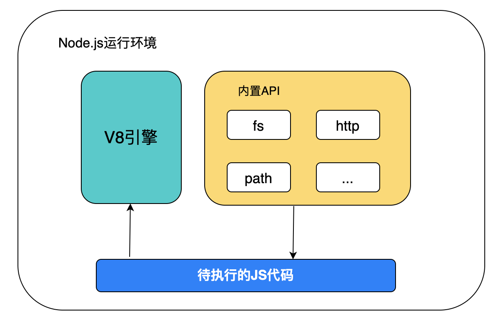

> node.js可以做什么？
>
> - 能够构建web应用，比如express
> - 可以构建跨平台应用，比如Electron
> - 可以快速构建API接口，比如restify

### 3、安装node.js

> 从[node.js](https://nodejs.org/zh-cn/)官网下载LTS(长期稳定版本)版本的node

### 4、node执行js代码

> 编写好如下js代码

```javascript
console.log("node.js study")
```

> 保存为后缀名为xxx.js的文件，然后使用命令行进行执行

```bash
node xxx.js
```

## 二、node模块

### 1、模块分类

> node.js中的根据模块的不同，模块分为了3类，分别是：
>
> - 内置模块：由官方Node.js官方提供，例如fs、path、http等
> - 自定义模块：由用户创建的每个.js文件，都是自定义模块
> - 第三方模块：由第三方开发出来的模块，并非官方提供的内置模块，也不是用户创建的自定义模块，使用前需要下载

### 2、加载模块

#### 2.1 require方法

> 使用require()方法，可以加在需要的内置模块、用户自定义模块、第三方模块进行使用

```javascript
// 1. 加载内置模块，比如：fs
const fs = require('fs')

// 2. 加载用户的自定义模块
const custom = require('./custom.js')

// 3. 加载第三方模块，第三方模块需要下载使用
const moment = require('moment')
```

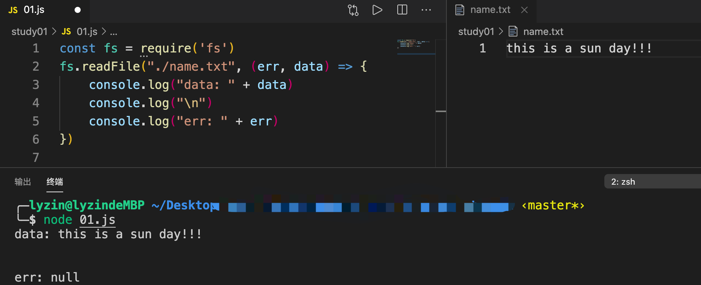

### 3、模块作用域

> 模块作用域：
>
> - 和函数作用域一样，在自定义模块中定义的变量、方法等成员，只能在当前模块内访问，这种模块级别的访问限制，叫做模块作用域
> - 作用：
>     - 模块作用域可以防止全局变量污染的问题

### 4、向外共享模块作用域中的成员

#### 4.1 module对象

> 每个.js自定义模块中都有一个module对象，它里面存储了和当前模块相关的信息

```javascript
console.log(module)
```

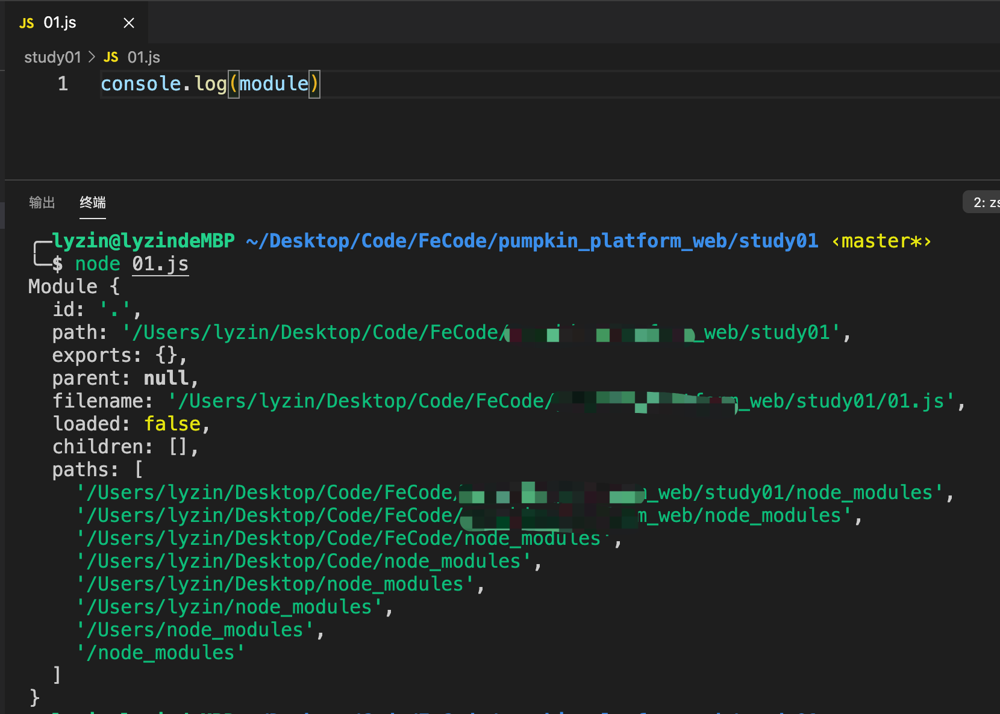

> - exports是Module对象的一个属性，可以导出当前.js文件的变量，给外部共享变量

#### 4.1 module.exports对象

> - 在自定义模块中，可以使用module.exports对象，将模块内的成员共享出去，供外界使用
> - 外界用require()方法导入自定义模块，得到的就是module.exports所指向的对象

##### 4.1.1 不使用module.exports导出对象

> `01.js`没有显式的使用module.exports导出任何对象，那么当前文件的module对象中的exports属性就是一个空对象

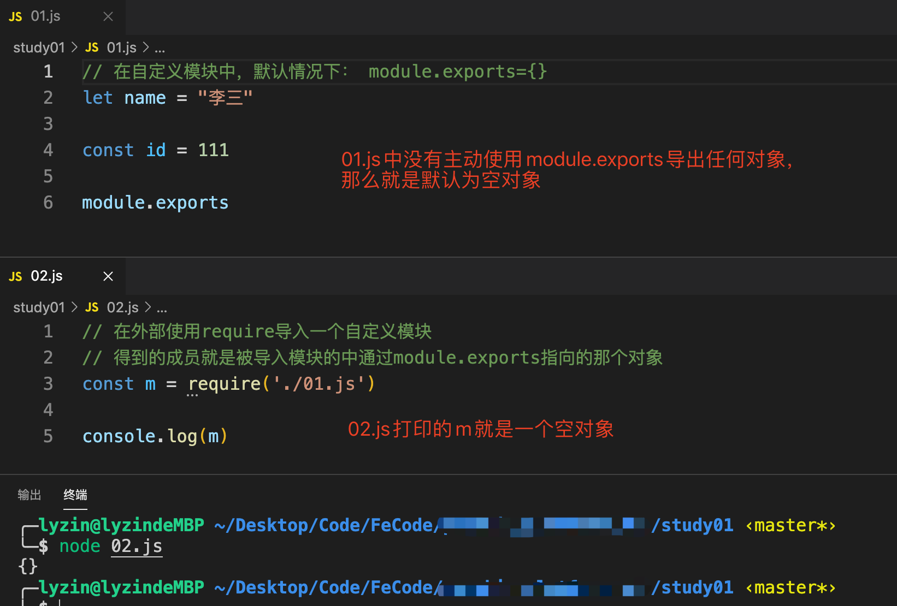

##### 4.1.2 使用module.exports导出对象

> console.log打印对象不用JSON.stringify，否则都是[object object]
>
> 解决办法：[https://www.cnblogs.com/xiaodongxier/p/consolelog-ru-he-da-yin-dui-xiang.html](https://www.cnblogs.com/xiaodongxier/p/consolelog-ru-he-da-yin-dui-xiang.html)

```javascript
// console.log打印对象
console.log(JSON.stringify(obj)) 
```

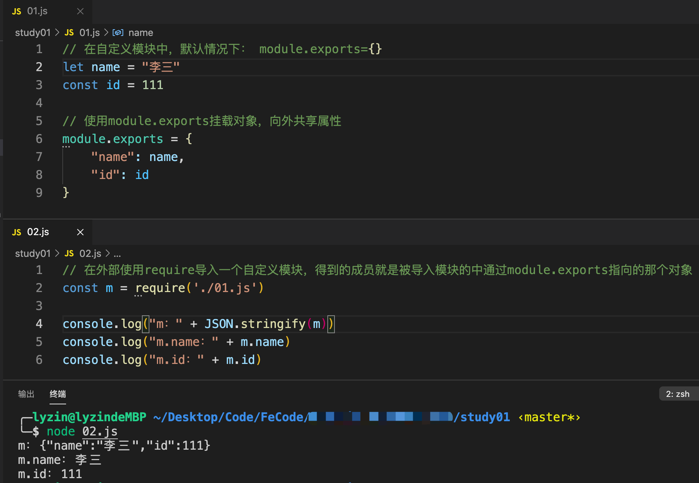

#### 4.1.3 exports对象

> 由于`module.exports`每次写起来有些麻烦，为了简化，node提供了`exports`对象，默认情况下`exports`和`module.exports`指向同一个对象，最终共享的结果，还是以`module.exports`指向的对象为准

> 下面验证确实为true

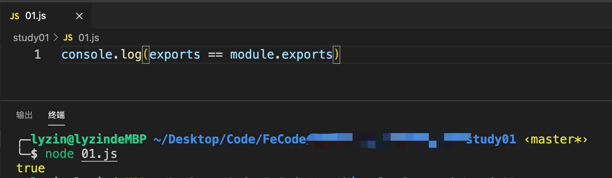

#### 4.1.4 共享成员注意事项

> - 使用require()方法导入模块时，导入的结果，永远以module.exports指向的对象为准

> module.exports本身是一个空对象，那么给module.exports重新赋值了一个对象以后，module.exports本身就是重新赋值以后的对象，那么被require导入时，只会导入module.exports本身就是重新赋值以后的对象，不会导入exports声明的变量，因为require()方法导入模块时，导入的结果，永远以module.exports指向的对象为准

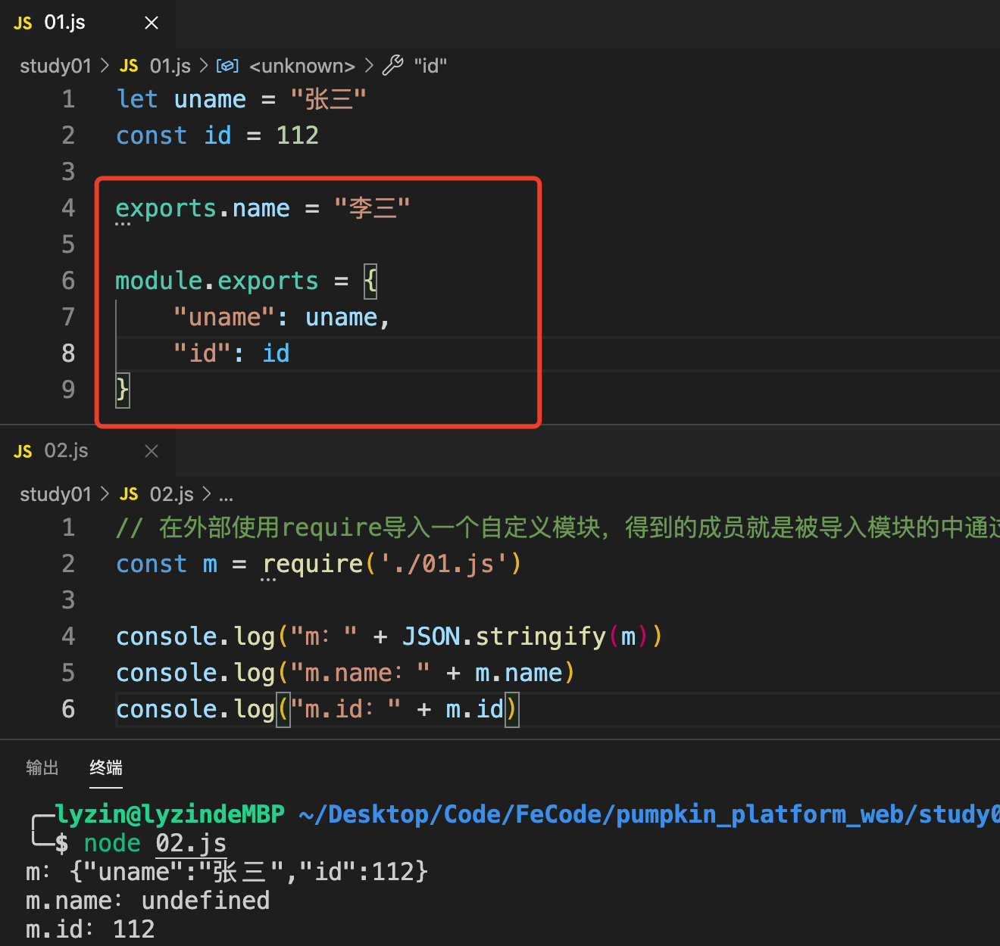

> module.exports本身是一个空对象，那么给module.exports添加了一个hobby属性，module.exports本身就有了添加hobby这个属性，那么被require导入时，只会导入module.exports本身的hobby属性，不会导入exports声明的变量，因为require()方法导入模块时，导入的结果，永远以module.exports指向的对象为准

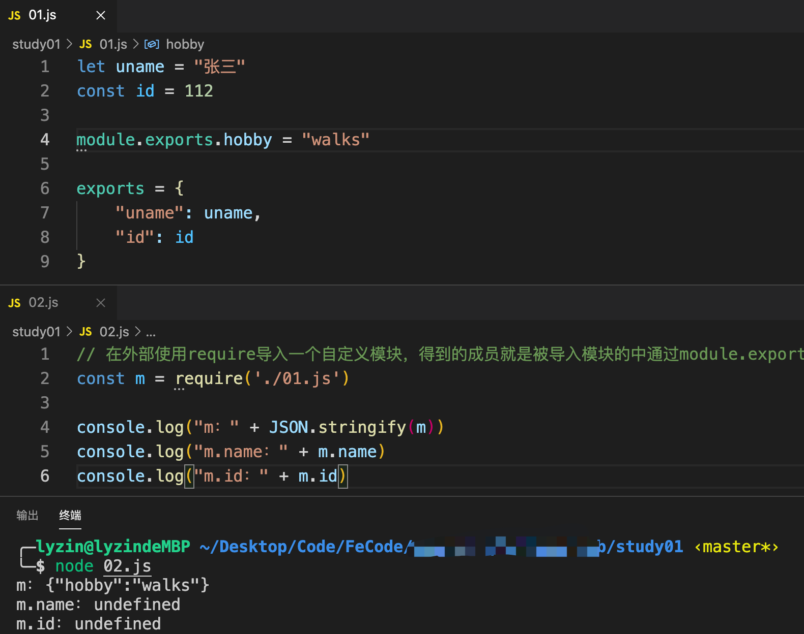

> 使用module.exports添加属性，使用exports添加属性，由于`exports`和`module.exports`指向同一个对象，那么被require导入时，会导入module.exports和exports这两个导出的变量

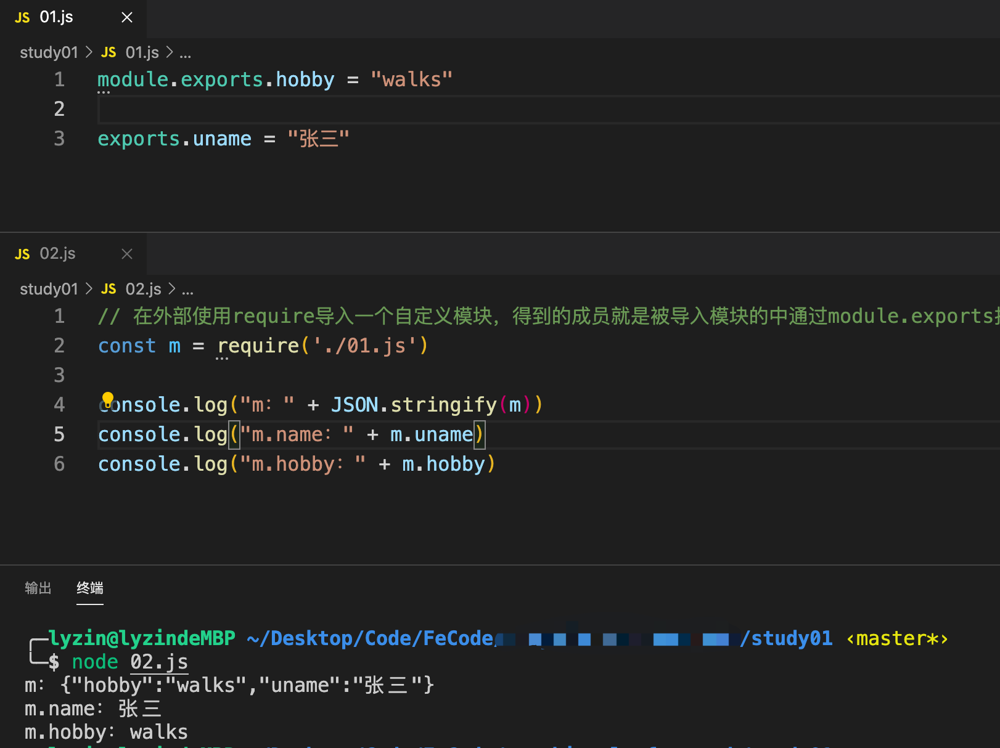

### 5、模块化规范

> node.js遵循了commonJS模块化规范，有如下规定：
>
> 1. 每个模块内容，module变量表示当前模块
> 2. module变量是一个对象，其中的exports(即module.exports)属性就是对外的接口
> 3. 加载某个模块，就是加载该模块的module.exports属性，require方法用于加载模块

## 三、包与npm

### 1、包的介绍

> node.js中的第三方模块就是包

#### 1.1 包管理仓库

> 全球最大的包共享平台：[https://www.npmjs.com](https://www.npmjs.com)，可以用来搜索包

> 全球最大的包镜像地址：[https://registry.npmjs.org](https://registry.npmjs.org)，可以用来下载第三方包到本地来使用

### 2、npm管理包

> 安装包的命令

```bash
# 安装包
npm install 包的名称

# 安装简写
npm i 包的名称

# 安装全局包
npm i 包名名称 -g
```

#### 2.1 npm装包后的文件

> 初次安装包完成以后，在项目文件夹下多了如下内容：
>
> - node_modules的文件夹
>     - 用来存放所有已安装到项目中的包，require导入第三方包时，就从这个目录中查找并加载包
>     - 在第三方包体积比较大的时候，不方便团队之间共享项目源代码，在共享是剔除node_modules文件夹
> - package-lock.json的配置文件
>     - 用来记录node_modules目录下的每一个包的下载信息，比如包的名称、版本、下载地址等

##### 2.1.1 package.json文件

> npm规定在项目根目录中必须提供一个`package.json`的包管理配置文件，用来记录与项目相关的一些配置信息
>
> - 项目的名称、版本号、描述等
> - 项目中用到了哪些包
> - 哪些包只在开发期间用
> - 哪些包在开发和部署是都需要用到
>
> 注意：
>
> - 后续再项目开发中，一定要把node_modules文件夹加入到.gitignore忽略文件中

> npm包管理工具提供了一个快速创建`package.json`文件的快捷命令，而且只需要创建一次
>
> - 项目文件夹名称一定要用英文名称，不能是中文
> - 运行`npm install`命令安装包的时候，npm会自动将包的名称和版本添加到`package.json`文件中

```bash
npm init -y
```

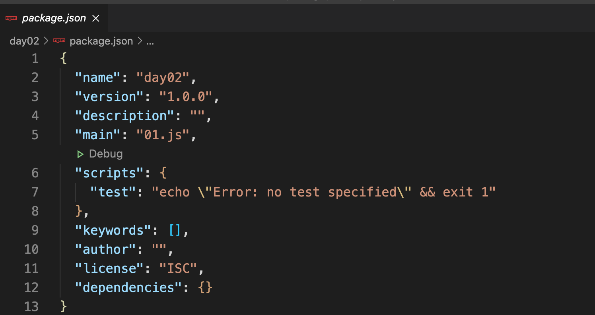

##### 2.1.2 package.json节点

> package.json文件的内容有时候会有两个节点

> dependencies节点
>
> - 一般称为核心依赖包
>
> - 在package.json文件中，有一个dependencies节点，专门用来记录使用npm install安装了哪些包，主要包含了包名和版本号

> devDependencies节点
>
> - 一般称为开发依赖包
>
> - 如果有些包只在开发节点使用，上线不会用到，则把这些包记录到devDependencies节点
> - 如果有些包需要再开发和项目上线都用到，则把这些包记录到dependencies节点

```bash
# 安装需要的包到devDependencies节点
npm i 包名 -D 

# 等同于如下命令
bom install 包名 --save-dev
```

##### 2.1.3 一次性安装所有包

> 拿到一个前端项目，如何一次性安装所有包？
>
> 在项目根目录下，与package.json文件同级，执行以下命令，npm包管理工具会先读取package.json中的dependencies节点，读取到记录的所有依赖的报名和版本号后，npm包管理工具会将所有依赖下载到当前项目中

```bash
npm install
```

##### 2.1.4 卸载包

> 卸载包的时候必须跟上包名，卸载包成功以后
>
> - 会将包从项目的node_modules文件中移除
> - 会自动将包的信息从package.json的dependencies节点中移除

```bash
npm uninstall 包名
```

#### 2.2 下载包慢解决

> 查看当前下载包镜像源

```bash
npm config get registry
```

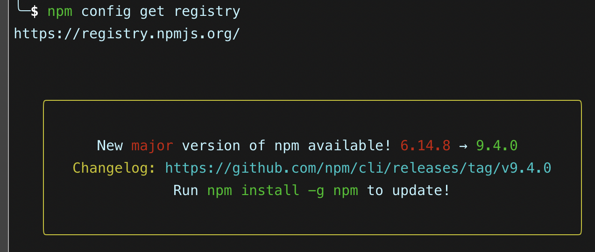

> 将下载包的镜像源切换为淘宝镜像源

```bash
npm config set registry=https://registry.npm.taobao.org/
```

> 最后再使用如下命令查看是否切换成功

```bash
npm config get registry
```

#### 2.3 nrm工具

> 主要是用来管理包的镜像源

```bash
# 通过npm包管理器，将nrm安装为全局工具
npm i nrm -g

# 查看所有可用镜像源
nrm ls

# 切换镜像源
nrm use taobao

# 增加镜像源，registry为镜像源的别名，url为镜像源的地址
nrm add registry http://registry.npm.frp.trmap.cn/
```

### 3、模块加载机制

> - 内置模块
>     - 是由node.js官方提供，内置模块的加载优先级最高
>     - 即使项目的node_modules文件夹下有同名的包也会先加载内置模块
> - 自定义模块
>     - 使用require()加载自定义模块，必须指定`./`和`../`开头的路径标识符，在加载自定义模块时，如果没有指定`./`和`../`路径标识符时，node会将它最为内置模块或第三方模块加载
>     - node会按照如下顺序进行加载
>         - 按确切的文件名进行加载
>         - 补全.js扩展名进行加载
>         - 补全.json扩展名进行加载
>         - 补全.node扩展名进行加载
>         - 加载失败，终端报错
> - 第三方模块
>     - 使用require()加载模块，没有指定`./`和`../`开头的路径标识符，也不是内置模块，那么node会从当前模块的父目录开始，尝试从/node_modules文件夹加载第三方模块
>     - 如果没有找到对应的第三方模块，则移动到再上一层父目录中，进行加载，直到文件系统的根目录
>
> 
