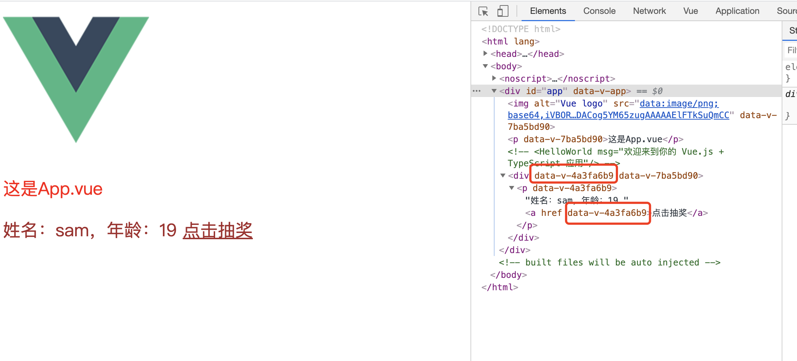
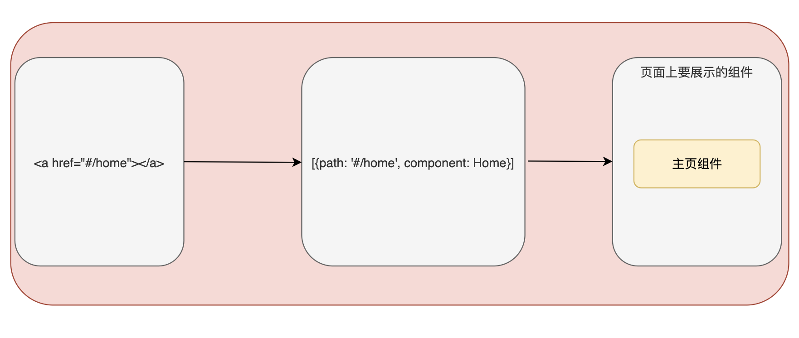
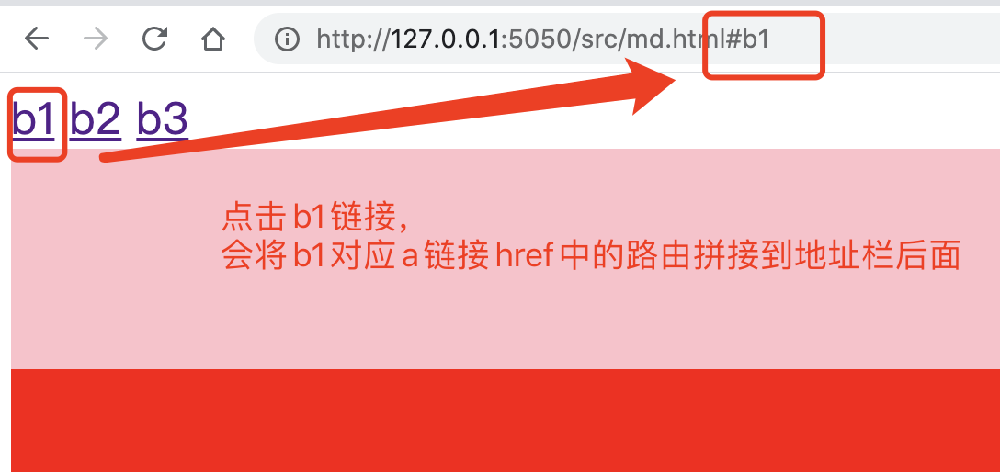
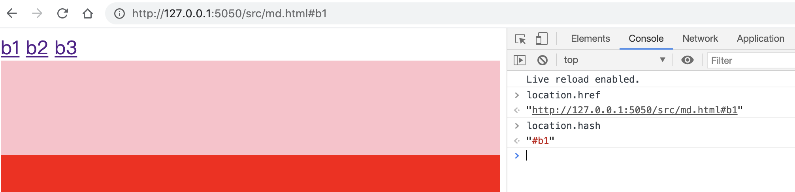

## 一、vue介绍

> [https://www.bilibili.com/video/BV1zq4y1p7ga?p=75&vd_source=501c3f3a75e1512aa5b62c6a10d1550c](https://www.bilibili.com/video/BV1zq4y1p7ga?p=75&vd_source=501c3f3a75e1512aa5b62c6a10d1550c)

### 1、vue介绍

> 官网：https://cn.vuejs.org/
>
> 是一套用来构建用户界面的前端框架
>
> - 构建用户界面
>     - 用vue给html中填充数据，非常方便
> - 框架
>     - 是一套现成的解决方案，用来让程序员遵守欧框架规范编写页面功能
> - 学习重点
>     - Vue的用法、指令、组件（对UI结构的复用）、路由、vue

### 2、vue的特性

#### 2.1 数据驱动视图

> 在使用了vue的页面里，vue会`主动`监听数据的`变化`，然后`自动`重新渲染页面结构
>
> 这样带来的优点：
>
> - 当页面数据发生变化时，页面会自动重新渲染
>
> 注意：
>
> - <font color="blue">数据驱动视图是单向的数据绑定</font>


#### 2.2 双向数据绑定

> 双向数据绑定可以服务开发人员在`不操作DOM`的前提下，`自动`把想要的数据`同步`到数据源中
>
> 比如：填写表单时，自动会把页面上输入的内容同步到数据源中
>
> 双向数据绑定的好处：
>
> - 如果没有vue，从页面获取数据，需要操作dom，如果需要把数据渲染到页面上，也要操作dom，如果这样的操作很多了，就会很不方便
> - 有了vue，就可以实现不操作dom，就能做到数据的同步，无论是获取数据，还是渲染数据
>     - 当js数据有变化时，会自动渲染到页面上
>     - 页面上表单上拿到的数据有变化是，会被vue自动获取到，并更新到js中


### 3、了解vue底层原理

#### 3.1 MVVM

> 1、MVVM是vue实现数据驱动视图和双向数据绑定的核心原理
>
> 2、MVVM是Model-View-ViewModel的缩写，即模型-视图-视图模型
>
> 3、MVVM三个特性
>
> - Model：表示当前页面渲染时所依赖的数据源，后端传递的数据
> - View：表示当前页面所渲染的DOM结构，代表UI组件，负责将数据模型转化成UI展现出来
> - ViewModel：表示vue实例，是一个同步View和Model的对象，MVVM模式的核心，是连接Model和View的桥梁


#### 3.2 ViewModel

> ViewModel是MVVM的核心，ViewModel把当前页面的数据源(Model)和页面结构(View)连接在一起
>
> 1. 当数据源有变化时，会被ViewModel监听到，ViewModel会根据最新的数据源`自动更新`页面的结构
> 2. 当表单元素的值有变化时，同时也会被ViewModel监听到，ViewModel会把变化后的最新的数据`自动同步`到Model数据源中

## 二、vue基础语法

### 1、第一个vue代码

> 需要三个步骤：
>
> 1. 导入vue.js的脚本文件（表示是在导入vue库）
> 2. 在页面中声明一个要被vue控制的DOM区域，比如一个div块
> 3. 创建vm实例对象（vm是指ViewModel）

```html
<!DOCTYPE html>
<html lang="en">

<head>
    <meta charset="UTF-8">
    <meta name="viewport" content="width=device-width, initial-scale=1.0">
    <title>Document</title>
</head>

<body>
    <!-- 2. 在页面中声明一个要被vue控制的DOM区域（这里就是View），比如一个div块 -->
    <div id="app">
        {{username}}
    </div>
</body>
<!-- 1. 导入vue.js的脚本文件 -->
<script src="../lib/vue/vue_v2.6.14.js"></script>
<script>
    // 3. 实例化一个ViewModel对象
    const vm = new Vue({
        // 3.1 指定当前ViewModel实例所控制页面的区域位置
        el: "#app",
        // 3.2 指定Model数据源
        data: {
            "username": "sam"
        }
    })
</script>

</html>
```

> 上面代码中，`new Vue`是表示vue的构造函数，用来实例化一个vue对象（ViewModel对象）
>
> - `new Vue`构造函数里的值定义：
>
>     - el属性是固定写法，表示当前vm实例要控制的是页面某个区域，接收到的值是一个选择器
>         - el指定的区域就是root根节点
>
>     - data也是固定写法，表示要渲染到页面上的数据
>
> - div里的传值写法
>     - `{{username}}`表示将vue实例对象里的data里的`username`渲染到页面上
>     - 从下面就可以看到，data里的数据渲染到了页面上


#### 1.1 使用工具调试vue

> 使用[Vue Devtools](https://devtools.vuejs.org/)调试工具，就能看到vue的数据了
>
> 可以看到jam就是root根节点，也表示是id为app的div
>
> 上面代码里username是sam，可以在调试工具右边的data里进行数据修改，然后vue又自动渲染数据到页面上，达到了双向数据绑定


### 2、vue的指令

> 指令是vue提供的模板语法，用来帮助开发渲染页面的基本结构
>
> 指令分类：
>
> - 内容渲染指令
> - 属性绑定指令
> - 事件绑定指令
> - 双向绑定指令
> - 条件渲染指令
> - 列表渲染指令

### 3、内容渲染指令

> 该指令用来渲染DOM元素的文本内容
>
> 主要分为三个
>
> - v-text
> - {{}}
> - v-html

#### 3.1 v-text

> 将vm实例对象的data里的数据，渲染到页面上

```html
<!DOCTYPE html>
<html lang="en">

<head>
    <meta charset="UTF-8">
    <meta name="viewport" content="width=device-width, initial-scale=1.0">
    <title>Document</title>
</head>

<body>
    <!-- 2. 在页面中声明一个要被vue控制的DOM区域，比如一个div块 -->
    <div id="app">
        <p v-text="username"></p>
        <p v-text="gender">性别</p>
    </div>
</body>
<!-- 1. 导入vue.js的脚本文件 -->
<script src="../lib/vue/vue_v2.6.14.js"></script>
<script>
    // 3. 实例化一个ViewModel对象
    const vm = new Vue({
        // 3.1 指定当前vm实例所控制页面的区域位置
        el: "#app",
        // 3.2 指定Model数据源
        data: {
            "username": "sam",
            "gender": "女"
        }
    })
</script>
</html>
```

> 输出结果
>
> - v-text会覆盖元素自身原有的值，比如就是将`div`第二个p标签里的`性别`替换成了`女`，但这并不是我们想要的，我们希望在`性别`后面展示`女`
> - 这个语法用的很少


#### 3.2 {{}}

> `{{}}`语法主要用来解决`v-text`引发的覆盖默认文本内容的问题
>
> `{{}}`语法叫做插值表达式(英文是：Mustache)
>
> 这个语法用的很多

> 问题解决：
>
> `3.2标题`为什么要这么写的原因？
>
> - 因为hexo直接渲染插值表达式会报错，所以需要传入原始值
>
> - 原文地址：[https://hexo.io/docs/troubleshooting.html](https://hexo.io/docs/troubleshooting.html)

```html
<!DOCTYPE html>
<html lang="en">

<head>
    <meta charset="UTF-8">
    <meta name="viewport" content="width=device-width, initial-scale=1.0">
    <title>Document</title>
</head>

<body>
    <!-- 2. 在页面中声明一个要被vue控制的DOM区域，比如一个div块 -->
    <div id="app">
        <p>姓名:{{ username }}</p>
        <p>性别: {{ gender }}</p>
    </div>
</body>
<!-- 1. 导入vue.js的脚本文件 -->
<script src="../lib/vue/vue_v2.6.14.js"></script>
<script>
    // 3. 实例化一个ViewModel对象
    const vm = new Vue({
        // 3.1 指定当前vm实例所控制页面的区域位置
        el: "#app",
        // 3.2 指定Model数据源
        data: {
            "username": "sam",
            "gender": "女"
        }
    })
</script>

</html>
```


#### 3.3 v-html

> 要把包含html标签的字符串数据渲染为页面HTML元素，就需要`v-html`
>
> 使用v-text、差值表达式就会原样输出，只能渲染文本内容

```html
<!DOCTYPE html>
<html lang="en">

<head>
    <meta charset="UTF-8">
    <meta name="viewport" content="width=device-width, initial-scale=1.0">
    <title>Document</title>
</head>

<body>
    <!-- 2. 在页面中声明一个要被vue控制的DOM区域，比如一个div块 -->
    <div id="app">
        <p v-text="username"></p>
        <p>姓名: {{ username }}</p>
        <p v-html="username"></p>
    </div>
</body>
<!-- 1. 导入vue.js的脚本文件 -->
<script src="../lib/vue/vue_v2.6.14.js"></script>
<script>
    // 3. 实例化一个ViewModel对象
    const vm = new Vue({
        // 3.1 指定当前vm实例所控制页面的区域位置
        el: "#app",
        // 3.2 指定Model数据源
        data: {
            "username": "<h3 style='color:pink'>sam</h3>",
        }
    })
</script>

</html>
```


> 很清楚能看到，v-html把h3标签渲染到了页面上，因为H3标签里的文本内容的颜色变为设置的pink色

#### 3.4 el属性注意事项

> 如果有多个相同HTML标签在页面结构中，用vue控制页面时，vue的el属性只会控制第一个同名的HTML标签，其余的都会原样输出，不会进行渲染，所以一般约定成俗的都是使用一个id名叫`“app”`一个大的div包裹我们需要编写的页面。
>
> 并且在以后的项目中，vue会自动配置控制区域的ID，不用我们手动写

### 4、属性绑定指令

> 如果需要给元素的属性`动态绑定属性值`，就需要用到`v-bind`属性绑定指令
>
> 什么时候使用使用属性绑定指令？
>
> - 为元素的属性动态添加值时，就要考虑使用属性绑定指令了
>
> 这个指令用的非常多

```html
 <!-- v-bind 绑定元素属性的完整写法 -->
<input type="text" v-bind:placeholder="placeholderText">

 <!-- v-bind 绑定元素属性的省略写法，在元素属性前面不写v-bind，只留下英文的冒号: -->
<input type="text" :placeholder="placeholderText">
```

> 完整代码示例

```html
<!DOCTYPE html>
<html lang="en">

<head>
    <meta charset="UTF-8">
    <meta name="viewport" content="width=device-width, initial-scale=1.0">
    <title>vue第一天</title>
</head>

<body>
    <div id="app">
        <!-- v-bind 绑定元素属性 -->
        <input type="text" v-bind:placeholder="placeholderText">
    </div>
</body>
<script src="../lib/vue/vue_v2.6.14.js"></script>
<script>
    const vm = new Vue({
        "el": "#app",
        data: {
            "placeholderText": "请输入用户名",
        }
    })
</script>

</html>
```

> 如果用插值表达式给元素属性绑定值，就会报错，插值表达式内容会原样输出并且控制台报错


### 5、插值和属性绑定写JS语句

> 在插值表达式和属性绑定指令中都可以添加js语句

```html
<!DOCTYPE html>
<html lang="en">

<head>
    <meta charset="UTF-8">
    <meta name="viewport" content="width=device-width, initial-scale=1.0">
    <title>vue第一天</title>
</head>

<body>
    <div id="app">
        <p>1 + 2 = {{ 1 + 2 }}</p>
        <div :title="'box' + index">
            box盒子内容
        </div>
    </div>
</body>
<script src="../lib/vue/vue_v2.6.14.js"></script>
<script>
    const vm = new Vue({
        "el": "#app",
        data: {
            "placeholderText": "请输入用户名",
            "index": 3
        }
    })
</script>

</html>
```


> 可以看到当鼠标放到box盒子内容上时，提示了title内容，内容就是拼接的`box + index`

### 6、事件绑定指令

> vue中的`v-on`事件绑定指令，用来协助为DOM元素绑定事件监听

#### 6.1 v-on语法

```html
<!-- v-on绑定事件 -->
<!-- 语法为：v-on:事件名称="事件处理函数名称" -->
<button v-on:click="addCount">+1</button>
```

```html
<!DOCTYPE html>
<html lang="en">

<head>
    <meta charset="UTF-8">
    <meta name="viewport" content="width=device-width, initial-scale=1.0">
    <title>vue第一天</title>
</head>

<body>
    <div id="app">
        <p>count的值:{{count}}</p>
        <button v-on:click="addCount">+1</button>
        <button v-on:click="subCount">-1</button>
    </div>
</body>
<script src="../lib/vue/vue_v2.6.14.js"></script>
<script>
    const vm = new Vue({
        "el": "#app",
        data: {
            "count": 0,
        },
        // methods里面定义事件处理函数
        methods: {
            // 完整写法
            addCount: function() {
                this.count += 1
                console.log("add count")
            },

            // 简写写法
            subCount() {
                this.count -= 1
                console.log("sub count")
            }
        }
    })
</script>

</html>
```

#### 6.2 methods中函数写法

> 在vue的实例对象中
>
> - methods里定义处理函数，推荐使用简写写法，就是`函数名 小括号 花括号`

#### 6.3 this访问数据源的数据

> 在vue的methods中定义了处理函数，如何来访问修改vue实例对象中的数据源的数据呢？
>
> - 可以使用`this`关键字
>     - 类比到python中就是，在同一个实例对象中，可以使用`self关键字+点号`的方式一直访问这个对象的所有数据和方法，`self`就表示是这个实例对象本身
>     - 那么在同一个vue实例对象中，就可以用`this.数据源中的数据`来访问vue实例对象的数据源中的数据

```html
<!DOCTYPE html>
<html lang="en">

<head>
    <meta charset="UTF-8">
    <meta name="viewport" content="width=device-width, initial-scale=1.0">
    <title>Document</title>
</head>

<body>
    <div id="app">
        <p>count的值:{{count}}</p>
        <button v-on:click="addCount">+1</button>
        <button v-on:click="subCount">-1</button>
    </div>
</body>
<script src="../lib/vue/vue_v2.6.14.js"></script>
<script>
    const vm = new Vue({
        "el": "#app",
        data: {
            "count": 0,
        },
        // methods里面定义事件处理函数
        methods: {
            // 完整写法
            addCount: function() {
                console.log("add count")
                console.log(vm)
            },

            // 简写写法
            subCount() {
                console.log("sub count")
            }
        }
    })
</script>

</html>
```

> 在上面代码中，vue实例对象的methods里的addCount方法中打印了`vm`这个常量，下面是vm的值
>
> vm值可以看出来
>
> - 数据源中的`count`是vm这个实例对象的一个属性
> - 数据源中的`addCount`、`subCount`是vm这个实例对象的方法
> - 所以`count`、`addCount`、`subCount`对于vm实例对象来说，都可以用点的方式来调用


> 既然数据源中的`count`是`vm`这个实例对象的一个属性，那么在`addCount`方法里就可以通过`vm.count`访问到`data`里的`count`值

```javascript
// 部分代码
<script>
    const vm = new Vue({
        "el": "#app",
        data: {
            count: 10
        },
        // methods里面定义事件处理函数
        methods: {
            // 简写写法
            addCount() {
                console.log("vm.count的值" + vm.count)
            }
        }
    })
</script>
```


> 不过vue中不推荐使用`vm`这个实例对象来访问属性或方法，而是使用`this`
>
> 从执行结果可以看到`vm`和`this`是`全等的`，那么就可以用`this`来代替`vm`访问`vm`这个实例对象里的属性和方法
>
> 注意：
>
> - 用`console.log(vm === this)`时，一定不能在括号里再用`+号`拼接任何内容，否则返回结果是`false`

```javascript
<script>
    const vm = new Vue({
        "el": "#app",
        data: {
            count: 10
        },
        // methods里面定义事件处理函数
        methods: {
            // 简写写法
            addCount() {
                console.log("vm.count的值" + vm.count)
                // 判断vm是否全等于this
                console.log(vm === this)
            }
        }
    })
</script>
```


> 使用`this`访问属性，从执行结果来看，`this.count`和`vm.count`获取到的值一样

```javascript
// 部分代码
<script>
    const vm = new Vue({
        "el": "#app",
        data: {
            count: 10
        },
        // methods里面定义事件处理函数
        methods: {
            // 简写写法
            addCount() {
                console.log("vm.count的值" + vm.count)
                console.log(vm === this)
                console.log("this.count:" + this.count)
            }
        }
    })
</script>
```


#### 6.4 事件绑定传参

> 在事件绑定时，可以对绑定函数进行传递参数，那么对应的`vue`实例对象里的`methods`中定义的事件绑定函数就要定义形参

```html
<!DOCTYPE html>
<html lang="en">

<head>
    <meta charset="UTF-8">
    <meta name="viewport" content="width=device-width, initial-scale=1.0">
    <title>Document</title>
</head>

<body>
    <div id="app">
        <p>count的值:{{count}}</p>
        <!-- 因为addCount函数接收一个形参n，那么在调用时就需要传递一个实参，比如2 -->
        <button v-on:click="addCount(2)">+n</button>
    </div>
</body>
<script src="../lib/vue/vue_v2.6.14.js"></script>
<script>
    const vm = new Vue({
        "el": "#app",
        data: {
            count: 10
        },
        // methods里面定义事件处理函数
        methods: {
            // addCount函数接收一个形参n
            addCount(n) {
                this.count += n
                console.log("this.count:" + this.count)
            }
        }
    })
</script>

</html>
```


> 从上面代码可以看出来，`addCount`函数接收一个形参n，那么在调用时就需要传递一个实参，比如2，那么每次点击`+n`这个事件，那么每次的count值都是递增+2

#### 6.5 v-on简写格式

> v-on使用的非常多，vue提供了简写方式`@`
>
> 注意：
>
> - 原生DOM对象有`onclick`、`oninput`、`onkeyup`等原生事件，替换为vue的事件绑定后，对应的为
>     - v-on:click
>     - v-on:input
>     - v-on:keyup

```html
<body>
    <div id="app">
        <p>count的值:{{count}}</p>
        <!-- 因为addCount函数接收一个形参n，那么在调用时就需要传递一个实参，比如2 -->
        <button @click="addCount(2)">+n</button>
    </div>
</body>
```


> 执行结果和`事件绑定传参`看到的结果一样，`count`的值都是递增+2

#### 6.6 $event参数(不常用)

##### 6.6.1 只有一个形参

> 当事件绑定函数里有一个形参时：
>
> - 此时在div中调用该事件函数，但是`不传递任何实参`，此时事件函数里的形参值是有一个默认的值，比如时间绑定函数形参定义为`e`，那么`e`是的值是`MouseEvent`，也就是说e有一个自己的默认值
>     - `MouseEvent`中有一个`target`属性，可以对元素进行样式的修改
> - 此时在div中调用该事件函数，但是`传递了一个实参`，那么上面的默认值就没有了，传进来的实参是什么，那么e就是什么
>     - 就是传参了，e的值就会被覆盖为传进来的值

```html
<!DOCTYPE html>
<html lang="en">

<head>
    <meta charset="UTF-8">
    <meta name="viewport" content="width=device-width, initial-scale=1.0">
    <title>Document</title>
</head>

<body>
    <div id="app">
        <p>count的值:{{count}}</p>
        <!-- 事件绑定函数有形参时，不传值，那么事件绑定函数默认接收一个e参数 -->
        <button @click="addCount">+1</button>
    </div>
</body>
<script src="../lib/vue/vue_v2.6.14.js"></script>
<script>
    const vm = new Vue({
        "el": "#app",
        data: {
            count: 10
        },
        // methods里面定义事件处理函数
        methods: {
            // addCount函数
            addCount(e) {
                console.log(e)
                this.count += 1

                if (this.count % 2 === 0) {
                    e.target.style.backgroundColor = 'red'
                } else {
                    e.target.style.backgroundColor = ''
                }

            }
        }
    })
</script>

</html>
```


> 代码分析:
>
> - 代码其实逻辑就是点击按钮时，当`count`值是偶数时，按钮颜色变为红色，为奇数不变色
> - 能够看到e其实就是`MouseEvent`，每次点击时，e的值都同一个

##### 6.6.2 有2个以上形参

> vue提供了内置变量，固定写法:`$event`
>
> - 既想传入一个实参，还想传`MouseEvent`参数，那么就可以就在调用事件函数时，将`$event`传进去
> - 相应的vue实例对象的methods中，用形参e(约定成俗)来接收就可以了

```html
<!DOCTYPE html>
<html lang="en">

<head>
    <meta charset="UTF-8">
    <meta name="viewport" content="width=device-width, initial-scale=1.0">
    <title>Document</title>
</head>

<body>
    <div id="app">
        <p>count的值:{{count}}</p>
        <!-- 事件绑定函数有形参时，不传值，那么事件绑定函数默认接收一个e参数 -->
        <button @click="addCount(1, $event)">+1</button>
    </div>
</body>
<script src="../lib/vue/vue_v2.6.14.js"></script>
<script>
    const vm = new Vue({
        "el": "#app",
        data: {
            count: 10
        },
        // methods里面定义事件处理函数
        methods: {
            // addCount函数
            addCount(n, e) {
                console.log(e)
                this.count += n

                if (this.count % 2 === 0) {
                    e.target.style.backgroundColor = 'red'
                } else {
                    e.target.style.backgroundColor = ''
                }

            }
        }
    })
</script>

</html>
```

> 执行结果和只有一个形参一致

#### 6.7 事件修饰符

> vue提供了事件修饰符的功能，可以更方便的控制事件

| 事件修饰符 | 说明                                                         |
| ---------- | ------------------------------------------------------------ |
| .prevent   | 阻止默认行为，比如阻止a链接跳转，表单的提交等等              |
| .stop      | 阻止事件冒泡（当页面有父子关系的标签时，只想打印子标签里面的内容，如果没有阻止，就会在打印子里面的内容时，也把父标签的内容也打印出来，为了不出现这种情况，就需要阻止事件冒泡） |

#### 6.8 按键修饰符

> 监听键盘事件时，需要判断详细的按键内容，此时就可以用按键修饰符

```javascript
// 当按键是enter时，调用vue实例对象中的submit()方法
<input @keyup.enter="submit">
    
// 当按键是esc时，调用vue实例对象中的clearInput()方法
<input @keyup.esc="clearInput"> 
```

```html
<!DOCTYPE html>
<html lang="en">

<head>
    <meta charset="UTF-8">
    <meta name="viewport" content="width=device-width, initial-scale=1.0">
    <title>Document</title>
</head>

<body>
    <div id="app">
        提交数据:<input type="text" @keyup.enter="subData">
        <br> 清空数据:
        <input type="text" @keyup.esc="clearInput">
    </div>
</body>
<script src="../lib/vue/vue_v2.6.14.js"></script>
<script>
    const vm = new Vue({
        "el": "#app",
        data: {
            count: 10
        },
        // methods里面定义事件处理函数
        methods: {
            subData() {
                console.log("按了回车enter键")
            },
            clearInput(e) {
                console.log("按了清除esc键")
                e.target.value = ''
            }

        }
    })
</script>

</html>
```


### 7、双向绑定

#### 7.1 v-model用法

> vue提供了`v-model双向数据绑定`指令，用来在不操作DOM的前提下，快速获取表单数据

```html
<!DOCTYPE html>
<html lang="en">

<head>
    <meta charset="UTF-8">
    <meta name="viewport" content="width=device-width, initial-scale=1.0">
    <title>Document</title>
</head>

<body>
    <div id="app">
        <p>用户名:{{ username }}</p>
        <input type="text" v-model="username">
    </div>
</body>
<script src="../lib/vue/vue_v2.6.14.js"></script>
<script>
    const vm = new Vue({
        "el": "#app",
        data: {
            username: "sam"
        },
        // methods里面定义事件处理函数
        methods: {}
    })
</script>

</html>
```


> 上述代码分析：
>
> - p标签中的username值来自于data中的username，同时给p标签设置了一个`v-model`属性，并且指向了username
>     - 首先页面会将data里的username值渲染到页面上
>     - 当input输入框中的内容有改变时，vue会实时感知到，然后逆向再渲染到p标签中，这样data中的username值就变成了在input输入框中输入的内容，这样达到了不操作DOM就采集到表单标签的值的功能，这样vue实例里就可以通过`this`访问到实时更新的值
>
> 注意：
>
> - 表单元素才可以使用`v-model`
>     - 表单元素有：
>         - input输入框
>         - textarea(大文本输入框)
>         - select（下拉选择框标签）

#### 7.2 v-model在select使用

```html
<!DOCTYPE html>
<html lang="en">

<head>
    <meta charset="UTF-8">
    <meta name="viewport" content="width=device-width, initial-scale=1.0">
    <title>Document</title>
</head>

<body>
    <div id="app">
        <select v-model='city'>
            <option value="">请选择城市</option>
            <option value="1">北京</option>
            <option value="2">上海</option>
            <option value="3">河北</option>
        </select>
        <button @click='subData'>提交</button>
    </div>
</body>
<script src="../lib/vue/vue_v2.6.14.js"></script>
<script>
    const vm = new Vue({
        "el": "#app",
        data: {
            username: "sam",
            city: ''
        },
        // methods里面定义事件处理函数
        methods: {
            subData() {
                console.log('city:' + this.city)
            }
        }
    })
</script>

</html>
```


#### 7.3 v-model修饰符

> 为了对用户输入内容更方便处理，v-model提供了三个修饰符

| 修饰符  | 作用说明                       |
| ------- | ------------------------------ |
| .number | 自动将用户的输入值转为数值类型 |
| .trim   | 自动过滤用户输入的首尾空白字符 |
| .lazy   | 在“change”时而非“input”时更新  |

##### 7.3.1 number修饰符

> 当从input获取到的值转为int时，就可以用number
>
> 下面的加法例子，如果没有`.number`修饰符，那么再输入其他数字，结果就会变为字符串拼接而不是加法

```html
<!DOCTYPE html>
<html lang="en">

<head>
    <meta charset="UTF-8">
    <meta name="viewport" content="width=device-width, initial-scale=1.0">
    <title>Document</title>
</head>

<body>
    <div id="app">
        <input type="text" v-model.number='n1'> + <input type="text" v-model.number='n1'> = <span>{{ n1 + n2 }}</span>
    </div>
</body>
<script src="../lib/vue/vue_v2.6.14.js"></script>
<script>
    const vm = new Vue({
        "el": "#app",
        data: {
            n1: 2,
            n2: 2
        },
        // methods里面定义事件处理函数
        methods: {

        }
    })
</script>

</html>
```


##### 7.3.2 trim修饰符

> 将表单获取的数据，去除首尾空白字符

```html
<!DOCTYPE html>
<html lang="en">

<head>
    <meta charset="UTF-8">
    <meta name="viewport" content="width=device-width, initial-scale=1.0">
    <title>Document</title>
</head>

<body>
    <div id="app">
        <input type="text" v-model.trim='username'>
        <button @click='getUserName'>获取用户名</button>
    </div>
</body>
<script src="../lib/vue/vue_v2.6.14.js"></script>
<script>
    const vm = new Vue({
        "el": "#app",
        data: {
            username: ""
        },
        // methods里面定义事件处理函数
        methods: {
            getUserName() {
                console.log(this.username)
            }
        }
    })
</script>

</html>
```


##### 7.3.3 lazy修饰符

> 当输入内容只想在失去焦点时才同步给vue，那么就可以使用`.lazy`修饰符，因为vue双向绑定实时的，每次更新肯定会有性能损耗，当不需要这样，就可以使用lazy

```html
<body>
    <div id="app">
        <input type="text" v-model.lazy='username'>
        <button @click='getUserName'>获取用户名</button>
    </div>
</body>
```


### 8、条件渲染指令

> 条件渲染指令可以根据条件来控制DOM的显示与隐藏
>
> 有两个指令：
>
> - v-if
> - v-show

#### 8.1 v-if

> `v-if`原理：每次动态创建或移除元素，实现元素的显示和隐藏

```html
<!DOCTYPE html>
<html lang="en">

<head>
    <meta charset="UTF-8">
    <meta name="viewport" content="width=device-width, initial-scale=1.0">
    <title>Document</title>
</head>

<body>
    <div id="app">
        <p v-if='flag'>这是被v-if控制</p>
    </div>
</body>
<script src="../lib/vue/vue_v2.6.14.js"></script>
<script>
    const vm = new Vue({
        "el": "#app",
        data: {
            flag: true
        },
        // methods里面定义事件处理函数
        methods: {}
    })
</script>

</html>
```


> 从上面控制台的vue列和Elements列可以看出，当flag为true时，v-if的p标签就显示出来了
>
> 那把flag改为false时，可以看到整个v-if的p标签直接被移除了


#### 8.2 v-show

> `v-show`原理：动态为元素添加或移除`display: none`样式，实现元素的显示和隐藏

```html
<!DOCTYPE html>
<html lang="en">

<head>
    <meta charset="UTF-8">
    <meta name="viewport" content="width=device-width, initial-scale=1.0">
    <title>Document</title>
</head>

<body>
    <div id="app">
        <p v-show='flag'>这是被v-show控制</p>
    </div>
</body>
<script src="../lib/vue/vue_v2.6.14.js"></script>
<script>
    const vm = new Vue({
        "el": "#app",
        data: {
            flag: true
        },
        // methods里面定义事件处理函数
        methods: {}
    })
</script>

</html>
```


> 从上面控制台的vue列和Elements列可以看出，当flag为true时，v-show的p标签就显示出来了
>
> 那把flag改为false时，可以看到整个v-show的p标签没有被移除，而是加了`display: none`的属性达到隐藏的效果


#### 8.3 v-else-if

> 相当于是用v-if的一个分支，但是必须要和`v-if`配套使用，否则不会被识别

```html
<body>
    <div id="app">
        <div v-if="count === 1">1级</div>
        <div v-else-if="count === 2">2级</div>
        <div v-else="count === 3">3级</div>
    </div>
</body>
<script src="../lib/vue/vue_v2.6.14.js"></script>
<script>
    const vm = new Vue({
        "el": "#app",
        data: {
            flag: true,
            count: 1
        }
    })
</script>
```


### 9、列表渲染指令

#### 9.1 v-for

> 主要是用来将数组循环渲染成一个列表的结构
>
> v-for用`item in items`形式的语法
>
> - `items`是待循环的数组
> - `item`是被循环的每一项
>
> 需要循环哪个DOM结构，就给那个页面结构加v-for

```html
# 举例
<li v-for="item in userinfos">name: {{ item.name }}</li>

# vue代码
<script>
    const vm = new Vue({
        "el": "#app",
        data: {
            userinfo: [{
                id: 1,
                name: "Sam"
            }, {
                id: 2,
                name: "Jam"
            }, {
                id: 3,
                name: "Tom"
            }, ]
        }
    })
```

#### 9.2 v-for支持索引

> v-for支持可选的第二个参数，也就是当前项的索引
>
> `(item, index) in items`
>
> 注意：
>
> - v-for中的`item`项和`index`索引都是形参，所以可以替换成别的形参名
> - 索引是按需添加，不强制

```html
# 举例
<li v-for="(item, index) in userinfos">index:{{ index }}, name: {{ item.name }}</li>

# vue代码
<script>
    const vm = new Vue({
        "el": "#app",
        data: {
            userinfo: [{
                id: 1,
                name: "Sam"
            }, {
                id: 2,
                name: "Jam"
            }, {
                id: 3,
                name: "Tom"
            }, ]
        }
    })
```

> 示例

```html
<!DOCTYPE html>
<html lang="en">

<head>
    <meta charset="UTF-8">
    <meta name="viewport" content="width=device-width, initial-scale=1.0">
    <title>Document</title>
    <style>
        li {
            list-style: none;
        }
        
        table {
            border-collapse: collapse;
            width: 200px;
            height: 160px;
        }
        
        table,
        th,
        td {
            border: 1px solid black;
            text-align: center;
        }
    </style>
</head>

<body>
    <div id="app">
        <table>
            <thead>
                <th>index</th>
                <th>id</th>
                <th>name</th>
            </thead>
            <tr v-for="(item, index) in userinfo">
                <td>索引:{{ index }}</td>
                <td>{{ item.id }}</td>
                <td>{{ item.name }}</td>
            </tr>
        </table>
    </div>
</body>
<script src="../lib/vue/vue_v2.6.14.js"></script>
<script>
    const vm = new Vue({
        "el": "#app",
        data: {
            userinfo: [{
                id: 1,
                name: "Sam"
            }, {
                id: 2,
                name: "Jam"
            }, {
                id: 3,
                name: "Tom"
            }, ]
        }
    })
</script>

</html>
```


#### 9.3 v-for推荐添加key

> vue官方推荐，只要用到了v-for指令，那么一定要绑定一个`:key`属性，
>
> key值注意事项：
>
> - 对于key的值只能是字符串或数字类型
> - 并且key的值不能重复，否则会报`Duplicate keys detected`的错误
> - 并且尽量以`当前循环项的id`作为`key`的值
> - 不推荐`index`作为key的值，会出现数据错乱
>     - 原因是如果添加数据时，添加数据成功以后，当前数据的索引值会变化，所以索引就不唯一了，并且和数据不是唯一绑定的，只有id才是和数据唯一绑定的
> - 指定key可以提升性能，放置列表错乱

```html
<body>
    <div id="app">
        <table>
            <thead>
                <th>index</th>
                <th>id</th>
                <th>name</th>
            </thead>
            <!-- v-for绑定key属性， 推荐以id作为key的值 -->
            <tr v-for="(item, index) in userinfo" :key="item.id">
                <td>索引:{{ index }}</td>
                <td>{{ item.id }}</td>
                <td>{{ item.name }}</td>
            </tr>
        </table>
    </div>
```

## 三、vue常用语法

### 1、vue-cli介绍

> vue-cli是vue.js开发的标准工具，简化基于webpack创建工程化vue项目的过程
>
> 网址：[https://cli.vuejs.org/zh](https://cli.vuejs.org/zh)

> 以下来源于vue-cli官网
>
> Vue CLI 是一个基于 Vue.js 进行快速开发的完整系统，提供：
>
> - 通过 `@vue/cli` 实现的交互式的项目脚手架。
> - 通过 `@vue/cli` + `@vue/cli-service-global` 实现的零配置原型开发。
> - 一个运行时依赖 (@vue/cli-service)，该依赖：
>     - 可升级；
>     - 基于 webpack 构建，并带有合理的默认配置；
>     - 可以通过项目内的配置文件进行配置；
>     - 可以通过插件进行扩展。
> - 一个丰富的官方插件集合，集成了前端生态中最好的工具。
> - 一套完全图形化的创建和管理 Vue.js 项目的用户界面。
>
> Vue CLI 致力于将 Vue 生态中的工具基础标准化。它确保了各种构建工具能够基于智能的默认配置即可平稳衔接，这样你可以专注在撰写应用上，而不必花好几天去纠结配置的问题。与此同时，它也为每个工具提供了调整配置的灵活性，无需 eject。

#### 1.1 vue-cli组件

> Vue CLI 有几个独立的部分——如果你看到了我们的[源代码](https://github.com/vuejs/vue-cli/tree/dev/packages/%40vue)，你会发现这个仓库里同时管理了多个单独发布的包。

##### 1.1.1 CLI

> CLI (`@vue/cli`) 是一个全局安装的 npm 包，提供了终端里的 `vue` 命令。它可以通过 `vue create` 快速搭建一个新项目，或者直接通过 `vue serve` 构建新想法的原型。你也可以通过 `vue ui` 通过一套图形化界面管理你的所有项目。我们会在接下来的指南中逐章节深入介绍。

##### 1.1.2 CLI服务

> CLI 服务 (`@vue/cli-service`) 是一个开发环境依赖。它是一个 npm 包，局部安装在每个 `@vue/cli` 创建的项目中。
>
> CLI 服务是构建于 [webpack](http://webpack.js.org/) 和 [webpack-dev-server](https://github.com/webpack/webpack-dev-server) 之上的。它包含了：
>
> - 加载其它 CLI 插件的核心服务；
> - 一个针对绝大部分应用优化过的内部的 webpack 配置；
> - 项目内部的 `vue-cli-service` 命令，提供 `serve`、`build` 和 `inspect` 命令

### 2、vue-cli安装和卸载

#### 2.1 vue-cli安装

> 安装vue-cli需要对node有版本要求
>
> Vue CLI 4.x
>
> - 需要[Node.js](https://nodejs.org/) v8.9 或更高版本 (推荐 v10 以上)
> - 可以使用 [n](https://github.com/tj/n)，[nvm](https://github.com/creationix/nvm) 或 [nvm-windows](https://github.com/coreybutler/nvm-windows) 在同一台电脑中管理多个 Node 版本。

```bash
npm install -g @vue/cli
```


> 如果已经安装过了，会提示下方报错


> 安装之后，就可以在命令行中访问 vue 命令

```bash
# 可以通过简单运行 vue，看看是否展示出了一份所有可用命令的帮助信息，来验证它是否安装成功。
vue
```


> 还可以用这个命令来检查其版本是否正确

```bash
vue -V
```


#### 2.2 vue-cli卸载

```bash
# vue-cli2版本
npm uninstall vue-cli -g

# vue-cli3版本
npm uninstall @vue/cli -g
```

### 3、vue初体验

#### 3.1 创建第一个vue项目

> 使用vue-cli创建工程化的vue
>
> 项目

```bash
# 创建项目文件夹，然后进入目录，使用命令行来创建vue项目
vue create tester-tools
```


> 可以看到有两个提示
>
> - 第一个提示是询问我们需要更换npm的镜像源吗？可以选否
> - 第二个提示是询问`pick a preset`，表示`请选择预设`，可以用上下箭头选择
>     - 如果选择`Default ([Vue 3] babel, eslint) `，会自动安装vue3，并安装`babel、eslint`
>     - 如果选择`Default ([Vue 2] babel, eslint) `，会自动安装vue2，并安装`babel、eslint`
> - 建议选择`Manually select features`，表示手动选择需要的功能，这样定制更高


> 可以看到有很多选项，有选中的表示已经选择了该功能
>
> - Babel解决js兼容性，必须`选中`
> - TypeScript是微软的一种js语言，可以`不选`
> - Progressive Web App (PWA) Support是渐进式的框架，可以`不选`
> - Router是路由，可以`不选`
> - Vuex，可以`不选`
> - CSS Pre-processors是css预处理器，建议`选中`，
>     - 使用空格就可以选中
> - Linter / Formatter是代码风格，可以`不选`
>     - 如果团队中有人用双引号，有人用单引号，那么这个工具就会报错，项目跑步起来，所以这个插件建议不安装
> - Unit Testing是单元测试，可以`不选`
> - E2E Testing是端对端测试，可以`不选`
>
> 最终选择完的结果如下


> 选择好以后，按`回车`进行下一步，会提示选择vue的版本
>
> - 目前学习是用的vue2，那么就选择`2.x`


> 接下来选择CSS预处理，这里选择`less`后回车


> 接下来继续提示下面的插件的配置文件想放到package.json，还是放到插件的独立的配置文件
>
> - 这里建议选择插件的独立的配置文件，这样可以更加独立的维护
> - 因为package.json是项目依赖的管理文件，肯定不希望这些插件的配置信息在里面


> 此时会提示：是否想当前预设保存给未来的项目，这里可以选择否，输入`N`，后面创建vue项目可以自定义选择别的插件
>
> - 也可以选择`y`，当前配置就会给后面创建项目的时候来使用


> 接着会提示，选择安装依赖的包管理器，可选`Yarn`或`NPM`，这里可以选择`NPM`
>
> 选择`NPM`后，就会开始创建项目了


> 到这第一个vue项目就创建好了

#### 3.2 运行第一个vue项目

> 从上面的创建好vue项目后的提示可以看到提示了我们如何运行项目

```bash
# 切换到项目目录
$ cd tester-tools

# 启动项目
$ npm run serve
```


> 从上面的启动项目可以看出来
>
> - vue项目先启动了开发服务器
>     - 从这句话就可以看出来：`INFO  Starting development server...`
> - 应用运行在本地和网络地址也提示出来了
>       - Local:http://localhost:8080/
>         - 表示本机IP和端口
>       - Network: http://10.1.108.84:8080
>         - 表示网络IP和端口

> 那访问下本机的IP和端口，看下我们创建的第一个vue项目，浏览器打开`http://localhost:8080/`


> 可以看到浏览器打开是VUE的默认欢迎页面，那么我们的第一个vue项目就启动成功了
>
> 注意：
>
> - `npm run serve`这个窗口不要关闭，关闭了上面访问`http://localhost:8080/`就无法访问了

#### 3.3 vue项目结构

> 上面我们成功的创建并启动了第一个vue项目，下面来分析下vue项目的目录结构，更加充分了解vue项目
>
> 从下面截图可以看出，vue项目基本分为下面几个目录
>
> - node_modules
> - public
> - src


##### 3.3.1 src目录

> src目录，见名知意也知道是`source`源码的意思，表示所有写的代码都在这个目录下


> src目录的目录结构
>
> - assets目录
>     - 项目中的静态资源，包括图片、css样式表
>
> - components（`重要`）
>     - 将`封装好`、`可复用`的组件放到`components`目录中
> - App.vue
>     - 项目的根组件
>     - 定义页面的UI结构
> - main.js
>     - 是项目入口文件，整个项目运行时，优先运行`main.js`

##### 3.3.2 public目录

> public目录，公共目录，里面存储了存放公共内容的目录，常见的内容有
>
> - `favicon.ico`，网站的icon
> - `index.html`，单页面项目，所有内容都是在`index.html`里面

```html
<template>
  <div id="app">
    
    <!-- <HelloWorld msg="Welcome to Your Vue.js App"/> -->
    <HelloWorld msg="欢迎来到VUE项目"/>
  </div>
</template>

<script>
import HelloWorld from './components/HelloWorld.vue'

export default {
  name: 'App',
  components: {
    HelloWorld
  }
}
</script>

<style lang="less">
#app {
  font-family: Avenir, Helvetica, Arial, sans-serif;
  -webkit-font-smoothing: antialiased;
  -moz-osx-font-smoothing: grayscale;
  text-align: center;
  color: #2c3e50;
  margin-top: 60px;
}
</style>
```

> 可以看到里面有div，id是app，就和实例化vue里传递给`el`属性的值是同一个，vue控制的就是这个`div`块

##### 3.3.3 node_modules

> 下载的第三方包的存储目录

#### 3.4 vue运行流程

> 工程化的vue项目，vue的功能
>
> - 核心概念：通过`src/main.js`将`src/components/App.vue`的页面UI结构渲染到`index.html`的指定区域中
>     - `App.vue`用来编写需要被渲染的模板结构
>     - `index.html`中预留一个`el`区域
>     - `main.js`把`App.vue`的页面UI结构渲染到`index.html`预留的`el`区域

```js
// 下面是src/main.js文件的内容

// 导入vue包，得到vue构造函数
import Vue from 'vue'

// 导入App.vue组件，将来要把App.vue中的模板结构渲染到html页面中去
import App from './App.vue'

Vue.config.productionTip = false

// 创建vue实例对象
new Vue({
  // 把render函数指向的组件，渲染到html页面中去
  render: h => h(App),
}).$mount('#app')
```

```vue
// 下面是src/components/App.vue文件的内容
<template>
  <div id="app">
    
    <!-- <HelloWorld msg="Welcome to Your Vue.js App"/> -->
    <HelloWorld msg="欢迎来到VUE项目"/>
  </div>
</template>

<script>
import HelloWorld from './components/HelloWorld.vue'

export default {
  name: 'App',
  components: {
    HelloWorld
  }
}
</script>

<style lang="less">
#app {
  font-family: Avenir, Helvetica, Arial, sans-serif;
  -webkit-font-smoothing: antialiased;
  -moz-osx-font-smoothing: grayscale;
  text-align: center;
  color: #2c3e50;
  margin-top: 60px;
}
</style>
```

```html
# 下面代码是public/index.html
<!DOCTYPE html>
<html lang="">
  <head>
    <meta charset="utf-8">
    <meta http-equiv="X-UA-Compatible" content="IE=edge">
    <meta name="viewport" content="width=device-width,initial-scale=1.0">
    <link rel="icon" href="<%= BASE_URL %>favicon.ico">
    <title><%= htmlWebpackPlugin.options.title %></title>
  </head>
  <body>
    <noscript>
      <strong>We're sorry but <%= htmlWebpackPlugin.options.title %> doesn't work properly without JavaScript enabled. Please enable it to continue.</strong>
    </noscript>
    
    <!-- 这里是需要被渲染的div区域 -->
    <div id="app"></div>
    <!-- built files will be auto injected -->
  </body>
</html>
```

> 注意:
>
> - main.js中的render函数把`App.vue`的页面结构渲染给`index.html`时，`render函数`本质会将`App.vue`里UI结构，完全替换index.html里的`<div id="app"></div>`这一块，相当于是全部替换了，此时去查看页面结构，会发现没有id为`app`的div块，显示的页面结构是`App.vue`里的页面结构内容


##### 3.4.1 main.js中的vue实例对象

> - vue实例vue对象时，都会传一个`el`属性指向`#app`
>
> - 但是在`main.js`中这个属性没有了，但是可以看到render函数后面有一个`$mount(“#app”)`
>     - `$mount(“#app”)`作用就是和`el`属性都完全一样的

### 4、组件(component)

#### 4.1 vue组件化开发

##### 4.1.1 组件化开发

> 根据封装的意思，将页面上可`重用`的UI结构封装为组件，进而方便项目的开发和维护

##### 4.1.2 vue组件化开发

> vue本身是支持组件化开发的框架
>
> vue中规定
>
> - 组件的文件后缀名是`.vue`
>     - 第一个vue项目的`src/App.vue`这个文件就是一个vue组件

##### 4.1.3 vue组件的三部分

> 每个`xxx.vue`组件都由3部分组成，分别是：
>
> - template：组件的模板结构
> - script：组件的JavaScript行为
> - style：组件的样式
>     - 本质就是组件的css样式

##### 4.1.4 组件中的template节点

> vue规定每个组件对应的模板结构，需要定义到`<template>`节点
>
> 注意：
>
> - `<template>`节点是vue提供的容器标签，只能有包裹性质的作用，它不会被渲染为真正的DOM元素
> - 组件的`<template>`节点中支持所有的`指令语法`，比如：
>     - 插值表达式
>     - v-bind
>     - v-on
>     - v-for等等

```javascript
// 组件第一部分：template
<template>
    <div>
        <p>这是index.vue组件</p>
        <p>这是我的第一个组件</p>
        <p>username: {{ username }}</p>
    </div>
</template>
```

##### 4.1.5 组件中的script节点

> vue规定`<script>`节点是可选的，可以在`<script>`节点中封装组件的`javascript`业务逻辑

```javascript
<script>
    // 默认导出，固定写法
    export default {
    }
</script>
```

##### 4.1.6 组件的script节点下name节点

> 可以通过name节点为当前组件定义一个名称，在使用vue-devtools进行调试时，自定义组件名称可以很清晰区分出来

```javascript
<script>
    // 默认导出，固定写法
    export default {
        // name表示当前组件的名称，规范为首字母大写
				name: "MyApp",
    }
</script>
```

##### 4.1.7 组件的script节点下data节点

> data节点表示需要被渲染的数据源
>
> 注意事项：
>
> - `xx.vue`组件中的data不能像之前vue实例对象里的一样，不能指向对象
> - 组件中的data必须是一个函数，然后data这个函数将数据源给返回

> 如果data数据源指向了对象，那么就会报错，报错如下

```javascript
<script>
    // 默认导出，固定写法
    export default {
        // data数据源，下面这么写vue会报错
		// data指向了一个对象，就会报错
        data: {
            username: "sam"
        }
    }
</script>
```


> 需要让data是一个函数，这样组件中的`template`区域才可拿到正确的数据

```javascript
<script>
    // 默认导出，固定写法
    export default {
        // data数据源
        // data数据源必须是一个函数
        data(){
            return {
                username: "sam"
            }
            
        }
    }
</script>
```


##### 4.1.8 组件的script节点下methods节点

> 组件中定义methods方法和vue实例对象中一样，在`methods`中定义方法即可

```vue
<template>
    <div>
        <p>这是index.vue组件</p>
        <p>这是我的第一个组件</p>
        <br>
        <p>用户名{{ username }}</p>
        <button @click="showMsg">点击修改用户名</button>
    </div>
</template>

<script>
    // 默认导出，固定写法
    export default {
        // data数据源
        // data数据源必须是一个函数
        data(){
            return {
                username: "修改前是:admin"
            }
            
        },
        // methods中定义方法
        methods: {
            showMsg() {
                this.username = "修改后是:sam"
            }
        }

    }
</script>

<style>
    p {
        font-size: 24px;
        color: deeppink;
    }
</style>
```


> 组件中`methods`里的方法的`this`是什么？
>
> - 在vue组件中，`this`表示当前组件的实例对象
>     - 组件的实例对象中也有`username`属性，那么就可以直接用this来调用


##### 4.1.9 组件的style节点

> vue规定组件内`<style>`节点是可选的，在`<style>`节点中编写美化当前组件的UI结构
>
> `<style>`标签上的lang="css"属性是可选的，表示为所使用的样式语言，默认支持普通css语法，可选less、scss等

```javascript
<style>
    h1 {
        font-size: 14px;
    }

</style>
```


##### 4.1.10 vue组件的唯一根节点

> 在vue2.x中，`<template>`只能有一个根节点，否则会报错

```vue
# 下面在组件的template中定义了两个div，就会报错
<template>
    <div>
        <p>这是index.vue组件</p>
        <p>这是我的第一个组件</p>
        <br>
        <p>用户名{{ username }}</p>
        <button @click="showMsg">点击修改用户名</button>
    </div>
	<!-- 这里是第二个div，但是会报错 -->
    <div>
        <p>第二个div</p>
    </div>
</template>
```


> 在vue3.x中，`<template>`支持定义多个根节点

##### 4.1.11 启动less语法

> 在创建vue工程化项目时，选择了less插件，那如何在vue组件中启用less呢？如下代码

```css
<style lang="less">
    p {
        font-size: 24px;
        color: deeppink;
    }
</style>
```

#### 4.2 组件的使用

##### 4.2.1 组件关系

> 组件创建好以后，彼此之间是相互独立的，不存在父子关系


> 组件嵌套后，才产生了父子关系、兄弟关系
>
> - 组件A嵌套了组件B和组件C，组件A和（组件B、组件C）是父子关系
> - 组件B和组件C是兄弟关系


> vue中注册组件分为下面两种方式
>
> - 全局注册：被全局注册的组件，可在全局任何一个组件内使用
> - 局部注册：被局部注册的组件，只能在当前注册的范围内使用

##### 4.2.2 使用组件三步骤

> 当组件写好以后，如何使用组件有三个步骤
>
> - 步骤一：在组件(`xxx.vue`的`script`节点中)中使用import语法导入需要的组件
> - 步骤二：在组件(`xxx.vue`的`script`节点中)中使用components节点注册组件
> - 步骤三：在组件(`xxx.vue`的`template`节点中)中以标签形式使用注册的组件

```vue
<template>
  <div>
    <!-- 步骤3：以标签形式使用注册的组件 -->
    <Card></Card>
  </div>
</template>

<script>
// 步骤1：导入components目录下的自定义组件
import Card from '@/components/Card.vue'

export default {
  // 步骤2：在components节点下注册组件
  components: {
    Card
  }
}
</script>

<style lang="less">
</style>

```


> 需要注意事项是：
>
> - 步骤1中导入组件的`@`符号，是表示从项目的`./src`目录开始查找组件，这个是webpack里的内容，vue使用`@`很有好的自定义了这个快捷方式，表示从`./src`目录下开始导入`components`目录里的组件
> - 步骤2中在`components`节点注册组件时，只写了`Card`，表示`{“Card”:“Card”}`，就是说这个对象的key和value都是一样的，那就可以简写为`Card`

> 推荐vscode插件：
>
> - Path Autocomplete
>
>     - 使用这个插件时，一定要记得vscode打开的是项目目录，比如项目根目录名字叫`tester-tool`，那么就需要用vscode打开这个目录，不能打开上一级，否则这个插件无法提示components路径
>
>     - 在vscode的settings.json中配置如下
>
>         -  "path-autocomplete.extensionOnImport": true,
>
>             ​    "path-autocomplete.pathMappings": {
>
>             ​        "@": "${folder}/src"
>
>             ​    }
>
> - Vuter

##### 4.2.3 局部注册组件

> 在单独的组件A中的`components`节点下注册了组件B，那么组件B只能在当前组件A中使用，不能被其他组件C使用，组件B就是私有组件

##### 4.2.4 全局注册组件

> 在vue项目的`main.js`入口文件中，通过`Vue.component()`方法来注册全局组件

```javascript
import Vue from 'vue'
import App from './App.vue'

// 导入需要全局注册的组件
import Count from '@/components/Count.vue'

// 注册全局组件
// 参数1：字符串格式，表示组件的”注册名称“
// 参数2：导入的需要被全局注册的组件
Vue.component("Count", Count)


Vue.config.productionTip = false

new Vue({
    render: h => h(App),
}).$mount('#app')
```


> 全局注册组件


> 在根组件App调用组件Left、Right组件


> 上面代码中：
>
> - Count组件被注册为全局组件
> - 根组件App引入了组件Left、组件Right
> - 组件Left、组件Right中又分别引入了全局组件Count
>
> 最终页面展示的效果


##### 4.2.6 组件注册名称写法

> 在进行组件注册时，定义组件注册名称的方式有：
>
> - 使用keybab-case命名法，俗称短横线命名法，比如：my-swiper、my-date等
> - 使用PascalCase命名法，俗称帕斯卡命名法或大驼峰命名法，比如MySwiper等

```javascript
import Swiper from './components/Swiper.vue'
import Test from './components/test.vue'

// 使用keybab-case命名法
vue.component("my-test", Swiper)

// 使用PascalCase命名法
vue.component("MySwiper", Swiper)
```

> 通过name属性注册组件
>
> - 在注册组件期间，除了可以直接提供组件的注册名称外，还可以把组件的name属性作为注册后组件的名称

```javascript
// Swiper.vue
<template>
  
</template>

<script>
export default {
    name: 'Swiper',

}
</script>

<style>

</style>
```

```javascript
import Swiper from './components/Swiper.vue'

// 使用PascalCase命名法，使用组件的name属性来声明组件注册名称
vue.component(Swiper.name, Swiper)
```

##### 4.2.7 组件样式冲突

> 在`.vue`组件中的样式会全局生效，因此会造成多个组件之间的样式冲突问题，导致的根本原因：
>
> - 所有组件的DOM结构，都是基于唯一的index.html页面进行渲染
> - 每个组件的样式，都会影响整个index.html页面的DOM结构

> 为每个组件分配唯一的自定义属性，在编写组件样式，使用属性选择器来控制样式的作用域，但是每个组件都要写唯一自定义属性，比较麻烦

```javascript
// Swiper.vue
<template>
  // 添加自定义属性 data-v-001
  <div class="box" data-v-001>
    <h3 data-v-001>首页</h3>
	</div>
</template>

<script>
export default {
    name: 'Swiper',

}
</script>

<style>
  // 用过中括号的属性选择器，来防止组件之间的样式冲突问题
  // 给每个组件分配的自定义属性都是唯一的
  	.box[data-v-001] {
      color: red;
    }

</style>
```

> vue为了解决上述出现的问题，vue为style节点提供了`scoped`属性，从而防止组件的样式冲突问题

```javascript
// 在App.vue组件中注册UserList.vue组件，可以看到在App.vue中的p标签设置了color属性
<template>
  
  <p>这是App.vue</p>
  <UserList/>
</template>

<script lang="ts">
import { defineComponent } from 'vue';

// 注册UserList.vue组件
import UserList from './components/UserList.vue'

export default defineComponent({
  name: 'App',
  components: {
    UserList,
  }
});
</script>

<style lang="less" scoped>
#app {
  font-family: Avenir, Helvetica, Arial, sans-serif;
  -webkit-font-smoothing: antialiased;
  -moz-osx-font-smoothing: grayscale;
  text-align: center;
  color: #2c3e50;
  margin-top: 60px;
}
 p{
   color: red;
 }
</style>
```

```javascript
// UserList.vue组件，也有个p标签设置了color属性
<template>
  <div>
      <p>姓名：{{uname}}，年龄：{{age}}
          <a href="">点击抽奖</a>
      </p>
  </div>
</template>

<script>
export default {
    name: "UserList",
    data() {
        return {
            uname: "sam",
            age: 19
        }
    }

}
</script>

// 给style节点设置了scoped属性，防止组件之间的样式冲突
<style scoped>
    p {
        color: brown;
    }
    p a {
        color: brown;
    }

</style>
```

> 从渲染的html结构来看，vue的style节点设置了一个scoped属性以后，vue会自动给组件设置了一个唯一的自定义属性，用来防止组件之间的样式冲突问题
>
> 可以看到UserList.vue组件有了一个data-v-4a3fa6b9的属性，不需要我们手动再去写自定义的唯一属性了
>
> 并且后面的的data-v-7ba5bd90这个属性是父组件里的唯一自定义属性



##### 4.2.8 /deep/样式穿透

> 如果给当前组件的style节点添加了scoped属性，则当前组件的样式对其子组件是不生效的，如果想让某些样式对子组件生效，可以使用/deep/深度选择器

```javascript
<style>
  // 先给当前组件设置样式
  h3 {
    color: pink;
  }

// 在给子组件里的标签将对应样式透传下去
 /deep/ h3{
   color: pink;
 }
</style>
```

##### 4.2.9 组件props属性

> props是组件的`自定义属性`，组件的调用者可以通过props属性将数据传递到子组件内部，供子组件内部进行使用
>
> props作用：父组件通过props向子组件传递要展示的数据
>
> props好处：提高组件的复用性

```javascript
// 语法结构
export default {
    // 组件的自定义属性
  	// 父组件传递给 当前组件的数据，必须在 props 节点中声明
    props: ['自定义属性A', '自定义属性B', '其它自定义属性...']
}
```

> 在封装通用组件的时候，合理的使用`props`属性可以极大提高组件复用性
>
> - 上面这句话怎么理解更好呢？
>    - 比如封装了一个组件A，组件B和组件C地方都用到了这个组件A，但是希望组件B和组件C给组件A传进去的值是不一样，使用props属性，就可以在组件B和组件C调用组件A，传进去不同的值
> - props作为自定义属性，允许调用者通过自定义属性，给当前组件指定初始值
>     - 这句话理解为调用封装好的组件时，调用格式为`<组件名></组件名>`，封装好的组件有props属性时，就可以再调用的时候，将props里定义的属性拿过来到调用格式里当做属性，格式会变为`<组件名 props中的属性></组件名>`
>     - 比如Count组件中定义了props属性，里面有个属性值是init，那么Left组件调用Count组件，就可以写成`<Count :init="9"></Count>`，其中`:`是`v-bind`的简写，表示属性绑定，这样给init属性设置了值，那么Count组件中就能接收到这个初始值，那么谁调用Count组件，传不同的值，也就做到了Count组件的复用，可以接收不同的初始值

```vue
// Count.vue组件
<template>
  <div class="count">
      <p>这是全局组件Count</p>
      <p>count:{{ init }}</p>
      <button @click="addCount">+1</button>
  </div>
</template>

<script>
export default {
  // 自定义props属性的初始化值
  props: ["init"]
}
</script>
```

> 从上面的Count组件中可以看到props自定义属性，那么调用Count组件方就可以使用这些自定义属性了
>
> 比如Left.vue中就以标签形式调用Count组件，并且给Count组件标签中添加Count组件的props自定义属性init

```vue
// Left.vue组件
<template>
  <div class="left">
      <p>这是Left组件</p>
      <hr>
      // 这里首先Count被注册为全局组件了
      // 然后Count组件有一个自定义的init属性
      <Count init="9"></Count>
  </div>
</template>
```

> 此时打开浏览器页面查看Left.vue结构，从下面可以看到Left组件中的Count组件的props中的init自定义属性值就是传进去的9，但是要注意的是，此时的init值的类型是字符串，那么在页面操作Left组件的`+`号操作，可以看到Count组件中的加法结果其实是字符串拼接了，因为init值是字符串9，每次+1都和`9`这个字符串拼接

> 注意：
>
> 父组件传递给了子组件中未声明的props属性，则传递进来的这些属性会被忽略，无法被子组件使用

##### 4.2.10 动态绑定props属性

### 5、vue路由

> 前端路由指的就是Hash地址与组件之间的对应关系
>
> 不同组件之间的切换需要通过前端路由来实现

#### 5.1 路由工作方式

> 路由变化过程：
>
> 1. 用户点击了页面了的路由链接
> 2. 导致了URL地址栏中的Hash值发生了变化
> 3. 前端路由监听到了Hash地址的变化
> 4. 前端路由把当前Hash地址对应的组件渲染到浏览器中



#### 5.2 路由原理

##### 5.2.1 锚链接模拟路由

> 使用锚点每次点击的时候，都会将a链接中的href的路由拼接到浏览器地址栏的后面

```html
<!DOCTYPE html>
<html lang="en">

<head>
    <meta charset="UTF-8">
    <meta name="viewport" content="width=device-width, initial-scale=1.0">
    <title>Document</title>
    <style>
        #b1 {
            background-color: pink;
            height: 120px;
        }
        
        #b2 {
            background-color: red;
            height: 120px;
        }
        
        #b3 {
            background-color: orange;
            height: 120px;
        }
    </style>
</head>

<body>
    <a href="#b1">b1</a>
    <a href="#b2">b2</a>
    <a href="#b3">b3</a>
    <div id='b1'></div>
    <div id='b2'></div>
    <div id='b3'></div>
</body>

</html>
```



> location这个属性可以拿到当前页面的链接以及Hash地址
>
> - location.href表示当前路由
> - location.hash表示hash地址，从地址栏的#号开始包含#号，表示hash地址



##### 5.2.2 
